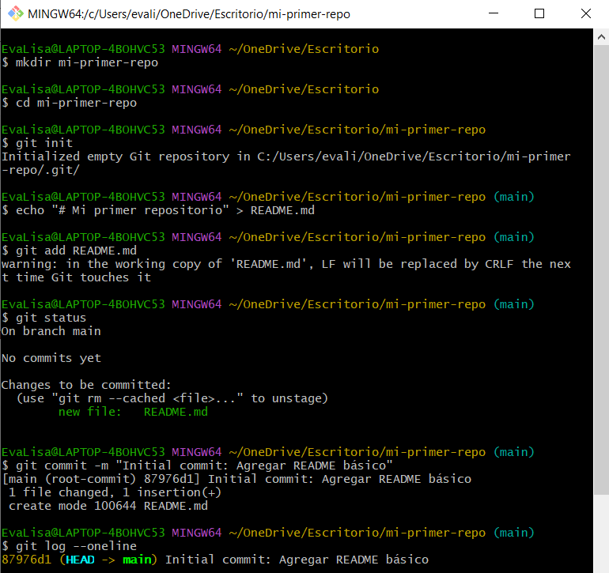

# Configura Git y crea tu primer repositorio local

## Instalación
Instalar git y verificar version:

```
git --version
```


## Configuración inicial

```
git config --global user.name "Tu Nombre Completo"
git config --global user.email "tu.email@ejemplo.com"
git config --global core.editor "code --wait"  # Para VS Code
git config --global init.defaultBranch main
```
Esta configuración ya la había hecho previamente, por lo que usaré otros comandos para verificar las configuraciones existentes:

## Verificación de configuración

```
git config --global --get user.name
git config --global --get user.email
git config --global --get core.editor
git config --global --get init.defaultBranch
```


## Crear primer repositorio

```
git init
echo "# Mi primer repositorio" > README.md
git status
git add README.md
git status
git commit -m "Initial commit: Agregar README básico"
git log --oneline
```

## Verificación

``git satuts:`` muestra qué cambió y si hay o no cambios pendientes.

``git add README.md:`` agrega el archivo al área de staging.

``git commit -m ...:`` guarda ese cambio en el historial del repositorio.

``git log --oneline:`` muestra el historial en una línea por commit.

``cat README.md:`` verifica el contenido del archivo.




