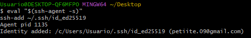
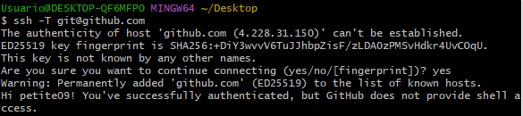
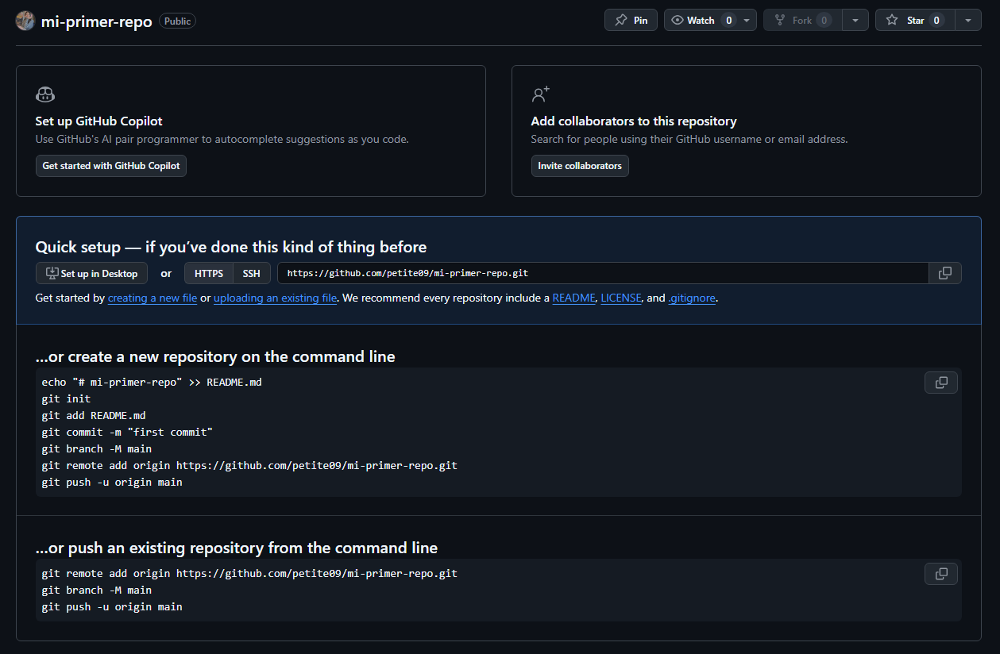
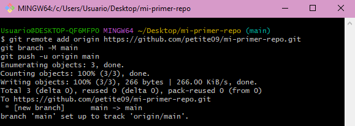
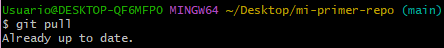
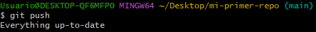
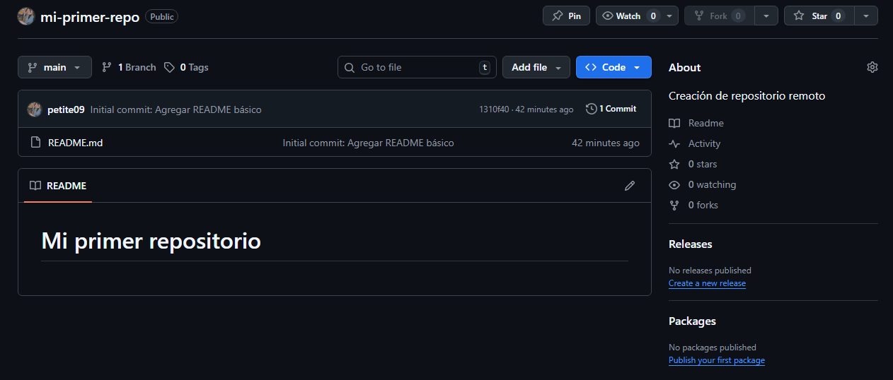

# Configura SSH y concecta con GitHub


1. Generar clave SSH:

    ``` 
    ssh-keygen -t ed25519 -C "tu.email@ejemplo.com"
    # Presiona Enter para todas las preguntas (usa passphrase si quieres)
    ```
2. Agregar clave al agente SSH:

    ```
    eval "$(ssh-agent -s)"
    ```
    Esto inicia el agente SSH. Si todo va bien, debe aparecer:
    ```
    "Agent pid XXXX"
    ```
    Luego,
    ```
    ssh-add ~/.ssh/id_ed25519
    ```
    Esto agrega tu clave privada al agente, para que Git la use automáticamente.

    

3. Copiar clave pública:

    ```
    cat ~/.ssh/id_ed25519.pub
    # Copia toda la salida, desde ssh-ed25519 hasta el final de la línea incluyendo tu correo.
    ```

4. Agregar a GitHub:

- Ve a GitHub.com → Settings → SSH and GPG keys
- Click "New SSH key"
- Pon un título descriptivo
- Pega la clave pública y guarda
- Click en "Add SSH Key"

5. Probar Conexión

    En tu terminal:
    ```
    ssh -T git@github.com
    # Deberías ver un mensaje de bienvenida: Hi (nombre)!, You've successfully authenticated, but GitHub does not provide shell access.
    ```

    La primera vez, Git preguntará si confías en GitHub:
   
    ```
    The authenticity of host 'github.com (IP...)' can't be established.
    Are you sure you want to continue connecting (yes/no/[fingerprint])? #escribir yes y Enter
    ```

    

    Este mensaje confirma que la conexión SSH funciona bien ✅.
    
6. Crear Repositorio Remoto (desde el repo local del día anterior)

    En GitHub crea un nuevo repositorio vacío (sin README.md)
    

    Luego para conectar tu repositorio local con GitHub:
    ```
    git remote add origin https://github.com/petite09/mi-primer-repo.git
    git branch -M main
    git push -u origin main
    ```
    

    ``git remote add origin ... `` → vincula tu carpeta local con el repositorio remoto en GitHub.

    ``git branch -M main `` → asegura que tu rama local se llama main (igual que en GitHub).

    `` git push -u origin main `` → sube tus archivos locales al remoto por primera vez.

7. Verificar que se puede hacer push y pull sin ingresar contraseña

    ```
    git pull # Debería decir: “Already up to date”
    git push # Debería decir: “Everything up-to-date”
    ```
    
    

    Al no pedir usuario ni contraseña significa que la autentifación SSH funciona correctamente ✅.

8. Verificar que los archivos locales se hayan subido al repositorio remoto de GitHub.
    
    En este caso debe aparecer el archivo README.md
    


