# Implementa GitHub Flow completo con convenciones profesionales

## Crear feature branch descriptiva:
```
git checkout -b feature/dashboard-ventas-v1
Hacer cambios con commits descriptivos:
```

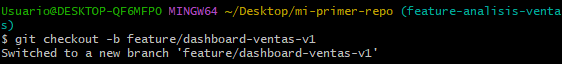

Se crea una nueva rama que representa una nueva funcionalidad: un dashboard de ventas.

## Modificar código
```
echo "import matplotlib.pyplot as plt" >> analisis_ventas.py
```
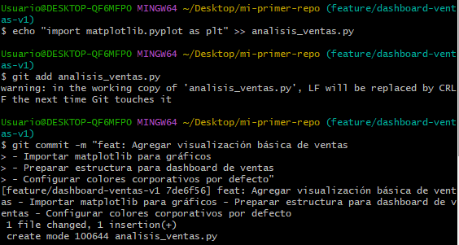

``echo`` imprime el texto ``"import matplotlib.pyplot as plt"`` en el ``archivo.py`` (indicado por ``>>``, se agrega al final del archivo).

Entonces, si ``analisis_ventas.py`` existe, el comando añade esta línea:
``"import matplotlib.pyplot as plt"``.
Si no existe, el comando crea el archivo y escribe esa línea.

## Commit con convención

```
git add analisis_ventas.py
git commit -m "feat: Agregar visualización básica de ventas

- Importar matplotlib para gráficos
- Preparar estructura para dashboard de ventas
- Configurar colores corporativos por defecto"

```


> [!TIP]
> Recordar commits con convención:
> 
>feat: → nueva funcionalidad
>
> fix: → correcciones
> 
> chore: → tareas menores
> 
> docs: → documentación
> 
> refactor: → reestructura de código

## Push y crear Pull Request:

```
git push -u origin feature/dashboard-ventas-v1
```

Esto permite subir la rama al repositorio remoto.
- ``u`` sirve para luego hacer git push o git pull sin tener que indicar la rama cada vez.

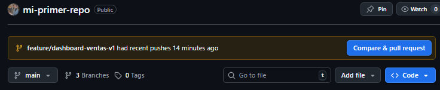

# En GitHub:

Crear PR desde la branch


Título: "feat: Dashboard básico de análisis de ventas"

Descripción detallada del cambio y su impacto

Solicitar revisión a compañeros (en este caso a lolalina)

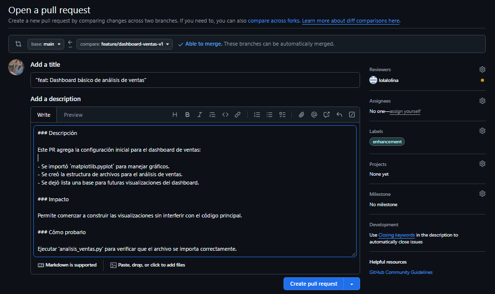

Finalmente tenemos el PR creado.
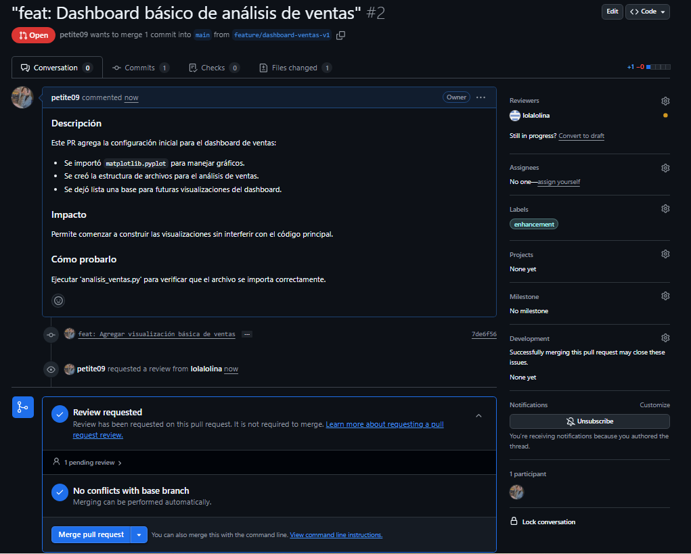


## Simular revisión y merge:


Agregar comentarios en el PR *(Desde cuenta lolalolina).*

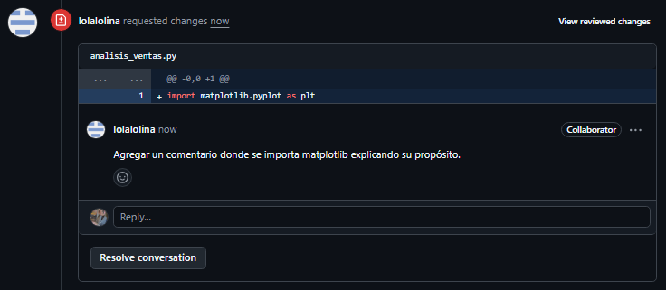


Hacer cambios solicitados en el archivo local y luego hacer git push de la modificación. *(Desde cuenta que realizó el PR).*

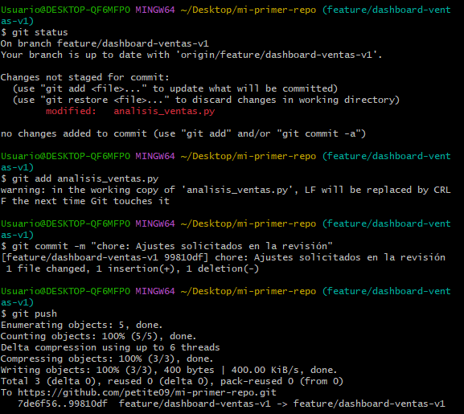


*(Desde cuenta lolalolina).*

Comprobar cambios en el PR

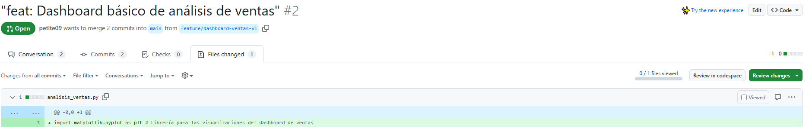

Aprobar y mergear el PR 
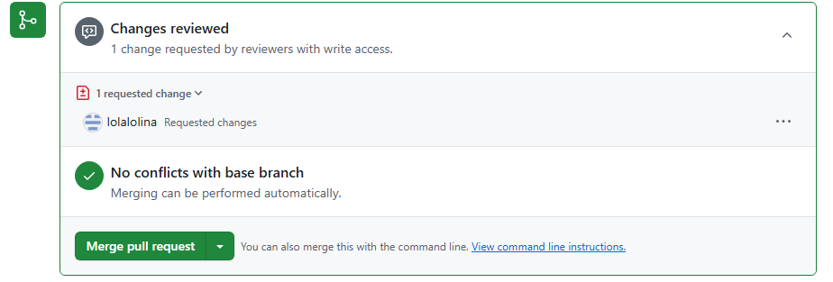

Seleccionar **Merge pull request** y luego escribir el mensaje del commit:

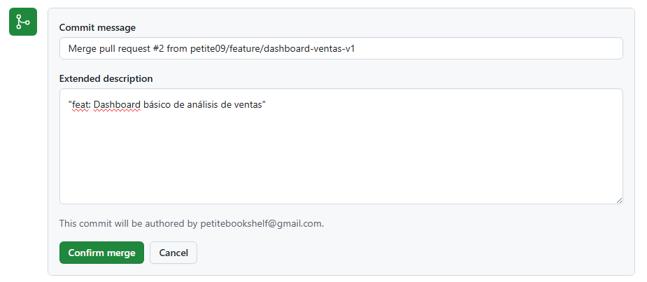

Confirmar el merge.

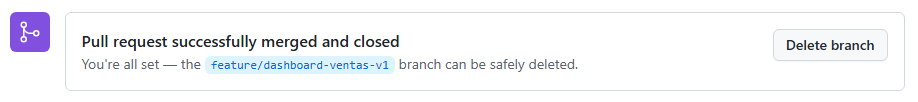

Luego del merge, se procede a eliminar la branch:

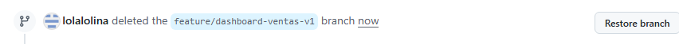


---

Verificación: Confirma que el flujo completo funciona y que el historial refleja un proceso profesional de colaboración.

Requerimientos:
- Git y GitHub configurados completamente (de días anteriores)
- Repositorio con historial de trabajo
- Conocimiento básico de branches y merges (del día 4)