# Crea ramas, modifica archivos y resuelve un conflicto


## Crear ramas
Primero verificamos si estamos en el repositorio correcto (``mi-primer-repo``) y en la rama ``main``.

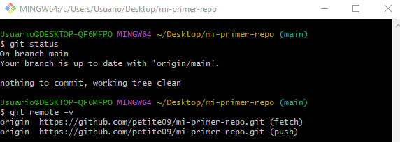


Se creó una rama para feature

```
git checkout -b feature-analisis-ventas
```
``git checkout`` sirve para cambiar de rama.

``-b`` le dice a Git que cree una nueva rama en este momento.

``feature-analisis-ventas`` es el nombre de la nueva rama.

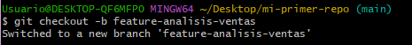

En esta rama de trabajo se modificó el archivo ``README.md`` agregando una línea.

```
echo "# Análisis de ventas mejorado" >> README.md
git add README.md
git commit -m "feat: Agregar sección de análisis de ventas"
```

El operador ``>>`` agrega al final. En este caso se ve afectado el bloque final del archivo README.md.

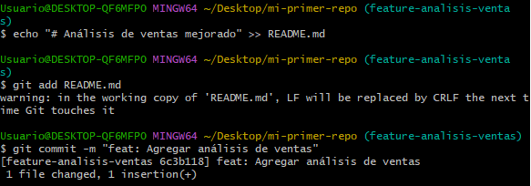

Luego, se volvió a la rama principal (main) y también se modificó el archivo ``README.md`` en la misma parte.

```
git checkout main
echo "# Análisis de datos principal" >> README.md
git add README.md
git commit -m "feat: Agregar análisis de datos principal"
```

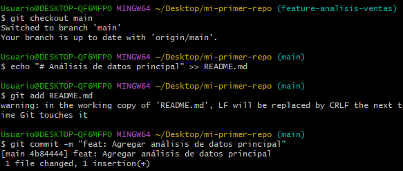

## Crear Conflicto
Cuando se intenta unir los cambios de ambas ramas, Git no sabe cuál de las dos versiones debe conservar, y ahí nace el **conflicto de merge**.

> [!NOTE]
> Un conflicto de merge ocurre cuando dos ramas modifican el mismo archivo en la misma parte del código y Git no puede decidir automáticamente cuál versión conservar.

Para visualizarlo, se intentó hacer merge (desde la rama main):

```
git merge feature-analisis-ventas
```
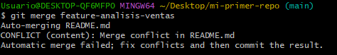

Para ver los archivos que están generando conflicto usamos ``git status``.

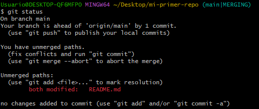

El mensaje indica que se está trabajando en la rama principal.

> [!IMPORTANT]  
> El merge siempre se ejecuta desde la **rama que recibe los cambios** (en este caso main).

Git detectó un conflicto y detuvo el merge hasta que se resuelva manualmente.
En rojo está el mensaje que dice que el archivo README.md fue modificado en ambas ramas (``main`` y ``feature-analisis-ventas``).

Con git diff podemos ver exactamente qué líneas cambiaron entre las dos ramas.

```
git diff main feature-analisis-ventas
```
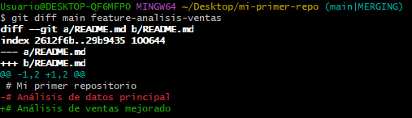

🔴 En rojo se indica la línea modificada o eliminada respecto a la rama comparada. En este caso se ve la línea que existía en ``main``, pero que fue cambiada o eliminada ``# Análisis de datos principal``.

🟢 En verde se indica la línea nueva o modificada en la rama que se está comparando (``feature-analisis-ventas``) En este caso, la línea ``# Análisis de ventas mejorado"`` existe en ``feature-analisis-ventas``, pero no en ``main``. 

## Resolver Conflicto

Si abrimos el archivo ``README.md`` en VS Code, se observan marcadores del conflicto:

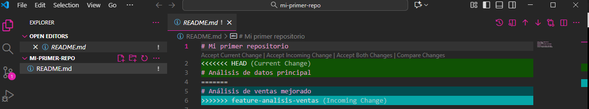

Editamos el archivo para resolver el conflicto.

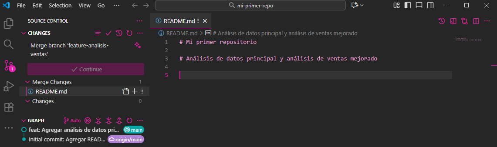

Luego para completar el merge:
```
git add README.md
git commit -m "Merge: Resolver conflicto entre análisis de ventas y datos"
```
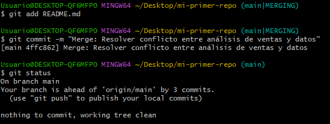

Podemos usar ``git log --oneline`` para ver el historial y ``cat README.md`` para ver el contenido del archivo ``README.md``.

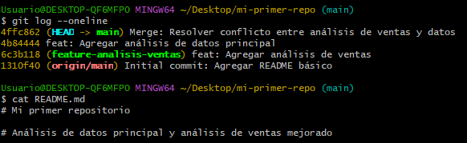

Hasta ahora todo los cambios están en mi computador local. Ahora se trabajará con la parte de GitHub.

## Crear Pull Request:

Debemos hacer push a ambas ramas a Github:

```
# Subir la rama main
git push origin main

# Subir la rama feature
git push origin feature-analisis-ventas
```
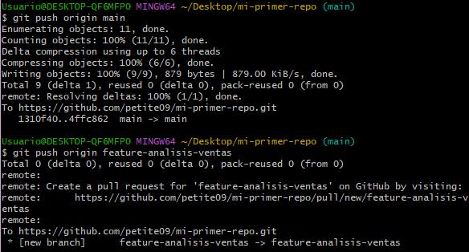

Si seleccionamos la pestaña de **Pull Request** en GitHub y luego hacemos click en el botón **New Pull Request** y seleccionamos:
- Base: ``main``
- Compare: ``feature-analisis-ventas``

Se observar el siguiente mensaje:

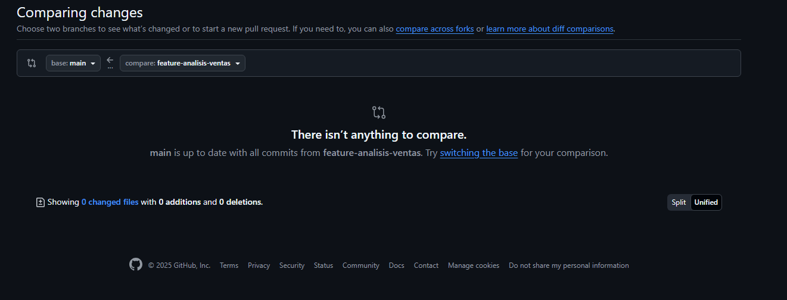

***There isn’t anything to compare.
main is up to date with all commits from feature-analisis-ventas.***

Esto significa que ambas ramas (``main`` y ``feature-analisis-ventas``) ya están sincronizadas con el repositorio remoto, es decir: todos los commits y cambios de ``feature-analisis-ventas`` ya fueron fusionados (mergeados) dentro de ``main``. Por eso, GitHub no encuentra ninguna diferencia que mostrar ni ningún cambio pendiente por integrar. Esto debido a que se hizo el merge localmente y luego se subieron los cambion con ``git push``.

> [!IMPORTANT]  
>Sin embargo, en un proyecto real colaborativo, las ramas *feature* (como ``feature-analisis-ventas``) normalmente no se fusionan directamente desde la terminal, sino que se hace a través de un pull Reques (PR) en GitHub.

El PR sirve para:
- Revisar el código antes de unirlo.
- Agregar comentarios o aprobar cambios.
- Tener trazabilidad del merge en la plataforma.

Para el ejercicio de crear un PR desde ``feature-analisis-ventas`` hacia ``main``, modificaremos nuevamente el archivo README.md agregando un punto final a la línea de ``# Análisis de datos principal y análisis de ventas mejorado``

Cambiamos a la rama ``feature-analisis-ventas`` con ``git checkout feature-analisis-ventas``. Luego editamos el README manualmente en VS code (se agrega un punto final) y se guarda el cambio en el editor de texto.
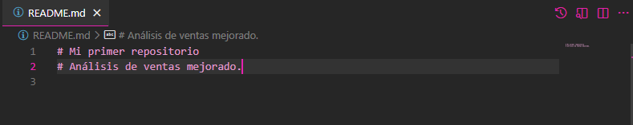

Desde la terminal, se añade y confirma el cambio con ``git add README.md`` + ``git commit -m`` para luego subir la rama al repositorio remoto con ``git push``.

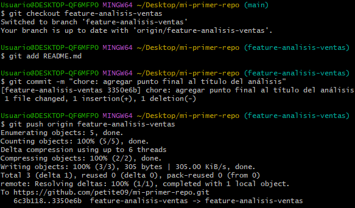

Ahora si vamos a nuestro repositorio remoto en GitHub aparece el siguiente mensaje: *feature-analisis-ventas had recent pushes 1 minute ago.*

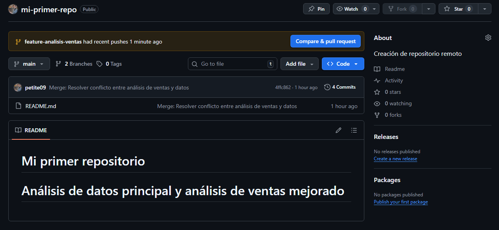

Hacemos click en **Compare & pull request** y agregamos título y descripción.
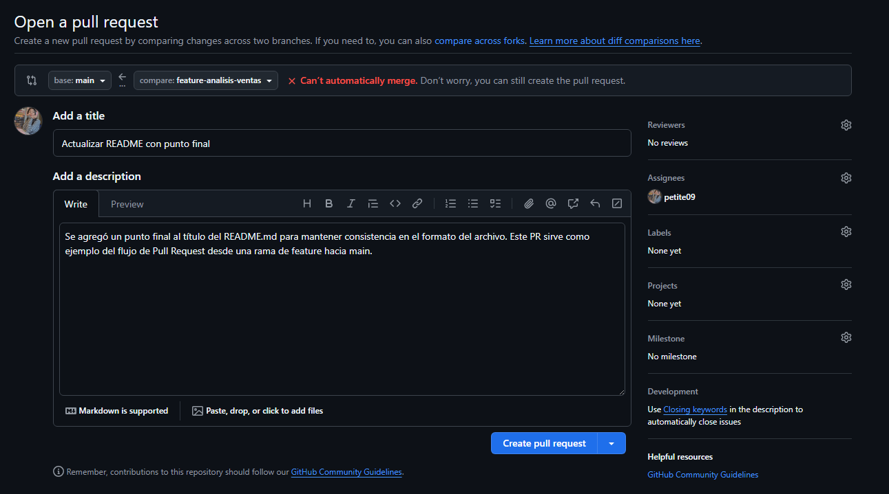
Luego hacemos click en **create pull request** y visualizamos el PR.
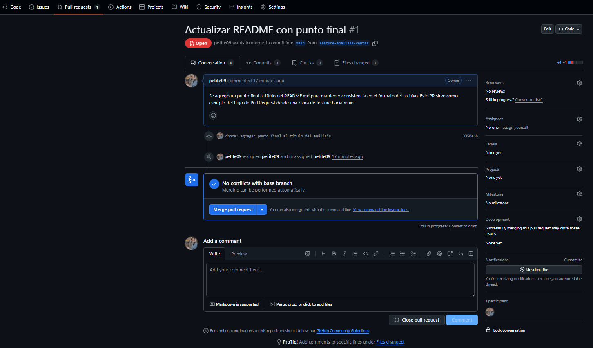
Se añade el *commit message*
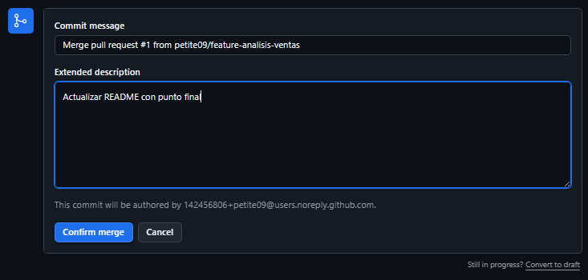
Y finalmente se confirma el merge.
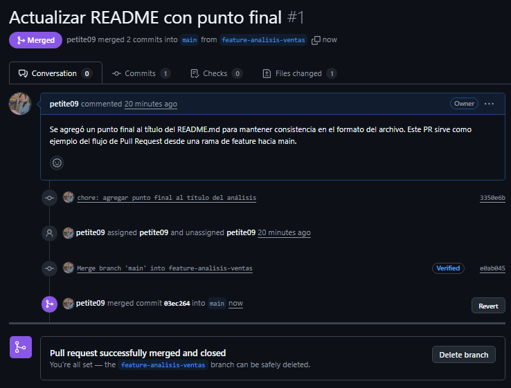
Y podemos visualizar el archivo ``README.md`` con el cambio del punto final.
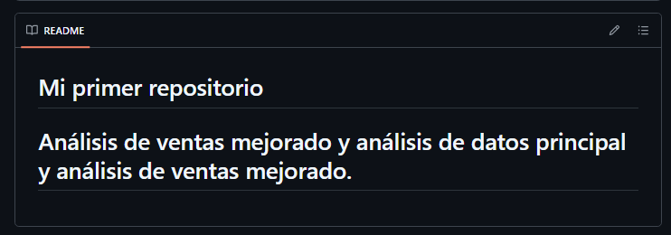.
