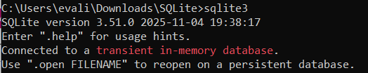
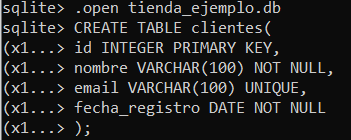
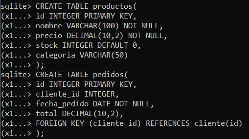
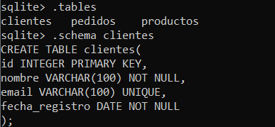
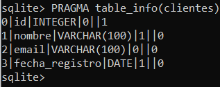
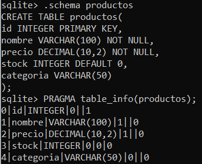
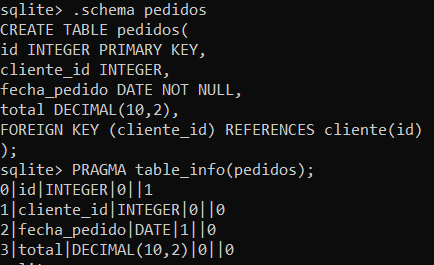

# Explorar y analizar un esquema de base de datos relacional

## Configurar SQLite local:

``` 
# Crear base de datos de ejemplo
sqlite3 .open tienda_ejemplo.db
```


## Crear Esquema Básico:

```
-- Crear tabla de clientes
CREATE TABLE clientes (
    id INTEGER PRIMARY KEY,
    nombre VARCHAR(100) NOT NULL,
    email VARCHAR(100) UNIQUE,
    fecha_registro DATE NOT NULL
);

-- Crear tabla de productos
CREATE TABLE productos (
    id INTEGER PRIMARY KEY,
    nombre VARCHAR(100) NOT NULL,
    precio DECIMAL(10,2) NOT NULL,
    stock INTEGER DEFAULT 0,
    categoria VARCHAR(50)
);

-- Crear tabla de pedidos
CREATE TABLE pedidos (
    id INTEGER PRIMARY KEY,
    cliente_id INTEGER,
    fecha_pedido DATE NOT NULL,
    total DECIMAL(10,2),
    FOREIGN KEY (cliente_id) REFERENCES clientes(id)
);
```
Crear Tabla clientes:



Crear Tabla productos y tabla pedidos:



Una vez que tenemos las 3 tablas creadas, se procede a explorar la estructura de la base de datos.

## Explorar estructura:

```
-- Ver todas las tablas
.tables

-- Ver estructura de tabla específica
.schema clientes

-- Ver información de tabla
PRAGMA table_info(clientes);
```


``.tables`` sirve para ver todas las tablas de nuestra basde de datos.

``.schema`` indica la estructura completa del "CREATE TABLE". Permite ver todas las constraints tal como fueron escritas, ver índices y triggers asociados en caso de que existieran. Muestra las claves primarias, las foráneas, constraints UNIQUE, valores por defecto, tipos de datos e índices creados automáticamente.

``.PRAGMA table_info()`` muestra un resumen estructurado de las columnas de la tabla. Sirve para ver información columna por columna, identificar los campos NOT NULL, confirmar la clave primaria (pk = 1), ver valores por defecto y ver tipos de datos procesados. 






En este caso, al usar ``PRAGMA table_info`` la primera columna indica el índice interno de la columna:
```
id → cid = 0
nombre → cid = 1
email → cid = 2
fecha_registro → cid = 3
```
La segunda columna indica el nombre de la columna.

La tercera columna el tipo de dato.

La cuarta columna indica si la columna acepta o no valores NULL:
```
1 = NO permite NULL (NOT NULL)
0 = sí permite NULL
```

La última columna indica si la columna es parte de la clave primaria:
```
1 = es la clave primaria
0 = no lo es
```

Por lo tanto, al ver la info de la tabla clientes se observa que la columna ``id`` si bien sí permite NULL (cuarta columna = 0) al ser la clave primaria de la tabla (última columna = 1), esto hace que la columna ``id`` sea NOT NULL por obligatoriedad.

Se aprovechó de explorar la estructura de las otras tablas: productos y pedidos:

```
.schema productos
PRAGMA table_info(productos);

.schema pedidos
PRAGMA table_info(pedidos);
```





## Analizar de Constraints:

1. Identifica qué columnas no pueden ser NULL:

    **Tabla clientes:**
    
    ``id``: al ser la clave primaria no puede ser NULL.

    ``nombre``: está definido como NOT NULL en la creación de la tabla.

    ``fecha_registro``: está definido como NOT NULL en la creación de la tabla.

    Tanto ``nombre`` como ``fecha_registro`` tienen el valor 1 en la cuarta columna (PRAGMA table_info), lo que indica que no aceptan valores NULL.

    **Tabla productos:**

    ``id``: al ser la clave primaria no puede ser NULL.
    
    ``nombre``: está definido como NOT NULL en la creación de la tabla.
    
    ``precio``: está definido como NOT NULL en la creación de la tabla.

    Tanto ``nombre`` como ``precio`` tienen el valor 1 en la cuarta columna (PRAGMA table_info), lo que indica que no aceptan valores NULL.
    
    **Tabla pedidos:**

    ``id``: al ser la clave primaria no puede ser NULL.

    ``fecha_pedido``: está definido como NOT NULL en la creación de la tabla. Además, tiene el valor 1 en la cuarta columna (PRAGMA table_info), lo que indica que no acepta valores NULL.

    
2. Encuentra las claves primarias y foráneas:
    Las claves primarias se puede ver tanto con ``.schema`` como con ``PRAGMA table_info``. Las claves foráneas se pueden ver usando ``.schema``.

    **Tabla clientes:**

    - Clave primaria:  ``id``.
    
    **Tabla productos:**
    - Clave primaria:  ``id``.

    **Tabla pedidos:**
    - Clave primaria:  ``id``.
    - Clave foránea: ``cliente_id``


3. Constraints como elementos que mantienen la integridad de los datos:

    En este esquema, las constraints garantizan que los datos cumplan reglas que evitan errores y mantinene la coherencia entre las tablas.

    Las **PRIMARY KEY** aseguran que cada registro tenga un identificador único, evitando duplicidades tanto en *clientes, productos y pedidos*.

    Las columnas con **NOT NULL** obligan a que ciertos datos esenciales (como el nombre del cliente o la fecha de pedido) siempre estén presentes, evitando registros incompletos.

    El **UNIQUE** en el email de clientes impide que haya valores repetidos y asegura que cada cliente tenga un correo exclusivo.

    Finalmente, la **FOREIGN KEY** en la tabla *pedidos* asegura que solo se puedan crear pedidos asociados a clientes que existen en la tabla *clientes*, manteniendo la relación entre tablas.

    En conjunto, estas constraints protegen la integridad referencial y estructural del sistema, previniendo inconsistencias y asegurando que los datos sean confiables y válidos.
