#  Consultas básicas en base de datos de ventas

## Configurar datos de ejemplo:

```
-- Crear y poblar tabla de productos
CREATE TABLE productos (
    id INTEGER PRIMARY KEY,
    nombre TEXT NOT NULL,
    precio REAL NOT NULL,
    categoria TEXT,
    stock INTEGER DEFAULT 0
);

INSERT INTO productos VALUES
(1, 'Laptop Dell', 1200.00, 'Electrónica', 15),
(2, 'Mouse Logitech', 25.50, 'Accesorios', 50),
(3, 'Teclado Mecánico', 89.99, 'Accesorios', 30),
(4, 'Monitor 24"', 199.99, 'Electrónica', 12),
(5, 'Audífonos Sony', 149.50, 'Audio', 25);
```

En la terminal se observa lo siguiente:

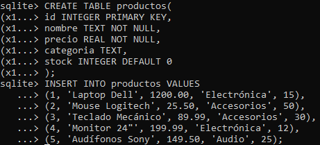

Para verificar el contenido de la tabla creada con los registros ingresados se utilizó: ``SELECT * FROM productos;``

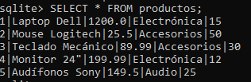


## Consultas básicas

A continuación, se presentan las consultas realizadas con la evidencia respectiva de que cada consulta devuelve los resultados esperados según las condiciones especificadas.

```
-- Seleccionar productos con precio > 100
SELECT nombre, precio FROM productos WHERE precio > 100;
```

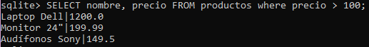

```
-- Productos de categoría 'Electrónica' ordenados por precio descendente
SELECT nombre, precio, categoria FROM productos
WHERE categoria = 'Electrónica'
ORDER BY precio DESC;
```

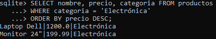

```
-- Productos con stock entre 10 y 40, ordenados por stock ascendente
SELECT nombre, stock, precio FROM productos
WHERE stock BETWEEN 10 AND 40
ORDER BY stock ASC;
```

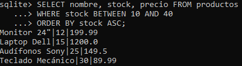

```
-- Nombres que contienen 'a' ordenados alfabéticamente
SELECT nombre, precio FROM productos
WHERE nombre LIKE '%a%'
ORDER BY nombre ASC;
```

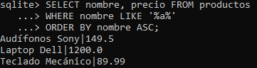

## Experimentar variaciones: 

1. Cambiar condiciones WHERE:

    ```
    -- Productos cuyo precio sea menor a 100, mostrando solo nombre y precio
    SELECT nombre, precio FROM productos
    WHERE precio < 100;
    ```

    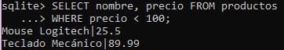

    ```
    -- Productos cuya categoría no sea 'Accesorios', mostrando nombre y categoría
    SELECT nombre, categoria FROM productos
    WHERE categoria <> 'Accesorios';
    ```

    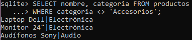

    ```
    -- Productos cuyo stock esté fuera del rango 20-40 (menor que 20 o mayor que 40)
    SELECT * FROM productos
    WHERE stock < 20 OR stock > 40;
    ```

    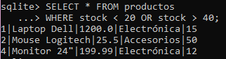


2. Probar diferentes columnas en ORDER BY

    ```
    -- Listar todos los productos ordenados por nombre en orden descendente
    SELECT * FROM productos
    ORDER BY nombre DESC;
    ```

    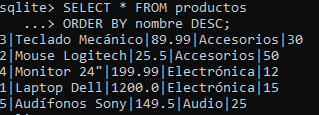

    ```
    -- Mostrar todos los productos ordenados por stock de mayor a menor
    SELECT * FROM productos
    ORDER BY stock DESC;
    ```

    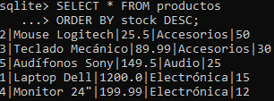

    ```
    -- Listar productos ordenados primero por categoría ascendente, y dentro de cada categoría por precio ascendente
    SELECT * FROM productos
    ORDER BY categoria ASC, precio ASC;
    ```

    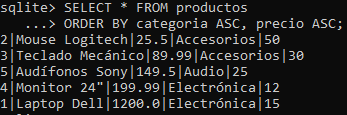

3. Cominar múltiples condiciones con AND/OR

    ```
    -- Seleccionar productos de la categoría 'Accesorios' cuyo precio sea mayor a 50
    SELECT * from productos
    WHERE categoria = 'Accesorios' AND precio > 50;
    ```

    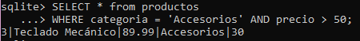

    ```
    -- Listar productos que sean de la categoría 'Electrónica' o que tengan un precio mayor a 150.
    SELECT * FROM productos
    WHERE categoria = 'Electrónica' OR precio > 150;
    ```
    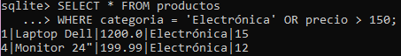

    ```
    -- Buscar productos cuyo nombre contenga la letra "o" y cuyo stock sea mayor a 20.
    SELECT * FROM productos
    WHERE nombre LIKE '%o%' AND stock > 20;
    ```
    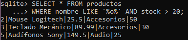