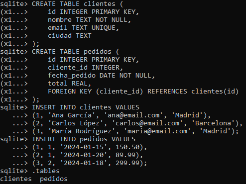
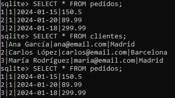
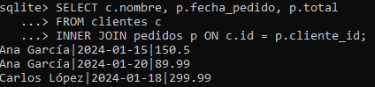
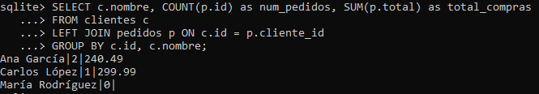
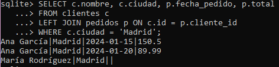

# Consultas con joins en esquema de ventas

## Crear esquema relacional completo:

```
-- Tabla de clientes
CREATE TABLE clientes (
    id INTEGER PRIMARY KEY,
    nombre TEXT NOT NULL,
    email TEXT UNIQUE,
    ciudad TEXT
);

-- Tabla de pedidos
CREATE TABLE pedidos (
    id INTEGER PRIMARY KEY,
    cliente_id INTEGER,
    fecha_pedido DATE NOT NULL,
    total REAL,
    FOREIGN KEY (cliente_id) REFERENCES clientes(id)
);

-- Insertar datos de ejemplo
INSERT INTO clientes VALUES
(1, 'Ana García', 'ana@email.com', 'Madrid'),
(2, 'Carlos López', 'carlos@email.com', 'Barcelona'),
(3, 'María Rodríguez', 'maria@email.com', 'Madrid');

INSERT INTO pedidos VALUES
(1, 1, '2024-01-15', 150.50),
(2, 1, '2024-01-20', 89.99),
(3, 2, '2024-01-18', 299.99);
```



Se usó ``.tables`` para verificar las tablas que creamos y se observan 2 tablas: ``clientes`` y ``pedidos``.

Con la consulta ``SELECT * FROM + 'nombre tabla'`` podemos ver todos los registros de la tabla y verificar que la inserción de datos fue exitosa.




## Consultas con diferentes tipos de joins:

### CASO 1
```
-- INNER JOIN: Solo clientes con pedidos
SELECT c.nombre, p.fecha_pedido, p.total
FROM clientes c
INNER JOIN pedidos p ON c.id = p.cliente_id;
```



``c.nombre`` viene de la tabla clientes, alias c.
``p.fecha_pedido`` y ``p.total`` vienen de la tabla pedidos, alias p.

En este caso, como el ``FROM`` es de la tabla clientes (c), esta es nuestra tabla de la izquierda y por lo tanto, la tabla pedidos (p) es nuestra tabla de la derecha.

El ``INNER JOIN`` trae solo las filas donde sí existe coincidencia entre ambas tablas, por lo tanto, solo los clientes que tienen pedidos.

``INNER JOIN pedidos p``: esta parte solo declara que se quiere unir la tabla pedidos y se le asigna el alias p. 

> [!IMPORTANT]  
> Hasta este punto no se ha dicho cómo se relacionan las tablas. Esto se hace con ``ON``.

``ON c.id = p.cliente_id``: indica que se quiere relacionar la fila de cliente (c) con la fila de pedido (p) cuando el id del cliente (``c.id``) sea igual al cliente id del pedido (``p.cliente_id``). Esta es la regla de emparejamiento.

### CASO 2

```
-- LEFT JOIN: Todos los clientes, con pedidos si existen
SELECT c.nombre, COUNT(p.id) as num_pedidos, SUM(p.total) as total_compras
FROM clientes c
LEFT JOIN pedidos p ON c.id = p.cliente_id
GROUP BY c.id, c.nombre;
```



``c.nombre`` viene de la tabla clientes, alias c.
``COUNT(p.id)`` es el recuento de id's de la tabla pedidos, y este recuento corresponde al número de pedidos (``num_pedidos``). Si un cliente no tiene pedidos, en este caso al hacer un LEFT JOIN, este valor será 0.

``SUM(p.total)`` corresponde a la suma de los valores totales de la tabla pedidos (``total_compras``). Si un cliente no tiene pedidos, en este caso al hacer un LEFT JOIN aparecerá NULL.

``FROM clientes c`` nos indica que la tabla clientes es nuestra tabla de la izquierda y por lo tanto la tabla pedidos la tabla de la derecha.

``LEFT JOIN`` muestra los registros de la tabla izquierda (clientes c) y si hay coincidencias en la tabla de la derecha (pedidos p), las muestra. Si **NO** hay coincidencia, igual mostrará al cliente pero con valores NULL en la tabla derecha. Es por esto que aparece María, aunque no tenga pedidos.

El ``ON c.id = p.cliente_id`` nuevamente es la regla de emparejamiento.

``GROUP BY c.id, c.nombre;`` permite agrupar por cliente (por su id y nombre).

En este caso, en el SELECT tenemos: 

```
SELECT c.nombre, COUNT(p.id), SUM(p.total)
```
Se están usando funciones agregadas ``COUNT()`` y ``SUM()``. Al agrupar, SQL obliga a decir qué columnas NO agregadas quieres mantener tal cual y esas deben ir en el ``GROUP BY``.

Con esto finalmente podemos ver que:
- Ana tiene 2 pedidos.
- Carlos tiene 1.
- María tiene 0 pedidos pero igual aparece.

### CASO 3

```
-- Clientes de Madrid con sus pedidos
SELECT c.nombre, c.ciudad, p.fecha_pedido, p.total
FROM clientes c
LEFT JOIN pedidos p ON c.id = p.cliente_id
WHERE c.ciudad = 'Madrid';
```



``c.nombre`` y ``c.ciudad`` viene de la tabla clientes, alias c.
``p.fecha_pedido`` y ``p.total`` vienen de la tabla pedidos, alias p.

``FROM clientes c`` nos indica que la tabla clientes es nuestra tabla de la izquierda y por lo tanto la tabla pedidos la tabla de la derecha.

``LEFT JOIN`` muestra los registros de la tabla izquierda (clientes c) y si hay coincidencias en la tabla de la derecha (pedidos p), las muestra. Si **NO** hay coincidencia, igual mostrará al cliente pero con valores NULL en la tabla derecha. 

``WHERE c.ciudad = 'Madrid'`` indica que se está filtrando por ciudad.

En este caso, Ana y María son de Madrid y dado que el ``SELECT`` incluye ``p.fecha_pedido`` y ``p.total`` aparecen las fechas y montos totales de los 2 pedidos de Ana, sin embargo, como María no tiene pedidos, estas columnas son NULL.


## Analizar resultados

1. Compara cuántas filas devuelve cada tipo de join

    CASO 1. INNER JOIN
    
    Se devuelven 3 filas:

        Ana García - Pedido 1
        Ana García - Pedido 
        Carlos López - Pedido 3

    María no aparece porque no tiene pedidos.

    CASO 2. LEFT JOIN
    
    El LEFT JOIN antes del GROUP BY generaría 4 filas:
        
        2 filas para Ana (2 pedidos)
        1 fila para Carlos (1 pedido)
        1 fila para María (con valores NULL porque no tiene pedidos)

    Sin embargo, después del GROUP BY, el resultado final son 3 filas, ya que se agrupan los 2 pedidos de Ana un solo registro:

        Ana García - 2 pedidos
        Carlos López - 1 pedido
        María Rodríguez - 0 pedidos, por lo que no se ve ``SUM(p.total)``.

    CASO 3. LEFT JOIN
    
    En este caso se muestran los clientes de Madrid y la consulta también devuelve 3 filas:
        
        Ana - Pedido 1 
        Ana - Pedido 2
        María - Sin pedidos, por lo que no se ve ni fecha ni total.
    

2. Observa cómo NULL aparece en LEFT JOIN
    
    En el CASO 2. Se ve par ael caso de María como no tiene pedidos, la ``SUM(p.total)`` es NULL.
    En el CASO 3. Nuevamente María al no tener pedidos, ``p.fecha_pedido`` y ``p.total`` aparecen como NULL.

3. Verifica integridad referencial

    En este caso, ``FOREIGN KEY (cliente_id) REFERENCES clientes(id)`` indica que cada ``cliente_id`` en la tabla ``pedidos`` debe corresponder a un ``id`` existente en la tabla ``clientes``.

    Al hacer los JOINS, todos los pedidos encuentran su cliente correspondiente. No hay pedidos con ``cliente_id`` que apunten a un cliente inexistente, lo que indica que la integridad referencial se está respetando en este conjunto de datos.