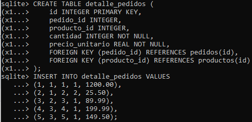
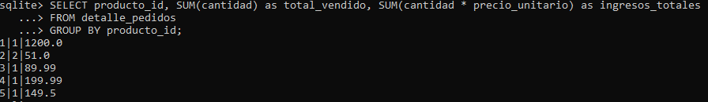
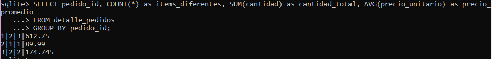
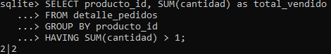
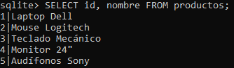
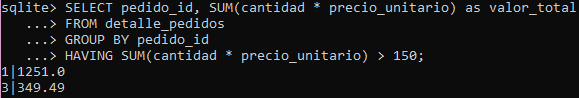
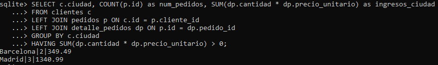

# Análisis agregado de datos de ventas

## Crear tabla de detalles de pedidos:

```
-- Tabla de detalles de pedidos
CREATE TABLE detalle_pedidos (
    id INTEGER PRIMARY KEY,
    pedido_id INTEGER,
    producto_id INTEGER,
    cantidad INTEGER NOT NULL,
    precio_unitario REAL NOT NULL,
    FOREIGN KEY (pedido_id) REFERENCES pedidos(id),
    FOREIGN KEY (producto_id) REFERENCES productos(id)
);

-- Insertar datos de ejemplo
INSERT INTO detalle_pedidos VALUES
(1, 1, 1, 1, 1200.00),
(2, 1, 2, 2, 25.50),
(3, 2, 3, 1, 89.99),
(4, 3, 4, 1, 199.99),
(5, 3, 5, 1, 149.50);
```



> [!IMPORTANT]  
> Se requiere la base de datos SQLite con esquema (completo, clientes, pedidos, productos, detalle_pedidos).

En este caso se trabajó con los ejemplos de tablas de los días anteriores.

- Tabla clientes y pedidos: [Actividad práctica día 2](https://github.com/petite09/Data_TalentOps/blob/main/01.Fundamentos_de_Datos_y_Control_de_versiones/S2_Fundamentos_SQL/P2-Consultas-bbdd.md)
 
 - Tabla productos: [Actividad práctica día 3](https://github.com/petite09/Data_TalentOps/blob/main/01.Fundamentos_de_Datos_y_Control_de_versiones/S2_Fundamentos_SQL/P3-Consultas-joins.md)

Podemos verificar las tablas de nuestra base de datos usando ``.tables``


## Consultas de agregación básica:

```
-- Ventas totales por producto
SELECT producto_id, SUM(cantidad) as total_vendido, SUM(cantidad * precio_unitario) as ingresos_totales
FROM detalle_pedidos
GROUP BY producto_id;
```


En este caso se observan 3 columnas: ``producto_id``, ``total_vendido`` e ``ingresos_totales``. Donde ``total_vendido`` e ``ingresos_totales`` contienen la función agregada SUM().
El resultado de la consulta también muestra 5 registros en total, correspondiente a la cantidad de productos.

```
-- Estadísticas por pedido
SELECT pedido_id, COUNT(*) as items_diferentes, SUM(cantidad) as cantidad_total, AVG(precio_unitario) as precio_promedio
FROM detalle_pedidos
GROUP BY pedido_id;
```


Acá se observan 4 columnas: 

- ``pedido_id``
- ``items_diferentes`` 
- ``cantidad_total`` 
- ``precio_promedio``

De estas columnas, 3 contienen funciones agregadas: 

- ``items_diferentes`` contiene la función COUNT() y en este caso nos indica cuántas filas hay en la tabla ``detalle_pedidos`` para ese pedido.
- ``cantidad_total`` contiene la función SUM(), que permite sumar cantidades de esos registros.
- ``precio_promedio`` contiene la función AVG() que nos da el promedio de ``precio_unitario`` de esos registros.

Y finalmente esta consulta entrega 3 registros que corresponden a la cantidad de pedidos de la tabla ``detalle_pedidos``.

## Consultas con HAVING:

```
-- Productos con más de 1 unidad vendida total
SELECT producto_id, SUM(cantidad) as total_vendido
FROM detalle_pedidos
GROUP BY producto_id
HAVING SUM(cantidad) > 1;
```


Se observa que la consulta entrega 2 columnas: 
- ``producto_id``
- ``total_vendido``: que en este caso es una función agregada SUM(), entregando la suma de las cantidades vendidas.

El ``HAVING`` nos permite filtrar resultados después de la agregación. En este caso agrupamos por ``producto_id`` y dentro de estos productos se pide que nos muestre aquellos cuyo ``total_vendido`` (``SUM(cantidad)``) sea mayor a 1: (``HAVING SUM(cantidad) > 1``), por lo que el resultado de la columna es solo 1 registro que cumple con ese criterio.



El producto id = 2 corresponde al Mouse Logitech, que se vendió más de una unidad (2 unidades).

```
-- Pedidos con valor total > 150
SELECT pedido_id, SUM(cantidad * precio_unitario) as valor_total
FROM detalle_pedidos
GROUP BY pedido_id
HAVING SUM(cantidad * precio_unitario) > 150;
```


En este ejemplo podemos observar que la consulta entrega 2 columnas:
- ``pedido_id``
- ``valor_total`` que contiene la función agregada ``SUM(cantidad * precio_unitario)``.

Luego de agrupar por ``pedido_id``, el ``HAVING`` filtra según la condición entregada, que el ``valor_total`` sea > 150. Se observan solo dos registros que cumplen con el criterio del ``HAVING SUM(cantidad * precio_unitario) > 150``.

## Análisis combinado con joins:

```
-- Ventas por ciudad usando JOIN + GROUP BY
SELECT c.ciudad, COUNT(p.id) as num_pedidos, SUM(dp.cantidad * dp.precio_unitario) as ingresos_ciudad
FROM clientes c
LEFT JOIN pedidos p ON c.id = p.cliente_id
LEFT JOIN detalle_pedidos dp ON p.id = dp.pedido_id
GROUP BY c.ciudad
HAVING SUM(dp.cantidad * dp.precio_unitario) > 0;
```

En este caso, la consulta entrega 3 columnas:

- ``ciudad`` corresponde a la ciudad del cliente, que viene de la tabla ``clientes``, alias c.
- ``num_pedidos``, que contiene la función agregada ``COUNT(p.id)`` y que corresponde a la cantidad de filas de pedidos obtenidas **después del join**. 

> [!IMPORTANT]  
>Es importante mencionar que este conteo se realiza después de unir las tablas, por lo que refleja cuántas filas de pedido (y detalle de pedido) quedaron asociadas a cada ciudad.

- ``ingresos_ciudad`` que contiene la función agregada ``SUM(dp.cantidad * dp.precio_unitario)`` que calcula la suma total de ingresos generados por cada ciudad. Esta operación multiplica la cantidad vendida por el precio unitario de cada producto dentro de un pedido, obteniendo así el ingreso por detalle. Luego, el ``SUM()`` acumula estos ingresos para todos los pedidos de los clientes de la misma ciudad. Es decir, la venta total generada por ese producto dentro de ese pedido.

El uso de ``JOIN`` en este ejercicio es necesario porque los datos requeridos están distribuidos en 3 tablas distintas:
- ``clientes``: para obtener la ciudad.
- ``pedidos``: para saber qué pedidos hizo cada cliente.
- ``detalle_pedidos``: para acceder al desglose de los productos vendidos y calcular los ingresos.

El uso de ``LEFT JOIN`` garantiza que todos los clientes aparezcan inicialmente y el ``HAVING`` filtra las ciudades sin ingresos.

El ``GROUP BY`` agrupa la información por ciudad, permitiendo calcular correctamente la cantidad de pedidos y los ingresos para cada una de llas.

Se observan 2 registros correspondientes a las 2 ciudades ``'Barcelona'`` y ``'Madrid'`` que son aquellas que cumplen con la condición del ``HAVING``.


