# Consultas avanzadas con subconsultas en base de datos completa

## Crear datos adicionales para análisis complejo:

> [!IMPORTANT]  
> Se requiere la base de datos SQLite con esquema (completo, clientes, pedidos, productos, detalle_pedidos).

En este caso se trabajó con los ejemplos de tablas de los días anteriores.

- Tabla clientes y pedidos: [Actividad práctica día 2](https://github.com/petite09/Data_TalentOps/blob/main/01.Fundamentos_de_Datos_y_Control_de_versiones/S2_Fundamentos_SQL/P2-Consultas-bbdd.md)
 
 - Tabla productos: [Actividad práctica día 3](https://github.com/petite09/Data_TalentOps/blob/main/01.Fundamentos_de_Datos_y_Control_de_versiones/S2_Fundamentos_SQL/P3-Consultas-joins.md)

 - Tabla detalle_pedidos: [Actividad práctica día 4](https://github.com/petite09/Data_TalentOps/blob/main/01.Fundamentos_de_Datos_y_Control_de_versiones/S2_Fundamentos_SQL/P4-Analisis-agregado-datos.md)

```
-- Tabla de categorías
CREATE TABLE categorias (
    id INTEGER PRIMARY KEY,
    nombre TEXT NOT NULL,
    descripcion TEXT
);

-- Agregar categoría a productos
ALTER TABLE productos ADD COLUMN categoria_id INTEGER REFERENCES categorias(id);

-- Insertar datos en tabla categorias
INSERT INTO categorias VALUES
(1, 'Electrónica', 'Productos electrónicos y tecnología'),
(2, 'Accesorios', 'Accesorios para computadoras'),
(3, 'Audio', 'Productos de audio y sonido');
```

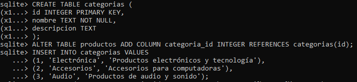

Antes la tabla ``productos`` tenía la columna ``categoria TEXT``. Pero en esta actividad se está "normalizando" el modelo, creando una nueva tabla llamada ``categorias``.

El ``ALTER TABLE`` en este caso se usa para agregar la nueva columna ``categoria_id`` en la tabla ``productos``.

Entonces, ahora cada producto de la tabla ``productos`` tiene un campo llamado ``categoria_id`` que es la clave foránea que apunta a ``categorias(id)`` de la tabla ``categoria``.


Podemos verificar las tablas de nuestra base de datos usando ``.tables``

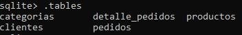


```
UPDATE productos SET categoria_id = 1 WHERE nombre LIKE '%Laptop%' OR nombre LIKE '%Monitor%';
UPDATE productos SET categoria_id = 2 WHERE nombre LIKE '%Mouse%' OR nombre LIKE '%Teclado%';
UPDATE productos SET categoria_id = 3 WHERE nombre LIKE '%Audífonos%';
```

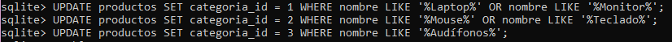

Como se acaba de agregar la columna ``categoria_id``, esa columna está vacía para todos los productos. Por lo tanto, es necesario usar ``UPDATE`` para rellenar esa columna ("actualizarla"), según el tipo de producto.

En la primera actualización se está pidiendo que a todos los productos cuyo nombre contenga '*Laptop*' o '*Monitor*', se le asigne la categoría 1: 'Electrónica'.

En la segunda actualización se está pidiendo que todos aquellos productos cuyo nombre contenga '*Mouse*' o '*Teclado*', se le asigne la categoría 2: 'Accesorios'.

 Y en la última actualización, se está pidiendo que todos los productos cuyo nombre contenga '*Audífonos*', se le asigne la categoría 3: 'Audio'.

 Ahora si queremos ver la tabla productos actualizada con sus respectivas categorías, podemos hacer la siguiente consulta ``SELECT * FROM productos;``

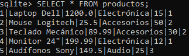


## Subconsultas en WHERE:

```
-- Clientes que han comprado productos de Electrónica
SELECT DISTINCT c.nombre, c.email
FROM clientes c
WHERE c.id IN (
    SELECT DISTINCT p.cliente_id
    FROM pedidos p
    JOIN detalle_pedidos dp ON p.id = dp.pedido_id
    JOIN productos prod ON dp.producto_id = prod.id
    JOIN categorias cat ON prod.categoria_id = cat.id
    WHERE cat.nombre = 'Electrónica'
);
```

> [!NOTE]  
> Una subconsulta es una consulta completa que se ejecuta dentro de otra consulta.

La subconsulta que está dentro del ``WHERE`` devuelve clientes que compraron productos de Electrónica.

```
WHERE c.id IN (
    SELECT DISTINCT p.cliente_id
    FROM pedidos p
    JOIN detalle_pedidos dp ON p.id = dp.pedido_id
    JOIN productos prod ON dp.producto_id = prod.id
    JOIN categorias cat ON prod.categoria_id = cat.id
    WHERE cat.nombre = 'Electrónica'
);
```

Esta parte solicita los ``cliente_id`` de la tabla ``pedidos``, alias p.
Además, hay 3 JOINS, que por defecto corresponden a ``INNER JOIN``, es decir, que se devuelven solo filas donde haya coincidencias en todas la tablas involucradas.El segundo ``WHERE`` filtra el nombre de la categoría electrónica.
Por lo tanto, esta subconsulta entrega aquellos clientes que hicieron pedidos de la categoría "Electrónica".

```
SELECT DISTINCT c.nombre, c.email
FROM clientes c
WHERE c.id IN (IDs de clientes que compraron Electrónica)
```

La consulta externa filtra clientes usando esos resultados.

Es como pedir: Muestra todos los clientes cuyo ID esté en esta lista de clientes que compraron productos de "Electrónica".


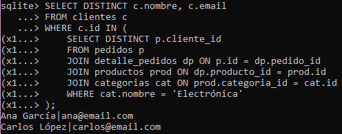

---
```
-- Productos con precio por encima del promedio de su categoría
SELECT p.nombre, p.precio, cat.nombre as categoria
FROM productos p
JOIN categorias cat ON p.categoria_id = cat.id
WHERE p.precio > (
    SELECT AVG(p2.precio)
    FROM productos p2
    WHERE p2.categoria_id = p.categoria_id
);
```

Este ejercicio busca mostrar aquellos productos cuyo precio es mayor que el precio promedio de su propia categoría.

```
SELECT p.nombre, p.precio, cat.nombre as categoria
```
Esta parte solo indica qué es lo que se mostrará:
- nombre del producto
- precio
- nombre de la categoría del producto

```
FROM productos p
JOIN categorias cat ON p.categoria_id = cat.id
```
Esto nos indica que debemos usar los datos de la tabla ``productos`` pero que además se hace un ``JOIN`` (INNER JOIN) con la tabla ``categorias``, donde se emparejan mediante ``p.categoria_id`` (FOREIGN KEY) en la tabla `` productos`` y ``cat.id`` (PRIMARY KEY) en la tabla ``categorias``.

```
WHERE p.precio > (
    SELECT AVG(p2.precio)
    FROM productos p2
    WHERE p2.categoria_id = p.categoria_id
);
```
Esta parte filtra productos cuyos precios sean mayores qué: y aquí entra la subconsulta.

``AVG(p2.precio)`` calcula el promedio de todos los **productos que tienen la misma categoría**. Esta parte está dada por el ``WHERE p2.categoria_id = p.categoria_id``. Por cada producto p, la subconsulta calcula el promedio *solo de su categoría correspondiente*.

Finalmente la consulta completa solicita lo siguiente: para este producto, dame el promedio de su categoría y solo muéstralo si su precio está por encima de ese promedio.

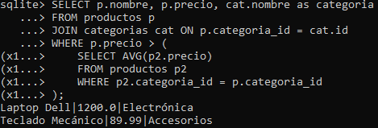

En este caso se observa que *Lapto Dell* tiene un precio de 1200, valor que es mayor al promedio de su categoría que es 699.995 (Electrónica) y *Teclado Mecánico* cuyo precio es 89.99, valor que es mayor al promedio de su categoría que es 57.745 (Accesorios).

Si queremos verificar los promedios de los precios por categoría podemos hacer la siguiente consulta:

```
SELECT cat.nombre AS categoria, AVG(p.precio) AS precio_promedio
FROM productos p
JOIN categorias cat ON p.categoria_id = cat.id
GROUP BY cat.id, cat.nombre;
```

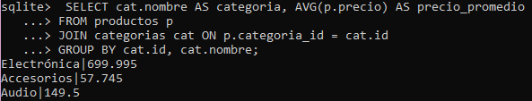

Otra opción es no unir las tablas de productos y categorías:

```
SELECT categoria_id, AVG(precio)
FROM productos
GROUP BY categoria_id;
```

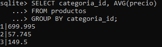

Donde acá, en vez de aparecer el nombre de la categoría, solo aparece su id.

## Subconsultas correlacionadas:

```
-- Para cada cliente, mostrar su pedido más reciente
SELECT c.nombre, p.fecha_pedido, p.total
FROM clientes c
JOIN pedidos p ON c.id = p.cliente_id
WHERE p.fecha_pedido = (
    SELECT MAX(p2.fecha_pedido)
    FROM pedidos p2
    WHERE p2.cliente_id = c.id
);
```

Esta consulta busca traer el pedido más reciente para cada cliente. Si un cliente tiene varios pedidos, queremos solo quedarnos con la fecha más reciente.

```
SELECT c.nombre, p.fecha_pedido, p.total
```

Esto mostrará lo siguiente:
- nombre del cliente
- fecha del pedido
- total del pedido

```
FROM clientes c
JOIN pedidos p ON c.id = p.cliente_id
```

Esta parte une cada cliente con todos sus pedidos correspondientes (se une la tabla ``clientes`` con la tabla ``pedidos``).

La subconsulta correlacionada es la siguiente:

```
WHERE p.fecha_pedido = (
    SELECT MAX(p2.fecha_pedido)
    FROM pedidos p2
    WHERE p2.cliente_id = c.id
);
```

Esto significa que para un cliente específico (``c.id``) se buscan sus pedidos (``p2.cliente_id = c.id``) y se devuelve la fecha más reciente con la función ``MAX(p2.fecha_pedido)``.

La primera línea de la subconsulta ``WHERE p.fecha_pedido = (`` filtra las filas del JOIN externo. De todos los pedidos del cliente, se mantienen solo aquellos cuya fecha coincide con la condición dada (máxima fecha encontrada).

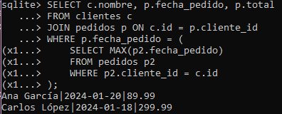

Por lo tanto podemos ver los pedidos más recientes de Ana y Carlos, junto con la fecha del pedido y el total del pedido. María como no tiene pedidos realizados no aparece.

En este ejemplo, la subconsulta depende del valor de la fila actual del SELECT externo. Y la correlación se encuentra en: ``p2.cliente_id = c.id``. Cada vez que la tabla externa (clientes c) cambia de fila, la subconsulta interna se ejecuta de nuevo con ese valor.


## Uso de EXISTS:

```
-- Clientes que tienen pedidos con productos caros (>200)
SELECT c.nombre, c.ciudad
FROM clientes c
WHERE EXISTS (
    SELECT 1
    FROM pedidos p
    JOIN detalle_pedidos dp ON p.id = dp.pedido_id
    WHERE p.cliente_id = c.id
    AND dp.precio_unitario > 200
);
```

``EXISTS`` se utiliza para verificar si existe **al menos una coincidencia** que cumpla una condición dada.

El objetivo de esta consulta es encontrar todos los clientes que hayan comprado al menos un producto cuyo precio_unitario sea mayor a 200.

```
SELECT c.nombre, c.ciudad
FROM clientes c
```

Esto mostrará lo siguiente:
- nombre del cliente
- ciudad

Ambos provenientes de la tabla ``clientes`` alias c.

```
WHERE EXISTS (
    ...
```

Se debe cumplir la condición del ``WHERE``. En este caso ``EXISTS`` devuelve "TRUE" si la subconsulta interna devuelve al menos una fila.

> [!NOTE]  
> No importa qué contenga esa fila, solo nos importa si existe.

Es por esto que la subconsulta interna usa ``SELECT 1``, el 1 es irrelevante.-

```
SELECT 1
FROM pedidos p
JOIN detalle_pedidos dp ON p.id = dp.pedido_id
WHERE p.cliente_id = c.id
AND dp.precio_unitario > 200
```

El ``JOIN`` une los pedidos de la tabla ``pedidos`` con sus detalles de la tabla ``detalle_pedidos``.

El segundo ``WHERE`` contiene la condición ``p.cliente_id = c.id``, lo que lo convierte en una subconsulta correlacionada, ya que usa el valor de la fila del SELECT externo: cuando el cliente externo es Ana, busca los pedidos de Ana, cuando el cliente externo es Carlos, busca los pedidos de Carlos.

El ``AND dp.precio_unitario > 200`` revisa si algún detalle del pedido tiene un precio_unitario sobre 200.

> [!IMPORTANT]  
> Si la subconsulta interna devuelva **AL MENOS UNA** fila -> EXISTS = TRUE -> cliente aparece.
>
> Si no devuelve filas -> EXISTS = FALSE -> cliente no aparece.

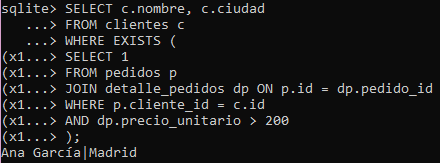

Finalmente, acá se puede observar que Ana es la única que aparece con su respectiva ciudad. 


Si quisieramos listar a los clientes con sus respectivos pedidos, podemos hacer la siguiente consulta:

```
SELECT c.nombre, c.ciudad, prod.nombre AS producto, dp.precio_unitario
FROM clientes c
JOIN pedidos p ON c.id = p.cliente_id
JOIN detalle_pedidos dp ON p.id = dp.pedido_id
JOIN productos prod ON dp.producto_id = prod.id
```
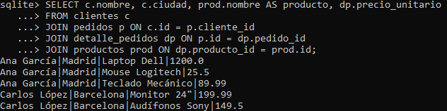

Al revisar los pedidos, efectivamente Ana es la única que tiene un producto caro (*Laptop Dell cuyo precio es 1200*).

