# Configurar entorno completo de análisis de datos

> [!NOTE]  
>En la carpeta de Descargas se creó una carpeta de proyecto llamada ``practica_python`` y en esta carpeta se creó el entorno virtual.

## Instalar Python y crear entorno virtual:

```
# Verificar instalación existente
python --version
```

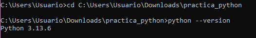

```
# Crear entorno virtual
python -m venv analisis_datos_env

# Activar entorno
source analisis_datos_env/bin/activate  # En Windows: analisis_datos_env\Scripts\activate`
```

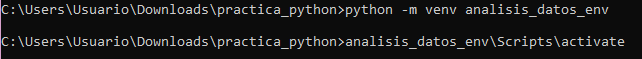

## Instalar bibliotecas esenciales:

```
# Instalar NumPy primero (base de todo)
pip install numpy
```

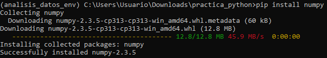

```
# Instalar Pandas
pip install pandas
```

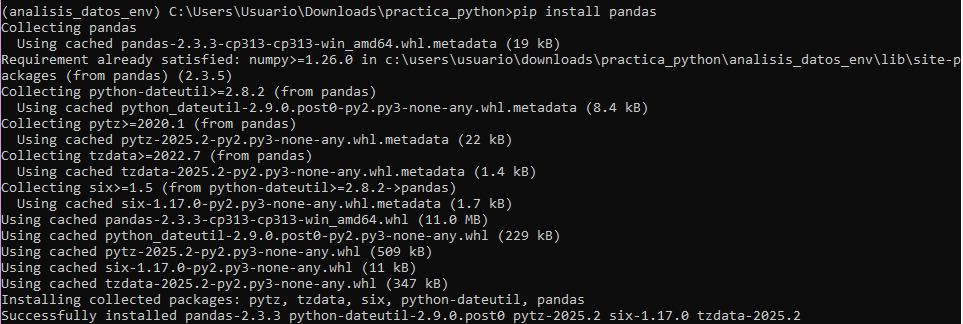

```
# Instalar Matplotlib para visualización
pip install matplotlib
```

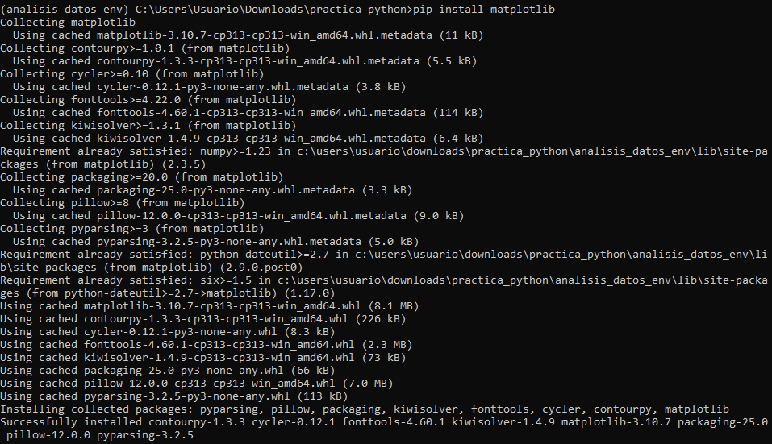

```
# Instalar Jupyter para notebooks
pip install jupyter
```

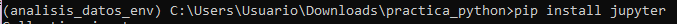

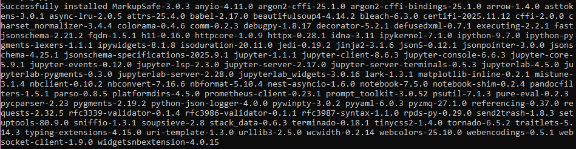


## Verificar instalación:

```
# Verificar versiones
python -c "import numpy as np; import pandas as pd; import matplotlib.pyplot as plt; print('NumPy:', np.__version__); print('Pandas:', pd.__version__); print('Matplotlib:', plt.__version__)"
```

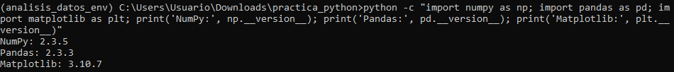

```
# Probar Jupyter
jupyter --version
```

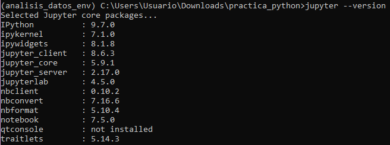

Con esto se confirma que todas las bibliotecas se instalaron correctamente ✅.

## Primer script de prueba:

Este primer script se creó en vs code y se guardó en la carpeta ``practica_python`` para poder ejecutarlo.

```
# Crear archivo test_analisis.py
import numpy as np
import pandas as pd
import matplotlib.pyplot as plt

# Crear datos de ejemplo
datos = {'x': np.random.randn(100), 'y': np.random.randn(100)}
df = pd.DataFrame(datos)

# Análisis básico
print("Estadísticas básicas:")
print(df.describe())

# Gráfico simple
plt.scatter(df['x'], df['y'])
plt.title('Primer gráfico con Python')
plt.savefig('primer_grafico.png')
print("Gráfico guardado como primer_grafico.png")
```

## Ejecutar y verificar:

```
python test_analisis.py
```

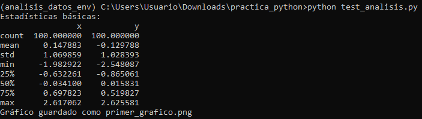

El script se ejecutó sin errores y se generó el siguiente gráfico que se guardó como imagen en la carpeta ``practica_python``.

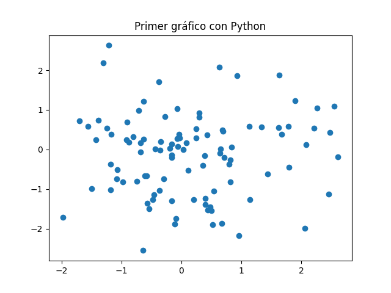


Verificación: Confirma que todas las bibliotecas se instalaron correctamente, el script se ejecutó sin errores, y se generó el archivo de imagen.

Requerimientos:
Sistema operativo: Windows, macOS, o Linux
Conexión a internet para descargar paquetes
Permisos para instalar software (especialmente en macOS/Linux)
Espacio en disco: ~1GB para bibliotecas y entornos virtuales