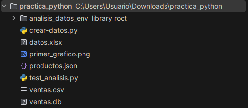
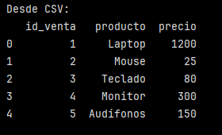
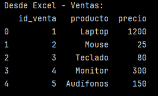
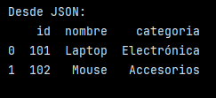
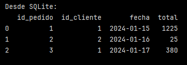
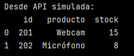

# Extracción desde múltiples fuentes heterogéneas

> [!NOTE]  
> Se usó la misma carpeta de la Actividad Práctica 1: ``practica_python`` y en esta se crearon  los diferentes scripts.

## Crear datos de ejemplo en diferentes formatos:

Para esto se creó el archivo [crear-datos.py](crear-datos.py):

```
import pandas as pd
import sqlite3
import json

# Crear CSV
ventas_csv = pd.DataFrame({
    'id_venta': range(1, 6),
    'producto': ['Laptop', 'Mouse', 'Teclado', 'Monitor', 'Audífonos'],
    'precio': [1200, 25, 80, 300, 150]
})
ventas_csv.to_csv('ventas.csv', index=False)

# Crear Excel con múltiples hojas
clientes_df = pd.DataFrame({
    'id_cliente': [1, 2, 3],
    'nombre': ['Ana', 'Carlos', 'María'],
    'ciudad': ['Madrid', 'Barcelona', 'Valencia']
})

with pd.ExcelWriter('datos.xlsx') as writer:
    ventas_csv.to_excel(writer, sheet_name='Ventas', index=False)
    clientes_df.to_excel(writer, sheet_name='Clientes', index=False)

# Crear JSON
productos_json = [
    {'id': 101, 'nombre': 'Laptop', 'categoria': 'Electrónica'},
    {'id': 102, 'nombre': 'Mouse', 'categoria': 'Accesorios'}
]
with open('productos.json', 'w') as f:
    json.dump(productos_json, f)

# Crear base de datos SQLite
conn = sqlite3.connect('ventas.db')
pedidos_df = pd.DataFrame({
    'id_pedido': [1, 2, 3],
    'id_cliente': [1, 2, 1],
    'fecha': ['2024-01-15', '2024-01-16', '2024-01-17'],
    'total': [1225, 25, 380]
})
pedidos_df.to_sql('pedidos', conn, index=False, if_exists='replace')
conn.close()
```

Al ejecutar el archivo ``crear-datos.py``, se crearon 4 archivos:
- ``datos.xlsx``
- ``productos.json``
- ``ventas.csv``
- ``ventas.db``



> [!NOTE]  
> Los archivos ``test_analisis.py`` y ``primer_grafico.png`` son archivos de la Actividad Práctica 1 del día anterior. 


## Extraer desde cada fuente:

Se creó un archivo llamado [extraer-datos.py](extraer-datos.py) con todos los bloques de código para extraer los datos de las distintas fuentes en un solo script. 

```
# Desde CSV
df_csv = pd.read_csv('ventas.csv')
print("Desde CSV:")
print(df_csv.head())
```

DataFrame entregado:



```
# Desde Excel (hoja específica)
df_excel_ventas = pd.read_excel('datos.xlsx', sheet_name='Ventas')
df_excel_clientes = pd.read_excel('datos.xlsx', sheet_name='Clientes')
print("\nDesde Excel - Ventas:")
print(df_excel_ventas.head())
```

> [!IMPORTANT]  
> Para excel es necesario instalar openpyxl: ``pip install openpyxl``.

DataFrame entregado:



```
# Desde JSON
df_json = pd.read_json('productos.json')
print("\nDesde JSON:")
print(df_json)
``` 

DataFrame entregado:



```
# Desde SQLite
conn = sqlite3.connect('ventas.db')
df_sql = pd.read_sql('SELECT * FROM pedidos', conn)
conn.close()
print("\nDesde SQLite:")
print(df_sql)
```

DataFrame entregado:




## API simulada (usando requests si está disponible):

Se creó el archivo [simular-api.py](simular-api.py) con el siguiente código:

```
# Simular API response
api_response = {
    'status': 'success',
    'data': [
        {'id': 201, 'producto': 'Webcam', 'stock': 15},
        {'id': 202, 'producto': 'Micrófono', 'stock': 8}
    ]
}

# Simular consumo de API
import json
df_api = pd.DataFrame(api_response['data'])
print("\nDesde API simulada:")
print(df_api)
```

DataFrame entregado:



La idea es practicar cómo trabajar con datos que vienen de una API (normalmente en formato JSON), pero sin llamar realmente a un servidor externo (se simula la respuesta de la API). En un proyecto real, muchas veces hay que traer datos desde una API REST:

- Se hace un requests.get ("https:/api.loquequeramos.com/endpoint").
- La API devuelve un JSON.
- Se convierte ese JSON en un DataFrame de pandas para analizarlo.

Finalmente, se confirma que todos los métodos de extracción funcionan correctamente y producen DataFrames consistentes ✅.


### Requerimientos:

Python con Pandas instalado

requests (opcional para APIs): pip install requests

openpyxl (para Excel): pip install openpyxl

SQLite incluido en Python estándar

Archivos de ejemplo o acceso a bases de datos