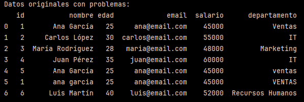
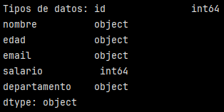
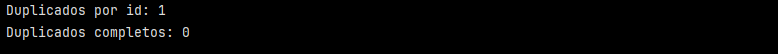
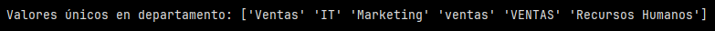
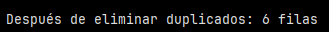
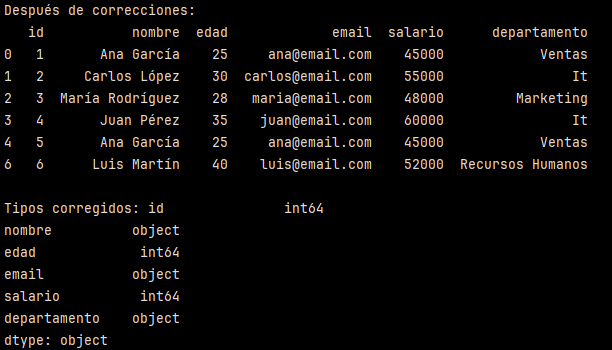
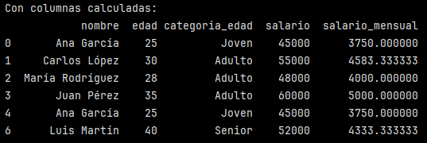
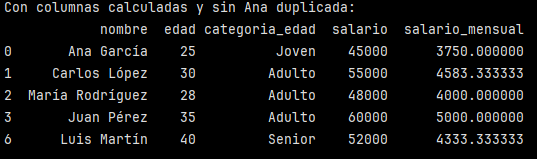

# Pipeline completo de limpieza de datos realista

## Crear dataset con problemas comunes:

```
import pandas as pd
import numpy as np

# Crear datos con problemas típicos
datos = {
    'id': [1, 2, 3, 4, 5, 1, 6],  # Duplicado en id 1
    'nombre': ['Ana García', 'Carlos López', 'María Rodríguez', 'Juan Pérez', 'Ana García', 'ana garcia', 'Luis Martín'],
    'edad': ['25', '30', '28', '35', '25', '25', '40'],  # String en lugar de int
    'email': ['ana@email.com', 'carlos@email.com', 'maria@email.com', 'juan@email.com', 'ana@email.com', 'ana@email.com', 'luis@email.com'],
    'salario': [45000, 55000, 48000, 60000, 45000, 45000, 52000],
    'departamento': ['Ventas', 'IT', 'Marketing', 'IT', 'ventas', 'VENTAS', 'Recursos Humanos']  # Inconsistente capitalización
}

df = pd.DataFrame(datos)
print("Datos originales con problemas:")
print(df)
```
Se obtiene el siguiente DataFrame:



Se observa que hay algunos nombres, id y correos repetidos e inconsistencia en la capitalización de nombres y departamentos.

## Inspeccionar y diagnosticar problemas:

```
print(f"\nTipos de datos: {df.dtypes}")
print(f"\nDuplicados por id: {df['id'].duplicated().sum()}")
print(f"Duplicados completos: {df.duplicated().sum()}")
print(f"\nValores únicos en departamento: {df['departamento'].unique()}")
```

Al ejecutar ``print(f"\nTipos de datos: {df.dtypes}")`` muestra qué tipo de dato detectó pandas en cada columna.



Acá se puede observar que la columna ``'edad'`` está guardada como texto, a pesar de contener números.

En el caso de los duplicados y valores únicos en departamentos tenemos lo siguiente:



``duplicated()`` marca True/False según si un valor ya apareció antes. Si ya apareció antes True, si no, False.

``.sum()`` en este caso cuenta la cantidad de ``True`` que hay en la columna id (en ``{df['id'].duplicated().sum()}`` se indica la columna ``'id'``) y luego pandas revisa todo el DataFrame y detecta si hay **filas** duplicadas completas (con ``{df.duplicated().sum()}``).

En este caso, se observa que hay 1 duplicado por id y no existen filas idénticas en el dataframe.

Al ver el dataframe de la primera imagen se puede comprobar que el 'id' = 1 está dos veces. También es posible ver que el nombre de Ana García está más de una vez, pero escrito de maneras diferentes.



Respecto a los valores únicos, ``{df['departamento'].unique()}`` muestra todos los valores distintos en esa columna. En este caso se ve que hay 6 valores únicos, sin embargo, podemos ver que *"Ventas"* está 2 veces, una como 'ventas' y la otra como 'VENTAS', lo que sería un ejemplo de capitalización inconsistente.


## Limpiar duplicados:

```
# Eliminar duplicados basados en id y email
df_limpio = df.drop_duplicates(subset=['id', 'email'], keep='first').copy()
print(f"\nDespués de eliminar duplicados: {len(df_limpio)} filas")
```



Como se vió en la sección anterior, hay duplicados en la columna 'id'. Sin embargo, al verificar si había duplicados de filas completas en el dataframe, se vio que no había. Una forma de eliminar duplicados es basarse en id y en el email.

``df.drop_duplicates(...)``: permite eliminar filas repetidas.

``subset=['id', 'email']``: indica qué colummnas usar para decidir si una fila está duplicada. En este caso, si dos filas tienen el mismo ``'id'`` y el mismo ``'email'``, se consideran duplicadas.

``keep='first'``: esto sirve para indicar que, si hay duplicados, se conserve la primera aparición y se eliminen las siguientes.

``df_limpio=(...)``: guarda el resultado en un nuevo DataFrame, esta es una buena práctica para no sobreescribir ni perder los datos originales.

``len(df_limpio)``: cuenta la cantidad de filas que quedaron luego de eliminar duplicados. En este caso inicialemente teníamos 7 filas y luego de la limpieza, quedaron 6 filas.

``.copy()``: se agregó para crear un DataFrame independiente (correspondiente a ``df_limpio``), para que VS Code o PyCharm no muestren el Warning de que ``df_limpio`` es una "vista" o una copia parcial de df.

## Corregir tipos de datos y formatos:

```
# Convertir edad a numérico
df_limpio['edad'] = pd.to_numeric(df_limpio['edad'], errors='coerce')

# Normalizar departamento
df_limpio['departamento'] = df_limpio['departamento'].str.title()

# Normalizar nombres
df_limpio['nombre'] = df_limpio['nombre'].str.title()

print("Después de correcciones:") print(df_limpio) print(f"\nTipos corregidos: {df_limpio.dtypes}")
```



La columna ``'edad'`` venía como *string*. Al usar ``pd.to_numeric(df_limpio['edad'], errors='coerce')`` estamos indicando que la columna ``'edad'`` se convierta a tipo numérico y la parte de ``errors='coerce'`` indica que si algo no se puede convertir o hay valores inválidos, se conviertan en ``NaN``.

En la parte de normalizar departamento y nombres, ``str.tittle()`` es un método que permite dar formato **"Título"**, que consite en un tipo de capitalización donde la primera letra de cada palabra va en mayúscula y el resto en minúscula. Esto permite unificar categorías/nombres que son iguales pero que están escritos de forma diferentes como 'ventas' y 'VENTAS' que al aplicar la normalización, quedan como 'Ventas'.

Al ver los tipos de datos, se comprueba que ``'edad'`` ahora es numérico. ✅


## Crear columnas calculadas


```
# Calcular salario mensual y anual
df_limpio['salario_mensual'] = df_limpio['salario'] / 12
df_limpio['categoria_edad'] = pd.cut(df_limpio['edad'], 
                                    bins=[0, 25, 35, 100], 
                                    labels=['Joven', 'Adulto', 'Senior'])

print("Con columnas calculadas:")
print(df_limpio[['nombre', 'edad', 'categoria_edad', 'salario', 'salario_mensual']])
```



En este caso, se creó una columna llamada ``'salario_mensual'`` y corresponde al valor de la columna ``'salario'`` divido en 12 (correspondiente a los 12 meses del año).

También se creó otra columna llamara ``'categoria_edad'``. ``pd.cut()`` nos permite agrupar valores numéricos en rangos, en este caso aplicado a la columna ``'edad'``. 

``bins=[0, 25, 35, 100]`` define los intervalos:
- (0, 25]
- (25, 35]
- (35, 100]

``labels=['Joven', 'Adulto', 'Senior']`` son las etiquetas asignadas a cada rango:
- 0 < edad ≤ 25 → "Joven"
- 25 < edad ≤ 35 → "Adulto"
- 35 < edad ≤ 100 → "Senior"

Finalmente, se muestra el DataFrame con las columnas solicitadas:
- nombre
- edad
- categoria_edad
- salario (anual)
- salario_mensual

Podemos ver que el nombre de "Ana García" aparece dos veces, sin embargo, de acuerdo a la regla utilizada en la limpieza de duplicados, ``subset=['id', 'email']``, el resultado es consistente. Esta regla solo eliminó las filas donde coidicen al mismo tiempo ``'id'`` e ``'email'``, por lo que solo se eliminó la fila 6 (índice 5) del df origial.

La fila 5 (índice 4) no es duplicado según el criterio anterior, porque si bien tienen el mismo mail, el ``'id'`` es diferente. Por lo tanto, en estos datos, hay dos Anas con distinto id, así que pandas asume que son personas distintas. Sin embargo, al ver la edad, el salario y el correo no es extraño pensar que corresponden a la misma persona. Si quisiéramos quedarnos con una sola Ana, al ver que tienen el mismo email, podríamos eliminar ese duplicado del dataframe de la siguiente manera:

```
df_final = df_limpio.drop_duplicates(subset=['email'], keep='first').copy()
print("Con columnas calculadas y sin Ana duplicada:")
print(df_final[['nombre', 'edad', 'categoria_edad', 'salario', 'salario_mensual']])
```



Verificación: Compara el dataset original con el limpio y confirma que todos los problemas identificados han sido resueltos. ✅

Requerimientos:
- Python con Pandas instalado (del día 1)
- NumPy disponible
- Dataset de ejemplo o archivo CSV para practicar
- Conocimiento básico de DataFrames (del día 2)