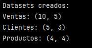
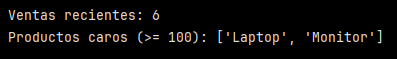
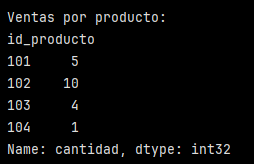
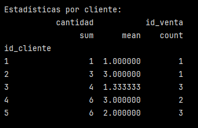
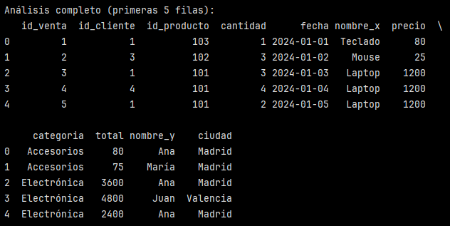
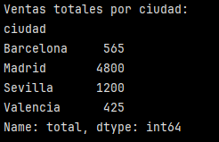
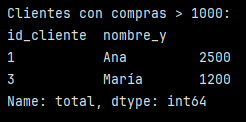

# Análisis completo combinando filtrado, agrupación y merge

## Crear datasets relacionados:

```python
import pandas as pd
import numpy as np

# Dataset de ventas
ventas = pd.DataFrame({
    'id_venta': range(1, 11),
    'id_cliente': np.random.choice([1, 2, 3, 4, 5], 10),
    'id_producto': np.random.choice([101, 102, 103, 104], 10),
    'cantidad': np.random.randint(1, 5, 10),
    'fecha': pd.date_range('2024-01-01', periods=10, freq='D')
})

# Dataset de clientes
clientes = pd.DataFrame({
    'id_cliente': [1, 2, 3, 4, 5],
    'nombre': ['Ana', 'Carlos', 'María', 'Juan', 'Luis'],
    'ciudad': ['Madrid', 'Barcelona', 'Madrid', 'Valencia', 'Sevilla']
})

# Dataset de productos
productos = pd.DataFrame({
    'id_producto': [101, 102, 103, 104],
    'nombre': ['Laptop', 'Mouse', 'Teclado', 'Monitor'],
    'precio': [1200, 25, 80, 300],
    'categoria': ['Electrónica', 'Accesorios', 'Accesorios', 'Electrónica']
})

print("Datasets creados:")
print(f"Ventas: {ventas.shape}")
print(f"Clientes: {clientes.shape}")
print(f"Productos: {productos.shape}")
```


La imagen muestra la cantidad de filas y columnas de cada dataframe creado.

``.shape`` entrega ``(n_filas, n_columnas)``, es decir, la cantidad de filas y columnas de cada DataFrame. Se utiliza para verificar rápidamente el tamaño de cada DataFrame.


## Filtrado avanzado con query():

```python
# Ventas del mes actual con query
ventas_recientes = ventas.query('fecha >= "2024-01-05"')
print(f"\nVentas recientes: {len(ventas_recientes)}")

# Productos caros usando variable externa
precio_limite = 100
productos_caros = productos.query('precio >= @precio_limite')
print(f"Productos caros (>= {precio_limite}): {productos_caros['nombre'].tolist()}")
```



``.query`` permite filtrar filas usando una expresión tipo string. En este caso se está pidiendo solo las ventas con fecha el de 5 de enero o después.

Para el caso de los productos caros, se definió un ``precio_limite = 100``.En ``query``, el símbolo ``@`` sirve para usar variables externas (en este caso ``precio_limite``). Lo que se está pidiendo es que se filtren productos cuyo precio sea mayor o igual al ``precio_limite``. Como resultado de la consulta, se ven los precios de la laptop y el monitor (≥ 100).

## Agrupación y agregación:

```python
# Ventas por producto
ventas_por_producto = ventas.groupby('id_producto')['cantidad'].sum()
print(f"\nVentas por producto:\n{ventas_por_producto}")
```



- ``groupby('id_producto')``: agrupa las filas por producto.

- ``['cantidad'].sum()``: suma las cantidades vendidas de cada producto.

Como resultado se obtiene los ``id_producto`` como índice junto a la suma de cantidad como tipo de dato numérico.


```python
# Estadísticas por cliente
stats_por_cliente = ventas.groupby('id_cliente').agg({
    'cantidad': ['sum', 'mean'],
    'id_venta': 'count'
})
print(f"\nEstadísticas por cliente:\n{stats_por_cliente}")
``` 



- ``groupby('id_cliente')``: agrupa las filas por cliente.
- ``.agg({...})``: permite aplicar múltiples agregaciones:
    - ``'cantidad': ['sum', 'mean']``: cantidad total comprada (suma) y promedio de unidades.
    - ``'id_venta': 'count'``: indica cuántas compras hizo ese cliente.

## Merge para análisis completo:

```python
# Unir ventas con productos
ventas_productos = pd.merge(ventas, productos, on='id_producto')

# Calcular totales
ventas_productos['total'] = ventas_productos['cantidad'] * ventas_productos['precio']

# Unir con clientes
analisis_completo = pd.merge(ventas_productos, clientes, on='id_cliente')

print(f"\nAnálisis completo (primeras 5 filas):\n{analisis_completo.head()}")
```



- ``pd.merge()``: es como un "join" tipo INNER por defecto. En este caso une la tabla ventas con productos usando la columna en común ``'id_producto'``.
- ``'total'``: se crea una nueva columna que corresponde a la cantidad multiplicada por el precio, dando el monto total de cada venta.
- Finalmente se unen ``ventas_productos`` (tabla de ventas unida a la de productos) con la tabla de clientes.

Esto entrega un DataFrame que contiene 5 filas y 11 columnas.

```python
# Análisis por ciudad
ventas_por_ciudad = analisis_completo.groupby('ciudad')['total'].sum()
print(f"\nVentas totales por ciudad:\n{ventas_por_ciudad}")
```



- ``groupby('ciudad')``: agrupa las filas por ciudad.
- ``['total'].sum()``: suma el total gastado en cada ciudad.
- Esto muestra cuánto se ha vendido en cada ciudad.


# Filtrado final:

```python
# Clientes con compras > 1000
clientes_top = analisis_completo.groupby(['id_cliente', 'nombre_y'])['total'].sum()
clientes_top = clientes_top[clientes_top > 1000]
print(f"\nClientes con compras > 1000:\n{clientes_top}")
```


- ``groupby(['id_cliente', 'nombre_y'])``: agrupa las filas por cliente (id y nombre). En este caso se usó ``'nombre_y'`` porque en los datasets hay 2 columnas llamadas ``'nombre'`` (en clientes y en productos). Al hacer el merge, como clientes también tiene ``'nombre'``, pandas debe renombrar una de las dos columnas.
Pandas en este caso renombra los duplicados así:
    - ``nombre_x``: del primer DataFrame del merge, en este caso nombre del producto.
    - ``nombre_y``: del segundo DataFrame del merge, en este caso, nombre del cliente.

>[!NOTE]
> Para evitar confusiones, una opción es renombrar las columnas después del merge. 

```python
analisis_completo = analisis_completo.rename(columns={
    'nombre_y': 'nombre_cliente',
    'nombre_x': 'producto'
})
```

- ``['total'].sum()`` suma el total de todas sus compras (del cliente).
- Finalmente se filtran aquellos clientes cuyo total (en compras) es > 1000.


En este análisis, cada paso intermedio fue clave para construir una visión completa del comportamiento de ventas.

El filtrado permitió aislar subconjuntos relevantes de datos, como las ventas más recientes o los productos de mayor precio según un criterio establecido. La agrupación reveló patrones agregados (por producto, por cliente, por ciudad) que no son visibles a nivel de registro individual, aportando métricas esenciales como totales, promedios y frecuencias.

Los merge permitieron integrar distintos datasets (ventas, clientes y productos) en una sola vista, vinculando la información transaccional con atributos de clientes y productos.

En conjunto, estos procesos permitieron transformar datos en un análisis más profundo pudiendo identificar clientes de mayor valor y medir rendimiento por catregorías, aportando información y una base sólida para la toma de decisiones informada.


--- 

Verificación: Examina cada resultado intermedio para entender cómo cada operación (filtrado, agrupación, merge) contribuye al análisis final.

Requerimientos:
- Python con Pandas instalado

- NumPy disponible

- Datasets relacionados para practicar joins

- Conocimiento de DataFrames básicos (del día 2)