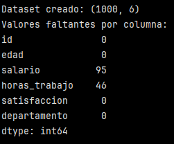
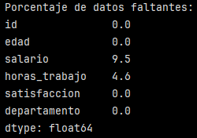
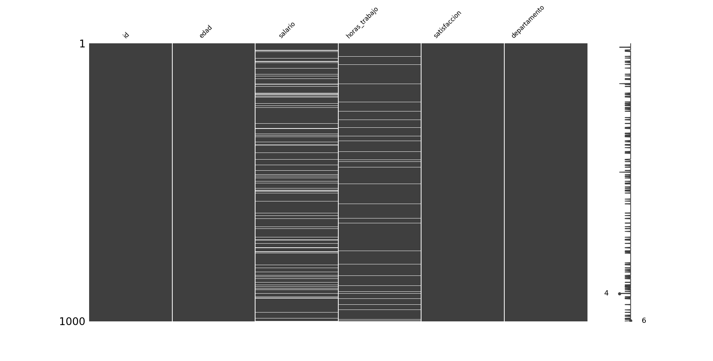
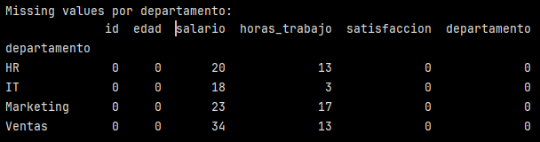
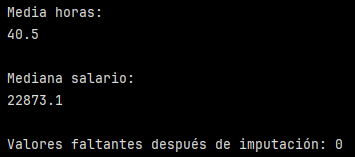
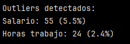
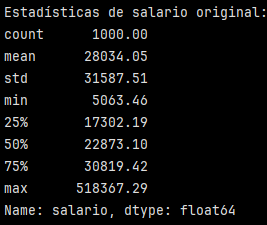
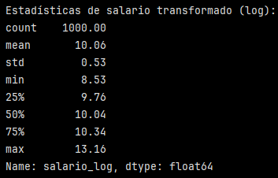
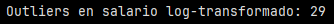

# Pipeline completo de manejo de datos faltantes y outliers

> [!IMPORTANT]
> Se deben instalar las librerías ``scipy`` y ``missingno``. 

## Crear dataset con problemas realistas:

```
import pandas as pd
import numpy as np
from scipy import stats

# Crear dataset con missing values y outliers
np.random.seed(42)
n = 1000

datos = pd.DataFrame({
    'id': range(1, n+1),
    'edad': np.random.normal(35, 10, n).clip(18, 80),  # Normal con límites
    'salario': np.random.lognormal(10, 0.5, n),  # Distribución log-normal
    'horas_trabajo': np.random.normal(40, 5, n).clip(20, 60),
    'satisfaccion': np.random.randint(1, 6, n),
    'departamento': np.random.choice(['IT', 'Ventas', 'Marketing', 'HR'], n)
})

# Introducir missing values
mask_missing = np.random.random(n) < 0.1  # 10% missing
datos.loc[mask_missing, 'salario'] = np.nan

mask_missing_horas = np.random.random(n) < 0.05  # 5% missing
datos.loc[mask_missing_horas, 'horas_trabajo'] = np.nan

# Introducir outliers
outlier_indices = np.random.choice(n, 20, replace=False)
datos.loc[outlier_indices[:10], 'salario'] = datos.loc[outlier_indices[:10], 'salario'] * 10  # Salarios extremos altos
datos.loc[outlier_indices[10:], 'horas_trabajo'] = np.random.choice([80, 90, 100], 10)  # Horas imposibles

print(f"Dataset creado: {datos.shape}")
print(f"Valores faltantes por columna:\n{datos.isnull().sum()}")
```

- ``np.random.seed(42)``: es una función de la biblioteca NumPy que inicializa el generador de números aleatorios para que siempre produzca la misma secuencia de números aleatorios. Se hace estableciendo un valor de semilla (en este caso 42) para que los resultados sean reproducibles cada vez que se ejecuta el código.
- ``n =1000``: indica que el dataset tendrá 1000 filas.

Primero se crea un DataFrame con lo siguiente:

- ``id``: de 1 a 1000.
- ``edad``: distribución normal centrada en 35, desviación 10, con límites entre 18 y 80 (``np.random.normal(35, 10, n).clip(18, 80)``). Esto obliga que los valores queden dentro de ese rango. En este caso, tiene sentido limitar el rango dado que la columna representa la edad, por lo tanto, es poco probable que haya empleados menores de 18 o mayores de 80. La idea es tener un dataset realista para practicar.
- ``salario``: distribución log-normal, típica para salarios (cola larga hacia valores altos)
- ``horas_trabajo``: distribución normal, alrededor de 40 horas, con rango limitado entre 20 y 60 (``np.random.normal(40, 5, n).clip(20, 60)``).
- ``satisfaccion``: valores enteros entre 1 y 5.
-  ``departamento``: elige un departamento al azar (``np.random.choice(['IT', 'Ventas', 'Marketing', 'HR'], n)``). El np.random.choice permite seleccionar uno o varios elementos de una lista, arreglo o rango de manera aleatoria. 

Luego se introducen valores faltantes al dataset.

- ``mask_missing``: representa qué filas deben tener datos faltantes (en base a la condición ``np.random.random(n) < 0.1``). Esto genera un arreglo con números aleatorios entre 0 y 1.     
    - Si es <= 0.1 → True → habrá un NaN.
    - Si es > 0.1 False → se deja el valor original. 

- ``datos.loc[mask_missing, 'salario'] = np.nan``: ``.loc`` permite seleccionar filas y columnas usando etiquetas o condiciones. En este caso, significa que en el DataFrame, en las filas donde mask_missing sea True, reemplaza el valor de la columna ``'salario'`` por NaN.

Esto genera un 10% de datos faltantes en ``'salario''``.

Para el caso de la horas de trabajo, se hace algo similar, excepto que ahora aproximadamente el 5% de los datos de ``'horas_trabajo`` quedan como NaN (``np.random.random(n) < 0.05``).




Se puede observar que el DataFrame entregado contiene 1000 filas y 6 columnas. Al hacer el recuento de valores faltantes por columna (``datos.isnull().sum()``), se ve que en la columna ``'salario'`` hay 95 valores faltantes y en la columna ``horas_trabajo`` hay 46 valores faltantes.


## Analizar datos faltantes:

```
# Análisis detallado de missing values
print("Porcentaje de datos faltantes:")
print((datos.isnull().sum() / len(datos) * 100).round(2))
```


- ``datos.isnull().sum() / len(datos) * 100).round(2)``: suma los valores faltantes y los divide en la cantidad total de datos. Esa división se multiplica por 100 y se redondea a dos decimales.

Se puede ver que para la columna ``salario`` hay un 9,5% de datos faltantes y para la columna ``horas_trabajo`` un 4,6 %.

```
# Patrón de missing values
import missingno as msno
import matplotlib.pyplot as plt

plt.figure(figsize=(14, 8)) # para ajustar tamaño
msno.matrix(datos)  # Visualización (requiere instalar missingno)
plt.xticks(rotation=45, ha='right', fontsize=12) # para inclinar nombres de los departamentos
plt.tight_layout() # reorganiza todo para que ninguna etiqueta quede fuera del gráfico.
plt.show() # para mostrar el gráfico
```
> [!NOTE]
> ``missingno`` es una librería utilizada para visualizar patrones de missing. 




Este gráfico muestra visualmente dónde están los valores faltantes el DataFrame. Las líneas blancas representan valores faltantes y las grises representan valores existentes.
Cada columna representa una columna del DataFrame y tenemos filas del 1 a 1000 en el eje vertical.
En la figura se observa que la columna ``salario`` y ``horas_trabajo`` contienen datos faltantes, siendo mayor la cantidad en la columna ``salario``.

> [!NOTE]
> Recordar que para la columna ``salario`` se agregó ~ 10% de valores faltantes y en la de ``horas_trabajo`` ~ 5%.

Esta visualización permite identificar rápidamente patrones de ausencia de datos y validar la calidad del dataset antes de proceder con imputaciones.

```
# Análisis por departamento
print("\nMissing values por departamento:")
print(datos.groupby('departamento').apply(lambda x: x.isnull().sum()))
```



- ``datos.groupby('departamento')`` permite agrupar por departamento (4 en total).
- ``.apply()``: es un método que sirve para aplicar una función.
- ``lambda x:``: define una función anónima que recibe un argumento (x)
- ``x.isnull().sum()`` indica lo que hace la función. En este caso para cada grupo (cada departamento), cuenta cuántos valores faltantes hay por columna.

Esto complementa la información del gráfico anterior y la enriquece al agrupar por departamento, viendo así, si algún departamento tiene más datos faltantes que otros.

Acá se observa que el departamento de ``Ventas`` tiene la mayor cantidad de datos faltantes en la columna ``salario`` (34) y el departamento ``IT`` tiene la menor cantidad (18). En el caso de las ``horas_trabajo``, la mayor cantidad de datos faltantes se encuentra en el departamento de ``Marketing`` (17) y la menor en ``IT``(3).

```
#Imputación de valores faltantes:

# Imputación por media para horas_trabajo
media_horas = datos['horas_trabajo'].mean()
print("\nMedia horas:")
print((media_horas).round(2)) #se agregó para ver la media.
datos['horas_trabajo'] = datos['horas_trabajo'].fillna(media_horas)
```
- ``datos['horas_trabajo'].mean()``: permite calcular la media de ``horas_trabajo``.
- ``.fillna(media_horas)``: rellena los NaN con la media calculada anteriormente.

```
# Imputación por mediana para salario (más robusto a outliers)
mediana_salario = datos['salario'].median()
print("\nMediana salario:")
print((mediana_salario).round(2)) #se agregó para ver la mediana.
datos['salario'] = datos['salario'].fillna(mediana_salario)
```

- ``datos['salario'].median()``: para calcular la mediana de ``salario``.
- ``.fillna(mediana_salario)``: rellena los valores faltantes con la mediana calculada anteriormente.

Estos dos ejemplos de imputación son imputaciones simples (media y mediana).

```
# Verificar que no queden missing values
print(f"\nValores faltantes después de imputación: {datos.isnull().sum().sum()}")
```



Se suman todos los valores faltantes y esta suma al ser = 0, indica que se imputó todo correctamente.


## Detección de outliers:

```
# Función para detectar outliers usando IQR
def detectar_outliers_iqr(data, columna):
    Q1 = data[columna].quantile(0.25)
    Q3 = data[columna].quantile(0.75)
    IQR = Q3 - Q1
    limite_inferior = Q1 - 1.5 * IQR
    limite_superior = Q3 + 1.5 * IQR
    return (data[columna] < limite_inferior) | (data[columna] > limite_superior)

# Detectar outliers en salario y horas
outliers_salario = detectar_outliers_iqr(datos, 'salario')
outliers_horas = detectar_outliers_iqr(datos, 'horas_trabajo')

print(f"\nOutliers detectados:")
print(f"Salario: {outliers_salario.sum()} ({outliers_salario.mean()*100:.1f}%)")
print(f"Horas trabajo: {outliers_horas.sum()} ({outliers_horas.mean()*100:.1f}%)")
```



- Se defina la función ``detectar_outliers_iqr(data, columna)`` donde:
    - Se calcula el cuartil 25% (Q1), el cuartil 75% (Q3).
    - Se calcula el rango intercuartílico (IQR) = Q3-Q1
    - Se definen los límites:
        - límite inferior = ``Q1 - 1.5 * IQR``
        - límite superior = ``Q3 + 1.5 * IQR``
    - ``return (data[columna] < limite_inferior) | (data[columna] > limite_superior)``: devuelve una serie booleana (True/False) que indica qué filas son outilers.
        - True = es un outlier
        - False = no es un outlier.

> [!NOTE]
> Esa última línea en particular indica que si el valor (dato) es menor que el límite inferior O  ( | ) mayor que el límite superior, entonces el valor es un outlier.

- ``outliers_salario.sum()``: suma la cantidad de outliers en la columna ``salario``.
- ``outliers_horas.sum()``: suma la cantidad de outliers en la columna ``horas_trabajo``.
- ``{outliers_salario.mean()*100:.1f}%)"``: calcula el porcentaje que corresponde esa cantidad de outliers en la columna ``salario``.
- ``({outliers_horas.mean()*100:.1f}%)")``: calcula el porcentaje que corresponde esa cantidad de outliers en la columna ``horas_trabajo``.

Finalmente, se observa que en la columna ``salario`` hay 55 valores outliers (55%) y en la columna ``horas_trabajo`` hay 24 (2,4%)

## Manejo de outliers:

```
# Para horas_trabajo: cap at reasonable maximum
max_horas_normales = 60
datos.loc[datos['horas_trabajo'] > max_horas_normales, 'horas_trabajo'] = max_horas_normales

# Para salario: transformar usando log (más robusto)
datos['salario_log'] = np.log1p(datos['salario'])
```


- ``max_horas_normales = 60``: Se define un máximo de horas consideradas "normales".
- ``datos.loc[datos['horas_trabajo'] > max_horas_normales, 'horas_trabajo'] = max_horas_normales``: indica que si alguien trabaja más de 60 horas semanales, se cambie ese valor por 60 (``max_horas_normales``). 
- ``.loc``permite seleccionar filas y columnas, en este caso:
    - filas donde la condición es True (``datos['horas_trabajo'] > max_horas_normales``).
    - columna ``horas_trabajo``
    - se asigna el nuevo valor (``max_horas_normales``)

Luego hay una transformación logarítima en la columna ``salario``:

- ``np.log1p``: esto significa log(1+x) y permite comprimir la escala en ``salario`` para reducir el impacto de outliers.

```
# Comparar estadísticas antes y después
print(f"\nEstadísticas de salario original:")
print(datos['salario'].describe().round(2))

print(f"\nEstadísticas de salario transformado (log):")
print(datos['salario_log'].describe().round(2))
``` 




Al comparar ambas estadísticas se observa que el salario transformado tiene valores mucho más bajos, comprobando que la transformación logarítmica reduce la variabilidad provocada por los outliers.

```
# Verificar reducción de outliers
outliers_salario_log = detectar_outliers_iqr(datos, 'salario_log')
print(f"\nOutliers en salario log-transformado: {outliers_salario_log.sum()}")
```


Se vuelve a aplicar el la función ``detectar_outliers_iqr(data, columna) `` pero ahora a la columna ya transformada. Como log reduce la escala, es esperable que más valores caigan dentro del rango intercuartílico "permitido" y por lo tanto que haya menos outliers.

Con este ejemplo podemos comprobar que de 55 outliers en la columna ``salario`` (sin transformar), pasamos a 29 outliers luego de transformar (``salario_log``).

Los outliers pueden contener información relevante y eliminarlos podría reducir la muestras. Es por eso que a veces, en algunos análisis es preferible reducir el impacto de estos en vez de eliminarlos.


Este ejercicio permitió construir un pipeline completo y realista de preparación de datos, abordando dos de los desafíos más frecuentes en el análisis de datos: los valores faltantes y los outliers. 
A través de la identificación, visualización y cuantificación de los missing values, fue posible aplicar estrategias de imputación adecuadas, utilizando medias o medianas según la naturaleza de cada variable. Posteriormente, la detección y corrección de outliers mediante técnicas como el capping (fijar el máximo de horas en 60) y la transformación logarítmica permitió reducir la distorsión en la distribución de los datos y mejorar la estabilidad de las métricas. En conjunto, este proceso garantiza un dataset más limpio, consistente y robusto, listo para análisis estadísticos o modelos predictivos que requieran información fiable y libre de sesgos extremos.


---

Verificación: Compara las estadísticas y distribuciones antes y después del procesamiento para confirmar que los datos están más limpios y apropiados para análisis.

Requerimientos:
- Python con Pandas y NumPy
- Opcional: scipy para estadísticas avanzadas
- Dataset con missing values y outliers para practicar
- Conocimiento de operaciones básicas de Pandas