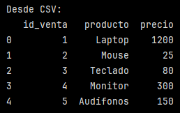
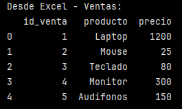
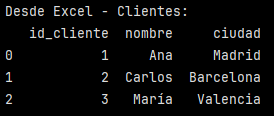
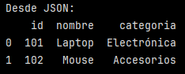
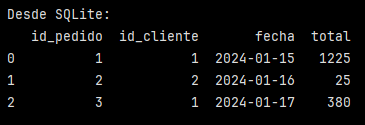
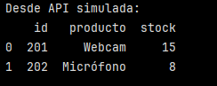

# Extracción desde múltiples fuentes heterogéneas

Ejercicio práctico para aplicar los conceptos aprendidos.

> [!IMPORTANT]
> Instalar librería ``openpyxl``.

## Crear datos de ejemplo en diferentes formatos:

```python
import pandas as pd
import sqlite3
import json

# Crear CSV
ventas_csv = pd.DataFrame({
    'id_venta': range(1, 6),
    'producto': ['Laptop', 'Mouse', 'Teclado', 'Monitor', 'Audífonos'],
    'precio': [1200, 25, 80, 300, 150]
})
ventas_csv.to_csv('ventas.csv', index=False)
```
- Se crea un DataFrame de nombre ``ventas_csv`` a partir de un diccionario.
- Las claves del diccionario (``'id_venta'``, ``'producto'``, ``'precio'``) son las columnas del DataFrame.
- Los valore son listas con los datos.
- ``to_csv`` guarda el DataFrame en un archivo CSV.
- ``index=False``: indica a pandas que no incluya la columna índice en el archivo.

```python
# Crear Excel con múltiples hojas
clientes_df = pd.DataFrame({ 
    'id_cliente': [1, 2, 3],
    'nombre': ['Ana', 'Carlos', 'María'],
    'ciudad': ['Madrid', 'Barcelona', 'Valencia']
})

with pd.ExcelWriter('datos.xlsx') as writer:
    ventas_csv.to_excel(writer, sheet_name='Ventas', index=False)
    clientes_df.to_excel(writer, sheet_name='Clientes', index=False)
```

- Se crea un DataFrame con información de los clientes, llamado ``clientes_df``, que luego es incorporado como una hoja de excel llamada ``'Clientes'``.
- El archivo CSV``ventas_csv`` creado anteriormente se incluye en una de las hojas de este excel, llamada ``'Ventas'``.
- ``with pd.ExcelWriter('datos.xlsx') as writer:`` crea un objeto ExcelWriter que lo permite guardar varios DataFrames en un mismo archivo, cada uno en una hoja distinta.

```python
# Crear JSON
productos_json = [
    {'id': 101, 'nombre': 'Laptop', 'categoria': 'Electrónica'},
    {'id': 102, 'nombre': 'Mouse', 'categoria': 'Accesorios'}
]
with open('productos.json', 'w') as f:
    json.dump(productos_json, f)
```

- Se tiene una lista de diccionarios de Python.
- Cada diccionario representa un producto.
- ``open('productos.json', 'w')``: abre un archivo llamado ``productos.json`` en modo escritura (``'w'``).
- ``as f``: f es el manejador del archivo.
- ``json.dump(productos_json, f)``: toma la estructura Python productos_json y la convierte a formato JSON en el archivo.


```python
# Crear base de datos SQLite
conn = sqlite3.connect('ventas.db')
pedidos_df = pd.DataFrame({
    'id_pedido': [1, 2, 3],
    'id_cliente': [1, 2, 1],
    'fecha': ['2024-01-15', '2024-01-16', '2024-01-17'],
    'total': [1225, 25, 380]
})
pedidos_df.to_sql('pedidos', conn, index=False, if_exists='replace')
conn.close()

```

- ``conn`` es el objeto de conexión que se usa para interactuar con la base de datos llamada ``'ventas.db'``.
- En este casp de tiene un DataFrame con datos de pedidos, llamado ``pedidos_df``.
- ``to_sql``: guarda el DataFrame en una tabla SQL.
- ``'pedidos'``: es el nombre de la tabla que se creará en la base de datos.
-`` if_exists='replace'``: si la tabla pedidos ya existe:
    - la borra y la vuelve a crear con los nuevos datos.
- ``conn.close()``: cierra la conexión con la base de datos.

## Extraer desde cada fuente:

```python
# Desde CSV
df_csv = pd.read_csv('ventas.csv')
print("Desde CSV:")
print(df_csv.head())
```



- Se lee el archivo y muestra las primeras 5 filas del DataFrame.
- Se observa que contiene información de las ventas distribuidas en 3 columnas.

```python
# Desde Excel (hoja específica)
df_excel_ventas = pd.read_excel('datos.xlsx', sheet_name='Ventas')
df_excel_clientes = pd.read_excel('datos.xlsx', sheet_name='Clientes')
print("\nDesde Excel - Ventas:")
print(df_excel_ventas.head())
```



- Si bien se leen ambas hojas del archivo excel, solo se muestra la información de la hoja ``'Ventas'``.
- Si quisieramos también ver a la información de ``'Clientes'`` tendríamos que agregar un ``print`` para poder verla.

```
print("\nDesde Excel - Clientes:")
print(df_excel_clientes.head())
```


```python
# Desde JSON
df_json = pd.read_json('productos.json')
print("\nDesde JSON:")
print(df_json)
```



- Lee el archivo JSON y lo convierte en un DataFrame.
- Como el archivo JSON es una lista de objetos ({...}), cada objeto es una fila del DataFrame.

```python
# Desde SQLite
conn = sqlite3.connect('ventas.db')
df_sql = pd.read_sql('SELECT * FROM pedidos', conn)
conn.close()
print("\nDesde SQLite:")
print(df_sql)
```



- ``sqlite3.connect('ventas.db')``: abre de nuevo la base de datos.
- ``pd.read_sql('SELECT * FROM pedidos', conn)``:
    - ejecuta la consulta SQL SELECT * FROM pedidos
    - devuelve el resultado como un DataFrame.
- ``conn.close()``: cierra conexión.

```
# Simular API response
api_response = {
    'status': 'success',
    'data': [
        {'id': 201, 'producto': 'Webcam', 'stock': 15},
        {'id': 202, 'producto': 'Micrófono', 'stock': 8}
    ]
}
```
- Se está simulando la respuesta de una API real.

```python
# Simular consumo de API
import json
df_api = pd.DataFrame(api_response['data'])
print("\nDesde API simulada:")
print(df_api)
```



- `` api_response['data']``: es una lista de diccionarios.
- ``pd.DataFrame(api_response['data'])``: la convierte en DataFrame.

Finalmente, se confirma que todos los métodos de extracción funcionan correctamente y producen DataFrames consistentes ✅

---

Verificación: Confirma que todos los métodos de extracción funcionan correctamente y producen DataFrames consistentes.

Requerimientos:
- Python con Pandas instalado
- requests (opcional para APIs): pip install requests
- openpyxl (para Excel): pip install openpyxl
- SQLite incluido en Python estándar
- Archivos de ejemplo o acceso a bases de datos