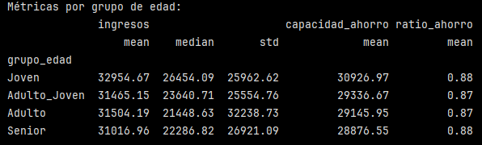
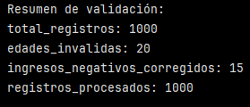

# Pipeline de transformación completo con validaciones

Ejercicio práctico para aplicar los conceptos aprendidos.

1. **Crear dataset con datos que requieren transformación**:
    
    ```python
    import pandas as pd
    import numpy as np
    
    # Crear datos con problemas realistas
    np.random.seed(42)
    n = 1000
    
    df = pd.DataFrame({
        'id_cliente': range(1, n+1),
        'edad': np.random.normal(35, 15, n).clip(18, 80).astype(int),
        'ingresos': np.random.lognormal(10, 0.8, n),
        'gastos_mensuales': np.random.normal(2000, 500, n).clip(500, 10000),
        'categoria_cliente': np.random.choice(['A', 'B', 'C', 'D'], n),
        'fecha_registro': pd.date_range('2020-01-01', periods=n, freq='D')[:n],
        'email': [f'cliente{i}@ejemplo.com' for i in range(1, n+1)],
        'telefono': [f'({np.random.randint(100, 999)}){np.random.randint(100, 999)}-{np.random.randint(1000, 9999)}' for _ in range(n)]
    })
    
    # Introducir algunos errores intencionalmente
    error_indices = np.random.choice(n, 50, replace=False)
    df.loc[error_indices[:20], 'edad'] = np.random.choice([-5, 150, np.nan], 20)# Edades inválidas
    df.loc[error_indices[20:35], 'ingresos'] = -1000# Ingresos negativos
    df.loc[error_indices[35:], 'gastos_mensuales'] = df.loc[error_indices[35:], 'ingresos'] * 2# Gastos > ingresos
    
    ```
    
- Se fijó la semilla para que los números aleatorios sean siempre los mismos ``np.random.seed(42)``.
- Se creó un DataFrame con 1000 registros.
- El DataFrame tiene las siguientes columnas:
    -``'id_cliente'``: del 1 al 1000.
    - ``'edad'``: con una distribución normal con media 35 y desviación 15, limitada al rango entre 18 y 80 y convertida a integer.
    - ``'salario'``: distribución log-normal.
    - ``'gastos_mensuales'`` distribución normal con media en 2000 y desviación 500, limitada al rango entre 500 y 10000.
    - ``'categoria_cliente'``: categoría aleatoria entre A, B, C, D. Con ``np.random.choice(lista, n)`` se elige al azar elementos de una lista.
    - ``'fecha_registro'``: ``pd.date_range(inicio, periods, freq)`` crea una serie de fechas (una por cliente). ``pd.date_range()`` es un método de pandas que genera un rango de fechas secuenciales. El primer parámetro es la fecha de inicio (con la que se debe partir), ``periods=n`` india la cantidad de fechas que se quieren generar, en este caso 1000. Y la frecuencia, dada por ``freq='D'`` indica que haya un día entre cada fecha.
    - ``'email'``: se crea una lista de correos.
    - ``'telefono'``: se crea números de teléfonos con el formato:(XXX)YYY-ZZZZ.
- Con ``np.random.choice(n, 50, replace=False)``: se eligieron 50 índices aleatorios del DataFrame sin repetir. 

>[!NOTE]
> np.random.choice(lista, cantidad)

- De estos 50, a los primeros 20 índices se les introdujo edades inválidas:
    - ``[-5, 150, np.nan]``: indica la lista de valores de donde se puede elegir, en este caso, -5, 150 y NaN.
    - El número 20 indica cuántos valores se quieren generar.

>[!NOTE]
> df.loc es un método para selecionar y modificar datos de un DataFrame por etiqueta [fila, columna].

- Luego, a los siguientes 15 índices (del 20 al 34), se les introdujo ingresos negativos (-1000).
- Y a los último 15 índices (de los 50), es decir, del 35 al 49, se introdujeron valores de gastos_mensuales mayores a los ingresos (específicamente el doble del valor de los ingresos).

---

2. **Aplicar validaciones y correcciones**:
    
    ```python
    # Validar y corregir edades
    df['edad_valida'] = df['edad'].apply(lambda x: True if 18 <= x <= 80 else False)
    df.loc[~df['edad_valida'], 'edad'] = np.nan# Marcar inválidas como NaN# Validar ingresos (no negativos)
    df.loc[df['ingresos'] < 0, 'ingresos'] = np.nan
    
    # Validar gastos vs ingresos
    df['ratio_gasto_ingreso'] = df['gastos_mensuales'] / df['ingresos']
    df.loc[df['ratio_gasto_ingreso'] > 1, 'gastos_mensuales'] = df.loc[df['ratio_gasto_ingreso'] > 1, 'ingresos'] * 0.8
    
    ```
    
- Validar edades:
    - Se crea una columna ``'edad_valida'`` en la que se aplica una función a cada valor de ``'edad'``.
    - ``lambda x``: crea una función anónima que recibe un valor x (edad) y devuelve True/False.
    - La nueva columna tendrá valores True cuando x esté dentro del rango [18, 80].
    - En los casos en que (``~df['edad_valida']``) es True, significa que la edad NO es válida, y por lo tanto, a esos valores se les asigna como NaN.
- Validar ingresos:
    - Se seleccionan todos los ingresos negativos (< 0) y se asignan como NaN.
    - Luego  se valida la relación gastos_mensuales/ingresos. Si el ratio es >1, significa que se gasta más de lo que se ingresa. Cuando esto ocurre, se corrigen los gastos a un 80% del ingreso (se reemplaza por ingresos*0.8).


3. **Crear transformaciones y enriquecimientos**:
    
    ```python
    # Categorizar por edad
    df['grupo_edad'] = pd.cut(df['edad'],
                            bins=[18, 25, 35, 50, 80],
                            labels=['Joven', 'Adulto_Joven', 'Adulto', 'Senior'])
    
    # Calcular capacidad de ahorro
    df['capacidad_ahorro'] = df['ingresos'] - df['gastos_mensuales']
    df['ratio_ahorro'] = df['capacidad_ahorro'] / df['ingresos']
    
    # Clasificar capacidad financiera
    df['clasificacion_financiera'] = np.where(df['ratio_ahorro'] > 0.3, 'Ahorra_Mucho',
                                             np.where(df['ratio_ahorro'] > 0.1, 'Ahorra_Poco',
                                                     np.where(df['ratio_ahorro'] > 0, 'Equilibra', 'Deficit')))
    
    # Extraer información del teléfono
    df['codigo_area'] = df['telefono'].str.extract(r'\((\d{3})\)')
    
    # Calcular antigüedad
    df['antiguedad_dias'] = (pd.Timestamp.now() - df['fecha_registro']).dt.days
    df['antiguedad_meses'] = df['antiguedad_dias'] // 30
    
    ```

- Edad:
    - Primero se agrupa por edad, ``pd.cut`` divide la variable 'edad' (numérica) en rangos (bins) con sus respectivos nombres (labels).
    - Como resultado se tiene una nueva columna categórica ``'grupo_edad'``.
- Capacidad de Ahorro:
    - Primero se define una nueva columna llamada ``'capacidad_ahorro'`` que corresponde a la resta entre ``'ingresos'`` y ``'gastos_mensuales'``.
    - Luego, se crea otra columna llamada ``'ratio_ahorro'`` que corresponde a la ``'capacidad_ahorro'`` calculada previamente dividida en los ``'ingresos'``.
    - Estas dos nuevas columnas permiten establecer un criterio de clasificación financiera según el ratio de ahorro:
        - Si ``'ratio_ahorro'`` > 0.3 → Ahorra_Mucho
        - Si ``'ratio_ahorro'`` > 0.1 → Ahorra_Poco
        - Si ``'ratio_ahorro'``> 0 → Equilibra
        - Si no se cumple nada → Déficit

>[!NOTE]
> np.where(condición, valor_si_True, valor_si_False)

- Teléfono:
    - Se crea una nueva columna llamada ``'codigo_area'``. Se quiere obtener los 3 dígitos dentro de los paréntesis (XXX) del número de teléfono (extraer el código de área del teléfono)

    - ``.str`` permite usar métodos de texto sobre una serie.
    - ``.extract(r'\((\d{3})\)')`` es lo que permite encontrar "(", capturar los dígitos "(\d{3})" y encontrar ")". ``.extract(patrón regex)`` extrae el texto que coincide con una expresión regular.

>[!NOTE]
> Las expresiones regulares son una herramienta del ``módulo re`` para buscar y manipular patrones de texto.

- Antigüedad cliente:
    - Se crea una nueva columna llamada ``'antiguedad_dias'`` que es igual a la resta entre la fecha y hora actuales (``pd.Timestamp.now()``) y la fecha de registro.

>[!IMPORTANT]
> Ojo que restar una columna de fechas da una serie de timedeltas, un tipo de dato que representa una duración.

    - ``.dt.days`` convierte esos timedeltas en número de días.
    - Luego con esta nueva columna de ``'antiguedad_dias'``, al dividirla en 30, se obtiene la ``'antiguedad_meses'``.


4. **Crear métricas agregadas por categoría**:
    
    ```python
    # Métricas por grupo de edad
    metricas_edad = df.groupby('grupo_edad').agg({
        'ingresos': ['mean', 'median', 'std'],
        'capacidad_ahorro': 'mean',
        'ratio_ahorro': 'mean'
    }).round(2)
    
    print("Métricas por grupo de edad:")
    print(metricas_edad)
    ```

    

    - Se agrupó según el ``'grupo_edad'``.
    - ``.agg({ ... })``: aplica funciones de agregación a columnas específicas:
        - sobre ingresos: media, mediana y desviación estándar.
        - sobre capacidad_ahorro: solo media.
        - sobre ratio_ahorro: solo media.

    **Ingresos:**

    - Los ingresos promedio son muy similares entre los 4 gruos, lo que indica que en este dataset la edad no pareciera influir significativamente en el nivel de ingresos.

    - La desviación estándar es mayor en el grupo ``'Adulto'``, lo que sugiere mayor variabilidad.

    - Las medianas también son bastantes similares, siendo mayor en el grupode ``'Joven'``.

    **Capacidad de ahorro:**
    
    - Si bien los promedios tampoco son tan diferentes entre grupos, el grupo ``'Joven'`` presenta una mayor capacidad de ahorro promedio.
    
    **Ratio de ahorro:**

    - El ratio es casi el mismo en los grupos (0.87-0.88).

    El comportamiento financiero entre grupos etarios queda bastante homogéneo después de las validaciones y correcciones.


    ```python
    # Resumen de validaciones
    resumen_validacion = {
        'total_registros': len(df),
        'edades_invalidas': (~df['edad_valida']).sum(),
        'ingresos_negativos_corregidos': (df['ingresos'].isna()).sum(),
        'registros_procesados': len(df)
    }
    
    print("\nResumen de validación:")
    for clave, valor in resumen_validacion.items():
        print(f"{clave}: {valor}")
    
    ```
    
    

    - Se crea un diccionario con distintas métricas y finalmente se recorre dicho diccionario y se imprime cada métrica en pantalla.

    **Interpretación del resumen de validaciones:**

    - El dataset final mantiene los 1000 registros originales, es decir, no hubo eliminaciones de filas, solo corecciones.
    - Se detectaron correctamente las 20 edades que se introdujeron como inválidas.
    - Se detectaron estas edades inválidad y se cumplieron las reglas del negocio definidas, ya que se reemplazaron según el criterio establecido.
    - De los 50 errores introducidos al inicio, 15 correspondían a ingresos negativos. Estos fueron identificados y corregidos.
    - Que los registros procesados sean 1000 indica que el pipeline procesó todo el dataset sin errores y que todas las transformaciones se aplicaron de forma consistente.

Resumiendo, se detectaron y corrigieron las edades fuera de rango, se marcaron como inválidos los ingresos negativos y se ajustaron los gastos que excedían los ingresos. El dataset final conserva los 1000 registros y se cumple con las reglas de negocio definidas para este proceso.

---


**Verificación**: Examina las transformaciones aplicadas y confirma que los datos cumplen con las reglas de negocio definidas.

**Requerimientos:**

- Python con Pandas y NumPy
- Dataset de ejemplo o datos para transformar
- Conocimiento de operaciones básicas de Pandas