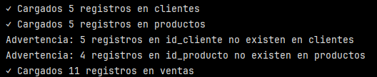
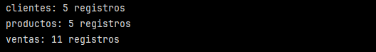
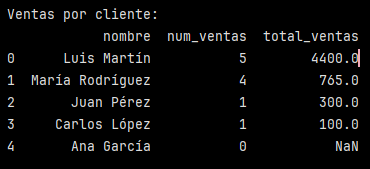

# Implementar carga completa con validaciones y estrategias avanzadas

Ejercicio práctico para aplicar los conceptos aprendidos.

1. **Crear esquema de base de datos destino**:
    
```python
import sqlite3
import pandas as pd
import numpy as np

# Crear base de datos
conn = sqlite3.connect('ventas_etl.db')

# Crear tablas con constraints
conn.execute('''
    CREATE TABLE clientes (
        id_cliente INTEGER PRIMARY KEY,
        nombre TEXT NOT NULL,
        email TEXT UNIQUE,
        ciudad TEXT,
        fecha_registro DATE
    )
''')

conn.execute('''
    CREATE TABLE productos (
        id_producto INTEGER PRIMARY KEY,
        nombre TEXT NOT NULL,
        precio REAL NOT NULL,
        categoria TEXT
    )
''')

conn.execute('''
    CREATE TABLE ventas (
        id_venta INTEGER PRIMARY KEY,
        id_cliente INTEGER,
        id_producto INTEGER,
        cantidad INTEGER NOT NULL,
        precio_unitario REAL NOT NULL,
        fecha_venta DATE,
        FOREIGN KEY (id_cliente) REFERENCES clientes(id_cliente),
        FOREIGN KEY (id_producto) REFERENCES productos(id_producto)
    )
''')

conn.commit()

```

>[!NOTE]
>
> ``conn`` es un objeto de conexción a la base de datos SQLite.
>
>Permite enviar consultas SQL, crear tablas, insertar datos, etc.

- ``conn.execute()`` sirve para aejecutar una instrucción SQL directamente. En este caso la instrucción es crear una tabla en la base de datos.
- ``conn.commit()`` guarda de manera permanente los cambios en la base de datos. Los ambios no se aplican definitivamente hasta que se llama a ``commit()``.
- Se crearon 3 tablas:
    - clientes
    - productos
    - ventas
    

2. **Crear datos de ejemplo para carga**:
    
```python
# Datos de clientes
clientes_df = pd.DataFrame({
    'id_cliente': range(1, 6),
    'nombre': ['Ana García', 'Carlos López', 'María Rodríguez', 'Juan Pérez', 'Luis Martín'],
    'email': ['ana@email.com', 'carlos@email.com', 'maria@email.com', 'juan@email.com', 'luis@email.com'],
    'ciudad': ['Madrid', 'Barcelona', 'Madrid', 'Valencia', 'Sevilla'],
    'fecha_registro': pd.date_range('2023-01-01', periods=5, freq='MS')
})

# Datos de productos
productos_df = pd.DataFrame({
    'id_producto': range(101, 106),
    'nombre': ['Laptop', 'Mouse', 'Teclado', 'Monitor', 'Audífonos'],
    'precio': [1200, 25, 80, 300, 150],
    'categoria': ['Electrónica', 'Accesorios', 'Accesorios', 'Electrónica', 'Audio']
})

# Datos de ventas (con algunos errores intencionales)
np.random.seed(42)
ventas_df = pd.DataFrame({
    'id_venta': range(1, 21),
    'id_cliente': np.random.choice(range(1, 8), 20),# Algunos IDs inexistentes
    'id_producto': np.random.choice(range(101, 108), 20),# Algunos IDs inexistentes
    'cantidad': np.random.randint(1, 5, 20),
    'precio_unitario': np.random.choice([1200, 25, 80, 300, 150], 20),
    'fecha_venta': pd.date_range('2024-01-01', periods=20, freq='D')
})

```

- Se crearon 3 DataFrames diferentes con datos para cargar a las 3 tablas creadas anteriormente.
- En el caso del DataFrame ``ventas_df`` se agregaron datos con algunos IDs inexistentes para ``'id_cliente'`` y para ``'id_producto'``.

>[!NOTE]
> ``np.random.choice`` selecciona valores desde una lista o rango específico, permitiendo repetirlos si es necesario.
>
>``np.random.randint(a, b)`` genera números enteros aleatorios dentro de un rango, pero no elige entre valores predefinidos. Sirve cuando se necesitan números y no una selección de algo previamente definido.

3. **Implementar carga con validaciones**:
    
```python
# Función para cargar con validaciones
def cargar_con_validacion(df, tabla, conn, claves_foraneas=None):
    try:
# Validar claves foráneas si se especifican
        if claves_foraneas:
            for columna, tabla_ref, columna_ref in claves_foraneas:
                valores_validos = pd.read_sql(f'SELECT {columna_ref} FROM {tabla_ref}', conn)
                valores_validos = valores_validos[columna_ref].tolist()

                invalidos = ~df[columna].isin(valores_validos)
                if invalidos.any():
                    print(f"Advertencia: {invalidos.sum()} registros en {columna} no existen en {tabla_ref}")
# Opción: filtrar inválidos o marcar como NULL
                    df = df[~invalidos]# Filtrar inválidos

# Cargar datos
        df.to_sql(tabla, conn, index=False, if_exists='append')
        print(f"✓ Cargados {len(df)} registros en {tabla}")
        return True

    except Exception as e:
        print(f"✗ Error cargando {tabla}: {e}")
        return False

# Cargar tablas base (sin dependencias)
exito_clientes = cargar_con_validacion(clientes_df, 'clientes', conn)
exito_productos = cargar_con_validacion(productos_df, 'productos', conn)

# Cargar ventas con validaciones de FK
if exito_clientes and exito_productos:
    claves_ventas = [
        ('id_cliente', 'clientes', 'id_cliente'),
        ('id_producto', 'productos', 'id_producto')
    ]
    cargar_con_validacion(ventas_df, 'ventas', conn, claves_ventas)

```

- Se crea la función ``cargar_con_validacion``.
- Parámetros:
    - Se definen los parámetros que recibe la función:
        - df: el DataFrame con datos a cargar.
        - tabla: nombre de la tabla de destino.
        - conn: conexión a la base de datos.
        - claves_foraneas: lista de validaciones para foreing keys. Por defecto es ``None``. Si se le pasa una lista de claves foráneas a validar, entonces se usa esa lista.
- Validación de claves foráneas:
    - Esto solo se ejecuta si se entrega la lista ``claves_foraneas``.
    - Validar que la columna ``id_cliente`` del DataFrame exista como clave en ``clientes.id_cliente``.
- Obtener valore válidos:
    - ``valores_validos = pd.read_sql(f'SELECT {columna_ref} FROM {tabla_ref}', conn)``: se consulta la tabla referenciada para obtener IDs válidos.
    - ``valores_validos = valores_validos[columna_ref].tolist()``: luego estos valores válidos se convierten en una lista.
- Detectar registros inválidos:
    - ``invalidos = ~df[columna].isin(valores_validos)``: devuelve True si el valor existe. El ``~`` (NOT) invierte este resultado.
    -``.any()``: revisa si hay al menos un True.
    - ``.sum()``: cuenta cuántos registros inválidos hay.
    - ``df = df[~invalidos]``: filtra eliminando los registros inválidos.
    - Si hay registros inválidos se imprime en pantalla un mensaje de advertencia.
- Cargar los datos válidos en la base:
    - ``df.to_sql(tabla, conn, index=False, if_exists='append')``: inserta el DataFrame (df) en la tabla.
    - ``append``: agrega filas.
    - Si no hay errores en la carga, la función devuelve True y se imprime el mensaje de carga exitosa.
- Manejo de errores:
    - Si algo falla, el error se captura y la función devuelve False y se imprime el mensaje con el error.

    >[!IMPORTANT]
    > ``Exception`` es la clase base de la cual heredan todos los tipos de error de Python. Sirve para capturar errores.

- Cargar tablas base (sin dependencias):
    - Se está llamando la función ``cargar_con_validación()`` para insertar datos en las tablas que **no** dependen de otras. La tabla clientes y productos, no tienen claves foráneas (por eso la función se llama sin el parámetro ``claves_foraneas``).
- Cargar ventas (sí tiene claves foráneas):
    - La condición ``AND`` de ``if exito_clientes and exito_productos`` se establece porque ``ventas`` depende de ``clientes`` y ``productos``. Si alguno de esos no se cargó bien, no tendría sentido cargar ventas.
    - Se definen las claves foráneas en una lista de tuplas.

    >[!IMPORTANT]
    > Cada tupla significa:
    >
    >(columna_en_ventas, tabla_referenciada, columna_referenciada)

    - En este caso sí se está entregando el parámetro ``claves_foraneas``, por lo que se consultan los valores válidos en la tabla clientes Y  productos. Se detectan los IDs inválidos dentro de ventas. Se eliminan antes de insertar los datos y luego solo se cargan las filas válidas.




Se observa que se cargaron 5 registros en clientes y 5 en productos.
Hay dos advertencias: 5 registros en id_cliente no existen en clientes y 4 registros en id_producto no existen en productos.
En ventas se observa que se cargaron 11 registros y no hubo advertencias.
Esto es consistente con los datos iniciales:
- El DataFrame ``ventas`` inicialmente tenía 20 ventas iniciales.
    - 5 de esas ventas tenían clientes inválidos y fueron descartadas.
    - 4 de esas ventas tenían productos inválidos y fueron descartadas.
    - solo 11 de las 20 ventas pasaron las validaciones y se cargaron a la tabla de destino.

>[!NOTE]
> Recordar que en la tabla ventas se introdujeron algunos errores intencionales.

>[!NOTE]
> Recordar que para la tabla clientes solo contiene estos IDs: 1, 2, 3, 4, 5. Y que la tabla productos solo contiene estos IDs: 101, 102, 103, 104, 105.

4. **Verificar carga y ejecutar consultas**:
    
```python
# Verificar conteos
for tabla in ['clientes', 'productos', 'ventas']:
    count = pd.read_sql(f'SELECT COUNT(*) FROM {tabla}', conn).iloc[0,0]
    print(f"{tabla}: {count} registros")
```



- El ``for`` recorre la lista de nombres de tablas.
- ``pd.read_sql()`` ejecuta una consulta SQL y devuelve un DataFrame con el resultado. La consulta consiste en contar cuántas filas tiene cada tabla.
- ``.iloc[0,0]`` extrae el primer elemento del DataFrame creado.

>[!NOTE]
> Esto ocurre **después** de la carga de datos.

>[!IMPORTANT]
> Cada consulta del ``for`` gener aun DataFrame nuevo (por iteración). Este DataFrame se guarda temporalmente en la variable ``count`` (antes de aplicar ``.iloc``).

- Esto verifica que se cargaron los datos esperados ✅.

```python
# Consulta de ejemplo: ventas por cliente
query_result = pd.read_sql('''
    SELECT c.nombre, COUNT(v.id_venta) as num_ventas,
            SUM(v.cantidad * v.precio_unitario) as total_ventas
    FROM clientes c
    LEFT JOIN ventas v ON c.id_cliente = v.id_cliente
    GROUP BY c.id_cliente, c.nombre
    ORDER BY total_ventas DESC
''', conn)

print("\nVentas por cliente:")
print(query_result)

conn.close()

```



- Esta consulta une ``clientes``con ``ventas``.
- LEFT JOIN trae todos los clientes (aunque no tengan ventas, por eso aparece ``Ana García``).
- ``COUNT(v.id_venta)``: calcula cuántas ventas hizo cada cliente.
- ``SUM(v.cantidad * v.precio_unitario)`` calcula el monto total vendido.
- Luego se agrupa por cliente y se ordena de mayor a menor según el total de ventas.
- Este resultado se guarda en un DataFrame llamado ``query_result``.

Finalmente ``conn.close()`` cierra la conexión a la base de datos.

---

**Verificación**: Confirma que todas las validaciones funcionaron correctamente y que solo se cargaron datos válidos con integridad referencial intacta.

**Requerimientos:**

- Python con Pandas y sqlite3
- Conocimiento de SQL básico
- Base de datos SQLite para pruebas