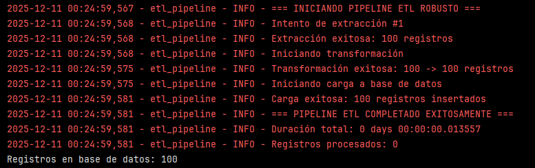

# Construir pipeline ETL completo con manejo robusto de errores y logging

Ejercicio práctico para aplicar los conceptos aprendidos.

1. **Configurar logging estructurado**:
    
```python
import logging
import pandas as pd
import sqlite3
import time
from pathlib import Path

# Configurar logging
logging.basicConfig(
    level=logging.INFO,
    format='%(asctime)s - %(name)s - %(levelname)s - %(message)s',
    handlers=[
        logging.FileHandler('etl_pipeline.log'),
        logging.StreamHandler()
    ]
)

logger = logging.getLogger('etl_pipeline')

```

``logging`` es un módulo de la librería estándar de Python. Sirve para registrar eventos, errores y actividades de una aplicación de forma estructurada, ayudando a depurar, monitorear y auditar el código.
- Info general: ``INFO``
- Advertencias: ``WARNING``
- Errores: ``ERROR``
- Mensajes de depuración: ``DEBUG``
- Permite guardar los mensajes en un archivo y/o verlos en consola.
- ``logging.basicConfig(...)``: configura cómo se va a comportar el sistema de logging.
- ``level=logging.INFO,``: 

``time`` es un módulo para funciones de timpo.

``pathlib.Path`` es una clase para trabajar con rutas de archivos más cómoda que con strings.

2. **Crear clase de pipeline robusto**:

```python
class RobustETLPipeline:
    def __init__(self, db_path='etl_database.db'):
        self.db_path = db_path
        self.logger = logging.getLogger('etl_pipeline')
        self.metrics = {'processed': 0, 'errors': 0, 'start_time': None}

    def run_pipeline(self):
        self.metrics['start_time'] = pd.Timestamp.now()
        self.logger.info("=== INICIANDO PIPELINE ETL ROBUSTO ===")

        try:
# Fase 1: Extracción con reintentos
            data = self.extract_with_retry()

# Fase 2: Transformación con validaciones
            transformed_data = self.transform_with_validation(data)

# Fase 3: Carga con transacciones
            self.load_with_transaction(transformed_data)

            self.report_success()

        except Exception as e:
            self.report_failure(e)
            raise

    def extract_with_retry(self):
        """Extracción con estrategia de reintentos"""
        max_retries = 3

        for attempt in range(max_retries):
            try:
                self.logger.info(f"Intento de extracción #{attempt + 1}")

# Simular extracción (reemplazar con lógica real)
                data = pd.DataFrame({
                    'id': range(1, 101),
                    'valor': [x * 1.1 for x in range(1, 101)],
                    'categoria': ['A', 'B', 'C'] * 33 + ['A']
                })

                self.logger.info(f"Extracción exitosa: {len(data)} registros")
                return data

            except Exception as e:
                self.logger.warning(f"Intento #{attempt + 1} falló: {e}")
                if attempt == max_retries - 1:
                    raise e
                time.sleep(1)# Esperar antes de reintentar

    ```
    
3. **Implementar transformación con validaciones**:
    
```python
    def transform_with_validation(self, data):
        """Transformación con validaciones y logging detallado"""
        self.logger.info("Iniciando transformación")
        original_count = len(data)

        try:
# Validación 1: Datos no nulos
            if data.isnull().any().any():
                null_counts = data.isnull().sum()
                self.logger.warning(f"Valores nulos encontrados: {null_counts[null_counts > 0].to_dict()}")

# Transformación 1: Limpiar datos
            data_clean = data.dropna()

# Transformación 2: Crear nuevas columnas
            data_clean = data_clean.copy()# Evitar SettingWithCopyWarning
            data_clean['valor_cuadrado'] = data_clean['valor'] ** 2
            data_clean['categoria_normalizada'] = data_clean['categoria'].str.upper()

# Validación 2: Resultados razonables
            if (data_clean['valor_cuadrado'] < 0).any():
                raise ValueError("Valores cuadrados negativos detectados")

            self.logger.info(f"Transformación exitosa: {original_count} -> {len(data_clean)} registros")
            return data_clean

        except Exception as e:
            self.logger.error(f"Error en transformación: {e}")
            raise

```
    
4. **Implementar carga con transacciones**:
    
```python
    def load_with_transaction(self, data):
        """Carga con soporte transaccional y rollback"""
        self.logger.info("Iniciando carga a base de datos")

        with sqlite3.connect(self.db_path) as conn:
            try:
# Iniciar transacción
                conn.execute('BEGIN TRANSACTION')

# Crear tabla si no existe
                conn.execute('''
                    CREATE TABLE IF NOT EXISTS datos_transformados (
                        id INTEGER PRIMARY KEY,
                        valor REAL,
                        categoria TEXT,
                        valor_cuadrado REAL,
                        categoria_normalizada TEXT
                    )
                ''')

# Limpiar datos previos (estrategia replace)
                conn.execute('DELETE FROM datos_transformados')

# Insertar datos
                data.to_sql('datos_transformados', conn, index=False, if_exists='append')

# Commit transacción
                conn.commit()

                self.logger.info(f"Carga exitosa: {len(data)} registros insertados")

            except Exception as e:
# Rollback automático por context manager
                self.logger.error(f"Error en carga, ejecutando rollback: {e}")
                raise

```
    
5. **Implementar reporting y ejecutar pipeline**:
    
```python
    def report_success(self):
        """Reportar métricas de éxito"""
        duration = pd.Timestamp.now() - self.metrics['start_time']
        self.logger.info("=== PIPELINE ETL COMPLETADO EXITOSAMENTE ===")
        self.logger.info(f"Duración total: {duration}")
        self.logger.info(f"Registros procesados: {self.metrics.get('processed', 0)}")

    def report_failure(self, error):
        """Reportar detalles de fallo"""
        duration = pd.Timestamp.now() - self.metrics['start_time']
        self.logger.error("=== PIPELINE ETL FALLÓ ===")
        self.logger.error(f"Duración hasta fallo: {duration}")
        self.logger.error(f"Error: {error}")

# Ejecutar pipeline
if __name__ == "__main__":
    pipeline = RobustETLPipeline()
    pipeline.run_pipeline()

# Verificar resultados
    with sqlite3.connect('etl_database.db') as conn:
        result = pd.read_sql('SELECT COUNT(*) as registros FROM datos_transformados', conn)
        print(f"Registros en base de datos: {result.iloc[0,0]}")

```




**Verificación**: Ejecuta el pipeline completo y verifica que el logging capture todas las fases correctamente, incluyendo cómo se manejan errores y se reportan métricas.

**Requerimientos:**

- Python con Pandas, sqlite3, y logging (incluidos en instalación estándar)
- Espacio para archivos de log
- Conocimiento de clases y manejo de excepciones en Python