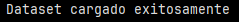
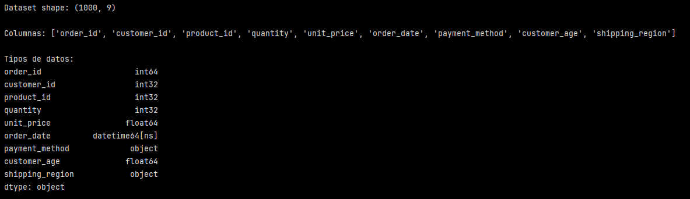
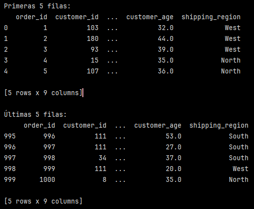
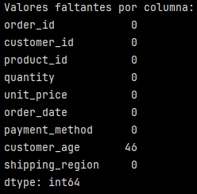
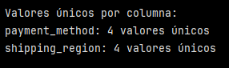
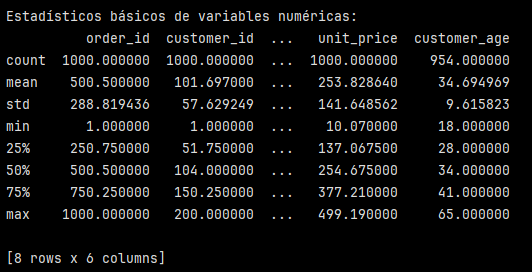
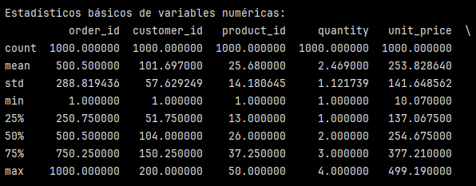
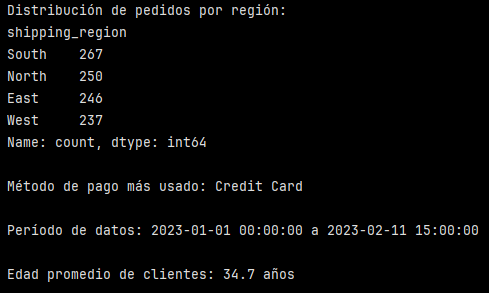

# Ejercicio: Primer EDA en dataset de ventas de e-commerce

## Carga y configuración inicial:

```python
import pandas as pd
import numpy as np

# Crear dataset de ejemplo de e-commerce
np.random.seed(42)
n_orders = 1000

df = pd.DataFrame({
    'order_id': range(1, n_orders + 1),
    'customer_id': np.random.randint(1, 201, n_orders),
    'product_id': np.random.randint(1, 51, n_orders),
    'quantity': np.random.randint(1, 5, n_orders),
    'unit_price': np.round(np.random.uniform(10, 500, n_orders), 2),
    'order_date': pd.date_range('2023-01-01', periods=n_orders, freq='h')[:n_orders],
    'payment_method': np.random.choice(['Credit Card', 'Debit Card', 'PayPal', 'Cash'], n_orders),
    'customer_age': np.random.normal(35, 10, n_orders).clip(18, 80).astype(int),
    'shipping_region': np.random.choice(['North', 'South', 'East', 'West'], n_orders)
})

# Introducir algunos valores faltantes
mask = np.random.random(n_orders) < 0.05
df.loc[mask, 'customer_age'] = np.nan

print("Dataset cargado exitosamente")
```


Se creó un DataFrame y se introdujeron algunos errores faltantes para el análisis (específicamente en la columna de edad (``'customer_age'``)).


## Inspección inicial sistemática:

```python
# Dimensiones y estructura
print(f"Dataset shape: {df.shape}")
print(f"\nColumnas: {list(df.columns)}")
print(f"\nTipos de datos:\n{df.dtypes}")
```


Se observa que el data frame tiene 1000 filas y 9 columnas gracias a ``df.shape``. Esto es coincidente con el paso anterior en la creación del DataFramed donde se indicó que el número de órdenes sería ``n_orders = 1000`` junto con las 9 columnas.

Luego con ``df.dtypes`` se puede ver los tipos de datos por columna.


```python
# Primeras y últimas filas
print("\nPrimeras 5 filas:")
print(df.head())

print("\nÚltimas 5 filas:")
print(df.tail())
```



Con ``df.head`` y ``df.tail`` podemos ver las primeras y últimas 5 filas del DataFrame. Esto es útil para tener una idea preliminar del contenido del DataFrame y qué información se entrega.

## Análisis de calidad de datos:

```python
# Valores faltantes
print("Valores faltantes por columna:")
print(df.isnull().sum())

print(f"\nPorcentaje de completitud: {(1 - df.isnull().sum() / len(df)) * 100}")
```



Con ``df.isnull().sum()`` se obtienen los valores faltantes por columna. Acá se observa que la columna ``'customer_age'`` contiene 46 datos faltantes.

```python
# Valores únicos por columna
print("\nValores únicos por columna:")
for col in df.select_dtypes(include=['object']).columns:
    print(f"{col}: {df[col].nunique()} valores únicos")
```



Con ``df.select_dtypes(include=['object']).columns`` se selecciona columnas del DataFrame según tipo de dato. En este caso, se está pidiendo que solo entregue las columnas cuyo tipo de dato sea ``object``, es decir:

- ``payment_method``
- ``shipping_region``

El loop solo recorrerá esas dos columnas.

>[!NOTE]
> El ``.column`` devuelve los nombres de las columnas. En este caso el nombre de las columnas tipo object.

``df[col].nunique()`` cuenta cuántos v alores distintos hay en una columna (No cuenta los valores nulos ``NaN``).

Este bloque de código busca identificar cuántas formas de pago distintas hay y cuántas regiones distintas existen.

La imagen muestra que existen 4 métodos de pago diferentes y 4 regiones diferentes.

```python
# Estadísticos básicos para numéricas
print("\nEstadísticos básicos de variables numéricas:")
print(df.select_dtypes(include=[np.number]).describe())
```



``df.select_dtypes(include=[np.number]).describe()`` con esta línea se está explicitando que se seleccionen solo las columnas numéricas para ``.describe``.

>[!NOTE]
> El ``.describe()`` calcula estadísticas solo para columnas numéricas e ignora automáticamente las columnas ``object``, ``datatime``, etc. Sin embargo, es una buena práctica en ETL y EDA explicitar sobre qué columnas se aplicará. Es más claro semánticamente y más robusto a cambios en el DataFrame.

>[!TIP]
> Cuando hay muchas columnas y en consola no se ven todas (...), se puede agregar la siguiente línea de código antes de imprimir en pantalla: ``pd.set_option('display.max_columns', None)`` para que las muestre todas.



Acá se puede observar que el recuento de registros indica que para todas las columnas es igual a 1000 y no hay valores nulos en estas columnas numéricas. 

### Análisis de rangos y coherencia lógica

Un análisis que podría realizarse en base a esta información es el de rangos y coherencia lógica. Por ejemplo, al ver los valores mínimos y máximos, podemos ver lo siguiente:

``order_id``:
- min = 1
- max = 1000
✅ coherente para un identificador secuencial.

``quantity``:
- min = 1
- máx = 4
✅ No hay cantidades negativas o valores 0.

``unit_price``
- min ≈ 10
- máx ≈ 499
✅ No hay cantidades negativas o valores 0.

### Análisis de distrución central: media vs mediana:

``unit_price``
- mean ≈ 253,83
- median ≈ 254,68

Esto sugiere una distribución bastante simétrica, que no hay outliers extremos dominando el promedio.

``quantity``
- mean = 2
- median ≈ 2,47

En este caso, la columna ``quantity`` representa una variable discreta de bajo rango (de 1 a 4). Al comparar media y mediana se observa que el valor más común está cerca de las 2 unidadespor pedido y que hay una ligera tendencia en pedidos con 3-4 unidades, que empujan la media hacia arriba.


>[!NOTE]
> Es importante fijarse en el tipo de información que es relevante para los análisis. Por ejemplo, comparar estadísticos como media, mediana, SD o cuartiles de columnas de id no tiene sentido.

### Dispersión y variabilidad

``quantity``
- std ≈ 1.12

Esto indica una variabilidad baja, la mayoría de las compras tienen cantidades similares.

``unit_price``
- std ≈ 141.65

En este caso se observa una alta dispersión, lo que indica precios variados y posible segmentación por tipo de producto. Esta información podría ayudar a decidir si conviene agrupar, normalizar o si hay categorías con comportamientos distintos.

### Identificación de posibles outliers:

Es posible hacer una detección preliminar considerando lo siguiente:
- Si ``máx`` está muy lejos del ``75%``, posible outlier.
- Si ``std`` es muy grande respecto a la media, dispersión alta.

En este caso no pareciera haber outliers evidentes a partir de los estadísticos descriptivos.

>[!NOTE]
> Recordar que en la Actividad Práctica 5 de la Semana 3: [Manejo de datos faltantes](https://github.com/petite09/Data_TalentOps/blob/main/01.Fundamentos_de_Datos_y_Control_de_versiones/S3_Manipulacion_de_datos_con_Python/D5-Manejo-datos-faltantes-outliers/P5-Manejo-datos-faltantes.md) se usó una función para detectar outliers usando IQR (rango intercuartílico).


Finalmente, a partir de los estadisticos descriptivos de las variables numéricas, se observa que los datos presentan rangos coherentes y distribuciones razonables. No se detectan valores atípicos evidentes ni problemas de calidad como valores negativos o faltantes. La similitud entre media y mediana sugiere distribuciones relativamente simétricas, lo que indica que el conjunto  de datos es adecuado para el análisis exploratorio y etapas posteriores del proceso ETL.

## Preguntas exploratorias iniciales:

```python
# Distribución por región
print("Distribución de pedidos por región:")
print(df['shipping_region'].value_counts())

# Método de pago más popular
print(f"\nMétodo de pago más usado: {df['payment_method'].value_counts().index[0]}")

# Rango de fechas
print(f"\nPeríodo de datos: {df['order_date'].min()} a {df['order_date'].max()}")

# Edad promedio de clientes
edad_promedio = df['customer_age'].mean()
print(f"\nEdad promedio de clientes: {edad_promedio:.1f} años")
```



### Distribución de pedidos por región:

``value_counts()`` cuenta cuántas veces aparece cada valor en la columna ``shipping_region``.

¿Qué está analizando?
- Volumen de pedidos por región
- Si hay una posible concentración geográfica 
- Regiones dominantes vs menos representadas

### Método de pago más popular:

``df['payment_method'].value_counts()`` cuenta cuántas veces aparece cada método de pago. ``value_counts()`` devuelve una Serie ordenada de mayor a menor y el ``.index`` toma el nombre de la categoría más frecuente (que estará en el índice 0).

Esto permite identificar ¿cuál es el método de pago dominante?

### Rango de fechas del dataset:

``{df['order_date'].min()} a {df['order_date'].max()}`` se aplica ``.min()`` y ``.max()`` sobre la columna ``'order_date'`` que es de tipo ``datatime``. Esto devuelve la fecha más antigua y la más reciente.

¿Qué analiza?
- Cobertura temporal del dataset
- Si los datos son históricos o recientes


### Edad promedio de clientes:

``df['customer_age'].mean()`` calcula el promedio ignorando automáticamente los valores nulos (``NaN``).

> [!WARNING]  
> Recordar que la columna ``'customer_edad'`` tiene datos faltantes.

``:.1f`` esto indica que se aplicará un formato que consiste en un decimal (.1) al número de tipo float (f). Es decir, muestra este número flotante (``'edad_promedio'``) con 1 decimal.

En este caso la edad promedio es clientes es de 37,4 años. Esto ayuda a tener información sobre el perfil demográfico general de los clientes.

Este bloque responde a 4 dimensiones clave del dataset:

| Dimensión   | Pregunta                                    |
|:------------|:---------------------------------------------|
| Geográfica  | ¿Desde dónde se envían los pedidos?          |
| Operativa   | ¿Cómo pagan los clientes?                   |
| Temporal    | ¿Qué período cubren los datos?              |
| Demográfica | ¿Cuál es el perfil etario promedio?         |


Como exploración inicial del conjunto de datos, se analizaron la distribución de pedidos por región, el método de pago predominante, el período temporal cubierto y la edad promedio de los clientes. Estos análisis permiten obtener una visión general del comportamiento de los datos, identificar patrones dominantes y evaluar la cobertura geográfica, temporal y demográfica del dataset antes de proceder con transformaciones más avanzadas

---

Verificación: Confirma que has identificado las dimensiones del dataset, tipos de datos, valores faltantes, y generado preguntas iniciales basadas en los datos observados.

Requerimientos:
Python con Pandas y NumPy instalados
Jupyter Notebook para exploración interactiva
Dataset de ejemplo o datos para analizar
matplotlib opcional para primeras visualizaciones