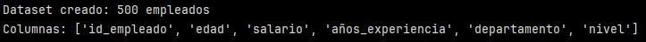
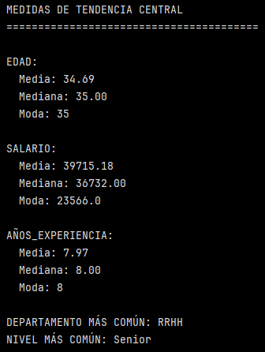
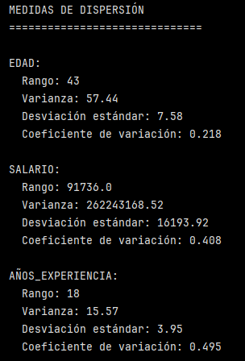
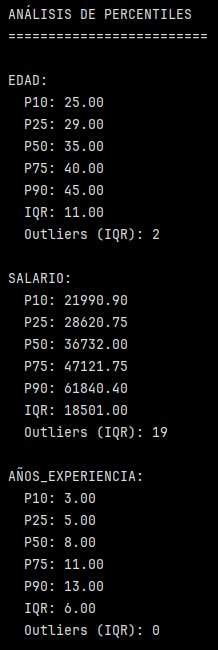
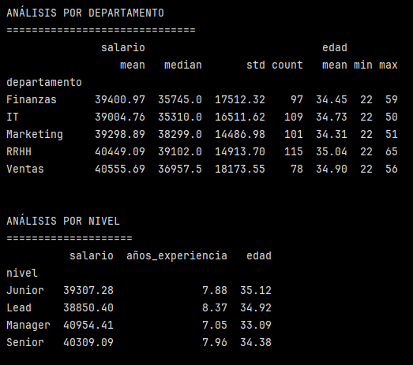

# Ejercicio: Análisis estadístico descriptivo completo de dataset de empleados

## Crear y explorar dataset de empleados:
```python
import pandas as pd
import numpy as np

# Crear dataset de empleados
np.random.seed(42)
n_empleados = 500

df = pd.DataFrame({
    'id_empleado': range(1, n_empleados + 1),
    'edad': np.random.normal(35, 8, n_empleados).clip(22, 65).astype(int),
    'salario': np.random.lognormal(10.5, 0.4, n_empleados).round(0),
    'años_experiencia': np.random.normal(8, 4, n_empleados).clip(0, 30).astype(int),
    'departamento': np.random.choice(['IT', 'Ventas', 'Marketing', 'RRHH', 'Finanzas'], n_empleados),
    'nivel': np.random.choice(['Junior', 'Senior', 'Lead', 'Manager'], n_empleados, p=[0.4, 0.4, 0.15, 0.05])
})

print(f"Dataset creado: {df.shape[0]} empleados")
print(f"Columnas: {list(df.columns)}")
```



Este primer bloque de código simula un dataset de 500 empleados usando NumPy para generar datos aleatorios y Pandas para armar la tabla.

Se crean 6 columnas:

- ``'id_empleado'``: con ``range(1, n_empleados + 1)`` se generan IDs del 1 al 500.
- ``'edad'``: ``np.random.normal(35, 8, n_empleados)`` genera 500 valores con distribución normal, con una media = 35 y una desviación estándar = 8. ``.clip(22, 65)`` limita los valores a un rango entre 22 y 65 (para evitar outliers en la edad). ``.astype(int)`` convierte a entero (sin decimales).
- ``'salario'``: ``np.random.lognormal(10.5, 0.4, n_empleados)`` genera valores cuyo logaritmo sigue una normal. Esto produce una distribución típica de salarios, con muchos valores "normales" y pocos muy altos (cola derecha). Se define con una media = 10.5 y una desviación estándar de 0.4. El ``.round(0)`` redeondea a 0 decimales.
- ``'años_experiencia'``: ``np.random.normal(8, 4, n_empleados).clip(0, 30).astype(int)`` sigue la misma lógica que para la columna edad, se limita a un rango de valores entre 0 y 30. Con una distribución normal, con media = 8 y desviación estándar = 4. Y también se convierte a ``int`` (entero)
- ``'departamento'``: ``np.random.choice(['IT', 'Ventas', 'Marketing', 'RRHH', 'Finanzas'], n_empleados)`` permite elegir de manera aleatoria elementos de la lista entregada que incluye los nombres de los distintos departamentos. Acá cada departamento tiene la misma probabilidad (no se especifica ``p=``)
- ``'nivel'``: misma lógica que la columna anterior, a diferencia de que acá si se especifica p (``p=[0.4, 0.4, 0.15, 0.05]``):
    - Junior 40%
    - Senior 40%
    - Lead 15%
    - Manager 5%

>[!IMPORTANT]
> p debe sumar 1.0 (o muy cerca).

Finalmente, en la imagen se observa que el dataset creado contiene 500 empleados y 6 columnas con sus respectivos nombres.

## Análisis de medidas de tendencia central:

```python
# Estadísticos básicos
print("MEDIDAS DE TENDENCIA CENTRAL")
print("=" * 40)

# Variables numéricas
for col in ['edad', 'salario', 'años_experiencia']:
    print(f"\n{col.upper()}:")
    print(f"  Media: {df[col].mean():.2f}")
    print(f"  Mediana: {df[col].median():.2f}")
    print(f"  Moda: {df[col].mode().iloc[0] if len(df[col].mode()) > 0 else 'Sin moda única'}")

# Variables categóricas
print(f"\nDEPARTAMENTO MÁS COMÚN: {df['departamento'].mode().iloc[0]}")
print(f"NIVEL MÁS COMÚN: {df['nivel'].mode().iloc[0]}")
```


Las medidas de tendencia central responden a la pregunta: ¿Dónde se concentra el valor típico de los datos?

Se separó el análisis de acuerdo al tipo de variable, variables numéricas y categóricas.

#### Variables numéricas:

``for col in ['edad', 'salario', 'años_experiencia']:`` itera sobre una lista de nombres de columnas (``'edad'``, ``'salario'`` y ``'años_experiencia'``)

``df[col]`` devuelve una Serie de Pandas. 

>[!NOTE]
> Las Series tienen métodos estadísticos propios (``mean``, ``median``, ``mode``, etc).

Se aplican distintos métodos estadísticos: media, mediana y moda. A la media y a la mediana se le aplica formato de con 2 decimales.

>[!IMPORTANT]
> ``mode()`` siempre devuelve una Serie, no un valor único. Puede tener 1 valor (única moda), varios valores (multimodal) o estar vacía (casos muy raros).

Es por esto que se usa ``.iloc[0]``, para tomar el primer elemento de la Serie resultante. El ``if`` se usa para evitar errores si la Serie estuviera vacía. 
``if len(df[col].mode()) > 0 else 'Sin moda única'`` se usa para verificar si dicha Serie contiene al menos un elemento, generando una condición booleana válida para el uso en una estructura ``if``.

#### Variables categóricas:

En este caso solo se reporta la moda para las variables categóricas (``'departamento'`` y ``'nivel'``).


En este bloque se calcularon medidas de tendencia central para variables numéricas (media, mediana y moda) y categóricas (moda). La media representa el promedio, la mediana el valor central y la moda el valor más frecuente. En variables como el salario, la mediana resulta más representativa debido a la posible presencia de valores extremos.


#### Análisis medidas de tendencia central:
El análisis de las medidas de tendencia central muestra comportamientos diferenciados según la variable. En el caso de la edad y los años de experiencia, la media y la mediana son muy similares (≈35 años y ≈8 años, respectivamente), lo que indica distribuciones relativamente simétricas y homogéneas. En contraste, el salario presenta una diferencia más marcada entre media y mediana, lo que sugiere una distribución asimétrica influenciada por valores altos extremos. En este contexto, la mediana resulta una medida más representativa del salario típico de los empleados.

## Análisis de dispersión:

```python
print("\n\nMEDIDAS DE DISPERSIÓN")
print("=" * 30)

for col in ['edad', 'salario', 'años_experiencia']:
    print(f"\n{col.upper()}:")
    print(f"  Rango: {df[col].max() - df[col].min()}")
    print(f"  Varianza: {df[col].var():.2f}")
    print(f"  Desviación estándar: {df[col].std():.2f}")
    print(f"  Coeficiente de variación: {df[col].std() / df[col].mean():.3f}")
```


Este análisis solo aplica para variables numéricas.

Las medidas de dispersión indican variabilidad de los datos.
Se usa el mismo patrón que para el bloque anterior, donde se itera sobre las columnas de variables numéricas. Para cada columna se calculó lo siguiente:

- Rango: mide la amplitud total de los datos. Es muy sensible a outliers y es útil como primera referencia. Consiste en restar el valor máximo (``.max()``) con el valor mínimo (``.min()``).
- Varianza: mide la dispersión cuadrática respecto a la media. En Pandas se calcula como varianza muestral (divide por *n-1*). Mide la disérsión promedio de los datos alrededor de la media, cuantificando qué tan "extendidos" están.
- Desviación estándar: es la raíz cuadrada de la varianza. Utiliza las mismas unidades de los datos originales.
- Coeficiente de variación: mide la dispersión relativa (no absoluta) y permite comparar variables con distintas unidades. Corresponde a la desviación estandar dividida en el promedio.

#### Análisis medidas de dispersión:

Las medidas de dispersión confirman que el salario es la variable con mayor variabilidad, evidenciada por un rango amplio, una desviación estándar elevada y un coeficiente de variación cercano al 41%. Esto refleja una alta heterogeneidad salarial dentro de la organización. Por el contrario, la edad presenta una dispersión moderada, mientras que los años de experiencia, aunque con menor rango absoluto, muestran una variabilidad relativa más alta, lo que indica diferencias importantes en trayectorias laborales a pesar de valores promedio similares.

## Análisis de percentiles y distribución:

```python
print("\n\nANÁLISIS DE PERCENTILES")
print("=" * 25)

for col in ['edad', 'salario', 'años_experiencia']:
    print(f"\n{col.upper()}:")
    percentiles = df[col].quantile([0.1, 0.25, 0.5, 0.75, 0.9])
    for p, v in percentiles.items():
        print(f"  P{int(p*100)}: {v:.2f}")
    
    # Rango intercuartílico
    q1, q3 = df[col].quantile([0.25, 0.75])
    iqr = q3 - q1
    print(f"  IQR: {iqr:.2f}")
    
    # Límites para outliers
    limite_inf = q1 - 1.5 * iqr
    limite_sup = q3 + 1.5 * iqr
    outliers = ((df[col] < limite_inf) | (df[col] > limite_sup)).sum()
    print(f"  Outliers (IQR): {outliers}")
```



#### Percentiles 

Siguiendo la misma lógica de los bloques anteriores, se itera sobre las columnas de variables categóricas.

``.quantile()`` es una función estafícitica que calcula puntos de corte que dividen un conjunto de datos ordenado en partes iguales. En este caso se da una lista de percentiles que se quieren calcular. Esto devuelve una Serie de Pandas:
- índice: percentil
- valor: dato correspondiente

``.items()`` recorre pares clave-valor y devuelve pares (índice, valor) de una Serie o Diccionario. En este caso ``p: percentil`` y ``v: valor numérico del percentil``.

El formato del percentil está dado por ``P{int(p*100)}`` para que quede como P10  por ejemplo y el formato del valor está dado por ``{v:.2f}`` dejando el valor con dos decimales.

#### Rango Intercuartílico

El intervalo [ Q1 , Q3 ] contiene exactamente el 50% central de los datos.

- Q1 (P25): es el límite inferior del 50% central.
- Q3 (P75): es el límite superior del 50% central.
- IQR = Q1-Q3

El rango intercuartílico mide la dispersión del núcleo de datos y es robusto frente a outliers.

#### Detección de outliers con método IQR

Se define límite inferior y superior, valores fuera de ese rango se consideran outliers.

- ``limite_inf = q1 - 1.5 * iqr``
- ``limite_sup = q3 + 1.5 * iqr``

Finalmente, se hace un conteo de outliers mediante ``outliers = ((df[col] < limite_inf) | (df[col] > limite_sup)).sum()``. Esto indica que si un valor de la columna es menor O mayor a los límites definidos, entonces es ``TRUE`` y el ``.sum()`` se aplica sobre lo anterior, por lo tanto, la suma cuenta cuántos valores ``TRUE`` hay (es decir, cuántos outliers hay).

#### Análisis de percentiles y outliers

El análisis de percentiles permite observar la distribución interna de las variables. La edad y los años de experiencia presentan rangos intercuartílicos acotados y una cantidad mínima o nula de outliers. En cambio, el salario exhibe un IQR elevado y un número considerable de valores atípicos superiores, confirmando una distribución sesgada hacia la derecha. Este comportamiento es consistente con variables económicas, donde unos pocos valores altos influyen fuertemente en la dispersión.

## Análisis por categorías:
```python
print("\n\nANÁLISIS POR DEPARTAMENTO")
print("=" * 30)

dept_stats = df.groupby('departamento').agg({
    'salario': ['mean', 'median', 'std', 'count'],
    'edad': ['mean', 'min', 'max']
}).round(2)

print(dept_stats)

print("\n\nANÁLISIS POR NIVEL")
print("=" * 20)

nivel_stats = df.groupby('nivel').agg({
    'salario': 'mean',
    'años_experiencia': 'mean',
    'edad': 'mean'
}).round(2)

print(nivel_stats)
```



#### Análisis por departamento:

Se agrupa por ``'departamento'`` y con ``agg()`` se puede aplicar varias funciones estadísticas a varias columnas en una sola operación.

>[!NOTE]
> La estructura general de ``agg()`` es la siguiente:

```python
agg({
  columna: [funciones],
  otra_columna: [funciones]
})
```

El resultado tiene columnas jerárquicas:
- primer nivel: variable (``'salario'`` y ``'edad'``).
- segundo nivel: estadístico (``mean``, ``median`` y ``std``).

Y todo esto por cada departamento. Este tipo de análisis sirve para comparar áreas funcionales.

El análisis por departamento revela diferencias relevantes en los niveles salariales y su dispersión. Áreas como Ventas y RRHH presentan salarios promedio más altos y una mayor desviación estándar, lo que sugiere una mayor heterogeneidad interna. Sin embargo, las edades promedio son bastante similares entre departamentos, lo que indica que las diferencias salariales no están asociadas de forma directa a la edad, sino probablemente a funciones, responsabilidades o esquemas de incentivos propios de cada área.


#### Análisis por nivel:

Acá se hizo una agrupación por ``'nivel'`` y solo se calculó la media para la columna ``'salario'``, ``'años_experiencia'`` y ``'edad'``.
Este tipo de análisis sirve para comparar jerarquía laboral.

El análisis por nivel jerárquico evidencia ciertas inconsistencias entre jerarquía, salario y experiencia. En particular, los años de experiencia promedio son similares entre los distintos niveles, e incluso relativamente elevados en el nivel Junior, lo que sugiere que la asignación del nivel no está estrictamente determinada por la trayectoria laboral. Asimismo, los salarios promedio no siguen un gradiente jerárquico claro, observándose valores similares entre Junior, Senior y Lead, posiblemente influenciados por la presencia de outliers y la alta variabilidad salarial.


>[!NOTE]
> Recordar que esto es un ejemplo con datos creados, donde se definió desde el inicio el tipo de distribución de las diferentes variables y no representa un caso real.

#### Compraración entre media y mediana

Las medidas de tendencia central describel el valor "típico" de una variable. Sin embargo, no todas estas medidas de tendencia central reaccionan igual frente a valores outliers.

**Media**:
- Se calcula como el promedio aritmético.
- Es sensible a valores outliers (valores extremos afectan el valor de la media).
- En variables con distribuciones asimétricas, pocos valores muy extremos pueden desplazar significativamente la media.

**Mediana**:
- Corresponde al valor central de la distribución ordenada.
- Es robusta frente a outliers.
 - Representa mejor el comportamiento central cuando la distribución es asimétrica.

 ¿Cuándo elegir la media o mediana?

 - Si la distribución es simétrica, sin outliers: Media.
 - Si la distribución es asimétrica con outliers: Mediana (es más representativa del valor típico).
 

---

Verificación: Compara cómo las medidas de tendencia central (media vs mediana) difieren en variables con outliers, y explica por qué elegirías una u otra para diferentes tipos de análisis.

Requerimientos:
- Python con Pandas y NumPy
- Dataset numérico para análisis estadístico
- matplotlib opcional para histogramas básicos