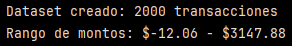
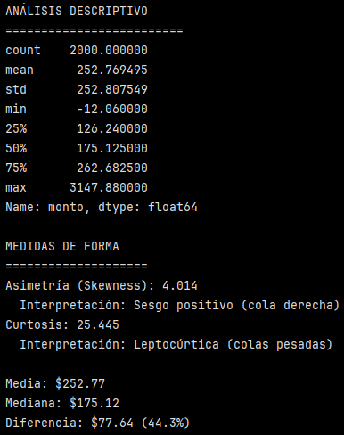
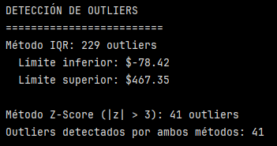
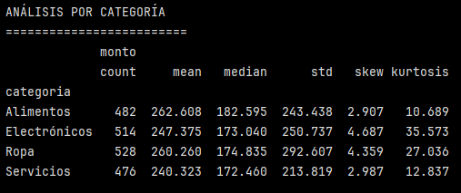
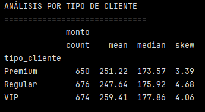
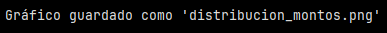
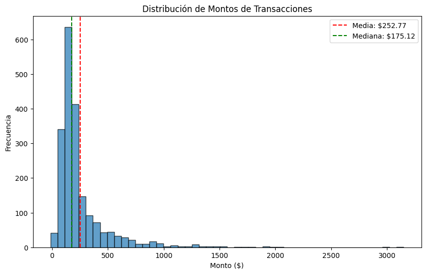

# Ejercicio: Análisis completo de distribuciones y outliers en dataset financiero

## Crear y explorar dataset financiero:

```python
import pandas as pd
import numpy as np
import matplotlib.pyplot as plt
from scipy import stats

# Crear dataset de transacciones financieras
np.random.seed(42)
n_transacciones = 2000

# Transacciones normales (distribución normal)
transacciones_normales = np.random.normal(150, 50, n_transacciones//2)

# Transacciones de lujo (distribución log-normal)
transacciones_lujo = np.random.lognormal(5.5, 0.8, n_transacciones//2)

# Combinar datasets
montos = np.concatenate([transacciones_normales, transacciones_lujo])

# Crear DataFrame
df = pd.DataFrame({
    'id_transaccion': range(1, len(montos) + 1),
    'monto': np.round(montos, 2),
    'tipo_cliente': np.random.choice(['Regular', 'Premium', 'VIP'], len(montos)),
    'categoria': np.random.choice(['Alimentos', 'Electrónicos', 'Ropa', 'Servicios'], len(montos))
})

print(f"Dataset creado: {len(df)} transacciones")
print(f"Rango de montos: ${df['monto'].min():.2f} - ${df['monto'].max():.2f}")
```



Se creó un Dataset con 2000 transacciones y cuyo rango de montos va desde los $-12.06 a $3147.88.

A partir del análisis preliminar del rango de los montos transaccionales, se observa la presencia de valores negativos, lo que resulta inconsistente con la naturaleza de una variable monetaria. Este hallazgo inicial sugiere la necesidad de realizar un proceso de limpieza y validación de datos previo a análisis posteriores, con el fin de asegurar la coherencia y calidad del dataset.


## Análisis de distribuciones y medidas de forma:

```python
# Estadísticos descriptivos
print("ANÁLISIS DESCRIPTIVO")
print("=" * 25)
print(df['monto'].describe())

# Medidas de forma
print("\nMEDIDAS DE FORMA")
print("=" * 20)
skewness = df['monto'].skew()
kurtosis = df['monto'].kurtosis()

print(f"Asimetría (Skewness): {skewness:.3f}")
print(f"  Interpretación: {'Sesgo positivo (cola derecha)' if skewness > 0 else 'Sesgo negativo (cola izquierda)' if skewness < 0 else 'Simétrica'}")

print(f"Curtosis: {kurtosis:.3f}")
print(f"  Interpretación: {'Leptocúrtica (colas pesadas)' if kurtosis > 0 else 'Platicúrtica (colas ligeras)' if kurtosis < 0 else 'Mesocúrtica (normal)'}")

# Comparación media vs mediana
media = df['monto'].mean()
mediana = df['monto'].median()

print(f"\nMedia: ${media:.2f}")
print(f"Mediana: ${mediana:.2f}")
print(f"Diferencia: ${media - mediana:.2f} ({((media - mediana) / mediana * 100):.1f}%)")
```



Se aplicó ``.describe()`` solo a la columna ``'monto'`` del DataFrame creado.
``.describe()`` es un método de Python de la librería Pandas que se usa para obtener un resumen estadístico rápido de un DataFrame o Serie.

Acá se observa que el promedio es de 252.77. la desviación estándar es muy alta ya que es casi igual al valor del promedio (252.80). El mínimo (que ya se había observado en el Rango en la sección anterior), es un valor negativo, lo que no es consistente al estar tratándose de montos monetarios. Estos valores dan indicios de que es necesario hacer un proceso de limpieza de datos.

Respecto a las medidas de forma, se obtienen los siguientes datos:

- Asimetría (Skewness) : 4.014, lo que se interpreta como un sesgo positivo (con cola derecha). El sesgo positivo nos indica que la media sobreestima el valor típico.
- Curtosis: 25.445, lo que se interpreta como leptocúrtica (colas pesadas). Esto significa que hay una mayor probabilidad de tener valores extremos.

El hecho de que la diferencia entre ``Media`` y ``Mediana`` sea de un 44.3% es consistente con la asimetría, evidenciando el sesgo positivo. Este comportamiento es coherente con el valor elevado de la asimetría (skewness = 4.014), indicando que la media está siendo desplazada hacia valores superiores por la presencia de transacciones de alto monto. En consecuencia, la media sobreestima el valor típico de las transacciones, mientras que la mediana constituye una medida más representativa del comportamiento central de los datos.


## Detección de outliers con múltiples métodos:

```python
# Método IQR
Q1 = df['monto'].quantile(0.25)
Q3 = df['monto'].quantile(0.75)
IQR = Q3 - Q1

limite_inf_iqr = Q1 - 1.5 * IQR
limite_sup_iqr = Q3 + 1.5 * IQR

outliers_iqr = df[(df['monto'] < limite_inf_iqr) | (df['monto'] > limite_sup_iqr)]

# Método Z-Score
z_scores = stats.zscore(df['monto'])
outliers_zscore = df[abs(z_scores) > 3]

print("\nDETECCIÓN DE OUTLIERS")
print("=" * 25)
print(f"Método IQR: {len(outliers_iqr)} outliers")
print(f"  Límite inferior: ${limite_inf_iqr:.2f}")
print(f"  Límite superior: ${limite_sup_iqr:.2f}")

print(f"\nMétodo Z-Score (|z| > 3): {len(outliers_zscore)} outliers")

# Comparar métodos
outliers_comunes = set(outliers_iqr.index) & set(outliers_zscore.index)
print(f"Outliers detectados por ambos métodos: {len(outliers_comunes)}")
```



Se usaron dos métodos de detección de outliers: IQR y el Z-Score. Esto permite evaluar la robustez de los resultados. 

``outliers_comunes = set(outliers_iqr.index) & set(outliers_zscore.index)`` Esta línea identifica los outliers detectados por ambos métodos.

``outliers_iqr.index``: devuelve los índices de las filas detectadas como outliers por IQR.

``outliers_zscore.index``: devuelve los índices de las filas detectadas como outliers por Z-Score.

``set()``: convierte esos índices en conjuntos (sets). Los conjuntos permiten realizar operaciones matemáticas como:
- Unión (``|``)
- Intersección (``&``)
- Diferencia (``-``)

Por lo tanto, esta línea ``set(outliers_iqr.index) & set(outliers_zscore.index)``: devuelve los elementos que están en **ambos** conjuntos *al mismo tiempo*.

En este caso, el método IQR detecta 229 outliers, principalmente asociados a valores elevados de la variable ``'monto'``, lo que es coherente con la distribución altamente asimétrica observada previamente. El límite superir relativamente bajo en comparación con el valor máximo ocnfirma la presencia de una cola derecha extensa.

Por su parte, el método Z-Score identifica 41 outliers, correspondientes a valores extremadamente alejados de la media, es decir, los casos más severos.

La coincidencia entre ambos métodos indica que estos 41 valores representan outliers extremos, mientras que el método IQR, al ser más sensible en distribuciones sesgadas, captura un conjunto más amplio de valores atípicos. Esta diferencia evidencia que la elección del método debe considerar la forma de la distribución y el objetivo del análisis.


Resumiendo esa sección, si bien ambos métodos de detección de outliers identifican valores atípicos, el método IQR resulta más sensible y detecta un mayor número de casos (229 outliers), mientras que el método Z-Score identifica únicamente los valores más extremos (41 outliers). La intersección entre ambos métodos confirma que estos 41 casos corresponden a outliers severos, coherentes con la fuerte asimetría positiva observada en la distribución.


## Análisis por categorías:

```python
print("\nANÁLISIS POR CATEGORÍA")
print("=" * 25)


'''
categoria_stats = df.groupby('categoria').agg({
    'monto': ['count', 'mean', 'median', 'std', 'skew', 'kurtosis']
}).round(3)

print(categoria_stats)

El código original incluía kurtosis en agg, sin embargo esto generó un error, por lo que se cambió esta parte del código por la siguiente: 
'''

categoria_stats = df.groupby('categoria').agg({
    'monto': ['count', 'mean', 'median', 'std', 'skew']
}).round(3)

# Cálculo de kurtosis por categoría (se agrega después)
kurtosis_por_categoria = df.groupby('categoria')['monto'].apply(lambda x: x.kurtosis()).round(3)

# Incorporar kurtosis al DataFrame con columnas jerárquicas
categoria_stats[('monto', 'kurtosis')] = kurtosis_por_categoria

print(categoria_stats)
```
>[!WARNING]
> Cuando se usa ``groupby().agg()``, Pandas no reconoce ``kurtosis`` como una función válida en ese contexto.
>
>Es por eso que se crea una función lambda que junto con ``.apply()`` permite ejecutar funciones no soportadas por ``.agg()``



El análisis por categoría evidencia que todas las categorías presentan distribuciones de monto marcadamente asimétricas, con sesgo positivo, lo cual se refleja en los valores elevados de asimetría y curtosis. En particular, la categoría Electrónicos destaca por exhibir la mayor asimetría y una curtosis significativamente alta, lo que indica la presencia de colas pesadas y valores extremos de alto monto. Asimismo, en todas las categorías la media supera a la mediana, confirmando que los montos típicos se concentran en valores inferiores al promedio. Este comportamiento es consistente con patrones de consumo donde una proporción reducida de transacciones de alto valor influye de manera considerable en las medidas de tendencia central.


```python
# Análisis por tipo de cliente
print("\nANÁLISIS POR TIPO DE CLIENTE")
print("=" * 30)

cliente_stats = df.groupby('tipo_cliente').agg({
    'monto': ['count', 'mean', 'median', 'skew']
}).round(2)

print(cliente_stats)
```



El análisis por tipo de cliente muestra que, independientemente del segmento, la distribución de los montos presenta un sesgo positivo, lo que indica la presencia de transacciones de alto valor que influyen en el promedio. En los tres tipos de cliente, la media supera a la mediana, confirmando que el monto típico de las transacciones es inferior al promedio. El segmento VIP exhibe el mayor monto promedio y mediano, lo que es consistente con un mayor poder de gasto, mientras que el segmento Regular presenta el mayor nivel de asimetría, sugiriendo una mayor concentración de valores extremos en relación con su comportamiento central. En conjunto, estos resultados refuerzan la conveniencia de utilizar la mediana como medida representativa del gasto típico por tipo de cliente.

## Visualización básica de distribuciones:

```python
# Histograma simple (si matplotlib está disponible)
try:
    plt.figure(figsize=(10, 6))
    plt.hist(df['monto'], bins=50, alpha=0.7, edgecolor='black')
    plt.axvline(df['monto'].mean(), color='red', linestyle='--', label=f'Media: ${df["monto"].mean():.2f}')
    plt.axvline(df['monto'].median(), color='green', linestyle='--', label=f'Mediana: ${df["monto"].median():.2f}')
    plt.title('Distribución de Montos de Transacciones')
    plt.xlabel('Monto ($)')
    plt.ylabel('Frecuencia')
    plt.legend()
    plt.savefig('distribucion_montos.png', dpi=100, bbox_inches='tight')
    print("\nGráfico guardado como 'distribucion_montos.png'")
except ImportError:
    print("\nMatplotlib no disponible - omitiendo visualización")
```

``plt.figure(figsize=(10, 6))`` crea un "lienzo" donde se dibuja el gráfico. ``figsize`` define el tamaño (en pulgadas) y se refiere a (ancho,alto).

``plt.hist(df['monto'], bins=50, alpha=0.7, edgecolor='black')`` define que el gráfico sea un histograma y que sea sobre la Serie ``'monto'`` (que es lo que se quiere graficar).

``bins=50`` divide el eje X en 50 intervalos.
``alpha`` es la transparencia del relleno:
- ``alpha`` = 1: totalmente opaco
- ``alpha`` = 0: totalmente transparente

Que en este caso ``alpha=0.7`` significa que se deja ver un poco el fondo y hace que no se vea "tan pesado".

``edgecolor = 'black'`` define el color de los borde en cada barra, en este caso, de color negro.

Línea vertical para la media:

- ``plt.axvline(x, ...)`` dibuja una línea vertical en ``x``.
- ``df['monto'].mean()`` calcula la media y se usa como posición.
- ``color='red'``: color de la línea.
- ``linestyle='--'``: línea punteada.
- ``label=...``: texto que aparecerá en la leyenda.

Línea vertical para la mediana:

- Sigue el mismo razonamiento anterior, solo que se usa color verde y la leyenda cambia (además de que se calcula la mediana en vez de la media).

Títulos y etiquetas:

- ``title``: título del gráfico
- ``xlabel``: etiqueta del eje X (montos)
- ``ylabel``: etiqueta del eje Y (frecuencia = conteo de observaciones por bin)

Leyenda:

- ``plt.legend()``: muestra la leyenda con los ``label=...`` que se definieron en las líneas de media y mediana.

Guardar el gráfico como archivo:

- ``plt.savefig('distribucion_montos.png', dpi=100, bbox_inches='tight')``.
- Los dpi son la resolución del archivo.
- ``bbox_inches='tight'``: recorta espacios en blanco extra para que quede más ajustado.

Mensaje final:

``print("\nGráfico guardado como 'distribucion_montos.png'")``: confirma que se guardó el archivo.

>[!NOTE]
> El archivo creado se guarda pero no se visualiza automáticamente luego de ejecutar el programa porque no hay ningún ``print()`` no ``plt.show()`` relacionado con el gráfico propiamente tal. Si se quisiera visualizar el gráfico al ejecutar el programa habría que incluir un lína ``plt.show()``.






La distribución de montos es fuertemente asimétrica hacia la derecha: la mayor parte de las transacciones se concentra en montos relativamente bajos, mientras que existe una cola larga con pocos casos de montos muy altos. Esto explica que la media (línea roja) quede desplazada hacia la derecha y sea mayor que la mediana (línea verde), ya que los valores extremos altos elevan el promedio. En este contexto, la mediana describe mejor el “monto típico”, y el histograma visualiza claramente por qué los métodos de outliers detectaron muchos valores atípicos (especialmente por arriba).

Aunque los outliers suelen asociarse a errores o anomalías, en un contexto financiero no todos los valores atípicos representan datos inválidos. En particular, algunas transacciones de alto monto pueden corresponder a comportamientos legítimos de clientes premium o VIP, caracterizados por una mayor capacidad de gasto y patrones de consumo distintos al cliente promedio.

Estas transacciones, si bien se ubican lejos del centro de la distribución, reflejan eventos reales de alto valor, como compras de productos exclusivos, servicios especializados o pagos concentrados en una sola operación. En este sentido, los outliers no distorsionan el análisis, sino que aportan información relevante sobre segmentos específicos del negocio.

Por esta razón, en análisis exploratorios y financieros resulta fundamental distinguir entre outliers erróneos y outliers válidos, ya que su eliminación indiscriminada podría llevar a la pérdida de información crítica para la toma de decisiones, especialmente en estudios de segmentación, revenue y comportamiento de clientes premium.


---

Verificación: Explica cómo la asimetría y curtosis afectan la interpretación de medidas de tendencia central, y justifica por qué algunos outliers pueden ser transacciones válidas de clientes premium.

Requerimientos:
- Python con Pandas, NumPy, SciPy
- matplotlib opcional para visualizaciones
- Dataset numérico para análisis de distribuciones