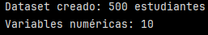
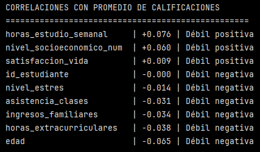
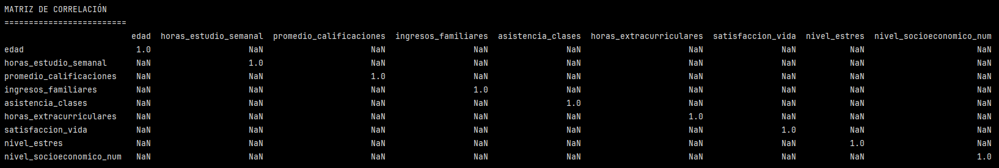
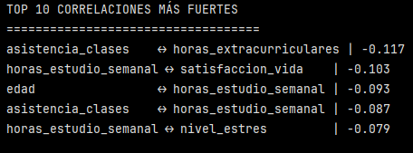
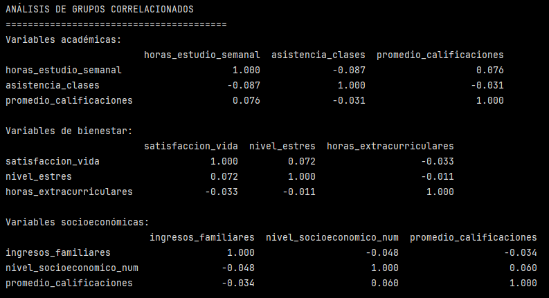
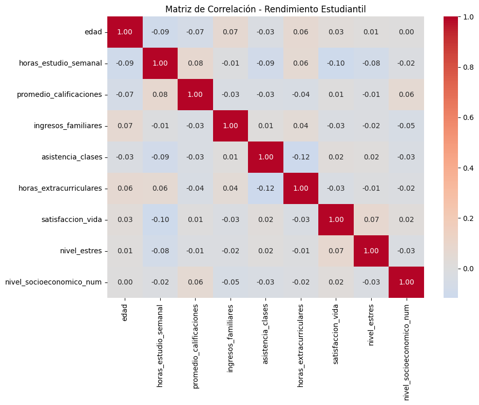

# Ejercicio: Análisis completo de correlaciones en dataset de rendimiento estudiantil

## Crear dataset educativo con múltiples variables:

```python

import pandas as pd
import numpy as np

# Configuración de visualización
pd.set_option('display.max_columns', None) # para mostrar todas las columnas en un DataFrame
pd.set_option('display.width', None)# Ancho completo

# Crear dataset de rendimiento estudiantil
np.random.seed(42)
n_estudiantes = 500

df = pd.DataFrame({
    'id_estudiante': range(1, n_estudiantes + 1),
    'edad': np.random.normal(16, 1.5, n_estudiantes).clip(14, 19).astype(int),
    'horas_estudio_semanal': np.random.normal(20, 8, n_estudiantes).clip(5, 50).astype(int),
    'promedio_calificaciones': np.random.normal(7.5, 1.2, n_estudiantes).clip(1, 10),
    'ingresos_familiares': np.random.lognormal(9, 0.6, n_estudiantes).round(0),
    'nivel_socioeconomico': np.random.choice(['Bajo', 'Medio', 'Alto'], n_estudiantes, p=[0.3, 0.5, 0.2]),
    'asistencia_clases': np.random.normal(85, 15, n_estudiantes).clip(10, 100).astype(int),
    'horas_extracurriculares': np.random.normal(8, 4, n_estudiantes).clip(0, 20).astype(int),
    'satisfaccion_vida': np.random.normal(7.2, 1.5, n_estudiantes).clip(1, 10),
    'nivel_estres': np.random.normal(6.8, 1.8, n_estudiantes).clip(1, 10)
})

# Convertir variables categóricas
nivel_map = {'Bajo': 1, 'Medio': 2, 'Alto': 3}
df['nivel_socioeconomico_num'] = df['nivel_socioeconomico'].map(nivel_map)

print(f"Dataset creado: {len(df)} estudiantes")
print(f"Variables numéricas: {len(df.select_dtypes(include=[np.number]).columns)}")
```



Se utilizó el método ``.map()`` para transformar la variable categórica ``'nivel_socioeconómico'`` en una representación numérica ordinal, ya que permite una correspondencia directa y eficiente entre categorías y valores numéricos.

Se creó un Dataset con 500 estudiantes y con 10 variables numércias (luego de aplicar ``.map()``).

>[!NOTE]
> Recordar que ``.map()`` sustituye cada valor de una Serie usando una correspondencia directa.

>[!CAUTION]
> Hasta el momento se creó una nueva columna llamada ``'nivel_socioeconomico_num'``, pero no se eliminó la columna original categórica. Hay que tener cuidado con esto porque ``.corr()`` es umn método para calcular la matriz de correlación entre **columnas numéricas** de un DataFrame. Pandas intentará usar igualmente la columna categórica y entregará un error, por lo que hay que asegurarse de usar solo columnas numércias al aplicar ``.corr()``.

Para evitar el error anterior, se definió un DataFrame solo con columnas numéricas: ``df_num=df.select_dtypes(include=[np.number])``.

## Análisis de correlaciones por pares:

```python
# Correlaciones con calificaciones

df_num = df.select_dtypes(include=[np.number]) # Se agregó para evitar el error
correlaciones_calificaciones = df_num.corr()['promedio_calificaciones'].sort_values(ascending=False) #acá se aplicó a df_num porque son puras variables numéricas

print("CORRELACIONES CON PROMEDIO DE CALIFICACIONES")
print("=" * 50)
for var, corr in correlaciones_calificaciones.items():
    if var != 'promedio_calificaciones':
        intensidad = "Fuerte" if abs(corr) > 0.6 else "Moderada" if abs(corr) > 0.3 else "Débil"
        direccion = "positiva" if corr > 0 else "negativa"
        print(f"{var:25} | {corr:+.3f} | {intensidad} {direccion}")
```

``.items()``: permite recorrer (variable, valor de correlación).

``if var != 'promedio_calificaciones'`` se usa para excluir la autocorrelación.

El resto del bloque clasifica y presenta las correlaciones de las otras variables respecto al ``'promedio_calificaciones'``.




El análisis de correlaciones con el promedio de calificaciones muestra que ninguna de las variables presenta una relación fuerte o moderada con el rendimiento académico, ya que todos los coeficientes observados son de baja magnitud. Las correlaciones positivas más altas corresponden a las horas de estudio semanal y al nivel socioeconómico, aunque su intensidad es débil, lo que sugiere que, si bien podrían influir en el desempeño, no lo determinan de forma directa. Por otro lado, variables como edad, horas extracurriculares, ingresos familiares y nivel de estrés presentan correlaciones negativas también débiles, indicando una relación inversa poco significativa. En conjunto, estos resultados evidencian que el rendimiento académico es un fenómeno multifactorial y que ninguna variable individual explica por sí sola el promedio de calificaciones.

## Matriz de correlación completa:

```python
# Variables numéricas principales
variables_interes = ['edad', 'horas_estudio_semanal', 'promedio_calificaciones', 
                    'ingresos_familiares', 'asistencia_clases', 'horas_extracurriculares',
                    'satisfaccion_vida', 'nivel_estres', 'nivel_socioeconomico_num']

correlation_matrix = df[variables_interes].corr()

print("\nMATRIZ DE CORRELACIÓN")
print("=" * 25)

# Mostrar correlaciones > 0.3 en valor absoluto
strong_correlations = correlation_matrix.where(abs(correlation_matrix) > 0.3)
print(strong_correlations.round(3))
```

Para la matriz de correlación se seleccionaron explícitamente variables numéricas de interés, lo que permitió calcular las correlaciones sin necesidad de filtrar previamente el DataFrame completo, evitando además la inclusión de variables no relevantes como identificadores. Además, se pidió que solo se mostraran aquellas correlaciones cuyo valor absoluto sea mayor a 0.3. Todo lo demás se reemplaza por ``NaN``.




Este resultado muestra que no se identifican correlaciones moderadas o fuertes entre las variables analizadas. Las relaciones existentes son de baja magnitud y no superan el umbral establecido de |r| > 0.3, lo que sugiere una baja dependencia lineal entre las variables del dataset, reforzando la naturaleza multifactorial del fenómeno estudiado.


## Análisis de correlaciones más fuertes:

```python
# Encontrar pares con correlaciones más fuertes
corr_unstack = correlation_matrix.unstack()
corr_unstack = corr_unstack[corr_unstack.index.get_level_values(0) != corr_unstack.index.get_level_values(1)]

top_correlations = corr_unstack.abs().sort_values(ascending=False).head(10)

print("\nTOP 10 CORRELACIONES MÁS FUERTES")
print("=" * 35)
for (var1, var2), corr_abs in top_correlations.items():
    if var1 < var2:  # Evitar duplicados
        corr_real = correlation_matrix.loc[var1, var2]
        print(f"{var1:20} ↔ {var2:20} | {corr_real:+.3f}")
```

``.unstack`` convierte la matriz (``correlation_matrix``) en una Serie larga, donde:
- El índice pasa a ser un par (``variable_fila``, ``variable columna``)
- El valor es la correlación entre esas dos variables.

```
Ejemplo conceptual del resultado:

('edad', 'edad')                       1.0
('edad', 'horas_estudio_semanal')     -0.09
('edad', 'asistencia_clases')         -0.03
('horas_estudio_semanal', 'edad')     -0.09
('horas_estudio_semanal', 'horas_estudio_semanal') 1.0
```

>[!NOTE]
> Se está pasando de 2 dimensiones a 1 dimensión.

Esto es útil porque al tener una Serie, se puede:
- odenar (``sort_values``)
- filtrar (``abs()``, ``head()``)
- recorrer (``for``)

Esto permite tratar cada correlación como un par independiente.

```python
corr_unstack = corr_unstack[
    corr_unstack.index.get_level_values(0) !=
    corr_unstack.index.get_level_values(1)
]
```
Este bloque elimina autocorrelaciones.

Luego, se toman las correlaciones más fuertes: ``top_correlations = corr_unstack.abs().sort_values(ascending=False).head(10)``.

>[!TIP]
> ``if var1 < var2:`` es un "truco" de orden alfabético para mostrar cada par de variables una sola vez.




El análisis de las correlaciones más fuertes muestra que incluso los pares de variables con mayor asociación presentan coeficientes de baja magnitud, todos inferiores a |0.12|, lo que confirma la ausencia de relaciones lineales significativas en el dataset. Las correlaciones identificadas son predominantemente negativas y débiles, sugiriendo que los incrementos en una variable se asocian solo marginalmente con disminuciones en otra. Este resultado refuerza la idea de que el rendimiento y las características estudiadas responden a dinámicas complejas y multifactoriales, donde ninguna relación bivariada domina el comportamiento del sistema.

>[!NOTE]
> Aunque se seleccionaron las diez correlaciones de mayor magnitud, el número de pares mostrados se reduce al eliminar duplicados derivados de la simetría de la matriz de correlación, presentándose únicamente las combinaciones únicas de variables.

>[!NOTE]
> Recordar que la matriz de correlación es simétrica:
> - corr(A,B) = corr(B,A).


## Análisis de grupos de variables correlacionadas:

```python
# Identificar clusters de variables relacionadas
print("\nANÁLISIS DE GRUPOS CORRELACIONADOS")
print("=" * 40)

# Variables relacionadas con rendimiento académico
academic_vars = ['horas_estudio_semanal', 'asistencia_clases', 'promedio_calificaciones']
academic_corr = df[academic_vars].corr()
print("Variables académicas:")
print(academic_corr.round(3))

# Variables relacionadas con bienestar
wellbeing_vars = ['satisfaccion_vida', 'nivel_estres', 'horas_extracurriculares']
wellbeing_corr = df[wellbeing_vars].corr()
print("\nVariables de bienestar:")
print(wellbeing_corr.round(3))

# Variables socioeconómicas
socio_vars = ['ingresos_familiares', 'nivel_socioeconomico_num', 'promedio_calificaciones']
socio_corr = df[socio_vars].corr()
print("\nVariables socioeconómicas:")
print(socio_corr.round(3))
```

En esta sección se definieron 3 grupos de variables:
- Rendimiento académico (``academic_vars``).
- Bienestar (``wellbeing_vars``).
- Socioeconómico (``socio_vars``).

Cada uno de estos grupos contiene un conjunto de variables y se calculó la correlación solo entre ellas (pertenecientes al mismo grupo).

El resultado es una matriz 3x3 que muestra la correlación entre las variables de dicho grupo (una matriz para cada grupo de variables.).





Este enfoque permitió evaluar las relaciones internas dentro de cada grupo, observándose que, en todos los casos, las correlaciones son de baja magnitud. Lo anterior sugiere que las variables dentro de cada dimensión no presentan relaciones lineales fuertes entre sí, reforzando la idea de que el rendimiento académico está influido por múltiples factores y no por una única dimensión aislada.

## Visualización de correlaciones (si matplotlib disponible):

```python

try:
    import matplotlib.pyplot as plt
    import seaborn as sns
    
    plt.figure(figsize=(10, 8))
    sns.heatmap(correlation_matrix, annot=True, cmap='coolwarm', center=0, fmt='.2f')
    plt.title('Matriz de Correlación - Rendimiento Estudiantil')
    plt.tight_layout()
    plt.savefig('matriz_correlacion_estudiantil.png', dpi=100, bbox_inches='tight')
    print("\nMapa de calor guardado como 'matriz_correlacion_estudiantil.png'")
    
except ImportError:
    print("\nMatplotlib/Seaborn no disponibles - omitiendo visualización")

```

>[!TIP]
> Los imports de visualización se incluyen dentro de un bloque ``try-except`` para asegurar que el análisis estadístico pueda ejecutarse incluso en entornos donde las librerías gráficas no estén disponibles, evitando la interrupción del flujo del programa.





En el heatmap generado, cada celda representa una correlación de Pearson.
- Rojo = correlación positiva.
- Azul = correlación negativa.

La intensidad del color indica la fuerza de la relación.

El mapa de calor de correlaciones confirma que no existen relaciones lineales fuertes entre las variables analizadas. La mayoría de las correlaciones presentan valores cercanos a cero, lo que refuerza la conclusión de que el rendimiento estudiantil no depende de una sola variable aislada. Las asociaciones observadas, aunque débiles, son coherentes desde un punto de vista conceptual y reflejan la naturaleza multifactorial del desempeño académico.


Correlaciones con sentido causal plausible:
- Horas de estudio → promedio de calificaciones: se podría pensar que a más horas de estudio, mejor rendimiento académico (mejor promedio de calificaciones).
- Nivel socioeconómico → promedio de calificaciones: mayor nivel socioeconómico podría significar mayor acceso a recursos o apoyo familiar lo que podría repercutir en un mejor promedio de calificaciones.

Correlaciones potencialmente espurias:
- edad ↔ promedio_calificaciones
- horas_extracurriculares ↔ asistencia_clases
- satisfaccion_vida ↔ horas_estudio_semanal

No hay una relación causal directiva evidente y las correlaciones son muy bajas.

El análisis evidencia que el rendimiento académico no puede explicarse mediante relaciones bivariadas simples. Variables como el estudio, el contexto socioeconómico y el bienestar contribuyen al desempeño, pero ninguna lo determina de forma aislada, lo que sugiere la necesidad de enfoques multivariados para comprender el fenómeno.

En conjunto, los resultados muestran que el rendimiento estudiantil es un fenómeno multifactorial, donde múltiples dimensiones interactúan sin que una sola variable explique el desempeño por sí misma.

--- 

Verificación: Identifica qué correlaciones tienen sentido causal (ej: horas de estudio → calificaciones) vs cuáles podrían ser espurias, y explica insights específicos del análisis de rendimiento estudiantil.

Requerimientos:
- Python con Pandas y NumPy
- matplotlib y seaborn opcionales para visualizaciones
- Dataset multivariado para análisis de correlaciones

