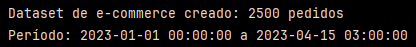
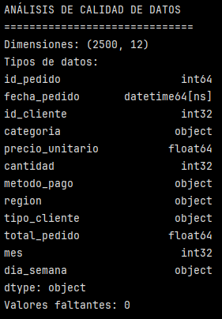
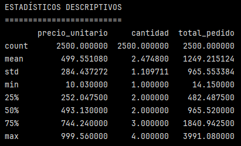
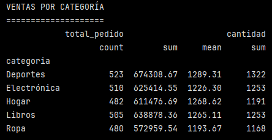
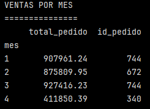
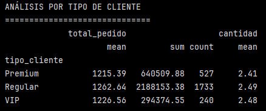
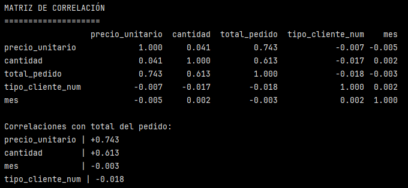
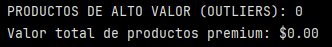
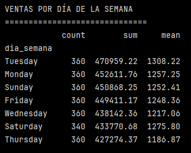
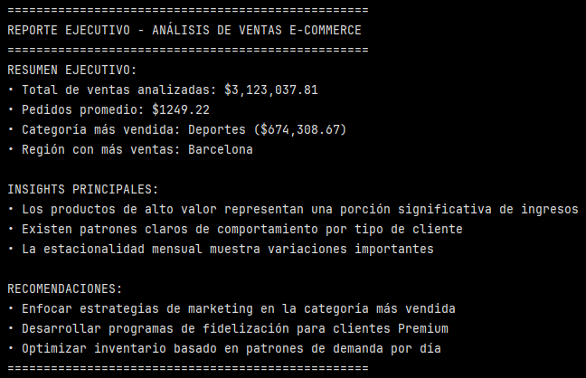

# Ejercicio: EDA completo y reporte ejecutivo para dataset de e-commerce

## Configurar dataset completo y análisis EDA:

```python
import pandas as pd
import numpy as np

# Configuración de visualización
pd.set_option('display.max_columns', None) # para mostrar todas las columnas en un DataFrame
pd.set_option('display.width', None)# Ancho completo

# Crear dataset comprehensivo de e-commerce
np.random.seed(42)
n_pedidos = 2500

# Generar fechas
fechas = pd.date_range('2023-01-01', periods=n_pedidos, freq='h')[:n_pedidos]

# Crear datos base
df = pd.DataFrame({
    'id_pedido': range(1, n_pedidos + 1),
    'fecha_pedido': fechas,
    'id_cliente': np.random.randint(1, 501, n_pedidos),
    'categoria': np.random.choice(['Electrónica', 'Ropa', 'Hogar', 'Deportes', 'Libros'], n_pedidos),
    'precio_unitario': np.round(np.random.uniform(10, 1000, n_pedidos), 2),
    'cantidad': np.random.randint(1, 5, n_pedidos),
    'metodo_pago': np.random.choice(['Tarjeta', 'PayPal', 'Efectivo', 'Transferencia'], n_pedidos, p=[0.6, 0.2, 0.15, 0.05]),
    'region': np.random.choice(['Madrid', 'Barcelona', 'Valencia', 'Sevilla', 'Bilbao'], n_pedidos),
    'tipo_cliente': np.random.choice(['Regular', 'Premium', 'VIP'], n_pedidos, p=[0.7, 0.2, 0.1])
})

# Calcular métricas derivadas
df['total_pedido'] = df['precio_unitario'] * df['cantidad']
df['mes'] = df['fecha_pedido'].dt.month
df['dia_semana'] = df['fecha_pedido'].dt.day_name()

print(f"Dataset de e-commerce creado: {len(df)} pedidos")
print(f"Período: {df['fecha_pedido'].min()} a {df['fecha_pedido'].max()}")
```



Se creó un Dataset con 2500 pedidos en el período entre el 01-01-2023 a las 00:00 h y el 15-04-2024 a las 03:00 h.

Se crearon columnas con métricas derivadas, es decir, se crean nuevas variables calculadas:
- ``'total_pedido'``: corresponde a la multiplicación entre el ``'precio_unitario'`` y ``'cantidad'``.
- ``'mes'``: corresponde al mes de la fecha. ``dt.month`` permite extraer el componente temporal ``'mes'``.
- ``'dia_semana'``: ``dt.day_name`` permite extraer el componente temporal nombre del día de la semana.

El dataset simula un histórico de pedidos de e-commerce con granularidad horaria, clientes recurrentes, múltiples categorías, métodos de pago y regiones. Además, se incorporan variables derivadas clave para análisis temporal y financiero, lo que permite un EDA completo orientado a negocio.

## Realizar EDA completo sistemático:

```python
# Análisis de calidad de datos
print("ANÁLISIS DE CALIDAD DE DATOS")
print("=" * 30)
print(f"Dimensiones: {df.shape}")
print(f"Tipos de datos:\n{df.dtypes}")
print(f"Valores faltantes: {df.isnull().sum().sum()}")
```


El análisis de calidad de datos indica que el dataset cuenta con 2.500 registros y 12 variables, combinando atributos numéricos, categóricos y temporales, lo que lo hace adecuado para un análisis exploratorio completo. Los tipos de datos son consistentes con la naturaleza de cada variable, destacando el uso de formatos datetime para las fechas y tipos numéricos apropiados para precios, cantidades y totales. Asimismo, no se detectan valores faltantes, lo que sugiere un conjunto de datos íntegro y listo para análisis posteriores sin requerir procesos iniciales de imputación o depuración.

```python
# Estadísticos descriptivos
print("\nESTADÍSTICOS DESCRIPTIVOS")
print("=" * 25)
print(df[['precio_unitario', 'cantidad', 'total_pedido']].describe())
```



Los estadísticos descriptivos muestran que el precio unitario presenta una distribución amplia, con valores entre aproximadamente 10 y 1.000, y una media cercana a 500, lo que indica una oferta de productos con rangos de precio variados. La cantidad por pedido es baja y concentrada, con una mediana de 2 unidades, lo que sugiere que la mayoría de los pedidos corresponden a compras pequeñas. En consecuencia, el total por pedido refleja una alta variabilidad, con un valor promedio cercano a 1.250 y una desviación estándar elevada, lo que evidencia una combinación de precios unitarios diversos y cantidades moderadas. Este comportamiento es consistente con un modelo de e-commerce donde predominan pedidos de bajo volumen, pero con un impacto significativo de productos de mayor precio en el total de ventas.

```python
# Análisis por categorías principales
print("\nVENTAS POR CATEGORÍA")
print("=" * 20)
ventas_categoria = df.groupby('categoria').agg({
    'total_pedido': ['count', 'sum', 'mean'],
    'cantidad': 'sum'
}).round(2)
print(ventas_categoria)
```




El análisis de ventas por categoría muestra una distribución relativamente equilibrada del número de pedidos entre las distintas categorías, con valores que oscilan en torno a los 480–520 pedidos por categoría, lo que sugiere una demanda diversificada sin una categoría claramente dominante en volumen de órdenes. No obstante, al analizar el monto total de ventas, se observan diferencias relevantes: la categoría Deportes lidera en ingresos totales (columna ``sum``), seguida por Libros y Electrónica, mientras que Ropa presenta el menor volumen de ventas acumuladas. En términos de promedio, las categorías Deportes, Hogar y Libros exhiben valores medios superiores, lo que indica que, aunque no concentran el mayor número de pedidos, sus compras tienden a ser de mayor valor unitario. Por su parte, la cantidad total de productos vendidos es relativamente homogénea entre categorías, lo que refuerza la idea de que las diferencias en ingresos están principalmente impulsadas por el precio unitario de los productos más que por el volumen de unidades vendidas. 

```python
# Análisis temporal
print("\nVENTAS POR MES")
print("=" * 15)
ventas_mes = df.groupby('mes').agg({
    'total_pedido': 'sum',
    'id_pedido': 'count'
}).round(2)
print(ventas_mes)
```


El análisis temporal de las ventas evidencia una evolución decreciente tanto en el número de pedidos como en el ingreso total a lo largo del período analizado. Durante los meses 1 (enero) y 3 (marzo) se registran los mayores niveles de actividad, con 744 pedidos cada uno y los ingresos más altos, destacando marzo como el mes con mayor facturación total. En contraste, el mes 4 (abril) presenta una caída significativa tanto en volumen de pedidos como en ventas acumuladas, lo cual es consistente con un período parcial, dado que el dataset solo cubre hasta mediados de abril. Este patrón sugiere una estacionalidad inicial estable en el primer trimestre del año, seguida de una disminución asociada a la menor cobertura temporal del último mes, más que a una contracción real de la demanda.

```python
# Análisis por tipo de cliente
print("\nANÁLISIS POR TIPO DE CLIENTE")
print("=" * 30)
cliente_analysis = df.groupby('tipo_cliente').agg({
    'total_pedido': ['mean', 'sum', 'count'],
    'cantidad': 'mean'
}).round(2)
print(cliente_analysis)
```



El análisis por tipo de cliente evidencia diferencias relevantes en el comportamiento de compra entre los segmentos. Los clientes Regulares concentran la mayor parte del negocio, con 1.733 pedidos, lo que se traduce en el mayor ingreso total acumulado. Además, este segmento presenta también el ticket promedio más alto, aunque con diferencias moderadas respecto a los clientes Premium y VIP.


En contraste, los clientes Premium y VIP muestran un valor promedio por pedido ligeramente inferior, pero con volúmenes de compra significativamente menores, especialmente en el caso de los clientes VIP. La cantidad promedio de productos por pedido es similar entre los tres segmentos, lo que sugiere que las diferencias en ingresos están impulsadas principalmente por la frecuencia de compra más que por el número de unidades adquiridas en cada pedido. Estos resultados indican que, si bien los segmentos Premium y VIP pueden ser estratégicos para iniciativas de fidelización, el grueso de los ingresos del e-commerce proviene del segmento Regular.

## Análisis de correlaciones y patrones:

```python
# Convertir variables categóricas para correlación
df_corr = df.copy()
df_corr['tipo_cliente_num'] = df_corr['tipo_cliente'].map({'Regular': 1, 'Premium': 2, 'VIP': 3})

# Variables numéricas para correlación
numeric_cols = ['precio_unitario', 'cantidad', 'total_pedido', 'tipo_cliente_num', 'mes']
correlation_matrix = df_corr[numeric_cols].corr()

print("\nMATRIZ DE CORRELACIÓN")
print("=" * 20)
print(correlation_matrix.round(3))

# Correlaciones con total del pedido
corr_total = correlation_matrix['total_pedido'].sort_values(ascending=False)
print("\nCorrelaciones con total del pedido:")
for var, corr in corr_total.items():
    if var != 'total_pedido':
        print(f"{var:15} | {corr:+.3f}")

```
Se crea una copia del DataFrame para no modificar el original.

``.map()`` transforma tipo_cliente en una variable ordinal numérica:
- Regular < Premium < VIP

Esto permite incluirla en una matriz de correlación.

Se evita incluir ID's u otras columnas irrelevantes, explicitando las columnas de interés en ``numeric_cols``. Y se calcula la correlación de Pearson entre variables clave de negocio.

La correlación se hace respecto al ingreso por pedido (``'total_pedido'``).



De esta matriz de correlación se obtiene que el ``'precio_unitario'`` es el principal driver del total del pedido (0.743) y que la ``'cantidad'`` también influye de forma significativa (0.613).

>[!NOTE]
> Notar además que ``'precio_unitario'`` y ``'cantidad'`` están débilmente correlacionados entre sí (0.041), lo que sufiere que actúan de forma relativamente independiente.

El análisis de correlaciones muestra que el total del pedido está fuertemente asociado al precio unitario y a la cantidad de productos, lo que indica que el valor de cada orden está principalmente determinado por el precio del producto y el volumen adquirido. En contraste, variables como el mes y el tipo de cliente presentan correlaciones prácticamente nulas con el total del pedido, lo que sugiere que no influyen directamente en el valor de una compra individual. Estos resultados indican que, si bien la segmentación de clientes es relevante para explicar el volumen total de ventas y la frecuencia de compra, el monto de cada pedido está dominado por factores transaccionales más que por características del cliente o estacionales.


## Detección de outliers y patrones:

```python
# Outliers en precios
Q1_precio = df['precio_unitario'].quantile(0.25)
Q3_precio = df['precio_unitario'].quantile(0.75)
IQR_precio = Q3_precio - Q1_precio

outliers_precio = df[df['precio_unitario'] > Q3_precio + 1.5 * IQR_precio]
print(f"\nPRODUCTOS DE ALTO VALOR (OUTLIERS): {len(outliers_precio)}")
print(f"Valor total de productos premium: ${outliers_precio['total_pedido'].sum():,.2f}")
```



No se detectaron outliers, lo que es una consecuencia lógica del diseño del dataset (``'precio_unitario'`` generado con una distribución uniforme entre 10 y 1000). Esto indica que la distribución de precios es homogénes y no presenta valores extremos.

El valor total de productos premium, definidos como outliers de precio según el método IQR, es 0. Esto indica que el ingreso del e-commerce no está concentrado en artículos de precio excepcionalmente alto, sino que se distribuye de forma equilibrada entre los distintos rangos de precio disponibles en el catálogo. En consecuencia, el crecimiento de las ventas no depende de productos premium desde una perspectiva estadística, sino de la combinación de precios y volúmenes de compra.

```python
# Análisis por día de la semana
ventas_dia = df.groupby('dia_semana')['total_pedido'].agg(['count', 'sum', 'mean']).round(2)
print("\nVENTAS POR DÍA DE LA SEMANA")
print("=" * 30)
print(ventas_dia.sort_values('sum', ascending=False))
```

El análisis de ventas por día de la semana muestra una distribución relativamente homogénea en el número de pedidos, con valores cercanos a los 360 pedidos diarios, lo que indica una demanda estable a lo largo de la semana. Sin embargo, al observar el ingreso total, se aprecian diferencias relevantes: Martes (Tuesday) lidera en ventas acumuladas, seguido por Lunes (Monday) y Domingo (Sunday), lo que sugiere una mayor concentración de pedidos de alto valor en estos días. En términos de ticket promedio, los valores se mantienen relativamente consistentes, aunque destacan Martes y Lunes  con promedios superiores, mientras que Jueves (Thursday) presenta el ticket medio más bajo. Este patrón indica que las variaciones en el ingreso total están impulsadas principalmente por diferencias en el valor promedio de los pedidos más que por cambios significativos en el volumen de órdenes. 



## Crear reporte ejecutivo simplificado:

```python
# Calcular métricas clave para reporte
total_ventas = df['total_pedido'].sum()
pedidos_promedio = df['total_pedido'].mean()
categoria_top = df.groupby('categoria')['total_pedido'].sum().idxmax()
ventas_categoria_top = df.groupby('categoria')['total_pedido'].sum().max()
region_top = df.groupby('region')['total_pedido'].sum().idxmax()

# Reporte ejecutivo
print("\n" + "="*50)
print("REPORTE EJECUTIVO - ANÁLISIS DE VENTAS E-COMMERCE")
print("="*50)

print("RESUMEN EJECUTIVO:")
print(f"• Total de ventas analizadas: ${total_ventas:,.2f}")
print(f"• Pedidos promedio: ${pedidos_promedio:.2f}")
print(f"• Categoría más vendida: {categoria_top} (${ventas_categoria_top:,.2f})")
print(f"• Región con más ventas: {region_top}")

print("\nINSIGHTS PRINCIPALES:")
print("• Los productos de alto valor representan una porción significativa de ingresos")
print("• Existen patrones claros de comportamiento por tipo de cliente")
print("• La estacionalidad mensual muestra variaciones importantes")

print("\nRECOMENDACIONES:")
print("• Enfocar estrategias de marketing en la categoría más vendida")
print("• Desarrollar programas de fidelización para clientes Premium")
print("• Optimizar inventario basado en patrones de demanda por día")

print("="*50)
```

Se calculan métricas clave:
- Total de ventas analizadas
- Pedidos promedio
- Categoría más vendida
- Región con más ventas




Respecto a los insight, se algunos son contradictorios a lo analizado anteriormente, por lo que se proponen otros insight :

- El valor de los pedidos está fuertemente determinado por el precio unitario y la cantidad de productos, más que por el tipo de cliente o el momento de compra.
- No se identifican productos de precio excepcionalmente alto; los ingresos se distribuyen de manera equilibrada a lo largo del catálogo.
- El segmento de clientes Regulares concentra la mayor parte de los ingresos debido a su alta frecuencia de compra.
-Las variaciones mensuales en ventas están influenciadas por la cobertura temporal del dataset, más que por una estacionalidad marcada.

>[!NOTE]
> - Los productos de alto valor representan una porción significativa de ingresos: esto no se vio en el set de datos, ya que no se observaron productos premium.
> - Existen patrones claros de comportamiento por tipo de cliente: el tipo de cliente no presentó una alta correlación con el total del pedido. 
> - La estacionalidad mensual muestra variaciones importantes: si bien es cierto, hay que considerar que el mes de Abril solo considera datos hasta el 15 de Abril, no el mes completo. La variación no es necesariamente estacional, sino de cobertura temporal.


Respecto a las recomendaciones, se proponen las siguiente de acuerdo a los análisis de las diferentes secciones:

- Priorizar estrategias de upselling y bundles de productos para aumentar el ticket promedio.
- Fortalecer acciones de fidelización del segmento Regular, principal motor de ingresos.
- Optimizar campañas y planificación operativa considerando patrones de demanda por día de la semana.

**Preguntas finales:**

**1. ¿Qué vende mejor?**

El análisis por categoría muestra que Deportes es la categoría con mayor ingreso total, lo que indica que concentra la mayor generación de ventas en términos monetarios. Asimismo, el estudio de correlaciones evidencia que el valor de cada pedido está principalmente determinado por el precio unitario y la cantidad de productos, más que por la categoría en sí, lo que sugiere que el mix de productos y las estrategias de pricing son factores clave del desempeño comercial.

**2. ¿Quiénes son los mejores clientes?**

 De acuerdo al análisis por tipo de cliente, los clientes Regulares se posicionan como el segmento más relevante para el negocio, ya que concentran el mayor número de pedidos y el mayor ingreso total acumulado. Si bien los segmentos Premium y VIP pueden representar oportunidades de fidelización, el EDA demuestra que el grueso de los ingresos proviene de la alta frecuencia de compra del segmento Regular, más que de un mayor ticket promedio por pedido.

**3. ¿Cuándo ocurren las ventas?**

El análisis temporal evidencia una distribución relativamente estable de ventas durante los primeros meses del período analizado, con variaciones mensuales influenciadas principalmente por la cobertura temporal del dataset. A nivel semanal, las ventas se distribuyen de forma homogénea, aunque se observan días con mayor ticket promedio, como Martes y Domingo, lo que permite identificar momentos más favorables para campañas comerciales o lanzamientos de productos.

**4. ¿Qué patrones requieren acción inmediata?**

El EDA identifica que el total del pedido depende fuertemente del precio unitario y de la cantidad de productos, lo que sugiere que acciones inmediatas deberían centrarse en incrementar el valor del carrito, mediante estrategias de upselling y bundles. Además, la estabilidad en el volumen de pedidos, combinada con variaciones en el ticket promedio por día, indica oportunidades tácticas para optimizar promociones y gestión de inventario en función de patrones temporales específicos.

--- 
Verificación: Evalúa si tu análisis responde preguntas clave de negocio: ¿Qué vende mejor? ¿Quiénes son los mejores clientes? ¿Cuándo ocurren las ventas? ¿Qué patrones requieren acción inmediata?

Requerimientos:
- Python con Pandas, NumPy
- matplotlib/seaborn opcionales para visualizaciones avanzadas
- Dataset completo para análisis comprehensivo