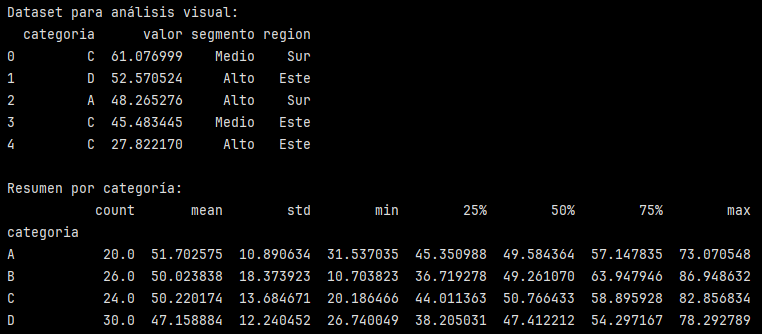
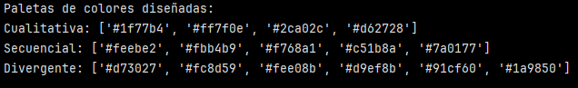
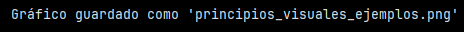
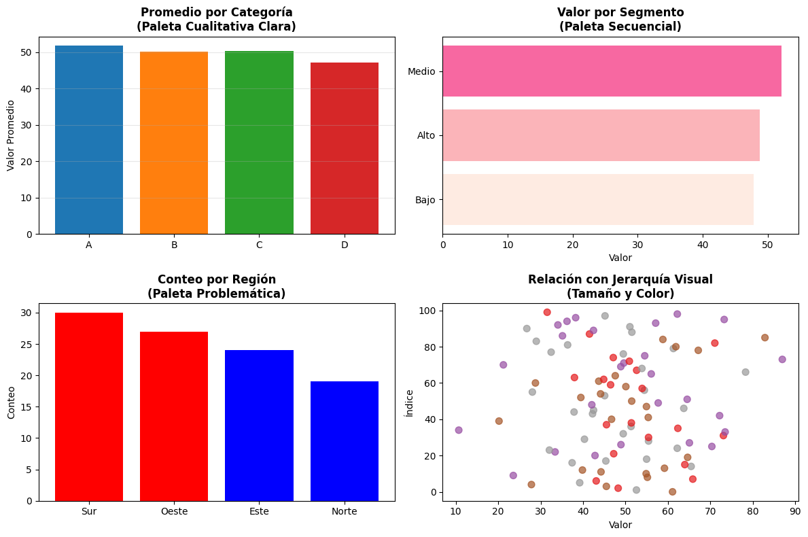
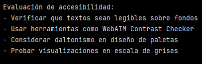

# Ejercicio: Diseño de paletas de colores efectivas para diferentes contextos

## Análisis de dataset y diseño de paletas conceptuales:

```python
import pandas as pd
import numpy as np
import matplotlib.pyplot as plt

# Crear dataset de ejemplo para análisis visual
np.random.seed(42)
df = pd.DataFrame({
    'categoria': np.random.choice(['A', 'B', 'C', 'D'], 100),
    'valor': np.random.normal(50, 15, 100),
    'segmento': np.random.choice(['Alto', 'Medio', 'Bajo'], 100),
    'region': np.random.choice(['Norte', 'Sur', 'Este', 'Oeste'], 100)
})

print("Dataset para análisis visual:")
print(df.head())
print(f"\nResumen por categoría:")
print(df.groupby('categoria')['valor'].describe())
```



El dataset creado contiene variables categóricas:
- ``'categoria'`` (A, B, C, D)
- ``'segmento'`` (Alto, Medio, Bajo)
- ``'region'`` (Norte, Sur, Este, Oeste)

Y variables numéricas continuas:
- ``'valor'`` 

Análisis del resumen por categoría:

Las categorías tienen medias similares pero diferentes desviaciones estándar y rangos. Las medianas son similares entre sí y cercanas a sus respectivas medias, lo que sugiere una distribución aproximadamente simétrica y compatible con una distribución normal para la variable valor dentro de cada categoría. No obstante, esta apreciación se basa en estadística descriptiva y debería complementarse con visualizaciones o pruebas formales para confirmarla.

## Diseño de paletas de colores por tipo de dato:

```python
# Paleta cualitativa para categorías discretas
colores_cualitativos = ['#1f77b4', '#ff7f0e', '#2ca02c', '#d62728']  # Azul, Naranja, Verde, Rojo

# Paleta secuencial para valores continuos
colores_secuenciales = ['#feebe2', '#fbb4b9', '#f768a1', '#c51b8a', '#7a0177']  # De claro a oscuro

# Paleta divergente para valores con punto medio
colores_divergentes = ['#d73027', '#fc8d59', '#fee08b', '#d9ef8b', '#91cf60', '#1a9850']

print("Paletas de colores diseñadas:")
print(f"Cualitativa: {colores_cualitativos}")
print(f"Secuencial: {colores_secuenciales}")
print(f"Divergente: {colores_divergentes}")
```



Se diseñaron 3 paletas de coloreS:

- Cualitativa
- Secuencial
- Divergente

Las paletas de color están definidas utilizando el formato hexadecimal (HEX), que representa los colores mediante la combinación de intensidades RGB y es ampliamente compatible con librerías de visualización como Matplotlib.

>[!NOTE]
> En el formato HEX cada color tiene forma: #RRGGBB
> - RR: Intensidad de Rojo
> - GG: Intensidad de Verde
> - BB: Intensidad de Azul
> 
> Cada par va de:
> - 00: sin intensidad
> - FF: máxima intensidad


## Aplicación de principios visuales en gráficos simples:

```python
# Gráfico de barras con paleta cualitativa efectiva
fig, ((ax1, ax2), (ax3, ax4)) = plt.subplots(2, 2, figsize=(12, 8))

# 1. Gráfico cualitativo (bueno)
categoria_means = df.groupby('categoria')['valor'].mean()
bars1 = ax1.bar(categoria_means.index, categoria_means.values, 
                color=colores_cualitativos[:len(categoria_means)])
ax1.set_title('Promedio por Categoría\n(Paleta Cualitativa Clara)', fontsize=12, fontweight='bold')
ax1.set_ylabel('Valor Promedio')
ax1.grid(axis='y', alpha=0.3)

# 2. Gráfico secuencial (bueno para rangos)
segmento_means = df.groupby('segmento')['valor'].mean().sort_values()
bars2 = ax2.barh(segmento_means.index, segmento_means.values,
                 color=colores_secuenciales[:len(segmento_means)])
ax2.set_title('Valor por Segmento\n(Paleta Secuencial)', fontsize=12, fontweight='bold')
ax2.set_xlabel('Valor')

# 3. Gráfico con colores problemáticos (mal ejemplo)
region_counts = df['region'].value_counts()
bars3 = ax3.bar(region_counts.index, region_counts.values, 
                color=['red', 'red', 'blue', 'blue'])  # Colores similares problemáticos
ax3.set_title('Conteo por Región\n(Paleta Problemática)', fontsize=12, fontweight='bold')
ax3.set_ylabel('Conteo')

# 4. Gráfico con buena jerarquía visual
scatter = ax4.scatter(df['valor'], range(len(df)), 
                     c=df['categoria'].map({'A': 0, 'B': 1, 'C': 2, 'D': 3}),
                     cmap='Set1', alpha=0.7, s=50)
ax4.set_title('Relación con Jerarquía Visual\n(Tamaño y Color)', fontsize=12, fontweight='bold')
ax4.set_xlabel('Valor')
ax4.set_ylabel('Índice')

plt.tight_layout()
plt.savefig('principios_visuales_ejemplos.png', dpi=100, bbox_inches='tight')
print("\nGráfico guardado como 'principios_visuales_ejemplos.png'")
```

``plt.subplots(2,2)`` divide el espacio de la figura (``fig``) en una grilla de 2 filas x 2 columnas. Cada celda de esa grilla es un subplot (un gráfico independiente).

Cada ``ax`` es un objeto Axes, es decir, un lienzo donde se dibuja un gráfico que tiene sus propios ejes, títulos, etiqueta, grillas. Representa el área de gráfico o subgráfico dentro de una figura.

``ax.tipo_de_grafico(eje_x, eje_y, opciones)``

- ``tipo_de_grafico``: el método que define cómo se visualizan los datos.
- ``eje_x``, ``eje y``: los datos.
- ``opciones``: colores, tamaños, transparencia, etc.

``categoria_means = df.groupby('categoria')['valor'].mean()``: genera una Serie de pandas.

- ``.index()``: contiene las etiquetas de las categorías.
- ``.values()``: contiene los valores numéricos.

``.barh()``: indica barras horizontales.

``paleta[:len(...)]``: utiliza un subconjunto de la paleta secuencial, seleccionando tantos colores como elementos a graficar. Usa exactamente un color por barra dependiendo de la cantidad de datos. Esto sirve para evitar errores si la paleta tiene más colores que datos.

>[!IMPORTANT]
> El orden de los colores sigue el orden de los datos.

Estructura del ``.scatter()``: gráfico de dispersión.

``ax4.scatter(x, y, c=..., cmap=..., s=..., alpha=...)``

- ``df['valor']``: corresponde al eje X
- ``range(len(df))``: corresponde al eje Y
- ``c``: significa color. Es una variable numérica que se traducirá a color.
- ``.map()`` convierte cada categoría en un número que se usará como índice para una paleta de colores.
- ``cmap='Set1'``: es un mapa de colores (*colormap*). Toma valores numéricos y los traduce a colores específicos. 
- ``Set1`` es una paleta cualitativa predefinida de Matplotlib.
- ``s``: controla el tamño de los puntos. Se mide en área.







**``ax1`` - Paleta cualitativa:**

- Compara categorías discretas.
- Colores diferentes sin jerarquía implícita

**``ax2`` - Paleta secuencial:**

- Representa valores ordenables
- Colores van de claro a oscuro
- Refuerza visualmente el orden

>[!IMPORTANT]
> ``sort_values()`` ordena por **valor numérico promedio**, no por el significado del segmento (está ordenado matemáticamente, no semánticamente).

**``ax3`` - Paleta Problemática**

- Colores iguales para categorías distintas
- Genera confusión visual

**``ax4`` - Jerarquía Visual**

Uso combinado de :
- Color
- Tamaño
- Transparencia (``alpha``)


## Evaluación de accesibilidad de colores:

```python
# Función simple para verificar contraste básico
def calcular_contraste(color1, color2):
    # Versión simplificada - en producción usar librerías especializadas
    # Contraste mínimo recomendado: 4.5:1
    return "Verificación manual requerida para producción"

print("\nEvaluación de accesibilidad:")
print("- Verificar que textos sean legibles sobre fondos")
print("- Usar herramientas como WebAIM Contrast Checker")
print("- Considerar daltonismo en diseño de paletas")
print("- Probar visualizaciones en escala de grises")

```



La función ``calcular_contraste()`` acá funciona como un placeholder, un recordatorio conceptual. Indica que es importante evaluar el contraste y deben usarse herramientas especializadas.

- Verificar que textos sean legibles sobre fondos:
    - El color no debe impedir la lectura.
    - Esto es especialmente importante en títulos, etiquetas y anotaciones.

- Usar herramientas como WebAIM ContrasC Checker:
    - Permite ingresar color de texto y fondo y verificar si cumple:
        - AA (≥ 4.5:1) 
        - AAA (≥ 7:1)

>[!NOTE]
> AA y AAA son los niveles de conformidad de las WCAG (*Web Content accessibility Guidelines*), que son las guías de accesibilidad más usadas a nivel mundial.


1. El nivel AA (recomendado/estándar):

    Muy común en sitios web, dashboard, visualizaciones públicas.

    Requisitos de contraste:

    - Texto normal ≥ 4.5 : 1
    - Texto grande ≥ 3 : 1

    Cumplir AA significa que el contenido es legible para la gran mayoría de las personas, incluyendo usuarios con baja visión.

2. El nivel AAA (más exigente):

    Se usa en contextos críticos, información pública sensible, educación, gobierno, salud.

    Requisitos de contraste:

    - Texto normal ≥ 7 : 1
    - Texto grande ≥ 4.5 : 1
    
     Cumplir AAA implica máxima legibilidad, incluso en condiciones visuales desfavorables.

>[!NOTE]
> 4.5:1 o 7:1 es uina relacion de contraste entre: color del texto y color del fondo. Por ejemplo, 7:1 significa que el texto es 7 veces más luminoso y oscuro que el fondo.

- Considerar daltonismo en diseño de paletas:
    - Evitar combinaciones problemáticas: rojo-verde o verde-marrón.
    - Usar contraste de luminosidad.

- Probar visualizaciones en escala de grises:
    - Test rápido y muy efectivo: si el gráfico se entiende sin color, tiene un buen diseño.
    - Evalúa jerarquía, contraste y redundancia visual.


#### Reflexión final

Los gráficos generados muestran cómo la aplicación de principios visuales influye directamente en la claridad con la que se comunican los insights.

En el gráfico de promedio por categoría, el uso de una paleta cualitativa clara permite distinguir fácilmente cada categoría sin imponer una jerarquía implícita. La composición es ordenada y el color cumple una función exclusivamente informativa, facilitando la comparación directa entre grupos.

En el gráfico de valor por segmento, la paleta secuencial refuerza la lectura de magnitud mediante un gradiente de color. Sin embargo, cuando el orden visual no respeta la jerarquía conceptual de los segmentos (Alto–Medio–Bajo), se podría generar ambigüedad interpretativa.

El gráfico de conteo por región utiliza colores similares para categorías distintas, lo que reduce el contraste y dificulta la diferenciación visual. Este ejemplo evidencia cómo una mala elección cromática puede ocultar patrones relevantes, aun cuando los datos estén correctamente representados.

Finalmente, el gráfico de dispersión muestra un uso efectivo de jerarquía visual, combinando color, tamaño y transparencia para guiar la atención del observador. Aquí, el color permite identificar categorías, mientras que la composición general facilita la exploración de la distribución de valores sin sobrecargar la visualización.

--- 

Verificación: Compara los gráficos generados y explica cómo los principios visuales (jerarquía, color, composición) afectan la capacidad de comunicar insights claramente.

Requerimientos:
- Python con Matplotlib instalado
- Pandas para manipulación de datos
- Entorno Jupyter para visualización interactiva
- Recomendado: Seaborn para paletas de colores avanzadas