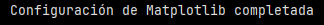
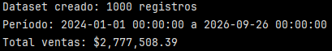
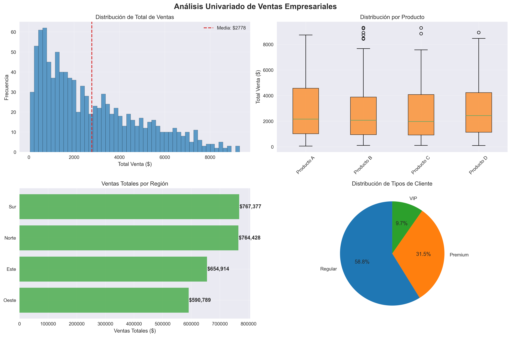
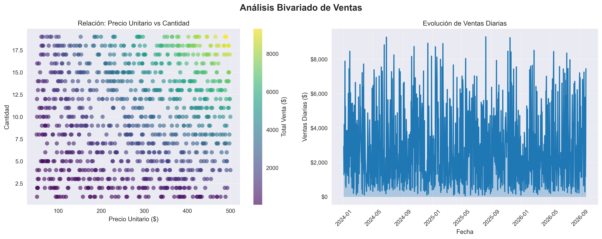

# Ejercicio: Análisis visual inicial de dataset empresarial completo

## Preparación del dataset y configuración de Matplotlib:

```python
import pandas as pd
import numpy as np
import matplotlib.pyplot as plt
import matplotlib as mpl

# Configuración de visualización
pd.set_option('display.max_columns', None) # para mostrar todas las columnas en un DataFrame
pd.set_option('display.width', None)# Ancho completo

# Configuración profesional de Matplotlib
plt.style.use('seaborn-v0_8')
mpl.rcParams.update({
    'font.size': 11,
    'figure.figsize': (10, 6),
    'figure.dpi': 100,
    'savefig.dpi': 300,
    'savefig.bbox': 'tight',
    'axes.grid': True,
    'grid.alpha': 0.3
})

# Paleta de colores corporativa
colores = ['#1f77b4', '#ff7f0e', '#2ca02c', '#d62728', '#9467bd', '#8c564b']

print("Configuración de Matplotlib completada")
```



Este bloque deja listo el entorno para el análisis visual posterior.

``plt.style.use('seaborn-v0_8')``: aplica un estilo inspirado en Seaborn:
- colores más suaves
- mejor contraste
- grillas más legibles

``rcParams``: acá se definen reglas globales para todos los gráficos que se hagan después. Es un diccionario global que almacena los parámetros de configuración para todos los gráficos.
- ``font.size: 11``
- ``figure.figsize: (10, 6)``: proporción estándar.
- ``figure.dpi: 100``: resolución (adecuada para pantalla)
- ``savefig.dpi: 300``: calidad alta para exportar.
- ``savefig.bbox: 'tight'``: evita que títulos o etiquetas se corten.
- ``axes.grid: True`` : muestra las líneas de la cuadrícula pero con ``grid.alpha:0.3`` no se ven tan marcadas (transparencia).

``colores``: se define una paleta de colores corporativa.


## Creación y análisis de dataset empresarial:

```python
# Generar dataset de ventas empresariales
np.random.seed(42)
n_ventas = 1000

df = pd.DataFrame({
    'fecha': pd.date_range('2024-01-01', periods=n_ventas, freq='D'),
    'producto': np.random.choice(['Producto A', 'Producto B', 'Producto C', 'Producto D'], n_ventas),
    'region': np.random.choice(['Norte', 'Sur', 'Este', 'Oeste'], n_ventas),
    'cantidad': np.random.randint(1, 20, n_ventas),
    'precio_unitario': np.random.uniform(50, 500, n_ventas).round(2),
    'cliente_tipo': np.random.choice(['Regular', 'Premium', 'VIP'], n_ventas, p=[0.6, 0.3, 0.1])
})

# Calcular métricas derivadas
df['total_venta'] = df['cantidad'] * df['precio_unitario']
df['mes'] = df['fecha'].dt.month
df['dia_semana'] = df['fecha'].dt.day_name()

print(f"Dataset creado: {len(df)} registros")
print(f"Período: {df['fecha'].min()} a {df['fecha'].max()}")
print(f"Total ventas: ${df['total_venta'].sum():,.2f}")
```



Se creó un dataset con 1000 registros de ventas, dentro del período contenido entre el 01 de Enero de 2024 a las 00:00 h y el 26 de Septiembre de 2026 a las 00:00 h. Se muestra también el total de ventas siendo $2,777,508.39

También se crearon columnas con métricas calculadas:

- ``'total_ventas'``: corresponde a los valores de la columna ``'cantidad'`` multiplicados por los valores de la columna ``'precio_unitario'``.
- ``'mes'``: con ``.dt.month`` se extrae el componente temporal *mes* de la fecha.
- ``'dia_semana'``: con ``.dt.day_name()`` se extae el componente temporal del nombre del día de la semana de la fecha.

>[!NOTE]
> **¿Por qué en el caso de mes se usa ``.dt.month`` (sin paréntesis), pero para extraer el nombre del día de la semana sí se usa paréntesis? (``.dt.day_name()``)?**

Es importante diferenciar entre lo que son **atributos** (propiedades) y otras que son **funciones** (métodos).

En el caso de ``'mes'``:
- month es un valor directamente almacenado en cada fecha.
- devuelve un entero entre 1 y 12
- no necesita paréntesis porque no ejecuta nada, solo accede al valor.

En el caso de ``'dia_semana'``:
- ``day_name()`` sí calcula algo: convierte el número del día (0-6) en un nombre de texto (Monday, Tuesday, etc).
- necesita paréntesis porque es un método a diferencia del mes que es un atributo.

## Análisis univariado con histogramas y box plots:

```python
# Figura con múltiples análisis univariados
fig, ((ax1, ax2), (ax3, ax4)) = plt.subplots(2, 2, figsize=(15, 10))
fig.suptitle('Análisis Univariado de Ventas Empresariales', fontsize=16, fontweight='bold')

# 1. Histograma de total de ventas
ax1.hist(df['total_venta'], bins=50, alpha=0.7, color=colores[0], edgecolor='black')
ax1.set_title('Distribución de Total de Ventas')
ax1.set_xlabel('Total Venta ($)')
ax1.set_ylabel('Frecuencia')
ax1.axvline(df['total_venta'].mean(), color=colores[3], linestyle='--', 
            label=f'Media: ${df["total_venta"].mean():.0f}')
ax1.legend()

# 2. Box plot por producto
productos = df.groupby('producto')['total_venta'].apply(list)
bp = ax2.boxplot(productos.values, labels=productos.index, patch_artist=True)
for patch in bp['boxes']:
    patch.set_facecolor(colores[1])
    patch.set_alpha(0.7)
ax2.set_title('Distribución por Producto')
ax2.set_ylabel('Total Venta ($)')
ax2.tick_params(axis='x', rotation=45)

# 3. Gráfico de barras por región
ventas_region = df.groupby('region')['total_venta'].sum().sort_values(ascending=True)
bars = ax3.barh(ventas_region.index, ventas_region.values, color=colores[2], alpha=0.7)
ax3.set_title('Ventas Totales por Región')
ax3.set_xlabel('Ventas Totales ($)')
for i, (region, venta) in enumerate(zip(ventas_region.index, ventas_region.values)):
    ax3.text(venta + 1000, i, f'${venta:,.0f}', va='center', fontweight='bold')

# 4. Pie chart de tipos de cliente (con precaución)
cliente_counts = df['cliente_tipo'].value_counts()
wedges, texts, autotexts = ax4.pie(cliente_counts.values, labels=cliente_counts.index, 
                                   autopct='%1.1f%%', colors=colores[:3], startangle=90)
ax4.set_title('Distribución de Tipos de Cliente')

plt.tight_layout()
plt.savefig('analisis_univariado_empresarial.png', dpi=300, bbox_inches='tight')
print("\nAnálisis univariado guardado como 'analisis_univariado_empresarial.png'")
```



1. Histograma de ``total_ventas``

    - Usa 50 bins
    - Muestra la frecuencia de montos de venta
    - La línea punteada de color rojo representa la media y cuyo valor es de $2778

    Se observa una distribución asimétrica con cola derecha: muchas ventas de monto bajo-medio y pocas ventas muy altas que desplazan la media hacia la derecha.

    - Hay transacciones de alto valor
    - Sería útil complementar con la mediana en reportes ejecutivos como valor más representativo del valor típico del total de ventas.

2. Box plot de ventas por producto

    - Compara la distribución de ventas entre productos.
    - Se muestra mediana, rango intercuartílico, outliers.

    Se observa que todos los productos presentan alta dispersión. Los productos B y C presentan valores outliers en el extremo superior, mientras que el Producto A muestra un distribución amplia pero sin valores clasificados como outliers según el criterio intercuartílico.
    
    Las medianas son relativamente similares, pero algunos productos tienen colas superiores más largas.

3. Ventas totales por región

    - Suma el total de ventas por región.
    - Ordena de menor a mayor.
    - Agrega etiquetas numéricas (con ```for i, (region, venta) in enumerate(zip(ventas_region.index, ventas_region.values)):
    ax3.text(venta + 1000, i, f'${venta:,.0f}', va='center', fontweight='bold'```) para tener el valor exacto explícito en cada barra.
    
    ``zip(vemta_region.index, ventas_region.values)`` une ambos. Recordar que:
    - ``ventas_region.index`` contiene nombre de las regiones (Sur, Norte,etc).
    - ``ventas_region.values`` contiene los valores numércios del total de ventar por región.

    ``enumerate(...)``: agraga un contador automático:
    - i = 0 → primera barra
    - i = 1 → segunda barra
    - i = 2 → tercera barra

    ``venta + 1000``: permite que el texto quede un poco a la derecha, lo que mejora la legibilidad y evita la superposición.

    ``va='center'``: alinea el texto verticalmente con la barra.
    

    Se observa que hay diferencias claras entre regiones. Sur y Norte lideran el volumen total. Esto puede indicar distinto tamaño de mercado, diferencias en demanda, oportunidades de expansión o refuerzo comercial.

4. Distribución de tipos de cliente

    - Muestra la proporción de clientes por tipo.
    - Usa ``autopct`` para porcentajes. Es un parámetro de la función plt.pie() que permite mostrar automáticamente los valores porcentuales dentro de cada sector de un gráfico circular.

    Los argumentos de ``ax4.pie(...)`` son instrucciones.

    ``wedges, texts, autotexts`` son variables que reciben el resultado del argumento de ax4.pie().

    - ``wedges`` son los "trozos" del pie chart, uno por categoría.
    - ``texts``: "Regular", "Premium", "VIP".
    - ``autotexts``: "58.8%", "31.5%", "9.7%"

    ``'%1.1f%%'``: es una cadena de formato numérico. El primer % indica el inicio de una instrucción de formato. El primer 1 significa: "reservva al menos 1 carácter para el número", el ``.1`` indica la cantidad de decimales (1) y la ``f`` indica que es un número float (decimal). Al final se ponen ``%%`` para que se imprima literal el símbolo ``%`` luego del número decimal.


    Se observa un predominio de clientes Regulares. Si bien los segmentos Premium y VIP son más pequeños, son relevantes. Probablemente estos segmentos sean responsables de los valores altos observados en el histograma.


El análisis univariado evidencia una distribución de ventas asimétrica, con presencia de transacciones de alto valor que influyen significativamente en el promedio. Se observa una alta variabilidad en las ventas por producto, diferencias claras entre regiones y una concentración mayoritaria de clientes regulares, coexistiendo con segmentos premium y VIP de alto impacto económico.

## Análisis bivariado con scatter plots y series temporales:

```python
# Figura para análisis bivariado
fig, (ax1, ax2) = plt.subplots(1, 2, figsize=(15, 6))
fig.suptitle('Análisis Bivariado de Ventas', fontsize=16, fontweight='bold')

# 1. Scatter plot: cantidad vs precio unitario
scatter = ax1.scatter(df['precio_unitario'], df['cantidad'], 
                     c=df['total_venta'], cmap='viridis', alpha=0.6, s=50)
ax1.set_title('Relación: Precio Unitario vs Cantidad')
ax1.set_xlabel('Precio Unitario ($)')
ax1.set_ylabel('Cantidad')
plt.colorbar(scatter, ax=ax1, label='Total Venta ($)')

# 2. Serie temporal de ventas diarias
ventas_diarias = df.groupby('fecha')['total_venta'].sum()
ax2.plot(ventas_diarias.index, ventas_diarias.values, color=colores[0], linewidth=2)
ax2.fill_between(ventas_diarias.index, ventas_diarias.values, alpha=0.3, color=colores[0])
ax2.set_title('Evolución de Ventas Diarias')
ax2.set_xlabel('Fecha')
ax2.set_ylabel('Ventas Diarias ($)')
ax2.tick_params(axis='x', rotation=45)

# Formatear eje Y
ax2.yaxis.set_major_formatter(mpl.ticker.StrMethodFormatter('${x:,.0f}'))

plt.tight_layout()
plt.savefig('analisis_bivariado_empresarial.png', dpi=300, bbox_inches='tight')
print("Análisis bivariado guardado como 'analisis_bivariado_empresarial.png'")
```



1. Cantidad vs precio unitario

    - Eje X: precio unitario
    - Eje Y: cantidad
    - Cada punto representa un registro de venta
    - Color (``c``): total_venta que corresponde a la cantidad multiplicada por el precio unitario.
    - Barra de color: "traduce" colores a valores de venta total.

    Ventas con alto total aparecen con colores más altos el "colormap" (más amarillo, mayor valor de venta).

    No se observa una relación lineal entre precio y cantidad. Los mayores montos de venta total se asocian a combinaciones de precio unitario elevado y cantidades medias-altas.

2. Serie temporal de ventas diarias

    - Se agrupó por fecha y se aplicó ``.sum()``, como se tiene un registro por día en este dataset creado, equivale a "la venta de ese día".
    - ``fill_beetween(...)``: rellena el área bajo la curva. Esto ayuda a percibir volumen pero podría saturar visualmente si hay demasiada variación.
    - ``StrMethodFormatter('${x:,.0f}')`` formatea el eje Y como dinero. Usa separador de miles y sin decimales.

    Se observa una alta variabilidad día a día, sin una tendencia sostenida clara a lo largo del período.


#### Preguntas finales:

**1. ¿Qué productos son más rentables?**

 A partir del box plot de ventas por producto y del scatter plot (cantidad vs precio) se observa que:
    
- Producto B y C presentan ventas máximas más altas.
- Estos productos muestran una mayor variabilidad, lo que indica que en ciertos casos concentran transacciones de alto valor.
- Producto A muestra una distribución sin outliers visibles, lo que sugiere ventas menos extremas pero más estables.
- Productos B y C destacan como los más rentables en términos de potencial de ventas altas, mientras que A ofrece mayor "estabilidad".

**2. ¿Cómo varían las ventas por región?**

A partir del gráfico de barra de ventas totales por región:

- Se observa que las regiones Sur y Norte concentran el mayor volumen total de ventas.
- La región Este muestra un desempeño intermedio y la región Oeste es la que registra el menor total de ventas del período analizad.
- Esto muestra que las ventas presentan una variación por región, lo que sugiere diferencias en tamño de mercado o nivel de demanda regional.


**3. ¿Existe estacionalidad en las ventas diarias?**

Al observar la serie temporal de ventas diarias:

- Se aprecia una alta variabilidad con picos frecuentes a lo largo del tiempo.
- No se identifica un patrón cíclico claro (como mensual, por trimestre o anual).
- No hay una tendencia sostenida al alza o a la baja durante el período.
- Por lo tanto, no se observa una estacionalidad en la ventas diarias. El comportamiento pareciera estar dominado por variaciones puntuales y eventos de alto valor más que por patrones temporales recurrentes.


--- 

Verificación: Examina los gráficos generados e identifica insights específicos sobre el negocio: ¿Qué productos son más rentables? ¿Cómo varían las ventas por región? ¿Existe estacionalidad en las ventas diarias?

Requerimientos:
- Python con Pandas, NumPy, Matplotlib
- Jupyter Notebook para experimentación interactiva
- Conocimientos básicos de estadística descriptiva