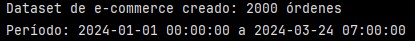
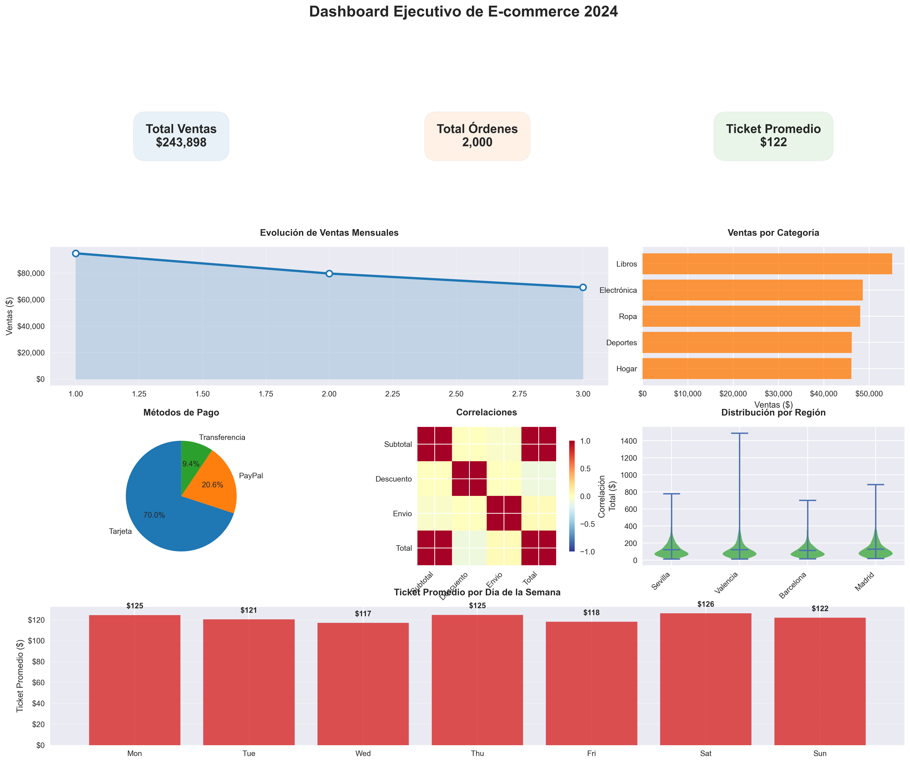

# Ejercicio: Construcción de dashboard analítico completo para análisis de e-commerce

>[!NOTE]
> GridSpec es un sistema de grillas flexible para organizar múltiples gráficos dentro de una misma figura. Permite:
> - combinar gráficos grandes y pequeños
> - controlar proporciones exactas
> - crear layouts tipo dashboard

## Configuración del entorno y dataset:

```python
import pandas as pd
import numpy as np
import matplotlib.pyplot as plt
import matplotlib as mpl
from matplotlib.gridspec import GridSpec

# Configuración profesional
plt.style.use('seaborn-v0_8')
mpl.rcParams.update({
    'font.size': 10,
    'figure.figsize': (16, 10),
    'savefig.dpi': 300,
    'savefig.bbox': 'tight'
})

# Paleta de colores
colores = ['#1f77b4', '#ff7f0e', '#2ca02c', '#d62728', '#9467bd', '#8c564b']

# Generar dataset de e-commerce avanzado
np.random.seed(42)
n_ordenes = 2000

df = pd.DataFrame({
    'fecha': pd.date_range('2024-01-01', periods=n_ordenes, freq='H'),
    'cliente_id': np.random.randint(1, 401, n_ordenes),
    'categoria': np.random.choice(['Electrónica', 'Ropa', 'Hogar', 'Libros', 'Deportes'], n_ordenes),
    'subtotal': np.round(np.random.lognormal(4.5, 0.8, n_ordenes), 2),
    'descuento': np.round(np.random.uniform(0, 0.3, n_ordenes), 2),
    'envio': np.round(np.random.uniform(5, 25, n_ordenes), 2),
    'region': np.random.choice(['Madrid', 'Barcelona', 'Valencia', 'Sevilla'], n_ordenes),
    'metodo_pago': np.random.choice(['Tarjeta', 'PayPal', 'Transferencia'], n_ordenes, p=[0.7, 0.2, 0.1])
})

# Calcular métricas
df['total'] = df['subtotal'] * (1 - df['descuento']) + df['envio']
df['mes'] = df['fecha'].dt.month
df['dia_semana'] = df['fecha'].dt.day_name()

print(f"Dataset de e-commerce creado: {len(df)} órdenes")
print(f"Período: {df['fecha'].min()} a {df['fecha'].max()}")
```

Este primer bloque configura el entorno. 
- Se importan las librerías para análisis de datos y visualización.
- Se define un estilo visual consistente con ``plt.style.use(...)`` y con ``mpl.rcParams.update(...)``. Esto implica la tipografía, tamaño de figuras, calidad de exportación.
- Se establece una paleta de colores fija. Esto permite mantener coherencia visual y facilita la lectura del dashboard.

Luego, se genera el dataset de e-commerce con 2000 órdenes. Se incluyen las siguientes variables:
- ``'fecha'``: a partir de ésta se calculan columnas derivadas, una para extraer el componente ``'mes'`` y otra para extraer el componente ``'dia_semana'``
- ``'cliente_id'``
- ``'categoria'``
- Ingresos:
    - ``'subtotal'``: precio base de los productos, antes de descuentos y envío.
    - ``'descuento'``: es un porcentade de descuento, expresado como decimal entre 0 y 1.
    - ``'envío'``: costo del envío.
    - Se crea una nueva columna llamada ``'total'`` que corresponde al monto final que paga el cliente por cada orden. Esto signigica que es el valor base del producto (``'subtotal'``) multiplicado por el porcentaje que efectivamente se paga (``1-df['descuento']``) más el valor del ``'envío'``.

Los precios se simulan con una distribución ``lognormal`` que simula precios reales. Además, se usan probalidades distintas para cada métodos de pago.




Finalmente, el Dataset creado contiene 2000 órdenes y abarca el período entre el 01 de Enero de 2024 a las 00:00 h hasta el 24 de Marzo de 2024 a las 07:00 h.


## Creación de dashboard comprehensivo con subplots:

```python
# Crear dashboard con GridSpec para layout flexible
fig = plt.figure(figsize=(20, 16))
gs = GridSpec(4, 6, figure=fig, hspace=0.3, wspace=0.3)

# Título principal
fig.suptitle('Dashboard Ejecutivo de E-commerce 2024', fontsize=20, fontweight='bold', y=0.95)

# 1. KPIs principales (superior)
ax_kpi1 = fig.add_subplot(gs[0, :2])
ax_kpi2 = fig.add_subplot(gs[0, 2:4])
ax_kpi3 = fig.add_subplot(gs[0, 4:])

# KPI 1: Total de ventas
total_ventas = df['total'].sum()
ax_kpi1.text(0.5, 0.5, f'Total Ventas\n${total_ventas:,.0f}', 
             ha='center', va='center', fontsize=16, fontweight='bold',
             bbox=dict(boxstyle='round,pad=1', facecolor=colores[0], alpha=0.1))
ax_kpi1.set_xlim(0, 1)
ax_kpi1.set_ylim(0, 1)
ax_kpi1.axis('off')

# KPI 2: Número de órdenes
num_ordenes = len(df)
ax_kpi2.text(0.5, 0.5, f'Total Órdenes\n{num_ordenes:,}', 
             ha='center', va='center', fontsize=16, fontweight='bold',
             bbox=dict(boxstyle='round,pad=1', facecolor=colores[1], alpha=0.1))
ax_kpi2.axis('off')

# KPI 3: Ticket promedio
ticket_promedio = df['total'].mean()
ax_kpi3.text(0.5, 0.5, f'Ticket Promedio\n${ticket_promedio:.0f}', 
             ha='center', va='center', fontsize=16, fontweight='bold',
             bbox=dict(boxstyle='round,pad=1', facecolor=colores[2], alpha=0.1))
ax_kpi3.axis('off')

# 2. Tendencia mensual (fila 1, columnas 0-3)
ax_trend = fig.add_subplot(gs[1, :4])
ventas_mes = df.groupby('mes')['total'].sum()
ax_trend.plot(ventas_mes.index, ventas_mes.values, 'o-', linewidth=3, 
              color=colores[0], markersize=8, markerfacecolor='white', markeredgewidth=2)
ax_trend.fill_between(ventas_mes.index, ventas_mes.values, alpha=0.2, color=colores[0])
ax_trend.set_title('Evolución de Ventas Mensuales', fontweight='bold', pad=15)
ax_trend.set_ylabel('Ventas ($)')
ax_trend.grid(True, alpha=0.3)
ax_trend.yaxis.set_major_formatter(mpl.ticker.StrMethodFormatter('${x:,.0f}'))

# 3. Distribución por categoría (fila 1, columnas 4-5)
ax_categoria = fig.add_subplot(gs[1, 4:])
ventas_cat = df.groupby('categoria')['total'].sum().sort_values(ascending=True)
bars = ax_categoria.barh(ventas_cat.index, ventas_cat.values, color=colores[1], alpha=0.8)
ax_categoria.set_title('Ventas por Categoría', fontweight='bold', pad=15)
ax_categoria.set_xlabel('Ventas ($)')
ax_categoria.xaxis.set_major_formatter(mpl.ticker.StrMethodFormatter('${x:,.0f}'))

# 4. Análisis de métodos de pago (fila 2, izquierda)
ax_pago = fig.add_subplot(gs[2, :2])
pago_counts = df['metodo_pago'].value_counts()
wedges, texts, autotexts = ax_pago.pie(pago_counts.values, labels=pago_counts.index, 
                                      autopct='%1.1f%%', colors=colores[:3], startangle=90)
ax_pago.set_title('Métodos de Pago', fontweight='bold', pad=15)

# 5. Heatmap de correlaciones (fila 2, centro)
ax_corr = fig.add_subplot(gs[2, 2:4])
numeric_cols = ['subtotal', 'descuento', 'envio', 'total']
corr_matrix = df[numeric_cols].corr()
im = ax_corr.imshow(corr_matrix, cmap='RdYlBu_r', vmin=-1, vmax=1)
ax_corr.set_xticks(np.arange(len(numeric_cols)))
ax_corr.set_yticks(np.arange(len(numeric_cols)))
ax_corr.set_xticklabels([col.title() for col in numeric_cols], rotation=45, ha='right')
ax_corr.set_yticklabels([col.title() for col in numeric_cols])
ax_corr.set_title('Correlaciones', fontweight='bold', pad=15)

# Barra de color para heatmap
cbar = fig.colorbar(im, ax=ax_corr, shrink=0.8)
cbar.set_label('Correlación')

# 6. Violin plot por región (fila 2, derecha)
ax_region = fig.add_subplot(gs[2, 4:])
region_data = [df[df['region'] == region]['total'] for region in df['region'].unique()]
vp = ax_region.violinplot(region_data, showmeans=True)
for pc in vp['bodies']:
    pc.set_facecolor(colores[2])
    pc.set_alpha(0.7)
ax_region.set_xticks(range(1, len(df['region'].unique()) + 1))
ax_region.set_xticklabels(df['region'].unique(), rotation=45, ha='right')
ax_region.set_title('Distribución por Región', fontweight='bold', pad=15)
ax_region.set_ylabel('Total ($)')

# 7. Análisis de días de la semana (fila 3, completa)
ax_dia = fig.add_subplot(gs[3, :])
orden_dias = ['Monday', 'Tuesday', 'Wednesday', 'Thursday', 'Friday', 'Saturday', 'Sunday']
ventas_dia = df.groupby('dia_semana')['total'].mean().reindex(orden_dias)
bars_dia = ax_dia.bar(range(len(ventas_dia)), ventas_dia.values, color=colores[3], alpha=0.8)
ax_dia.set_xticks(range(len(ventas_dia)))
ax_dia.set_xticklabels([dia[:3] for dia in orden_dias])
ax_dia.set_title('Ticket Promedio por Día de la Semana', fontweight='bold', pad=15)
ax_dia.set_ylabel('Ticket Promedio ($)')
ax_dia.yaxis.set_major_formatter(mpl.ticker.StrMethodFormatter('${x:,.0f}'))
ax_dia.grid(True, alpha=0.3, axis='y')

# Añadir valores encima de las barras
for bar, valor in zip(bars_dia, ventas_dia.values):
    height = bar.get_height()
    ax_dia.text(bar.get_x() + bar.get_width()/2., height + 5, 
               f'${valor:.0f}', ha='center', va='bottom', fontweight='bold')

plt.savefig('dashboard_ecommerce_completo.png', dpi=300, bbox_inches='tight')
print("\nDashboard comprehensivo guardado como 'dashboard_ecommerce_completo.png'")
```



**1. KPI's**

Se observan 3 KPI principales en la parte superior del dashboard:
- Total de Ventas ($243,898)
- Total de Órdenes (2,000)
- Ticket Promedio ($122)

>[!NOTE]
> El ticket promedio indica cuánto gasta en promedio cada cliente en un negocio durante una transacción o en un período determinado.


**2. Evolución de Ventas Mensuales**

Se observa una disminución en las ventas a los largo de los meses (desde Enero hasta Marzo.) Esto puede sugerir:

- Estacionalidad
- Pérdida de tracción
- Falta de campañas

¿Es necesario tomar acciones comerciales para revertir esta tendencia?

**3. Ventas por Categoría**

La categoría que más vende son los Libros, seguida por la Electrónica y la Ropa. Las categorías con menos ventas son Deportes y Hogar.

Dado que la categoría Libros concentra el mayor volumen de ventas, se podría recomendar mantener y optimizar campañas comerciales en esta línea, asegurando su rol como motor principal del negocio. Sin embargo, también se puede sugerir desarrollar estrategias complementarias para potenciar las categorías con menor desempeño, con el fin de reducir el riesgo de dependencia y diversificar las fuentes de ingreso.

**4. Métodos de Pago**

Se observa que el método predominante es la tarjeta (70%), seguido de Paypal (20,6%) y por último la transferencia, representado por un 9,4%.

Esto indica una alta dependencia al método de tarjeta. Quizás una buena oportunidad de optimizar costos financieros, es decir, reducir el peso relativo de los métodos más caros, sin afectar la experiencia del cliente. 

>[!NOTE]
> Esto considerando que los pagos con tarjeta, al pasar por intermediarios financieros, cobran comisión por transacción.

**5. Correlaciones**

Se observa una alta correlación positiva entre ``'subtotal'`` y ``'total'``, lo que es esperable ya que ``'total'`` depende directamente del ``'subtotal'``.

Para el caso de ``'descuento'`` y ``'total'`` se observa una correlación levemente negativa, lo que tiene sentido ya que a mayor descuento, menor total pagado. Esta correlación es débil, lo que sugiere que los descuentos no son extremos o no se aplican de forma sistemática sobre órdenes grandes.

``'envío'`` y ``'subtotal'`` también tienen correlaciones negativas débiles. Lo que indica que el costo del envío no aumenta proporcionalmente con el valor del carrito y que se comporta como un componente logístico relativamente estable.

**6. Distribución por Región**

Muesta la distribución completa del gasto de los clientes.

Se observa que todas tienen una mediana similar, pero con dispersiones muy diferentes, marcada hacia los extremos superiores de la distribución de precios (hacia los precios más altos). Esto sugiere que el cliente "típico" gasta parecido en todas las regiones. Valencia es la región con mayor dispersión, lo que indicaría que los clientes tienen comportamientos de compra muy distintos entre sí y/o la presencia de compras de alto valor. 

Esto podría posicionar a Valencia como una región atractiva para estrategias premium o de upselling.

**7. Ticket Promedio por Día de la Semana**

En cuanto al ticket promedio, se observa que no hay grandes diferencias entre los días de la semana, siendo los sábados los días con mayor ticket promedio ($126) y los miércoles los de menor ticket promedio ($117).

Esto puede indicar que el comportamiento de gasto es estable y que no hay días críticos que requieran intervención.


---

Verificación: Examina el dashboard generado e identifica cómo cada visualización contribuye a una comprensión integral del negocio: ¿Qué patrones emergen en las ventas? ¿Qué insights clave comunicarías a la dirección?

Requerimientos:
- Python con Pandas, NumPy, Matplotlib
- Opcional: Plotly para interactividad avanzada
- Jupyter Notebook para desarrollo iterativo