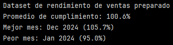
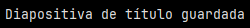
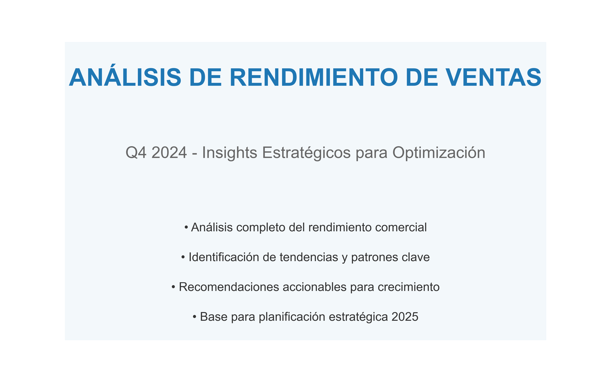
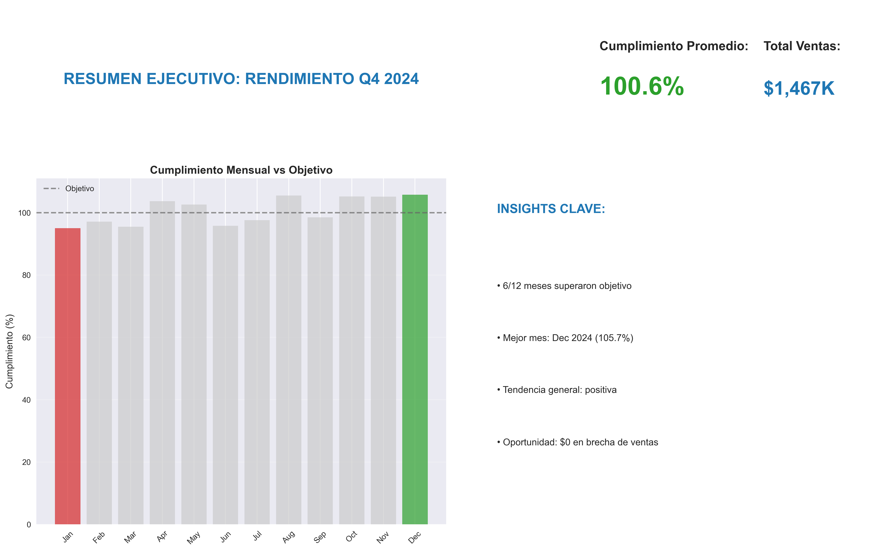
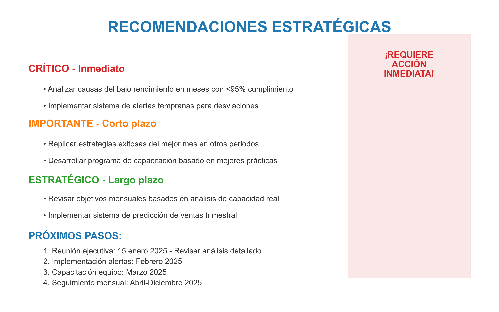

# Ejercicio: Creación de presentación analítica impactante sobre rendimiento de ventas

## Análisis de datos y preparación de insights clave:

```python
import pandas as pd
import numpy as np
import matplotlib.pyplot as plt
import matplotlib as mpl
from matplotlib.patches import Rectangle

# Configuración profesional para presentación
plt.style.use('seaborn-v0_8')
mpl.rcParams.update({
    'font.size': 14,
    'figure.titlesize': 20,
    'figure.figsize': (16, 10),
    'savefig.dpi': 300,
    'savefig.bbox': 'tight'
})

# Generar dataset de rendimiento de ventas
np.random.seed(42)
meses = pd.date_range('2024-01-01', periods=12, freq='M')

df = pd.DataFrame({
    'mes': meses,
    'ventas_objetivo': [100000, 105000, 110000, 108000, 115000, 120000, 
                       125000, 128000, 130000, 135000, 138000, 140000],
    'ventas_real': [95000, 102000, 105000, 112000, 118000, 115000,
                   122000, 135000, 128000, 142000, 145000, 148000],
    'margen_promedio': np.random.normal(0.25, 0.05, 12),
    'clientes_nuevos': np.random.randint(50, 150, 12),
    'satisfaccion': np.random.normal(4.2, 0.3, 12).clip(1, 5)
})

df['cumplimiento'] = (df['ventas_real'] / df['ventas_objetivo'] * 100).round(1)
df['mes_nombre'] = df['mes'].dt.strftime('%b %Y')

print("Dataset de rendimiento de ventas preparado")
print(f"Promedio de cumplimiento: {df['cumplimiento'].mean():.1f}%")
print(f"Mejor mes: {df.loc[df['cumplimiento'].idxmax(), 'mes_nombre']} ({df['cumplimiento'].max()}%)")
print(f"Peor mes: {df.loc[df['cumplimiento'].idxmin(), 'mes_nombre']} ({df['cumplimiento'].min()}%)")
```

Este primer bloque prepara el dataset base de 12 registros que luego se usará para el análisis e insights. 

- Configura la estétita de los gráficos
- Genera un dataset mensual de 2024 con las siguientes variables:
    - ``'ventas_objetivo'``
    - ``'ventas_reales'``
    - ``'margen_promedio'``
    - ``'clientes_nuevos'``
    - ``'satisfaccion'``
- Se calculan métricas clave:
    - ``'cumplimiento'``: corresponde al porcentaje de ventas reales respecto a las ventas objetivo.
- Se genera una nueva columna llamada ``'mes_nombre'`` que convierte la fecha (mes) en un texto legible.
    - ``.dt``: permite trabajar con componentes temporales
    - ``%b``: mes abreviado en inglés (``Jan``, ``Feb``, etc)
    - ``%Y``: año con 4 dígitos (``2024``)
- Se extraen insights rápidos:
    - Promedio de cumplimiento
    - Mejor Mes
    - Peor Mes

``df['cumplimiento'].idxmax()``: devuelve el índice (la posición de la fila), en la que obtiene el máximo porcentaje de cumplimiento del año.

``df.loc[ … , 'mes_nombre']``: usa ese índica para decir (fila donde el cumplimiento fue máximo ``.idxmax()``, ``columna mes_nombre``).

Luego estos datos se imprimen en pantalla junto con el valor de dicho máximo (o mínimo)

Esta misma lógina se realiza para calcular el Peor mes, pero en vez de máximo se busca el mínimo.



El promedio de cumplimiento es de 100,6%, el mejor mes fue Diciembre de 2024 con un cumplimiento del 105.7% y el peor mes fue Enero de 2024 con un 95.0%

Que el promedio sea 100,6% significa que las ventas reales superaron levemente los objetivos definidos. Por lo que en conjunto, el balance anual es positivo.

## Creación de diapositiva de título impactante:

```python
# Diapositiva 1: Título y contexto
fig, ax = plt.subplots(figsize=(16, 10))
ax.axis('off')

# Título principal
ax.text(0.5, 0.8, 'ANÁLISIS DE RENDIMIENTO DE VENTAS', 
        ha='center', va='center', fontsize=36, fontweight='bold', color='#1f77b4')

# Subtítulo
ax.text(0.5, 0.6, 'Q4 2024 - Insights Estratégicos para Optimización', 
        ha='center', va='center', fontsize=24, color='#666666')

# Contexto ejecutivo
contexto = """
• Análisis completo del rendimiento comercial
• Identificación de tendencias y patrones clave
• Recomendaciones accionables para crecimiento
• Base para planificación estratégica 2025
"""

y_pos = 0.4
for line in contexto.strip().split('\n'):
    ax.text(0.5, y_pos, line, ha='center', va='center', 
            fontsize=18, color='#333333')
    y_pos -= 0.08

# Elemento visual de fondo sutil
rect = Rectangle((0.1, 0.1), 0.8, 0.8, fill=True, alpha=0.05, color='#1f77b4')
ax.add_patch(rect)

plt.savefig('diapositiva_01_titulo.png', dpi=300, bbox_inches='tight')
print("Diapositiva de título guardada")
```

Este bloque crea una diapositiva de título y al final imprime el siguiente mensaje en pantalla.



#### Creación del "lienzo de la diapositiva

```python
fig, ax = plt.subplots(figsize=(16, 10))
ax.axis('off')
```
- ``fig``: la diapositiva completa
- ``ax``: el área donde se dibuja
- ``figsize=(16,10)``: proporción similar a una slide
- ``ax.axis('off')``: elimina:
    - ejes
    - ticks
    - grillas

#### Título principal
``ax.text(0.5, 0.8, 'ANÁLISIS DE RENDIMIENTO DE VENTAS', ...)``: es el título principal

- ``ax.text()``: coloca texto en coordenadas normalizadas
- ``(0.5, 0.8)``: 50% del ancho, 80% de la altura del eje
- ``ha='center'``, ``va='center'``: centra el texto
- ``fontsize=36`: tamaño fuente
- ``fontweith='bold'``: negrita
- ``color='#1f77b4'``: define el color (en este caso azul)

>[!NOTE]
> El ancho y la altura son del área del eje (ax). En matplotlib, cuando no hay ejes visibles, se trabaja en un sistema de coordanas normalizado de 0 a 1, relativo al área del eje.

#### Subtítulo

``ax.text(0.5, 0.6, 'Q4 2024 - Insights Estratégicos...', ...)``

- Acá el subtítulo es más pequeño (``'fontsize'=24``) y es de color gris(``color='#666666''``).


#### Contexto ejecutivo

Se define la variable ``contexto`` que contiene un texto para explicar el contexto ejecutivo a la audiencia.

Luego, esta variable se usa en una estructura de control:

```python
for line in contexto.strip().split('\n'):
    ax.text(...)
```
- Se divide el texto en lineas
- Se va dibujando una debajo de otra
- ``y_pos `` controla el espaciado vertical
    - ``y_pos=0.4`` define el punto de partida vertical donde comienza a dibujarse el bloque de texto, es decir, la primera línea del texto va a empezar al 40% de la altura de la diapositiva.
    - ``y_pos=-0.08``: en cada iteración del loop:
        - Se dibuja una línea en la posición actua ``y_pos``
        - Se baja un poco el valor de ``y_pos``
        - La siguiente línea aparece más abajo (baja 8% de la altura total del eje). Es el interlineado.

#### Elemento visual de fondo

```python
rect = Rectangle((0.1, 0.1), 0.8, 0.8, fill=True, alpha=0.05, color='#1f77b4')
ax.add_patch(rect)
```
Crea un rectángulo centrado, semitransparente del mismo color del título.
``ax.add_patch(rect)``: toma el objeto ``rect`` y lo inserta dentro de ``ax``.

>[!NOTE]
> Patch es una forma geométrica rellena o con borde. Todas deben agregarse con ``ax.add_patch(...)``.


#### Guardar la diapositiva

```python
plt.savefig('diapositiva_01_titulo.png', dpi=300, bbox_inches='tight')
```
Esto permite exportar la slide como imagen, define los dpi y ajusta el tamaño del archivo de salida para eliminar el espacio extra alrededor del gráfico, asegurando que todos los elementos esenciales queden dentro del "cuadro delimirador" final (``bbox_inches='tight'``).



## Diapositiva de insights principales con jerarquía visual:

```python
# Diapositiva 2: Insights principales
fig, ((ax_title, ax_kpi), (ax_chart, ax_insights)) = plt.subplots(2, 2, 
                                                                figsize=(16, 10),
                                                                gridspec_kw={'width_ratios': [1, 1], 'height_ratios': [0.3, 0.7]})

# Título de sección
ax_title.text(0.5, 0.5, 'RESUMEN EJECUTIVO: RENDIMIENTO Q4 2024', 
              ha='center', va='center', fontsize=20, fontweight='bold', color='#1f77b4')
ax_title.axis('off')

# KPIs principales (jerarquía alta)
ax_kpi.axis('off')
cumplimiento_promedio = df['cumplimiento'].mean()
color_kpi = '#2ca02c' if cumplimiento_promedio >= 100 else '#ff7f0e' if cumplimiento_promedio >= 95 else '#d62728'

ax_kpi.text(0.3, 0.7, f'Cumplimiento Promedio:', fontsize=16, fontweight='bold')
ax_kpi.text(0.3, 0.4, f'{cumplimiento_promedio:.1f}%', fontsize=32, fontweight='bold', color=color_kpi)

ax_kpi.text(0.7, 0.7, f'Total Ventas:', fontsize=16, fontweight='bold')
ax_kpi.text(0.7, 0.4, f'${df["ventas_real"].sum()/1000:,.0f}K', fontsize=24, fontweight='bold', color='#1f77b4')

# Gráfico principal con énfasis
bars = ax_chart.bar(range(len(df)), df['cumplimiento'], color='#cccccc', alpha=0.7)

# Resaltar mejor y peor mes
mejor_idx = df['cumplimiento'].idxmax()
peor_idx = df['cumplimiento'].idxmin()

bars[mejor_idx].set_color('#2ca02c')  # Verde para mejor
bars[peor_idx].set_color('#d62728')  # Rojo para peor

ax_chart.axhline(y=100, color='#666666', linestyle='--', alpha=0.7, label='Objetivo')
ax_chart.set_xticks(range(len(df)))
ax_chart.set_xticklabels(df['mes'].dt.strftime('%b'), rotation=45)
ax_chart.set_ylabel('Cumplimiento (%)', fontsize=12)
ax_chart.set_title('Cumplimiento Mensual vs Objetivo', fontsize=14, fontweight='bold')
ax_chart.legend()
ax_chart.grid(True, alpha=0.3, axis='y')

# Panel de insights clave (jerarquía alta)
ax_insights.axis('off')
ax_insights.text(0.05, 0.9, 'INSIGHTS CLAVE:', fontsize=16, fontweight='bold', color='#1f77b4')

insights = [
    f"• {len(df[df['cumplimiento'] >= 100])}/12 meses superaron objetivo",
    f"• Mejor mes: {df.loc[mejor_idx, 'mes_nombre']} ({df.loc[mejor_idx, 'cumplimiento']}%)",
    f"• Tendencia general: {'positiva' if df['cumplimiento'].iloc[-3:].mean() > df['cumplimiento'].iloc[:3].mean() else 'estable'}",
    f"• Oportunidad: ${df[df['cumplimiento'] < 95]['ventas_objetivo'].sum():,.0f} en brecha de ventas"
]

y_pos = 0.7
for insight in insights:
    ax_insights.text(0.05, y_pos, insight, fontsize=12, va='top')
    y_pos -= 0.15

plt.tight_layout()
plt.savefig('diapositiva_02_insights_principales.png', dpi=300, bbox_inches='tight')
print("Diapositiva de insights guardada")
```

Este bloque crea una diapisitiva con 4 áreas:
- Título ``ax_title (título)``
- KPIs en grande ``ax_kpi (KPIs)``
- Gráfico principal ``ax_chart (gráfico)``
- Panel de insights ``ax_insights (texto de insights)``

#### Layout

``plt.subplots(2,2)`` permite crear los 4 subplots.

``figsize=(16,10)`` al igual que la anteiror.

``height_ratios [0.3, 0.7]`` indica que la fila superior ocupa 30% del alto (título + KPIs), la inferior 70%.

#### Título

``ax_title.text(...)`` este subplot es como una caja de texto.
``ax_title.axis('off')`` se desactivan los ejes porque no hay datos.

#### KPIs

1. KPI 1: Cumplimiento promedio

```python
cumplimiento_promedio = df['cumplimiento'].mean()
color_kpi = '#2ca02c' if cumplimiento_promedio >= 100 else '#ff7f0e' if cumplimiento_promedio >= 95 else '#d62728'
```

Esto define el color según el umbral:
- 🟢 Verde si >= 100 (cumple o supera)
- 🟠 Naranjo si 95–99.9 (cerca)
- 🔴 Rojo si < 95 (riesgo)

2. KPI 2: Total de ventas

Suma todas las ventas reales del año, las divide por 1000 para mostrar "miles" con "K".

#### Gráfico principal

```python
bars = ax_chart.bar(range(len(df)), df['cumplimiento'], color='#cccccc', alpha=0.7)
```

- Se grafica un gráfico de barras de cumplimiento junto con la línea objetivo.
- Cada barra representa un mes.
- Todas las barras parten grises (neutral) para que destaquen excepciones.

```python
mejor_idx = df['cumplimiento'].idxmax()
peor_idx = df['cumplimiento'].idxmin()

bars[mejor_idx].set_color('#2ca02c')  # Verde para mejor
bars[peor_idx].set_color('#d62728')  # Rojo para peor
```

Las primeras dos líneas sirven para dar la posición del mes en que se encuentra el mejor y peor mes.

Las últimas dos líneas sirven para setear los colores.

``ax_chart.axhline(y=100, linestyle='--', label='Objetivo')``: define la línea objetivo. La línea punteada es la referencia de cumplimiento.

``ax_chart.set_xticklabels(df['mes'].dt.strftime('%b'), rotation=45)``: en el eje X los meses se ponen abreviados (Jan, Feb, etc) y con una rotación de 45°.

``ax_chart.grid(True, alpha=0.3, axis='y')``: las chart.grid son las líneas del fondo, al estar como ``True`` las activa.

#### Panel de Insights

Se hace una lista con los insights para que pueda ser recorrida por la estructura de control ``for`` más adelante.

- Insight 1: ``len(df[df['cumplimiento'] >= 100])`` cuántos meses susperaron el objetivo
- Insight 2: mejor mes (de la misma forma que se presentó en el output del bloque anterior)
- Insight 3: ``df['cumplimiento'].iloc[-3:].mean() > df['cumplimiento'].iloc[:3].mean()`` promedio de los últimos 3 meses vs los primeros 3 meses. Si los último son mejores, significa una tendencia "positiva", si no es "estable".
- Insight 4: ``df[df['cumplimiento'] < 95]['ventas_objetivo'].sum()`` se suamn los objetivos de meses bajo 95% para estimar un gap de desempeño. Representa la oportunidad de brecha de ventas.

#### Guardado y ajuste final


``plt.tight_layout()``: evita que cosas se monten.
``plt.savefig(...)``: guarda y exporta la slide.





## Diapositiva de recomendaciones con llamado a acción:

```python
# Diapositiva 3: Recomendaciones y acción
fig, ax = plt.subplots(figsize=(16, 10))
ax.axis('off')

# Título de recomendaciones
ax.text(0.5, 0.92, 'RECOMENDACIONES ESTRATÉGICAS',
        ha='center', va='center', fontsize=28, fontweight='bold', color='#1f77b4')

# Recomendaciones priorizadas
recomendaciones = [
    ("CRÍTICO - Inmediato", "#d62728", [
        "• Analizar causas del bajo rendimiento en meses con <95% cumplimiento",
        "• Implementar sistema de alertas tempranas para desviaciones"
    ]),
    ("IMPORTANTE - Corto plazo", "#ff7f0e", [
        "• Replicar estrategias exitosas del mejor mes en otros periodos",
        "• Desarrollar programa de capacitación basado en mejores prácticas"
    ]),
    ("ESTRATÉGICO - Largo plazo", "#2ca02c", [
        "• Revisar objetivos mensuales basados en análisis de capacidad real",
        "• Implementar sistema de predicción de ventas trimestral"
    ])
]

# --- Ajustes de espaciado (para evitar amontonamiento) ---
y_start = 0.80          # punto de inicio del primer bloque
block_gap = 0.18        # distancia entre títulos de cada bloque (más compacto pero sin chocar)
item_offset = 0.07      # distancia desde el título del bloque al primer ítem
item_gap = 0.055        # interlineado entre ítems

for prioridad, color, items in recomendaciones:
    # Encabezado de prioridad
    ax.text(0.05, y_start, prioridad,
            fontsize=18, fontweight='bold', color=color, va='top')

    # Items de la recomendación
    y_item = y_start - item_offset
    for item in items:
        ax.text(0.08, y_item, item, fontsize=14, va='top', color='#333333')
        y_item -= item_gap

    y_start -= block_gap

# --- Próximos pasos (zona inferior reservada, compacta y sin choque) ---
ax.text(0.05, 0.25, 'PRÓXIMOS PASOS:',
        fontsize=18, fontweight='bold', color='#1f77b4', va='top')

proximos_pasos = [
    "1. Reunión ejecutiva: 15 enero 2025 - Revisar análisis detallado",
    "2. Implementación alertas: Febrero 2025",
    "3. Capacitación equipo: Marzo 2025",
    "4. Seguimiento mensual: Abril-Diciembre 2025"
]

# Compactación real: arranca justo debajo del título y baja poco por línea
y0 = 0.198      # primera línea (debajo del título)
y_step = 0.035  # interlineado compacto (clave para que no se vea “gigante”)

for i, paso in enumerate(proximos_pasos):
    ax.text(0.08, y0 - i * y_step, paso, fontsize=14, va='top', color='#333333')

# Elemento visual de urgencia (se mantiene igual)
rect = Rectangle((0.7, 0.1), 0.25, 0.8, fill=True, alpha=0.1, color='#d62728')
ax.add_patch(rect)
ax.text(0.825, 0.8, '¡REQUIERE\nACCIÓN\nINMEDIATA!',
        ha='center', va='center', fontsize=16, fontweight='bold', color='#d62728')
```
Este bloque crea una slide de recomendaciones:
- Dibuja 3 bloques de prioridad (CRÍTICO/IMPORTANTE/ESTRATÉGICO)
- Dibuja "PRÓXIMOS PASOS" como una lista numerada en la parte inferior.
- Agrega un rectángulo rojo semitransparente a la derecha con un subtítulo de "¡REQUIERE ACCIÓN INMEDIATA! como llamado a la acción.
- Guarda y exporta la imagen.

Para esto se creó una lista con las recomendaciones y una lista de próximos pasos para ser usadas en estructuras de control ``for`` más adelante.




En conjunto, las diapositivas presentan una jerarquía visual clara que guía eficazmente la atención del espectador. La primera diapositiva establece el contexto y el propósito del análisis, permitiendo comprender rápidamente el problema y su relevancia. La segunda concentra la información crítica mediante KPIs destacados y un gráfico principal que respalda visualmente los insights, facilitando la interpretación del desempeño y sus variaciones. La narrativa fluye de manera lógica desde el análisis del rendimiento hacia la toma de decisiones, culminando en la tercera diapositiva con recomendaciones priorizadas y próximos pasos. Esto convierte el análisis en una herramienta efectiva para apoyar la toma de decisiones estratégicas.


--- 
Verificación: Evalúa cómo cada diapositiva guía la atención del espectador: ¿La jerarquía visual comunica claramente qué es más importante? ¿La narrativa fluye lógicamente del problema a la acción? ¿Los insights están respaldados por datos visuales persuasivos?

Requerimientos:
Python con Pandas, NumPy, Matplotlib
Entorno de presentación (PowerPoint, Google Slides) para combinar visualizaciones
Conocimientos básicos de diseño visual y narrativa