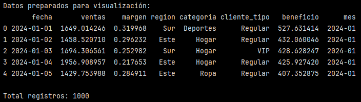
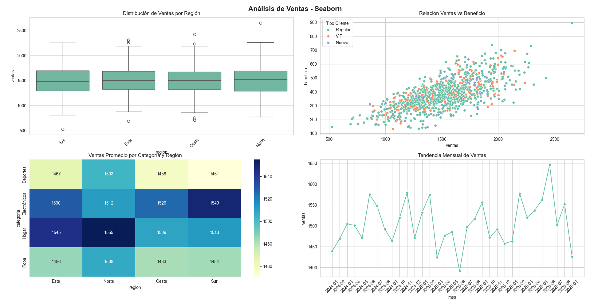
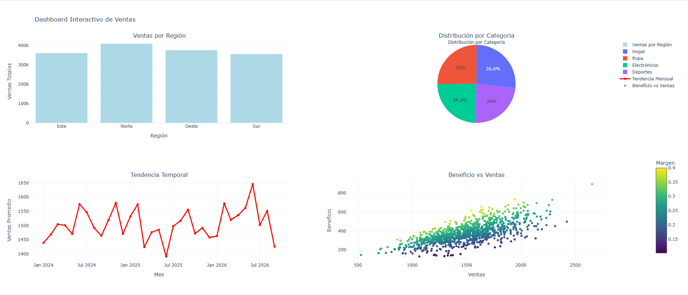
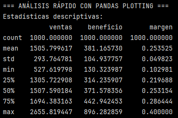
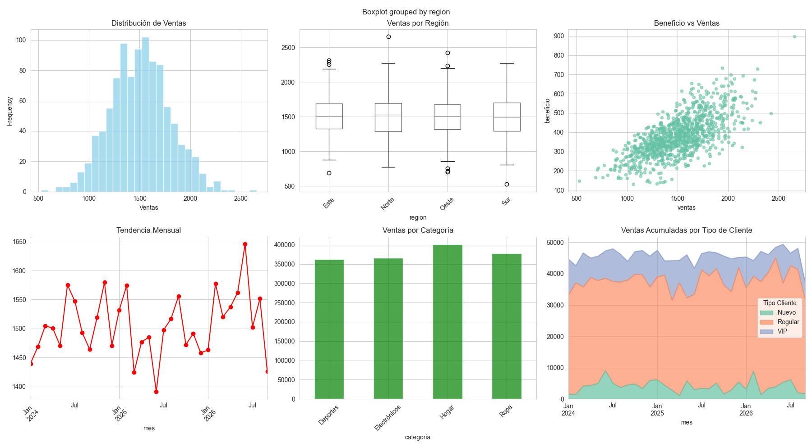

# Ejercicio: Comparación de herramientas para análisis de ventas


## Preparar datos de ejemplo:

```python
import pandas as pd
import numpy as np
import matplotlib.pyplot as plt
import seaborn as sns
import plotly.express as px
from plotly.subplots import make_subplots
import plotly.graph_objects as go

# Configuración de visualización
pd.set_option('display.max_columns', None) # para mostrar todas las columnas en un DataFrame
pd.set_option('display.width', None)# Ancho completo

# Configurar estilo
plt.style.use('default')
sns.set_palette("husl")

# Generar datos de ventas
np.random.seed(42)
n_registros = 1000

ventas_data = pd.DataFrame({
    'fecha': pd.date_range('2024-01-01', periods=n_registros, freq='D'),
    'ventas': np.random.normal(1500, 300, n_registros).clip(min=0),
    'margen': np.random.normal(0.25, 0.05, n_registros).clip(0.1, 0.4),
    'region': np.random.choice(['Norte', 'Sur', 'Este', 'Oeste'], n_registros),
    'categoria': np.random.choice(['Electrónicos', 'Ropa', 'Hogar', 'Deportes'], n_registros),
    'cliente_tipo': np.random.choice(['Regular', 'VIP', 'Nuevo'], n_registros,
                                   p=[0.7, 0.2, 0.1])
})

# Calcular métricas derivadas
ventas_data['beneficio'] = ventas_data['ventas'] * ventas_data['margen']
ventas_data['mes'] = ventas_data['fecha'].dt.to_period('M')

print("Datos preparados para visualización:")
print(ventas_data.head())
print(f"\nTotal registros: {len(ventas_data)}")
```



Se creó un dataset con un total de 1000 registros de ventas.
Se tienen las siguientes columnas:
- ``'fecha'``
- ``'ventas'``
- ``'margen'``
- ``'region'``
- ``'categoria'``
- ``'beneficio'``: métrica derivada, corresponde al valor de las ventas multiplicado por el margen.
- ``'mes'``: métrica deriva, se extrae el componente temporal que incluye año y mes.

En la imagen se observan las primeras 5 filas del dataset.

## Comparación con Seaborn - Visualización estadística elegante:

```python
# Configurar Seaborn
sns.set_style("whitegrid")
sns.set_palette("Set2")

# Crear figura con múltiples subplots
fig, axes = plt.subplots(2, 2, figsize=(15, 12))
fig.suptitle('Análisis de Ventas - Seaborn', fontsize=16, fontweight='bold')

# 1. Distribución de ventas por región
sns.boxplot(data=ventas_data, x='region', y='ventas', ax=axes[0,0])
axes[0,0].set_title('Distribución de Ventas por Región')
axes[0,0].tick_params(axis='x', rotation=45)

# 2. Relación ventas vs beneficio
sns.scatterplot(data=ventas_data, x='ventas', y='beneficio',
                hue='cliente_tipo', ax=axes[0,1])
axes[0,1].set_title('Relación Ventas vs Beneficio')
axes[0,1].legend(title='Tipo Cliente')

# 3. Ventas promedio por categoría y región
pivot_data = ventas_data.pivot_table(
    values='ventas', index='categoria', columns='region', aggfunc='mean'
)
sns.heatmap(pivot_data, annot=True, fmt='.0f', cmap='YlGnBu', ax=axes[1,0])
axes[1,0].set_title('Ventas Promedio por Categoría y Región')

# 4. Tendencia mensual de ventas
ventas_mensuales = ventas_data.groupby('mes')['ventas'].mean().reset_index()
ventas_mensuales['mes'] = ventas_mensuales['mes'].astype(str)
sns.lineplot(data=ventas_mensuales, x='mes', y='ventas', marker='o', ax=axes[1,1])
axes[1,1].set_title('Tendencia Mensual de Ventas')
axes[1,1].tick_params(axis='x', rotation=45)

plt.tight_layout()
plt.show()

print("✅ Visualización con Seaborn completada")
```

>[!WARNING]
> En entornos interactivos, plt.show() bloquea la ejecución del script mientras la figura no se "cierra". Como no hay un evento de cierre real el kernel queda "esperando" y por eso al ejecutar TODO el script, solo se ve la primera figura y el ``print("✅ Visualización con Seaborn completada")`` no se ejecuta hasta que se cierre la 'Figure_1' y así puede seguir ejecutándose el resto del script.


Este bloque usa Seaborn (sobre Matplotlib) para crear un panel analítico estático con cuatro vistas complementarias del desempeño de ventas.



#### Distribución de Ventas por región (Boxplot):

- Se observa una mediana similar, siendo levemente mayor en el caso de la región Norte.
- Se identifican rangos similares para las 4 regiones.
- Se observan valores outliers en todas las regiones:
    - Sur, Este y Oeste: outliers asiciados a ventas inusualmente bajas.
    - Este, Oeste y Norte: outliers asociados a ventas de alto valor.

#### Relación Ventas vs Beneficio (Scatter)

- El gráfico scatter muestra una relación positiva entre ventas y beneficios. A medida que aumentan las ventas, el beneficio tiende a incrementar.
- La paleta de colores permite identificar al tipo de cliente (Regular, VIP y Nuevo), evidenciando que el tipo de cliente predominante es el cliente Regular.

#### Ventas Promedio por Categoría y Región (heatmap)

- Muestra las ventas promedio por cada categoría y región.
- Se observa que la categoría más vendida es Hogar, tanto para la región Norte como la para región Este. En el caso ede la región Oeste y Sur, la categoría máss vendida es la de Electrónicos. Esta última categoría también es altamente vendida en la región Este.
- La categoría Electrónicos presenta consistentemente valores promedio altos en todas las regiones.
- Las categorías Ropa y Deportes muestran promedios más bajos y homogéneos en las distintas regiones.
- La región Norte presenta ventas promedio más altas en la mayoría de las categorías, lo que se refleja en una coloración más intensa (hacia azules más oscuros). Esto podría sugerir que la región Norte tiene un desempeño superior.


#### Tendencia mensual de ventas (lineplot)

- Muestra la evolución temporal del promedio de ventas por mes.
- Permite observar tendencias, fluctuaciones y posibles estacionalidades.
- En este caso se observan fluctiaciones mes a mes, sin embargo sin cambios abruptos sostenidos en el tiempo.
- No se identifica una estacionalidad marcada, aunque algunos meses presentan picos y caídas puntuales.
- Se observa que el mínimo de ventas ocurrió en Junio de 2025 y el máximo en Junio de 2026.


## Comparación con Plotly - Interactividad web:

```python
# Crear dashboard interactivo con Plotly
fig = make_subplots(
    rows=2, cols=2,
    subplot_titles=('Ventas por Región', 'Distribución por Categoría',
                   'Tendencia Temporal', 'Beneficio vs Ventas'),
    specs=[[{'type': 'bar'}, {'type': 'pie'}],
           [{'type': 'scatter'}, {'type': 'scatter'}]]
)

# 1. Ventas por región (barra interactiva)
ventas_region = ventas_data.groupby('region')['ventas'].sum().reset_index()
fig.add_trace(
    go.Bar(x=ventas_region['region'], y=ventas_region['ventas'],
           name='Ventas por Región', marker_color='lightblue'),
    row=1, col=1
)

# 2. Distribución por categoría (pie interactivo)
ventas_categoria = ventas_data.groupby('categoria')['ventas'].sum().reset_index()
fig.add_trace(
    go.Pie(labels=ventas_categoria['categoria'], values=ventas_categoria['ventas'],
           name='Por Categoría', title='Distribución por Categoría'),
    row=1, col=2
)

# 3. Tendencia temporal (línea interactiva)
ventas_tiempo = ventas_data.groupby('mes')['ventas'].mean().reset_index()
ventas_tiempo['mes'] = ventas_tiempo['mes'].astype(str)
fig.add_trace(
    go.Scatter(x=ventas_tiempo['mes'], y=ventas_tiempo['ventas'],
              mode='lines+markers', name='Tendencia Mensual',
              line=dict(color='red', width=3)),
    row=2, col=1
)

# 4. Beneficio vs Ventas (scatter interactivo)
'''
Esta parte se modificó para que la barra de color del scatter no interfiriera con las leyendas de los otros gráficos (ver Figure_3 no corregida)
'''

fig.add_trace(
    go.Scatter(
        x=ventas_data['ventas'],
        y=ventas_data['beneficio'],
        mode='markers',
        name='Beneficio vs Ventas',
        marker=dict(
            color=ventas_data['margen'],
            colorscale='Viridis',
            showscale=True,
            colorbar=dict(
                title="Margen",
                x=1.08,   # desplaza la barra hacia la derecha
                y=0.25,   # la baja para que no choque con el pie
                len=0.45  # reduce su altura
            )
        ),
        text=ventas_data['categoria']
    ),
    row=2, col=2
)

# Configurar ejes
fig.update_xaxes(title_text="Región", row=1, col=1)
fig.update_yaxes(title_text="Ventas Totales", row=1, col=1)

fig.update_xaxes(title_text="Mes", row=2, col=1)
fig.update_yaxes(title_text="Ventas Promedio", row=2, col=1)

fig.update_xaxes(title_text="Ventas", row=2, col=2)
fig.update_yaxes(title_text="Beneficio", row=2, col=2)

fig.show()

print("✅ Dashboard interactivo con Plotly completado")
```
Este bloque crea un dashboard 2x2 interactivo en formato web usando plotly graph_objects + make_subplots, con 4 gráficos que resumen las ventas desde ángulos distintos.




🎥 **Demostración del dashboard interactivo Plotly:** 

[](youtube.com/watch?v=94j1Mp5EMic&feature=youtu.be)

#### Ventas por Región (barras):

- Agrupa los datos por región y suma las ventas.
- Se observa que la región Norte presenta el mayor número de ventas totales.
- El resto de regiones presenta volúmenes bastante similares.
- Al ser un gráfico interactivo, al posar el mouse sobre cada barra, aparece el nombre de la región junto con el valor exacto de las ventas totales.

#### Distribución por Categoría (pie chart):

- Agrupa por categoría y suma las ventas.
- Se observa el porcentaje que representa cada categoría en el total de ventas.
- Las proporciones son bastante parejas entre las categorías, siendo Hogar muy levemente mayor.

#### Tendencia temporal

- Se agrupa por mes y calcula el promedio de ventas mensual. En esencia es el mismo gráfico que en la sección anterior, pero en este caso el eje X tiene etiquetado solo 6 meses y al ser un gráfico interactivo al posarse sobre cada punto aparece la fecha y el monto respectivo.

#### Beneficio vs Ventas (scatter plot)

- Eje X corresponde a Ventas y el Eje Y a Beneficios (también es el mismo gráfico que en la sección anterior) solo que los colores representan otra cosa.

>[!NOTE]
> En el caso anterior el color representaba el tipo de cliente.

- En este caso, el color de cada punto representa el margen y al costado derecho se muestra una barra de color que va de 0.1 a 0.4.
- Al ser un gráfico interactivo, al posarse sobre cada punto, se muestra la coordenada (venta,beneficio) y además la categoría a la que pertenece.

Este tipo de  bisualizaciones interactivas permiten:

- Pasar el mouse y ver valores exactos (tooltips)
- Hacer zoom, pan (desplazarse por el gráfico una vez que se hace zoom) y reset (restaurar el gráfico a su vista original).
- Ocultar/mostrar series desde la leyenda.

>[!NOTE]
> Los Tooltips son cuadros de información emergente que aparecen cuando se pasa el mouse sobre un punto, barra o sección del gráfico. Muestran valores exactos (por ejemplo: ventas, beneficio, margen) e información adicional (categoría, región, fecha).


## Comparación con Pandas plotting - Análisis rápido:

```python
# Análisis rápido con pandas plotting
print("=== ANÁLISIS RÁPIDO CON PANDAS PLOTTING ===")

# Estadísticas básicas
print("Estadísticas descriptivas:")
print(ventas_data[['ventas', 'beneficio', 'margen']].describe())

# Crear figura con subplots
fig, axes = plt.subplots(2, 3, figsize=(18, 10))
fig.suptitle('Análisis Exploratorio Rápido - Pandas Plotting', fontsize=16)

# 1. Histograma de ventas
ventas_data['ventas'].plot.hist(bins=30, ax=axes[0,0], color='skyblue', alpha=0.7)
axes[0,0].set_title('Distribución de Ventas')
axes[0,0].set_xlabel('Ventas')

# 2. Box plot por región
ventas_data.boxplot(column='ventas', by='region', ax=axes[0,1])
axes[0,1].set_title('Ventas por Región')
axes[0,1].tick_params(axis='x', rotation=45)

# 3. Scatter plot beneficio vs ventas
ventas_data.plot.scatter(x='ventas', y='beneficio', ax=axes[0,2], alpha=0.6)
axes[0,2].set_title('Beneficio vs Ventas')

# 4. Línea de tendencia mensual
ventas_mensual = ventas_data.groupby('mes')['ventas'].mean()
ventas_mensual.plot(ax=axes[1,0], marker='o', color='red')
axes[1,0].set_title('Tendencia Mensual')
axes[1,0].tick_params(axis='x', rotation=45)

# 5. Barras por categoría
ventas_categoria = ventas_data.groupby('categoria')['ventas'].sum()
ventas_categoria.plot.bar(ax=axes[1,1], color='green', alpha=0.7)
axes[1,1].set_title('Ventas por Categoría')
axes[1,1].tick_params(axis='x', rotation=45)

# 6. Área acumulada por tipo de cliente
ventas_cliente = ventas_data.groupby(['mes', 'cliente_tipo'])['ventas'].sum().unstack()
ventas_cliente.plot.area(ax=axes[1,2], alpha=0.7)
axes[1,2].set_title('Ventas Acumuladas por Tipo de Cliente')
axes[1,2].legend(title='Tipo Cliente')

plt.tight_layout()
plt.show()

print("✅ Análisis exploratorio con Pandas plotting completado")
```

Este bloque utiliza Pandas Plotting para realizar un análisis exploratorio rápido, combinando estadísticas descriptivas y visualizaciones básicas generadas directamente desde el DataFrame. 



- Las ventas presentan un valor promedio cercano a 1500 con una desviación estándar de aproximadamente 294, lo que indicaría una variabilidad controlada.
- El beneficio promedio se sitúa en torno a los 380, manteniendo una dispersión estándar de aproximadamente 105.
- El margen muestra una media cerca a 0.25, con un rango acotado entre 0.1 y 0.4.
- La diferencia entre los percentiles 25, 50 y 75 y entre la media y la mediana sugieren una distribución equilibrada, sin asimetrías extremas para estas 3 variables.




#### Distribución de Ventas (Histograma):

- Se observa una distribución aproximadamente normal, centrada entorno a los valores medios, con presencia de algunos valores extremos en ambos extremos.

#### Ventas por Región (Boxplot):

- Es el mismo gráfico de la [Figure_1](02.Analisis_de_datos_y_estadistica/S2_Visualizacion_de_datos/D5-Herramientas-alternativas/IMG-P5/Figure_1.png).
- Las medianas son similares entre regiones y se observan outliers tanto en ventas bajas como altas.

#### Tendencia mensual (Lineplot):

- También es el mismo gráfico de las secciones anteriores, solo que el Eje X está etiquetado de otra forma.

#### Ventas por categoría (Barras):

- En este caso se agrupa por categoría y se suman las ventas.
- Indica diferencias en el volumen total, destacando la categoría Hogar con la mayor contribución al total de ventas. 
- Las otras categorías presentan volúmenes similares.


#### Ventas acumuladas por tipo de Cliente (gráfico de área acumulada)

- Agrupa por mes y tipo de cliente y suma las ventas.
- Se observa que los clientes Regulares (naranjo) concentran la mayor parte de las ventas, seguidos por VIP (azul), mientras que los clientes Nuevos (verde)tienen una contribución menor y más variable.
- Se muestra la evolución de un total (las ventas) a lo largo del tiempo.

>[!NOTE]
> - El valor total en cada mes es la suma de todas las áreas visibles.
> - Cada franja de color indica cuánto aporta cada tipo de cliente a ese total.
> - El grosor del área de cada color muestra su peso relativo en el total.
> - Cada grupo se suma al anterior.

## Reflexión final de la Comparación 

**¿Cuándo elegirías Seaborn vs Plotly vs Pandas plotting para un proyecto específico?**

Seaborn:

Elegiría Seaborn cuando el objetivo es realizar análisis exploratorio detallado y generar visualizaciones estadísticas claras y bien estilizadas, especialmente para informes o trabajos académicos. Es ideal cuando se necesita comparar distribuciones, relaciones y patrones de forma precisa, pero no se requiere interactividad, ya que produce gráficos estáticos.

Plotly:

Elegiría Plotly cuando el proyecto requiere interactividad, exploración dinámica de datos o presentación de resultados a usuarios no técnicos. Es especialmente útil para dashboards, presentaciones web y análisis donde el usuario necesita filtrar, explorar o profundizar en los datos directamente desde el gráfico.

Pandas Plotting

Elegiría Pandas Plotting para análisis rápidos y exploratorios, validaciones iniciales de datos. Es ideal en las primeras etapas del análisis, aunque ofrece menor control estético y es estático.


**¿Qué factores considerar al seleccionar una herramienta de visualización (complejidad, interactividad, rendimiento, facilidad de uso)?**

La elección de la herramienta de visualización depende del equilibrio entre rapidez, profundidad analítica e interactividad requerida, siendo Pandas Plotting ideal para exploración rápida, Seaborn para análisis estadístico detallado y Plotly para comunicación interactiva de resultados.

Factores a considerar:

En cuanto a complejidad del análisis:
- Bajo: Pandas Plotting
- Medio: Seaborn
- Alta: Plotly

Nivel de interactividad requerido:
- Ninguna: Pandas Plotting / Seaborn
- Alta: Plotly

Rendimiento:
- Pandas Plotting y Seaborn son más livianos para datasets pequeños a medianos.
- Plotly puede ser más pesado.

Facilidad de uso:
- Más simple: Pandas Plotting (no requiere importar otras librerías).
- Intermedia: Seaborn.
- Más compleja: Plotly.

Audiencia objetivo:
- Analistas/académicos: Seaborn
- Ejecutivos/Stakeholders: Plotly
- Uso interno/Exploración personal: Pandas Plotting


---

Verificación: ¿Cuándo elegirías Seaborn vs Plotly vs Pandas plotting para un proyecto específico? ¿Qué factores considerar al seleccionar una herramienta de visualización (complejidad, interactividad, rendimiento, facilidad de uso)?

Requerimientos:
- Seaborn para visualizaciones estadísticas
- Plotly para gráficos interactivos
- Pandas con matplotlib backend
- Jupyter para exploración interactiva