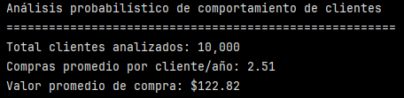
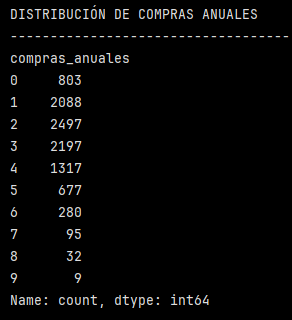
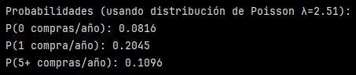
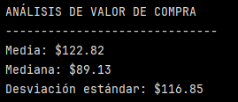
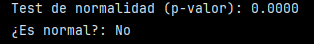
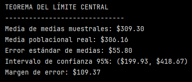
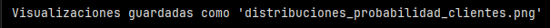
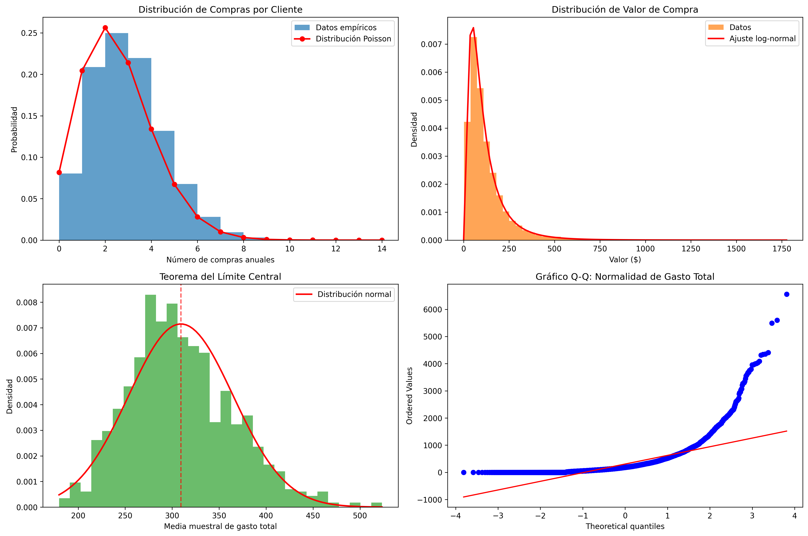

# Ejercicio: Análisis probabilístico de comportamiento de clientes en e-commerce

## Análisis de distribución de compras por cliente:

```python
import pandas as pd
import numpy as np
import matplotlib.pyplot as plt
from scipy import stats

# Generar dataset de comportamiento de clientes
np.random.seed(42)
n_clientes = 10000

# Simular compras por cliente (distribución Poisson)
compras_por_cliente = np.random.poisson(lam=2.5, size=n_clientes)

# Simular valor de compra (distribución log-normal)
valor_compra = np.random.lognormal(mean=4.5, sigma=0.8, size=n_clientes)

# Crear DataFrame
df = pd.DataFrame({
    'cliente_id': range(1, n_clientes + 1),
    'compras_anuales': compras_por_cliente,
    'valor_promedio_compra': valor_compra,
    'gasto_total_anual': compras_por_cliente * valor_compra
})

print("Análisis probabilístico de comportamiento de clientes")
print("=" * 55)
print(f"Total clientes analizados: {len(df):,}")
print(f"Compras promedio por cliente/año: {df['compras_anuales'].mean():.2f}")
print(f"Valor promedio de compra: ${df['valor_promedio_compra'].mean():.2f}")
```

Este bloque simula una base de 10000 clientes. Simula también las ``compras_por_cliente`` con una distribución de Poisson.



Este tipo de distribuciones es ideal para contar eventos discretos, en un periodo fijo y cuando los ventos ocurren de forma independiente.

También se simuló el valor de compra con un a distribución log-normal. Este tipo de distribución es asimétrica, tiene una cola derecha larga y sirve para modelar precios, ingresos y gastos.

>[!IMPORTANT]
> ``mean`` y ``sigma`` están en escala logarítmica. No son el promedio directo en la moneda utilizada.

Finalmente, se genera un DataFrame con 4 columnas:
- ``'cliente_id'``
- ``'compras_anuales'``
- ``'valor_promedio_compra'``
- ``'gasto_total_anual'``: corresponde a la multiplicación de ``'compras_por_cliente'`` por ``'valor_compra'``.


## Análisis de distribuciones y probabilidades:

```python
# Análisis de distribución de compras
print("\nDISTRIBUCIÓN DE COMPRAS ANUALES")
print("-" * 35)
print(df['compras_anuales'].value_counts().sort_index().head(10))

# Probabilidades usando distribución de Poisson
lambda_compras = df['compras_anuales'].mean()

print(f"\nProbabilidades (usando distribución de Poisson λ={lambda_compras:.2f}):")
print(f"P(0 compras/año): {stats.poisson.pmf(0, lambda_compras):.4f}")
print(f"P(1 compra/año): {stats.poisson.pmf(1, lambda_compras):.4f}")
print(f"P(5+ compras/año): {1 - stats.poisson.cdf(4, lambda_compras):.4f}")

# Análisis de valor de compra
print(f"\nANÁLISIS DE VALOR DE COMPRA")
print("-" * 30)
print(f"Media: ${df['valor_promedio_compra'].mean():.2f}")
print(f"Mediana: ${df['valor_promedio_compra'].median():.2f}")
print(f"Desviación estándar: ${df['valor_promedio_compra'].std():.2f}")

# Test de normalidad para valor de compra
_, p_valor = stats.normaltest(df['valor_promedio_compra'])
print(f"Test de normalidad (p-valor): {p_valor:.4f}")
print(f"¿Es normal?: {'No' if p_valor < 0.05 else 'Sí'}")
```

Este bloque responde a dos preguntas claves:
- ¿Cómo se distribuye el número de compras por cliente?
- ¿Cómo se comporta el valor de compra y qué tipo de distribución sigue?

1. Compras anuales

``print(df['compras_anuales'].value_counts().sort_index().head(10))`` muestra en pantalla el número de compras anuales, cuántos clientes tienen 0, 1, 2... compras. Esto se hace con ``value_counts()``. ``sort_index`` ordena por número de compras y ``.head(10)`` muestra los primeros 10 valores.




Se observa que la mayor concentración está entre 1 y 3 compras por año.
Hay una cola decreciente hacia compras altas (esto es esperable de una distribución de Poisson).

Luego se calcularon probabilidades de compra. Se usó el lambda del dataset (2.51).

>[!NOTE]
> El parámetro λ se utiliza como entrada en la distribución de Poisson para calcular probabilidades teóricas. Representa el número promedio de compras por cliente/año y es el valor que determina la forma completa de la distribución, afectando directamente la probabilidad de observar 0, 1 o múltiples compras.



Estos resultados indican que:
- cerca del 8,2% de los clientes no compran nada en el año.
- 20% de los clientes compran solo una vez.
- aproximadamente el 11% de los clientes son frecuentes (compran 5 o más veces al año).


Luego se hizo un análisis descriptivo del valor de compra.



- La media es mayor que la mediana, lo que sugiere una distribución asimétrica positiva.
- Hay una alta desviación estándar respecto a la media y la mediana, lo que indica que los valores son dispersos.

Después se hizo un test de normalidad que evalúa si los datos provienen de una distribución normal o no.



En este caso, el p-valor es = 0.0000. Al ser menor a 0.05, se rechaza la hipótesis de normalidad. Por lo tanto, el valor de compra no es normal. 
Esto es esperable ya que se simuló como log-normal.

## Aplicación del teorema del límite central:

```python
# Demostración del teorema del límite central
n_muestras = 1000
tamano_muestra = 50

medias_muestrales = []
for _ in range(n_muestras):
    muestra = np.random.choice(df['gasto_total_anual'], size=tamano_muestra, replace=True)
    medias_muestrales.append(np.mean(muestra))

# Análisis de la distribución de medias muestrales
medias_array = np.array(medias_muestrales)
media_muestral_global = np.mean(medias_array)
error_estandar = np.std(medias_array)

print(f"\nTEOREMA DEL LÍMITE CENTRAL")
print("-" * 30)
print(f"Media de medias muestrales: ${media_muestral_global:.2f}")
print(f"Media poblacional real: ${df['gasto_total_anual'].mean():.2f}")
print(f"Error estándar de medias: ${error_estandar:.2f}")

# Intervalo de confianza
z_score = 1.96  # 95% confianza
margen_error = z_score * error_estandar
ic_inferior = media_muestral_global - margen_error
ic_superior = media_muestral_global + margen_error

print(f"Intervalo de confianza 95%: (${ic_inferior:.2f}, ${ic_superior:.2f})")
print(f"Margen de error: ${margen_error:.2f}")
```

Este bloque responde a ¿qué ocurre con el promedio cuando se toman muchas muestras, incluso si la población no es normal?

Parámetros:
- ``n_muestras = 1000``: se tomarán 1000 muestras distintas.
- ``tamano_muestra = 50``: cada muestra tiene 50 clientes.

Cada muestra simula un estudio pequeño o un periodo limitado de clientes.

Luego se calculan medias muestrales:

- ``np.random.choice(..., replace=True)``: muestreo con reemplazo. Cada cliente puede aparecer más de una vez. Simula muestreo aleatorio independiente.
- Para cada muestra:
    - Se calcula el promedio del gasto total anual
    - Se guarda ese promedio
    - Al final se tiene 1000 promedios

Posteriormente se construye la distribución de medias con ``medias_array = np.array(medias_muestrales)``.

Finalmente se calculan las medias muestrales y la poblacional. Se observa que ambas son muy cercanas.
El error estándar de la media mide la dispersión de los promedios, es menor que la desviación del gasto individual.



Un intervalo de confianza es un rango de valores que se usa para estimar un parámetro desconocido de la población, por ejemplo el gasto promedio anual de todos los clientes. Como no se puede observar a toda la población, se usa una muestra y se construye un rango que tiene alta probabilidad de contener el valor verdadero. En este caso, el intervalo de confianza de 9% es ($199.93, $418.67). Esto significa que si se repitiera este procedimiento muchas veces, el 95% de los intervalos construidos contendría la media poblacional real.

>[!IMPORTANT]
> ¿Por qué no se habla de probablidad dentro del intervalo?
> La media poblacional es fija. El intervalo es lo que cambia de muestra a muestra, por eso la probabilidad se asigna al método y no al parámetro.

En el fondo lo que se está haciendo acá es seleccionar una muestra aleatoria de tamaño fijo (50), calcular la media muestral y construir un intervalo de confianza usando la distribución normal. Al repetir este proceso muchas veces (en este caso 1000 veces), un 95% de los intervalos construidos contendrán la media poblacional verdadera.


>[!NOTE]
> El z_score proviene de la distribución normal estándar. Indica cuántas desviaciones estándar te alejas de la media. En este caso, como el intervalo de confianza es del 95% (z_score = 1.96), significa que el 95% de los valores está entre ±1.96 desviaciones estándar alrededor de la media.

Respecto al margen de error, representa cuánto puede variar la estimación. Depende del nivel de confianza (z_score) y la variabilidad de la media (error estándar). En este caso el margen de error es de $109.37.

>[!IMPORTANT]
> ``error_estandar = np.std(medias_array)`` es la desviación estándar pero de las **medias muestrales**, que a sea la desviación estándar de la distribución de los datos.

Recordar que el Teorema del Límite Central dice que la distribución de las medias muestrales tiende a una normal, incluso si la población no lo es, cuando el tamaño de la muestra es lo suficientemente grande.

En este bloque se aplicó el teorema del límite central para analizar el comportamiento de la media del gasto total anual de los clientes a partir de muestras aleatorias. A través de la generación de múltiples muestras, se observó que la media de las medias muestrales converge al valor de la media poblacional real y que su distribución se aproxima a una normal, aun cuando la variable original no lo es. Esto permitió estimar el error estándar de la media y construir un intervalo de confianza del 95%, proporcionando una estimación confiable del gasto promedio anual.


## Visualización de distribuciones:

```python
# Crear visualización de distribuciones
fig, ((ax1, ax2), (ax3, ax4)) = plt.subplots(2, 2, figsize=(15, 10))

# Distribución de compras (comparar empírica vs teórica)
ax1.hist(df['compras_anuales'], bins=range(0, 15), alpha=0.7, density=True, 
        color='#1f77b4', label='Datos empíricos')

x_poisson = range(0, 15)
y_poisson = [stats.poisson.pmf(x, lambda_compras) for x in x_poisson]
ax1.plot(x_poisson, y_poisson, 'ro-', label='Distribución Poisson', linewidth=2)
ax1.set_title('Distribución de Compras por Cliente')
ax1.set_xlabel('Número de compras anuales')
ax1.set_ylabel('Probabilidad')
ax1.legend()

# Distribución de valor de compra
ax2.hist(df['valor_promedio_compra'], bins=50, alpha=0.7, density=True, 
        color='#ff7f0e', label='Datos')

# Ajuste de distribución log-normal
params = stats.lognorm.fit(df['valor_promedio_compra'])
x_fit = np.linspace(0, df['valor_promedio_compra'].max(), 100)
y_fit = stats.lognorm.pdf(x_fit, *params)
ax2.plot(x_fit, y_fit, 'r-', linewidth=2, label='Ajuste log-normal')
ax2.set_title('Distribución de Valor de Compra')
ax2.set_xlabel('Valor ($)')
ax2.set_ylabel('Densidad')
ax2.legend()

# Distribución de medias muestrales (TLC)
ax3.hist(medias_array, bins=30, alpha=0.7, density=True, color='#2ca02c')

# Añadir curva normal teórica
x_normal = np.linspace(medias_array.min(), medias_array.max(), 100)
y_normal = stats.norm.pdf(x_normal, media_muestral_global, error_estandar)
ax3.plot(x_normal, y_normal, 'r-', linewidth=2, label='Distribución normal')
ax3.axvline(media_muestral_global, color='red', linestyle='--', alpha=0.7)
ax3.set_title('Teorema del Límite Central')
ax3.set_xlabel('Media muestral de gasto total')
ax3.set_ylabel('Densidad')
ax3.legend()

# Gráfico Q-Q para normalidad
stats.probplot(df['gasto_total_anual'], dist="norm", plot=ax4)
ax4.set_title('Gráfico Q-Q: Normalidad de Gasto Total')

plt.tight_layout()
plt.savefig('distribuciones_probabilidad_clientes.png', dpi=300, bbox_inches='tight')
print("\nVisualizaciones guardadas como 'distribuciones_probabilidad_clientes.png'")
```



Este bloque de visualización crea 4 gráficos en un lienzo de 2x2.



1. Distribución de compras por cliente:

- Se hizo un histograma de ``compras_anuales`` (datos empíricos en azul).
- Se superpuso la distribución de Poisson teórica (línea roja).

Las barras empíricas siguen bastante bien la curva de Poisson. Se ve una mayor concentración entre 1 y 3 compras y una caída progresiva hacia valores altos.


2. Distribución del valor de compra

- Se hizo un histograma del ``valor_promedio_compra`` (datos en naranjo).
- Se hizo un ajuste de una distribución log-normal sobre los datos (línea roja).

Se observa que la distribución es asimétrica con cola larga a la derecha. La curva log-normal se ajusta bien a la forma del histograma, evidenciando muchos valores bajos y pos valores muy altos.

3. Teorema del Límite Central

- Se hizo un histograma de las medias muestrales del gasto total.
- Se superpuso una curva normal teórica (línea roja).
- Se marcó la media de las medias muestrales con una línea vertical punteda en rojo.

Se observa que ls distribución es aproximadamente simétrica. La curva normal se aproxima a una normal, confimando empíricamente el teorema del límite central.

4. Gráfico Q-Q del gasto toal anual

- Se compararon los cuantiles del gasto total con los de una normal teórica.

Se observan desviaciones claras de la línea recta, curvatura pronunciada en lacola y  presencia de valores extremos. Por lo tanto, el gasto total anual no sigue un distribución normal, lo que refuerza la necesidad de usar el Teorema del Límite Central.

>[!IMPORTANT]
> "Ajustar" es distinto a "Superponer". Ajustar (fit) implica:
>
> - estimar parámetros a partir de los datos.
> - optimizar qué distribución explica mejor los datos.

>[!NOTE]
> Solo se hizo un ajuste para log-normal (gráfico 2).


Este bloque de visualización permitió contrastar los datos empíricos con distribuciones teóricas, validando el uso de la Poisson para modelar el número de compras, la log-normal para el valor de compra y el teorema del límite central para la inferencia sobre la media del gasto total. Los gráficos refuerzan visualmente los resultados obtenidos en el análisis estadístico previo.


## Reflexión final

Las distribuciones probabilística permiten modelar de forma más realista el comportamiento de los clientes que una distribución normal cuando las variables no cumplen los supuestos de este tipo de distribución. En el caso del número de compras, la distribución de Poisson es adecuada porque modela conteos de eventos discretos en un período de tiempo fijo, capturando correctamente la asimetría y la alta frecuencia de valores bajos observada en el comportamiento de compra. Por su parte, el valor de compra presenta una distribución asimétrica con cola derecha, característica de variables económicas, por lo que una distribución log-normal representa mejor la concentración de compras pequeñas y la presencia de pocos valores elevados que una normal simétrica.

A pesar de que estas variables individuales no siguen una distribución normal, el teorema del límite central establece que la distribución de la media muestral tiende a una normal cuando el tamaño de muestra es suficientemente grande. Esto justifica el uso de estadística paramétrica, como intervalos de confianza y pruebas basadas en la normal, para analizar muestras y realizar inferencia sobre parámetros poblacionales, incluso cuando los datos originales no cumplen el supuesto de normalidad.

---

Verificación: Explica cómo las distribuciones probabilísticas (Poisson para conteos, log-normal para valores) modelan mejor el comportamiento de clientes que las distribuciones normales, y cómo el teorema del límite central justifica el uso de estadística paramétrica en análisis de muestras.

Requerimientos:
- Python con SciPy y NumPy
- Pandas para manipulación de datos
- Matplotlib para visualizaciones
- Jupyter para análisis interactivo