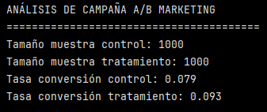
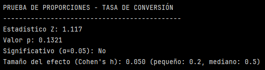
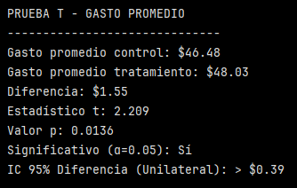
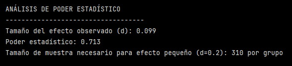
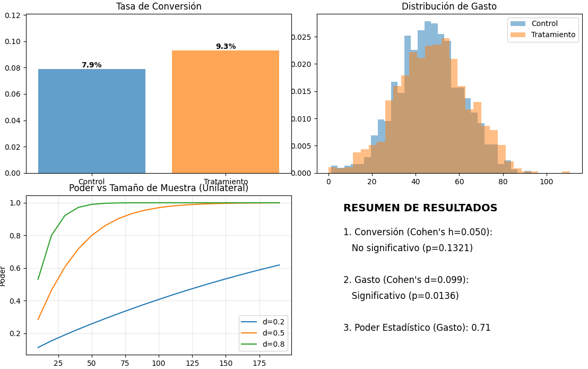

# Ejercicio: Aplicación de pruebas de hipótesis en análisis de campaña de marketing

>[!NOTE]
> Se debe instalar la librería statsmodels.

## Configuración y generación de datos

```python
import pandas as pd
import numpy as np
from scipy import stats
import matplotlib.pyplot as plt
from statsmodels.stats.proportion import proportions_ztest
from statsmodels.stats.api import CompareMeans, DescrStatsW
from statsmodels.stats.power import TTestIndPower
# ==========================================
# 1. CONFIGURACIÓN Y GENERACIÓN DE DATOS
# ==========================================
np.random.seed(42)
n_control = 1000
n_tratamiento = 1000
# Grupo control (campaña actual)
tasa_conversion_control = 0.08  # 8%
conversiones_control = np.random.binomial(1, tasa_conversion_control, n_control)
gasto_promedio_control = np.random.normal(45, 15, n_control)
# Grupo tratamiento (campaña nueva)
tasa_conversion_tratamiento = 0.095  # 9.5%
conversiones_tratamiento = np.random.binomial(1, tasa_conversion_tratamiento, n_tratamiento)
gasto_promedio_tratamiento = np.random.normal(48, 16, n_tratamiento)
print("ANÁLISIS DE CAMPAÑA A/B MARKETING")
print("=" * 40)
print(f"Tamaño muestra control: {n_control}")
print(f"Tamaño muestra tratamiento: {n_tratamiento}")
print(f"Tasa conversión control: {conversiones_control.mean():.3f}")
print(f"Tasa conversión tratamiento: {conversiones_tratamiento.mean():.3f}")
```

En este bloque se define la configuración y generación de los datos a analizar.

Se tienen 2 grupos:
- control
- tratamiento

Para cada grupo se simulan dos cosas:

a) Conversión:

```python
conversiones_control = np.random.binomial(1, 0.08, 1000)
conversiones_tratamiento = np.random.binomial(1, 0.095, 1000)
```

Estro crea un arreglo de 0 y 1 donde:
- 1 = convirtió
- 0 = no convirtió

La probabilidad de 1 está dada por la tasa de conversión para cada grupo:
- 0.08 grupo control
- 0.095 grupo tratamiento

>[!NOTE]
> Conversión es una acción binaria: ocurre o no ocurre.
>
> Suele significar dar el paso de interés como negocio:
> - Comprar un producto
> - Hacer clic en "Comprar"
> - Registrarse con el email
> - Descargar algo
> - Completar un formulario

La conversión representa si un usuario realiza la acción objetivo de la campaña (convertir = 1, no convertir = 0). La tasa de conversión corresponde a la proporción de usuarios que convierten en cada grupo, permitiendo comparar la efectividad de la campaña control versus la de tratamiento.

En este caso, “¿El usuario convirtió (sí/no) después de ver la campaña?”

b) Gasto:

```python
gasto_promedio_control = np.random.normal(45, 15, 1000)
gasto_promedio_tratamiento = np.random.normal(48, 16, 1000)
```
Se simula gasto con una distribución normal para ambos grupos.

Supuestos implícitos:
- los grupos son independientes (usuarios distintos en control y tratamiento).
- la asignación es aleatoria.
- para el gasto se está asumiendo una distribución normal.




La pregunta que se quiere responder es si ¿la campaña nueva hace que más usuarios conviertan que la campaña actual?

Del análisis de campaña A/B marketing, podemos ver que:

- La tasa de conversión del grupo control es 7.9% (es decir, un 7.9% sí convierte).
- La tasa de conversión del grupo tratamiento es 9.3% (9.3% sí convierte).

La prueba estadística evalúa si la diferencia observada entre ambas tasas de conversión es real (efecto de la campaña) o si podría deberse al azar.

## Tasa de conversión
```python
# ==========================================
# 2. PRUEBA DE HIPÓTESIS: TASA DE CONVERSIÓN
# ==========================================
# H₀: p_control = p_tratamiento
# H₁: p_tratamiento > p_control (Cola derecha)
conversiones = [conversiones_tratamiento.sum(), conversiones_control.sum()]
muestras = [n_tratamiento, n_control]
# Z-test unilateral
z_stat, p_value_conv = proportions_ztest(conversiones, muestras, alternative='larger')
print(f"\nPRUEBA DE PROPORCIONES - TASA DE CONVERSIÓN")
print("-" * 45)
print(f"Estadístico Z: {z_stat:.3f}")
print(f"Valor p: {p_value_conv:.4f}")
print(f"Significativo (α=0.05): {'Sí' if p_value_conv < 0.05 else 'No'}")
# CORRECCIÓN: Cálculo de Cohen's h para proporciones
p1 = conversiones_tratamiento.mean()
p2 = conversiones_control.mean()
h_cohen = 2 * (np.arcsin(np.sqrt(p1)) - np.arcsin(np.sqrt(p2)))
print(f"Tamaño del efecto (Cohen's h): {h_cohen:.3f} (pequeño: 0.2, mediano: 0.5)")
```

La prueba estadística evalúa si la diferencia observada entre ambas tasas de conversión es real (efecto de la campaña) o si podría deberse al azar.

Busca responder si ¿la nueva campaña (tratamiento) logra una tasa de conversión mayor que la campaña actual (control)? Por eso la prueba es unilateral (cola derecha).

- Hipótesis nula (H₀): La nueva campaña NO mejora la conversión (es igual o peor).

- Hipótesis alternativa (H₁): La nueva campaña logra una mayor tasa de conversión.

>[!NOTE]
> Recordar que se intenta rechazar H₀ con evidencia, no se prueba H₁ directamente.

En este caso se comparan proporciones:




Estos resultados indican que aunque el tratamiento tiene mayor tasa observada, no hay evidencia estadística suficiente para afirmar que la mejora no se debe al azar.

El tamaño del efecto (Cohen's) indica qué tan grande es la diferencia que se está observando, cuán relevante es la magnitud.

>[!NOTE]
> Recordar:
> 
> d ≈ 0.2 (pequeño), 0.5 (medio), 0.8 (grande)

En este caso, Cohen's h = 0.05, lo que significa que la diferencia entre conversión del control y del tratamiento es muy pequeña en magnitud. 

Aunque la tasa de conversión del grupo tratamiento es mayor que la del grupo control, la diferencia observada no es estadísticamente significativa (p = 0.132). El tamaño del efecto es pequeño (Cohen’s h = 0.05), lo que sugiere que la mejora en conversión es limitada y podría requerir una muestra mayor o un cambio más fuerte en la campaña.


## Gasto promedio
```python
# ==========================================
# 3. PRUEBA DE HIPÓTESIS: GASTO PROMEDIO
# ==========================================
# H₀: μ_control = μ_tratamiento
# H₁: μ_tratamiento > μ_control (Cola derecha)
# T-test unilateral
t_stat, p_value_gasto = stats.ttest_ind(gasto_promedio_tratamiento, gasto_promedio_control, 
                                        alternative='greater', equal_var=False)
print(f"\nPRUEBA T - GASTO PROMEDIO")
print("-" * 30)
print(f"Gasto promedio control: ${gasto_promedio_control.mean():.2f}")
print(f"Gasto promedio tratamiento: ${gasto_promedio_tratamiento.mean():.2f}")
print(f"Diferencia: ${gasto_promedio_tratamiento.mean() - gasto_promedio_control.mean():.2f}")
print(f"Estadístico t: {t_stat:.3f}")
print(f"Valor p: {p_value_gasto:.4f}")
print(f"Significativo (α=0.05): {'Sí' if p_value_gasto < 0.05 else 'No'}")
# CORRECCIÓN: Intervalo de confianza unilateral
cm = CompareMeans(DescrStatsW(gasto_promedio_tratamiento), DescrStatsW(gasto_promedio_control))
conf_int = cm.tconfint_diff(alpha=0.05, alternative='larger')
print(f"IC 95% Diferencia (Unilateral): > ${conf_int[0]:.2f}")
```

En este caso, se busca responder a la siguiente pregunta ¿Los usuarios expuestos a la nueva campaña gastan más dinero en promedio, que los del grupo control?

- H₀ (nula): La nueva campaña NO aumenta el gasto promedio.
- H₁ (alternativa): La nueva campaña genera mayor gasto promedio.

Nuevamente se hace una prueba unilateral (cola derecha). En particular un t-test de medias para muestras independientes.

``equal_var=False`` indica que no asume varianzas iguales.




Estos resultados indican que se rechaza H₀, por lo que habría evidencia de que la campaña nueva sí aumenta el gasto promedio. La diferencia observada ($1.55) entre el gasto promedio del control ($46.48) y el tratamiento ($48.03).

La prueba t para muestras independientes muestra que el gasto promedio del grupo tratamiento es significativamente mayor que el del grupo control (p < 0.05). Aunque el tamaño del efecto es pequeño (Cohen’s d ≈ 0.2), el resultado sugiere que la nueva campaña genera un mayor valor por cliente, lo que puede ser relevante a gran escala.

## Análisis de poder y tamaño de muestra
```python
# ==========================================
# 4. ANÁLISIS DE PODER Y TAMAÑO DE MUESTRA
# ==========================================
# CORRECCIÓN: Cálculo manual de Cohen's d con varianza muestral (ddof=1)
s_pooled = np.sqrt(((n_tratamiento - 1) * np.var(gasto_promedio_tratamiento, ddof=1) + 
                    (n_control - 1) * np.var(gasto_promedio_control, ddof=1)) / 
                    (n_tratamiento + n_control - 2))
d_cohen = (gasto_promedio_tratamiento.mean() - gasto_promedio_control.mean()) / s_pooled
# Calcular poder (Unilateral)
analysis = TTestIndPower()
power = analysis.solve_power(effect_size=d_cohen, 
                            nobs1=n_tratamiento, 
                            alpha=0.05, 
                            ratio=1.0, 
                            alternative='larger')
print(f"\nANÁLISIS DE PODER ESTADÍSTICO")
print("-" * 35)
print(f"Tamaño del efecto observado (d): {d_cohen:.3f}")
print(f"Poder estadístico: {power:.3f}")
# Calcular tamaño muestra para efecto pequeño (Unilateral)
sample_size = analysis.solve_power(effect_size=0.2, power=0.8, alpha=0.05, alternative='larger')
print(f"Tamaño de muestra necesario para efecto pequeño (d=0.2): {np.ceil(sample_size):.0f} por grupo")
```
El poder estadístico es la probabilidad de que una prueba estadística detecte un efecto cuando ese efecto realmente existe. En otras palabras, es la probabilidad de rechazar la hipótesis nula cuando la hipótesis alternativa es verdadera.



En este caso, la diferencia real observada en el gasto promedio es muy pequeña (d = 0.099), lo que indica que tiene un efecto muy pequeño (incluso menor que el umbral de efecto pequeño de Cohen = 0.2).

Aunque el gasto promedio del tratamiento es mayor, la magnitud de esa diferencia es baja en relación con la variabilidad del gasto.

Si analizamos el poder estadístico, es de 0.713. Con el tamaño de muestra utilizado y un efecto real de d = 0.099, la probabilidad de detectar ese efecto es 71.3%. Si se repitiera este experimento muchas veces, en un 71 de cada 100 casos se lograría detectar el efecto como significativo. Un poder de 0.713 es moderado, no ideal, pero razonable para un efecto tan pequeño.

Que el tamaño de muestra necesario para tener un efecto pequeño (d = 0.2) sea de 310 por grupo, significa que si el efecto real fuera un efecto pequeño estándar (d=0.2), bastarían 310 usuarios por grupo para detectarlo con 80% de poder (definido en el código ``sample_size = analysis.solve_power(effect_size=0.2, power=0.8, alpha=0.05, alternative='larger')``).

>[!NOTE]
> Ese 80% viene de trabajos de Jacob Cohen. Propuso el 80% como un equilibrio razonable entre:
> - detectar efectos reales
> - no usar muestras absurdamente grandes.
>
> Es decir, si el efecto realmente existe, se quiere tener al menos 8 de cada 10 posibilidades de detectarlo como significativo. Es como un estándar aceptado. En áreas críticas como medicina en ensayos clínicos se usa 90% o más.

El análisis de poder estadístico indica que el tamaño del efecto observado en el gasto promedio es muy pequeño (d = 0.099). Con el tamaño de muestra disponible, la prueba alcanza un poder moderado (71.3%), suficiente para detectar el efecto, aunque por debajo del umbral recomendado del 80%. Para detectar efectos pequeños estándar (d = 0.2), sería suficiente una muestra de aproximadamente 310 observaciones por grupo. 


El análisis de poder permite evaluar si el diseño experimental cuenta con la capacidad suficiente para detectar efectos reales. En este estudio, el poder estadístico moderado indica que el experimento fue capaz de identificar un efecto pequeño en el gasto promedio, mientras que la ausencia de significancia en la conversión se explica por la baja magnitud del efecto y no por una falta de muestra.

## Visualización de resultados
```python
# ==========================================
# 5. VISUALIZACIÓN DE RESULTADOS
# ==========================================
fig, ((ax1, ax2), (ax3, ax4)) = plt.subplots(2, 2, figsize=(15, 10))
# A) Gráfico de barras conversiones
labels = ['Control', 'Tratamiento']
rates = [conversiones_control.mean(), conversiones_tratamiento.mean()]
bars = ax1.bar(labels, rates, color=['#1f77b4', '#ff7f0e'], alpha=0.7)
ax1.set_title('Tasa de Conversión')
ax1.set_ylim(0, max(rates) * 1.3)
for bar, rate in zip(bars, rates):
    ax1.text(bar.get_x() + bar.get_width()/2, rate, f'{rate:.1%}', 
            ha='center', va='bottom', fontweight='bold')
# B) Histograma gasto
ax2.hist(gasto_promedio_control, alpha=0.5, label='Control', density=True, bins=30)
ax2.hist(gasto_promedio_tratamiento, alpha=0.5, label='Tratamiento', density=True, bins=30)
ax2.set_title('Distribución de Gasto')
ax2.legend()
# C) Gráfico de Poder (Unilateral)
effect_sizes = [0.2, 0.5, 0.8]
sizes = np.arange(10, 200, 10)
for effect in effect_sizes:
    powers = [analysis.solve_power(effect_size=effect, nobs1=n, alpha=0.05, 
                                    alternative='larger') for n in sizes]
    ax3.plot(sizes, powers, label=f'd={effect}')
ax3.set_title('Poder vs Tamaño de Muestra (Unilateral)')
ax3.set_ylabel('Poder')
ax3.legend()
ax3.grid(True, alpha=0.3)
# D) Resumen Ejecutivo (Corrección de variables)
ax4.axis('off')
ax4.text(0.1, 0.9, 'RESUMEN DE RESULTADOS', fontsize=14, fontweight='bold')
resumen_texto = [
    f"1. Conversión (Cohen's h={h_cohen:.3f}):",
    f"   {'Significativo' if p_value_conv < 0.05 else 'No significativo'} (p={p_value_conv:.4f})",
    "",
    f"2. Gasto (Cohen's d={d_cohen:.3f}):",
    f"   {'Significativo' if p_value_gasto < 0.05 else 'No significativo'} (p={p_value_gasto:.4f})",
    "",
    f"3. Poder Estadístico (Gasto): {power:.2f}"
]
y_pos = 0.75
for line in resumen_texto:
    ax4.text(0.1, y_pos, line, fontsize=12)
    y_pos -= 0.1
plt.tight_layout()
plt.show()
print("\nVisualización generada exitosamente.")
```




1. Gráfico de barras - Tasa de conversión

- Se muestra el grupo control (azul) cuya tasa es de 7.9% y el grupo tratamiento (naranjo), cuya tasa es de 9.3%

Visualmente el tratamiento parece mejor porque se ve una diferencia entre la tasa de conversión de ambos grupos, siendo mayor para el tratamiento.
Este gráfico permite visualizar la diferencia, pero no para justificar una decisión por si solo.

2. Histograma - Distribución de gasto

Se ve que las distribuciones de control (azul) y tratamiento (naranjo) se solapan.

Esto podría significar que la mayoría de la gente gasta parecido, pero el tratamiento tiende a gastar un poco más (levemente desplazada a la derecha).

3. Poder vs Tamaño de Muestra (Unilateral)

Se observan 3 curvas:

- d = 0.2 (efecto pequeño)
- d = 0.5 (mediano)
- d = 0.8 (grande)

El eje X correponde al tamaño de muestra y el eje Y al poder estadístico.

Esto muestra que efectos grandes se detectar rápido y efectos pequeños requieren más muestra.

>[!WARNING]
> Es importante recalcar que la muestra no hace que el efecto sea más grande. La muestra más grande solo hace que el efecto se pueda detectar.

La conversión no fue significativa porque el efecto es muy pequeño, no porque el experimento esté mal diseñado.

4. Resumen de resultados

Este panel resume las estadísticas y resultados obtenidos.

- La conversión no fue significativa y el efecto muy pequeño.
- El gasto sí fue significativo pero el efecto muy pequeño (aunque real).
- Poder moderado (0.71)

Con esto se puede decir que la campaña no aumenta claramente la cantidad de compradores, pero sí aumenta el valor de cada compra.

Las visualizaciones refuerzan los resultados del análisis estadístico. Si bien la tasa de conversión del grupo tratamiento es mayor, la diferencia no resulta significativa ni presenta un tamaño de efecto relevante. En contraste, el gasto promedio muestra un desplazamiento consistente hacia valores más altos, lo que se refleja en una diferencia significativa. El análisis de poder indica que el experimento tiene capacidad moderada para detectar efectos pequeños, apoyando la interpretación de los resultados.


## Reflexiones finales

1. Interpretación general de los resultados

Los resultados del A/B testing muestran que la campaña nueva no genera un aumento estadísticamente significativo en la tasa de conversión, ya que la diferencia observada entre el grupo control y el grupo tratamiento es pequeña y no supera el umbral de significancia (p > 0.05). Esto sugiere que la campaña no incrementa de manera clara la proporción de usuarios que convierten.

Sin embargo, el análisis del gasto promedio indica que los usuarios expuestos a la nueva campaña gastan significativamente más que aquellos del grupo control (p < 0.05), aunque el tamaño del efecto es pequeño. Esto implica que, si bien no aumenta el número de compradores, la campaña sí incrementa el valor promedio de cada transacción.

Desde una perspectiva de negocio, estos resultados sugieren que la campaña nueva aporta valor económico, aun cuando su impacto en conversión sea limitado.

2. Recomendación sobre la implementación de la campaña

La recomendación no sería un “sí” o “no” absoluto, sino una implementación estratégica:

- No se recomienda implementar la campaña como reemplazo total de la actual si el objetivo principal es aumentar la tasa de conversión.

- Sí se recomienda considerar su implementación parcial o segmentada si el objetivo es aumentar ingresos por cliente, por ejemplo:
    - enfocándola en segmentos de mayor poder adquisitivo,
    - utilizándola en campañas premium o de upselling,
    - combinándola con acciones que refuercen la conversión.

3. Factores a considerar más allá de la significancia estadística

Además del p-value, es fundamental considerar otros factores clave:

- Tamaño del efecto: aunque el aumento en gasto es significativo, el efecto es pequeño, por lo que su impacto debe evaluarse en función del volumen total de usuarios.

- Impacto económico: pequeños aumentos en gasto promedio pueden ser relevantes si la campaña se aplica a gran escala.

- Costos de implementación: si la nueva campaña implica mayores costos creativos o operativos, estos deben compararse con el aumento esperado en ingresos.

- Objetivo del negocio: si la prioridad es aumentar ingresos y no necesariamente captar más clientes, la campaña puede ser valiosa.

- Poder estadístico: el análisis de poder indica que el experimento tiene capacidad moderada para detectar efectos pequeños, lo que da confianza en la interpretación de los resultados.

- Escalabilidad y riesgo: implementar la campaña de forma gradual permite validar su impacto sin asumir un riesgo elevado.


En conclusión, la campaña nueva no demuestra una mejora significativa en la tasa de conversión, pero sí genera un aumento estadísticamente significativo en el gasto promedio. Considerando el tamaño del efecto, el poder estadístico y el impacto potencial en ingresos, se recomienda una implementación estratégica y segmentada, evaluando costos y objetivos de negocio más allá de la sola significancia estadística.

---
Verificación: Explica cómo interpretarías estos resultados para recomendar si implementar la campaña nueva. ¿Qué factores considerarías además de la significancia estadística?

Requerimientos:
- Python con SciPy y Statsmodels
- NumPy y Pandas para datos
- Matplotlib para visualizaciones