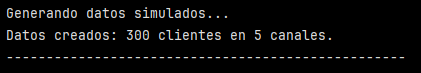
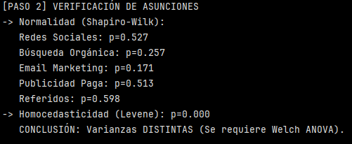
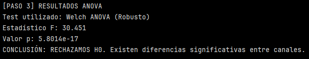
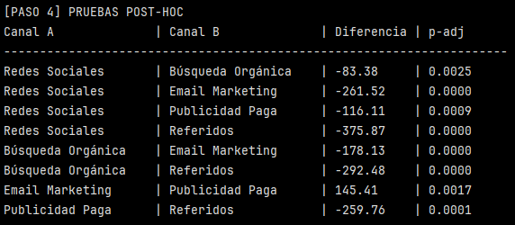
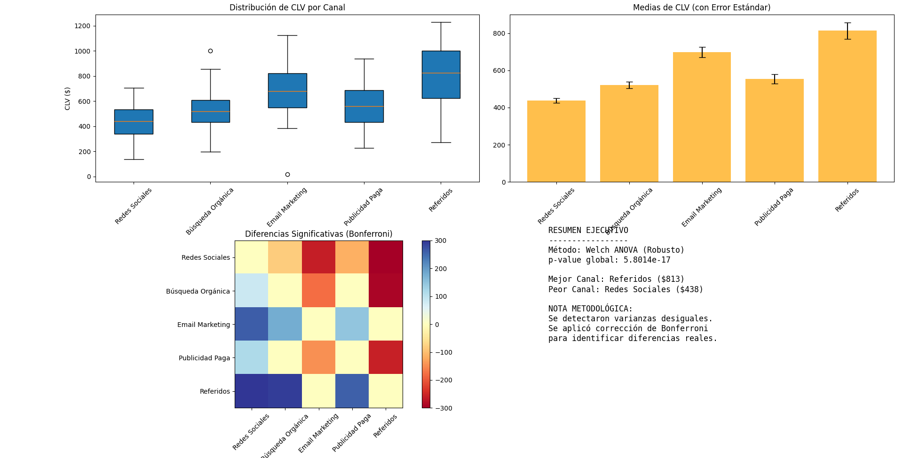
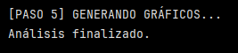

# Ejercicio: ANOVA para análisis de segmentación de clientes por canal

A continuación se presenta un flujo de trabajo completo para analizar si el Valor de Vida del Cliente (CLV) varía significativamente según el canal de adquisición.

Ejecución del Análisis: Copia y ejecuta el siguiente código completo.
Interpretación: Revisa los outputs generados (consola y gráficos).

## Preparación de datos y configuración 

```python
import pandas as pd
import numpy as np
from scipy import stats
import statsmodels.api as sm
from statsmodels.stats.oneway import anova_oneway
from statsmodels.stats.multitest import multipletests
from itertools import combinations
import matplotlib.pyplot as plt

# ==========================================
# 1. PREPARACIÓN DE DATOS Y CONFIGURACIÓN
# ==========================================
print("Generando datos simulados...")
np.random.seed(42)
n_clientes = 300

# Definir canales y sus pesos (Muestras desbalanceadas)
canales = ['Redes Sociales', 'Búsqueda Orgánica', 'Email Marketing', 'Publicidad Paga', 'Referidos']
pesos_canales = [0.3, 0.25, 0.2, 0.15, 0.1] 

# Asignar canales
canal_asignado = np.random.choice(canales, n_clientes, p=pesos_canales)

# Definir distribuciones de CLV (Varianzas desiguales intencionales)
clv_por_canal = {
    'Redes Sociales': 450,
    'Búsqueda Orgánica': 520,
    'Email Marketing': 680,
    'Publicidad Paga': 590,
    'Referidos': 750
}

# Generar datos con variabilidad dependiente de la media (Heterocedasticidad)
clv_data = []
for canal in canal_asignado:
    media = clv_por_canal[canal]
    valor = np.random.normal(media, media * 0.3) 
    clv_data.append(max(0, valor))

# Crear DataFrame
df = pd.DataFrame({
    'cliente_id': range(1, n_clientes + 1),
    'canal_adquisicion': canal_asignado,
    'clv': clv_data
})

print(f"Datos creados: {len(df)} clientes en {len(canales)} canales.")
print("-" * 50)
```




Este bloque generó un conjunto de datos simulados de 300 clientes segmentados en cinco calaes de adquisición:

- Redes sociales
- Búsqueda orgánica
- Email Marketing
- Publicidad Paga
- Referidos

Con tamaños de muestra desiguales y diferencias reales en el CLV promedio por  canal. Los datos fueron diseñados intencionalmente con varianzas desiguales para reflejar escenraios reales de marketing y permitir evaluar los supuestos del ANOVA.

Los valores asignados a cada canal representan el CLV promedio esperado de los clientes adquiridos por ese canal. Estos valores se utilizan como medias para generar datos simulados con variabilidad, permitiendo analizar si existen diferencias significativas entre canales mediante ANOVA.

>[!NOTE]
> CLV es Customer Lifetime Value. Es una métrica de negocio que estima cuánto dinero genera un cliente para la empresa a lo largo de toda su relación con ella.


## Verificación de asunciones 

```python
# ==========================================
# 2. VERIFICACIÓN DE ASUNCIONES
# ==========================================
print("\n[PASO 2] VERIFICACIÓN DE ASUNCIONES")

# Agrupar datos para facilitar el acceso
grupos_clv = {canal: df[df['canal_adquisicion'] == canal]['clv'].values for canal in canales}

# a) Normalidad (Shapiro-Wilk)
print("-> Normalidad (Shapiro-Wilk):")
for canal, datos in grupos_clv.items():
    stat, p = stats.shapiro(datos)
    print(f"   {canal}: p={p:.3f}")

# b) Homocedasticidad (Levene)
stat, p_levene = stats.levene(*grupos_clv.values())
homocedasticidad = p_levene > 0.05
print(f"-> Homocedasticidad (Levene): p={p_levene:.3f}")
if homocedasticidad:
    print("   CONCLUSIÓN: Varianzas iguales (Se podría usar ANOVA estándar).")
else:
    print("   CONCLUSIÓN: Varianzas DISTINTAS (Se requiere Welch ANOVA).")
```

>[!NOTE]
> RECORDAR ASUNCIONES DE ANOVA:
> - Normalidad de la variable dependiente de cada grupo.
> - Homogeneidad de varianzas entre grupos.
> - Independencia de las observaciones.




1. Para evaluar Normalidad se usó un test de Shapiro-Wilk:
- H₀: los datos del grupo siguen una distribución normal
- H₁: los datos no son normales

>[!NOTE]
> p > 0.05, no se rechaza la normalidad.

En este caso, se observa que todos los valores p son mayores a 0.05, por lo que no hay evidencia estadística de que la distribución se desvíe de la normalidad.

2. Para evaluar homocedasticidad se hizo un test de Levene:
- H₀: todas las varianzas son iguales
- H₁: al menos una varianza es distinta

>[!NOTE]
> p < 0.05 se interpreta como varianzas desiguales.

En este caso, como p < 0.05 (p = 0.000), se rechaza la homogeneidad de varianzas. 

Esto puede interpretarse como si las varianzas fueran iguales, la probabilidad de observar diferencias tan grandes como las observadas sería extremadamente baja.

Este resultado indica heterocedasticidad, lo que justifica el uso de ANOVA de Welch, que es más robusto frente a heterocedasticidad y tamaños de muestra desiguales.


## Ejecución del ANOVA

```python
# ==========================================
# 3. EJECUCIÓN DEL ANOVA (ADAPTATIVO)
# ==========================================
print("\n[PASO 3] RESULTADOS ANOVA")

if homocedasticidad:
    # Si las varianzas fueran iguales (raro en datos reales de negocio)
    f_stat, p_value = stats.f_oneway(*grupos_clv.values())
    tipo_test = "ANOVA Estándar"
else:
    # CAMINO ROBUSTO (El que se ejecutará con estos datos)
    # anova_oneway con use_var='unequal' es el Test de Welch
    resultado = anova_oneway(df['clv'], df['canal_adquisicion'], use_var='unequal')
    f_stat = resultado.statistic
    p_value = resultado.pvalue
    tipo_test = "Welch ANOVA (Robusto)"

print(f"Test utilizado: {tipo_test}")
print(f"Estadístico F: {f_stat:.3f}")
print(f"Valor p: {p_value:.4e}")

if p_value < 0.05:
    print("CONCLUSIÓN: RECHAZAMOS H0. Existen diferencias significativas entre canales.")
else:
    print("CONCLUSIÓN: NO rechazamos H0.")
```

Este bloque ejecuta automáticamente el test estadístico correcto según se cumplan o no los supuestos del ANOVA estándar.

```python
if homocedasticidad: ...

else: ...  esto es lo que se ejecuta, ya que no se cumple la homocedasticidad.
```




Se observa que el test utilizado es el Welch ANOVA (Robusto). El estadístico F = 30.451. 

>[!NOTE]
> El estadístico F mide cuánta variabilidad existe entre los grupos en relación con la variabilidad dentro de los grupos. Si F es grande, las medias de los grupos están muy separadas, por lo que la varianza entre grupos es mucho mayor que la varianza dentro de grupos (que refleja la variabilidad aleatoria), sugiriendo diferencias significativas entre las medias de los grupos.

El  valor p = 5.8 × 10⁻¹⁷, lo que permite rechazar H₀ y decir que existen diferencias significativas entre canales.

En términos del negocio, esto significaría que el canal por el cual se adquiere un cliente influye significativamente en su valor de vida (CLV).
No todos los calanes aportan clientes igual de rentales y por lo tanto, la estrategia de adquisión sí importa.

>[!IMPORTANT]
> El ANOVA no dice todavía cuáles canales son distintos entre sí ni cuánto difieren.

## Pruebas Post-Hoc

```python
# ==========================================
# 4. PRUEBAS POST-HOC (WELCH T-TEST + BONFERRONI)
# ==========================================
print("\n[PASO 4] PRUEBAS POST-HOC")

# Generamos todas las combinaciones de pares
pares = list(combinations(canales, 2))
p_values_raw = []
info_pares = []

# Calculamos T-test de Welch para cada par
for (g1, g2) in pares:
    datos_g1 = grupos_clv[g1]
    datos_g2 = grupos_clv[g2]
    
    # equal_var=False es fundamental aquí
    t, p = stats.ttest_ind(datos_g1, datos_g2, equal_var=False)
    
    p_values_raw.append(p)
    info_pares.append({
        'A': g1, 
        'B': g2, 
        'diff': np.mean(datos_g1) - np.mean(datos_g2)
    })

# Aplicamos corrección de Bonferroni (Task 3 de tu teoría)
reject, p_adjusted, _, _ = multipletests(p_values_raw, alpha=0.05, method='bonferroni')

# Guardamos resultados significativos
resultados_significativos = []
print(f"{'Canal A':<20} | {'Canal B':<20} | {'Diferencia':<10} | {'p-adj':<8}")
print("-" * 70)

for i, row in enumerate(info_pares):
    if reject[i]: # Si es significativo tras la corrección
        print(f"{row['A']:<20} | {row['B']:<20} | {row['diff']:<10.2f} | {p_adjusted[i]:.4f}")
        res_row = row.copy()
        res_row['p_adj'] = p_adjusted[i]
        resultados_significativos.append(res_row)

df_posthoc = pd.DataFrame(resultados_significativos)
```

Este bloque se encarga de comprar los canales de a dos, para ver entre qué pares hay diferencias reales de CLV, corrigiendo el error por hacer muchas comparaciones.

``pares = list(combinations(canales, 2))`` Esto genera todas las combinaciones posibles de dos en dos sin repetir. Recordar que son 5 canales.

Luego se generan listas  vacías para guardar los resultados:
- ``p_values_raw``: guarda los p-values sin corregir.
- ``info_pares``: guarda quién se compara con quién y la diferencia de medias.

``grupos_clv`` es un diccionario:
 - Clave: nombre del canal.
 - Valor: array de CLV de ese canal.

Por ejemplo: grupos_clv['Email Marketing'] → [620, 710, 850, ...]


Welcht t-test:

``t, p = stats.ttest_ind(datos_g1, datos_g2, equal_var=False)``

Esto compara la media de CLV entre:
- CANAL A (g1)
-CANAL B (g2)

``equal_var=False``: no asume varianzas iguales, por lo tanto indica Welch t-test. Esto entrega el valor p sin corregir que se van a guardar en p_values_raw.

Luego, se guarda la información del par en ``info_pares``. siendo diff = Media (A) - Media (B).

La corrección de Bonferroni ajusta todos los p-values juntos (α/número de comparaciones). Bonferroni endurece el criterio para declarar significancia.

>[!NOTE]
> Recordar que múltiples comparaciones inflan la probabilidad de error tipo I, por eso se deben hacer las correcciones. 


Se imprimen solo los pares con diferencias significativas (`` if reject[i]:...``)

Finalmente se crea un DataFrame con los resultados (``df_posthoc``).

Resumiendo, el bloque compara todo con todo, corrige errores y deja solo importante.




Los resultados indican diferencias estadísticamente significativas entre varios pares de canales, destacando que los clientes provenientes de Referidos y Email Marketing presentan un CLV significativamente mayor en comparación con Redes Sociales, Búsqueda Orgánica y Publicidad Paga.

## Visualización

```python
# ==========================================
# 5. VISUALIZACIÓN
# ==========================================
print("\n[PASO 5] GENERANDO GRÁFICOS...")

fig, axes = plt.subplots(2, 2, figsize=(15, 12))
((ax1, ax2), (ax3, ax4)) = axes

# A) Boxplot
ax1.boxplot([grupos_clv[c] for c in canales], labels=canales, patch_artist=True)
ax1.set_title('Distribución de CLV por Canal')
ax1.tick_params(axis='x', rotation=45)
ax1.set_ylabel('CLV ($)')

# B) Barplot de Medias + Error Estándar
medias = [np.mean(g) for g in grupos_clv.values()]
errores = [stats.sem(g) for g in grupos_clv.values()]
ax2.bar(canales, medias, yerr=errores, capsize=5, color='orange', alpha=0.7)
ax2.set_title('Medias de CLV (con Error Estándar)')
ax2.tick_params(axis='x', rotation=45)

# C) Heatmap de Diferencias (Basado en Bonferroni)
matriz_diff = np.zeros((len(canales), len(canales)))

if not df_posthoc.empty:
    for _, row in df_posthoc.iterrows():
        try:
            i = canales.index(row['A'])
            j = canales.index(row['B'])
            matriz_diff[i, j] = row['diff']
            matriz_diff[j, i] = -row['diff']
        except: pass

im = ax3.imshow(matriz_diff, cmap='RdYlBu', vmin=-300, vmax=300)
ax3.set_xticks(range(len(canales)))
ax3.set_yticks(range(len(canales)))
ax3.set_xticklabels(canales, rotation=45)
ax3.set_yticklabels(canales)
ax3.set_title('Diferencias Significativas (Bonferroni)')
plt.colorbar(im, ax=ax3)

# D) Resumen Textual
ax4.axis('off')
mejor_canal = canales[np.argmax(medias)]
peor_canal = canales[np.argmin(medias)]

texto_resumen = (
    f"RESUMEN EJECUTIVO\n"
    f"-----------------\n"
    f"Método: {tipo_test}\n"
    f"p-value global: {p_value:.4e}\n\n"
    f"Mejor Canal: {mejor_canal} (${max(medias):.0f})\n"
    f"Peor Canal: {peor_canal} (${min(medias):.0f})\n\n"
    f"NOTA METODOLÓGICA:\n"
    f"Se detectaron varianzas desiguales.\n"
    f"Se aplicó corrección de Bonferroni\n"
    f"para identificar diferencias reales."
)
ax4.text(0.1, 0.4, texto_resumen, fontsize=12, family='monospace')

plt.tight_layout()
plt.show()
print("Análisis finalizado.")
```

Se generan 3 gráficos y un resumen ejecutivo.






a) Boxplot - Distribución de CLV por canal

Para cada canal se muestra:
- Mediana
- Rango intercuartílico
- Dispersión
- Outliers

Se observa que Referidos y Email Marketing tienen CLV más altos y también mayor dispersión.

Redes sociales es el canal que presenta CLV más bajo y menor rango.

Este tipo de gráfico confirma que existen diferencias entre medianas.

b) Barplot - Medias con error estándar

Cada barra representa el CLV promedio para cada canal y las líneas son el error estándar asociado a cada promedio.

Se observa que Referidos y Email Marketing tienen los mayores CLV promedios. Los errores estándar más grandes indica que los datos están más dispersos y errores más pequeños que los datos están más concentrados.

Esto complementa lo observado en el gráfico anterior.

c) Heatmap - Diferencias significativas (Bonferroni)

Grafica una matriz de diferencias solo donde hubo diferencias significativas.

- Azul: si la fila es mayor que la columna
- Rojo: si la fila es menor que la columna

La intensidad es la magnitud de la diferencia. Los colores más intensos corresponden al output observado en el [paso 4 - Pruebas post-hadoc](paso4.PNG).

>[!CAUTION]
> Es importante destacar que a diferencia de otras matrices que hemos visto en el curso, en este caso no es una matriz de correlación, si no que de diferencias.

d) Resumen ejecutivo

Incluye:
- Método estadístico utilizado
- p-value global
- Mejor y peor canal con sus respectivos promedios
- Nota metodológica

Finalmente, existen diferencias estadísticamente significativas en el CLV entre canales de adquisición, confirmadas mediante Welch ANOVA y pruebas post-hoc con corrección de Bonferroni.

A nivel de negocio, el canal de adquisión influye de forma relevante en el valor de los clientes. Los clientes adquiridos por Refereidos y Email Marketing generan mayor valor en el tiempo, destacando como los canales más rentables. Esta información puede se de apoyo a las decisiones estratégicas de reasignación de inversión en marketing.


--- 
- Requerimientos:
- Python con SciPy, Statsmodels, y Pandas
- Matplotlib para visualizaciones
- NumPy para cálculos estadísticos