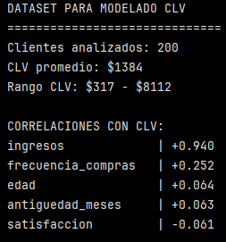
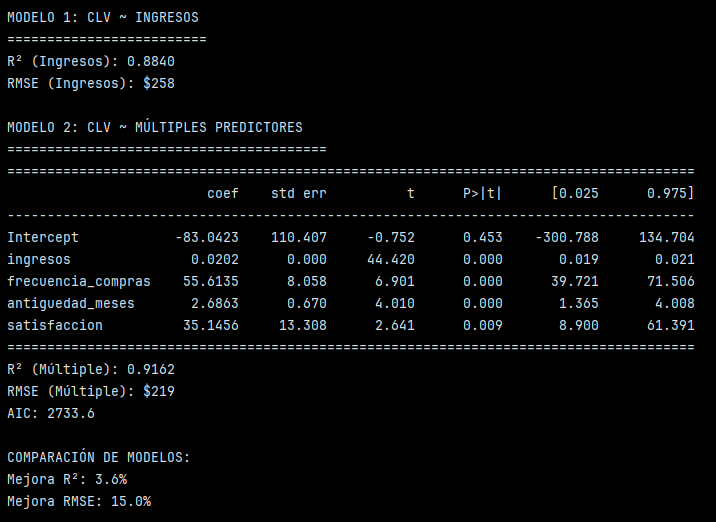
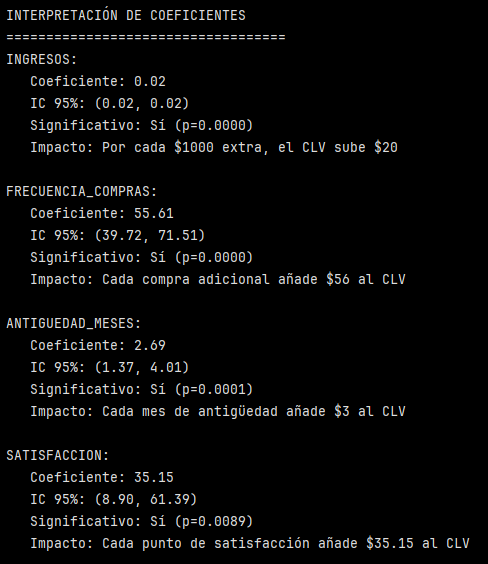
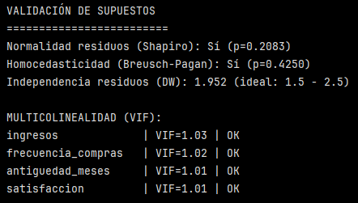
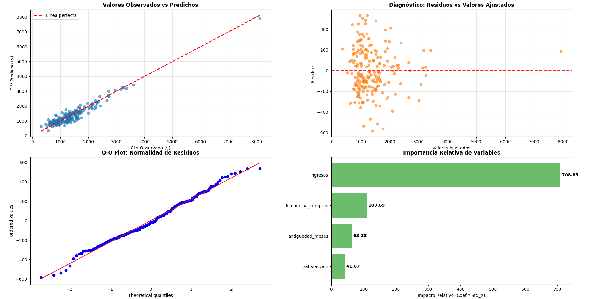
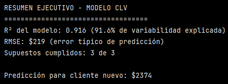

# Ejercicio: Modelado predictivo de valor de vida del cliente (CLV) usando regresión lineal

## Preparación de datos y análisis exploratorio:

```python
import pandas as pd
import numpy as np
import statsmodels.formula.api as smf
import matplotlib.pyplot as plt
from sklearn.metrics import mean_squared_error, r2_score
import scipy.stats as stats
from statsmodels.stats.api import het_breuschpagan
from statsmodels.stats.stattools import durbin_watson
from statsmodels.stats.outliers_influence import variance_inflation_factor
from statsmodels.tools.tools import add_constant # Importación necesaria para el fix de VIF

# ==========================================
# 1. GENERACIÓN DE DATOS
# ==========================================
# Generar dataset de clientes para modelado CLV
np.random.seed(42)
n_clientes = 200

df = pd.DataFrame({
    'cliente_id': range(1, n_clientes + 1),
    'edad': np.random.normal(35, 10, n_clientes).clip(18, 70).astype(int),
    'ingresos': np.random.lognormal(10.5, 0.6, n_clientes).round(0),
    'frecuencia_compras': np.random.poisson(4, n_clientes),
    'antiguedad_meses': np.random.exponential(24, n_clientes).astype(int),
    'satisfaccion': np.random.normal(7.5, 1.2, n_clientes).clip(1, 10),
    'canal_adquisicion': np.random.choice(['Online', 'Tienda', 'App'], n_clientes)
})

# Generar CLV basado en características (Relación lineal "limpia")
clv_base = (df['ingresos'] * 0.02 + 
            df['frecuencia_compras'] * 50 + 
            df['antiguedad_meses'] * 2 + 
            df['satisfaccion'] * 30)

# Generar ruido HOMOCEDÁSTICO (Varianza constante)
# clv_base.std() es un escalar, por lo que el ruido es igual para todos
df['clv'] = clv_base + np.random.normal(0, clv_base.std() * 0.3, n_clientes)
df['clv'] = df['clv'].clip(0)  # CLV no puede ser negativo

print("DATASET PARA MODELADO CLV")
print("=" * 30)
print(f"Clientes analizados: {len(df)}")
print(f"CLV promedio: ${df['clv'].mean():.0f}")
print(f"Rango CLV: ${df['clv'].min():.0f} - ${df['clv'].max():.0f}")

# Análisis de correlaciones
numeric_cols = ['edad', 'ingresos', 'frecuencia_compras', 'antiguedad_meses', 'satisfaccion', 'clv']
correlaciones = df[numeric_cols].corr()['clv'].sort_values(ascending=False)

print("\nCORRELACIONES CON CLV:")
for var, corr in correlaciones.items():
    if var != 'clv':
        print(f"{var:20} | {corr:+.3f}")
```

Se generó un dataset de 200 clientes con las siguientes variables:

- ``'cliente_id'``
- ``'edad'``
- ``'ingresos'``
- ``'frecuencia_compras'``
- ``'antiguedad_meses'``
- ``'satisfaccion'``
- ``'canal_adquisicion'``

Se genera el CLV como una combinación lineal explícita de las siguientes variables:

- ``'ingresos'``
- ``'frecuencia_compras'``
- ``'antiguedad_meses'``
- ``'satisfaccion'``

```python
clv_base = (ingresos * 0.02 +
            frecuencia_compras * 50 +
            antiguedad_meses * 2 +
            satisfaccion * 30)
```

Esta ecuación es una función generadora de datos. Se define una relación matemática "verdadera" entre variables, se generan datos y luego se ve si el modelo es capaz de recuperar esa relación. En este caso, ingresos queda como driver del CLV. 

En el fondo, el CLV fue generado mediante una función lineal sintética que combina variables de comportamiento y perfil del cliente, con el objetivo de simular un proceso generador de datos controlado. Esto permite evaluar la capacidad del modelo de regresión lineal para recuperar relaciones conocidas bajo supuestos estadísticos clásicos.

Luego se genera ruido homocedástico. Esto significa que todos los clientes tienen la misma varianza del error. De esta manera, se cumple el supuesto clásico de homocedasticidad.




De los 200 clientes analizados, se observa un CLV promedio de $1384 y un rango del CLV entre $317 y $8112. 

>[!NOTE]
> CLV se mide en la moneda de la empresa. Representa el beneficio, ingreso o margen de beneficio que se espera obtener del cliente.

Luego se hace un análisis de correlaciones con CLV para 5 variables:

- ``'ingresos'``: + 0.940 indica una relación muy fuerte y positiva.
- ``'frecuencia_compras'``: + 0.252 indica una relación positiva moderada.
- ``'edad'`` y ``'antiguedad_meses'``: + 0.064 y + 0.063 respectivamente, indican correlaciones positivas muy débiles.
- ``'satisfaccion'``: - 0.061  correlación negativa muy débil.


## Construcción del modelo de regresión
```python
# ==========================================
# 2. CONSTRUCCIÓN DEL MODELO DE REGRESIÓN
# ==========================================
# Modelo 1: Usando ingresos como predictor principal
modelo1 = smf.ols('clv ~ ingresos', data=df).fit()

print("\nMODELO 1: CLV ~ INGRESOS")
print("=" * 25)

# Métricas de evaluación
y_pred1 = modelo1.predict(df)
r2_1 = r2_score(df['clv'], y_pred1)
rmse_1 = np.sqrt(mean_squared_error(df['clv'], y_pred1))

print(f"R² (Ingresos): {r2_1:.4f}")
print(f"RMSE (Ingresos): ${rmse_1:.0f}")

# Modelo 2: Múltiples predictores
modelo2 = smf.ols('clv ~ ingresos + frecuencia_compras + antiguedad_meses + satisfaccion', 
                  data=df).fit()

print("\nMODELO 2: CLV ~ MÚLTIPLES PREDICTORES")
print("=" * 40)
print(modelo2.summary().tables[1])

# Métricas del modelo múltiple
y_pred2 = modelo2.predict(df)
r2_2 = r2_score(df['clv'], y_pred2)
rmse_2 = np.sqrt(mean_squared_error(df['clv'], y_pred2))

print(f"R² (Múltiple): {r2_2:.4f}")
print(f"RMSE (Múltiple): ${rmse_2:.0f}")
print(f"AIC: {modelo2.aic:.1f}")

# Comparación de modelos
mejora_r2 = ((r2_2 - r2_1) / r2_1) * 100
mejora_rmse = ((rmse_1 - rmse_2) / rmse_1) * 100

print("\nCOMPARACIÓN DE MODELOS:")
print(f"Mejora R²: {mejora_r2:.1f}%")
print(f"Mejora RMSE: {mejora_rmse:.1f}%")
```

Este bloque genera 2 modelos:




1. Modelo 1: Usando ingresos como predictor principal

Tiene un R² = 0.884, lo que indica que el 88.4% de la variabilidad del CLV se explica solo por los ingresos. 

>[!NOTE]
> RMSE: Root Mean Square Error. Es el error cuadrático medio que mide la diferencia promedio entre los valores predichos por un modelo y los valores reales observados, expresada en las mismas unidades de la variable objetivo. Mientras más bajo el valor, significa que se ajusta mejor al modelo.

En este caso, el RMSE es $258. Recordar que el CLV promedio es de $1384 y que hay una alta dispersión en los valores de CLV, por lo que $258 es un valor razonable.

Los ingresos por sí solos sun un predictor muy fuerte del CLV, pero no capturan completamente el comportamiento del cliente.

2. Modelo 2: Múltiples predictores

Tiene un R² = 0.916, lo que indica que el modelo explica 91.6% de la variabilidad del CLV y el RMSE baja a un $219. 

>[!NOTE]
> AIC Akaike Information Criterion (Criterio de Información Akaike).
> Es una métrica para comparar modelos estadísticos. Un menor valor de AIC indica mejor modelo. 

En este caso, como no se tiene el valor AIC del modelo uno no se puede decir mucho respecto a este dato. Solo tiene sentido cuando se compara entre dos o más modelos ajustados sobre el mismo conjunto de datos.

En una regresión lineal, los coeficientes son los números que indican cuánto cambia el CLV cuando una variable aumenta en 1 unidad, manteniendo las demás constantes.

Si comparamos los coeficientes estimados por el modelo y los reales tenemos lo siguiente:

| Variable              | Coeficiente real | Coeficiente estimado |
|-----------------------|------------------|----------------------|
| ingresos              | 0.02             | **0.0202**           |
| frecuencia_compras    | 50               | **55.6**             |
| antiguedad_meses      | 2                | **2.68**             |
| satisfaccion          | 30               | **35.1**             |

Estos resultados sugieren que incorporar variables de comportamiento al modelo, mejora la precisión de este.


Respecto a la tabla del output de este paso, se observan las siguientes columnas (además de la de coeficiente y std err):

- ``t``: estadístico t. Mide cuántas desviaciones estándar está el coeficiente lejos de 0.

    t = Coeficiente estimado/Error estándar

    - |t| grande → evidencia fuerte de que el coeficiente no es 0
    - |t| pequeño → el coeficiente podría ser 0 (no hay efecto claro)

- ``P>|t|``: p-valor del coeficiente. Si el coeficiente real fuera 0, ¿qué tan probable es observar un valor tan extremo como este?

    - p < 0.05: coeficiente estadísticamente significativo
    - p ≥ 0.05: no hay evidencia suficiente

En este modelo, todos los p son < 0.05, excepto para el caso del intercepto, cuyo p = 0.453.

>[!IMPORTANT]
> Significativo no significa importante, solo que el efecto es distinto de 0.

- ``[0.025 0.975]``: intervalo de confianza al 95%. Estas dos columnas representan el rango donde probablemente se encuentra el coeficiente verdadero, con un 95% de confianza.

    - 0.025 → límite inferior (2.5%)
    - 0.975 → límite superior (97.5%)

    Esto deja 2.5% de probabilidad en la cola izquierda y 2.5% de probabilidad en la cola derecha:

    100% - 2.5% - 2.5% = 95%, por eso ese rango es el intervalo de confianza al 95%.

El estadístico t y su p-valor asociado permiten evaluar la significancia estadística de cada predictor. Asimismo, los intervalos de confianza al 95% entregan un rango plausible para los coeficientes verdaderos, evidenciando la precisión de las estimaciones.


## Interpretación de coeficientes
```python
# ==========================================
# 3. INTERPRETACIÓN DE COEFICIENTES
# ==========================================
# Extraer coeficientes del modelo múltiple
coeficientes = modelo2.params
p_values = modelo2.pvalues
conf_int = modelo2.conf_int()

print("\nINTERPRETACIÓN DE COEFICIENTES")
print("=" * 35)

for var in ['ingresos', 'frecuencia_compras', 'antiguedad_meses', 'satisfaccion']:
    coef = coeficientes[var]
    p_val = p_values[var]
    ci_lower, ci_upper = conf_int.loc[var]
    
    print(f"{var.upper()}:")
    print(f"   Coeficiente: {coef:.2f}")
    print(f"   IC 95%: ({ci_lower:.2f}, {ci_upper:.2f})")
    print(f"   Significativo: {'Sí' if p_val < 0.05 else 'No'} (p={p_val:.4f})")
    
    # Interpretación específica
    if var == 'ingresos':
        print(f"   Impacto: Por cada $1000 extra, el CLV sube ${coef*1000:.0f}")
    elif var == 'frecuencia_compras':
        print(f"   Impacto: Cada compra adicional añade ${coef:.0f} al CLV")
    elif var == 'antiguedad_meses':
        print(f"   Impacto: Cada mes de antigüedad añade ${coef:.0f} al CLV")
    elif var == 'satisfaccion':
        print(f"   Impacto: Cada punto de satisfacción añade ${coef:.2f} al CLV")
    print()
```

Este bloque extrae del modelo:
 
- Coeficientes (``params``)
- p-valores (``p-values``)
- intervalos de confianza (``conf_int``)

Recorre solo las variables relevantes y traduce cada coeficiente a: significancia estadística e impacto económico directo.



En el caso de los ``ingresos``, es el predictor más robusto del CLV, por cada $1000 extra, el CLV sube $20 (esto dado por el coeficiente).

En el caso de la ``frecuencia_compras``: cada compra adicional añade $56 al CLV.

Para la ``antiguedad_meses``: cada mes de antigüedad añade $3 al CLV. No e sun driver fuerte por unidad, pero sí por persistencia. Un mes aislado aporta poco, pero la acumulación en el tiempo sí importa, suma valor sostenidamente.

En el caso de la ``satisfaccion``: cada punto de satisfacción añade $35.15 al CLV. 

La interpretación de los coeficientes permite traducir el modelo estadístico a impactos económicos concretos. Los resultados indican que los ingresos y la frecuencia de compra son los principales determinantes del CLV. Esto se debe a su mayor capacidad explicativa, su impacto económico acumulado dada su escala, y la alta precisión con que sus efectos son estimados en el modelo. Mientras que la antigüedad y la satisfacción presentan efectos positivos pero de menor magnitud. Todos los coeficientes analizados resultan estadísticamente significativos, y sus intervalos de confianza al 95%.


## Validación de supuestos
```python
# ==========================================
# 4. VALIDACIÓN DE SUPUESTOS
# ==========================================
# Análisis de residuos
residuos = modelo2.resid
valores_ajustados = modelo2.fittedvalues

print("VALIDACIÓN DE SUPUESTOS")
print("=" * 25)

# Prueba de normalidad de residuos (Shapiro-Wilk)
stat, p_normalidad = stats.shapiro(residuos)
print(f"Normalidad residuos (Shapiro): {'Sí' if p_normalidad > 0.05 else 'No'} (p={p_normalidad:.4f})")

# Prueba de homocedasticidad (Breusch-Pagan)
bp_test = het_breuschpagan(residuos, modelo2.model.exog)
print(f"Homocedasticidad (Breusch-Pagan): {'Sí' if bp_test[1] > 0.05 else 'No'} (p={bp_test[1]:.4f})")

# Correlación de residuos (Durbin-Watson)
dw_stat = durbin_watson(residuos)
print(f"Independencia residuos (DW): {dw_stat:.3f} (ideal: 1.5 - 2.5)")

# --- CORRECCIÓN VIF ---
# Multicolinealidad (VIF) - Corrección: Se debe agregar constante
X = df[['ingresos', 'frecuencia_compras', 'antiguedad_meses', 'satisfaccion']]
X_con_constante = add_constant(X) # Statsmodels requiere constante explícita para VIF

vif_data = pd.DataFrame()
vif_data["Variable"] = X_con_constante.columns
vif_data["VIF"] = [variance_inflation_factor(X_con_constante.values, i) for i in range(X_con_constante.shape[1])]

# Filtramos la constante para mostrar solo las variables
vif_data = vif_data[vif_data["Variable"] != 'const']

print("\nMULTICOLINEALIDAD (VIF):")
for _, row in vif_data.iterrows():
    problema = "PROBLEMA" if row['VIF'] > 5 else "OK"
    print(f"{row['Variable']:20} | VIF={row['VIF']:.2f} | {problema}")
```



La regresión lineal clásica se apoya en 4 grandes supuestos. La idea de este bloque es ir validando cada uno de estos.

1. Test Shapito-Wilk

Evalúa si los residuos siguen aproximadamente una distribución normal.

>[!NOTE]
> En una regresión, los residuos son la diferencia entre el CLV rel y el CLV que predice el modelo, para cada cliente.
>
> $residuo_i = y_i - \hat{y}_i$.

En este caso, como p = 0.2083, no se recha la normalidad.

2. Homocedasticidad - Test Breusch-Pagan

Evalúa si la varianza de los residuos es constante a lo largo de los valores ajustados.

Como p > 0.05 (p=0.4250) no hay evidencia de heterocedasticidad. Lo que indica que el error del modelo es estable.

3. Independencia de los residuos - Test Durbin-Watson

Evalúa la autocorrelación entre residuos consecutivos.

El estadístico DW siempre toma valores entre 0 y 4: 0 ≤ 𝐷𝑊 ≤4
- Un DW cercano a 0 indica una fuerte autocorrelación positiva, que viola el supuesto de independencia.
- Un DW < 1.5 indica autocorrelación positiva moderada, podría ser problemático.
- Un DW cercano a 2 indica residuos independientes.
- Un DW > 2.5 indica autocorrelación negativa moderada.
- Un DW cercano a 4 indica una fuerte autocorrelación negativa, que viola el supuesto de independencia.

``DW = 1.952  (ideal entre 1.5 y 2.5)`` indica residuos independientes.

4. Multicolinealidad - Métrica VIF (Variance Inflation Factor)

>[!NOTE]
> La multicolinealidad ocurre cuando dos o más variables explicativas de un modelo de regresión están fuertemente correlacionadas entre sí. Es decir, explican lo mismo y aportan información redundante. Esto puede generar problemas, porque el modelo no sabe a cuál asignar el efecto y afecta la interpretación de los coeficientes.


VIF: Evalúa si los predictores están altamente correlacionados entre sí.

- VIF < 5: aceptable
- VIF < 2: excelente

En este caso, todas las VIF calculadas son menores a 2. Por lo que no hay multicolinealidad, los coeficientes son estables y que cada variable aporta información independiente.


## Visualización completa
```python
# ==========================================
# 5. VISUALIZACIÓN COMPLETA
# ==========================================
fig, ((ax1, ax2), (ax3, ax4)) = plt.subplots(2, 2, figsize=(16, 12))

# 1. Valores observados vs predichos
ax1.scatter(df['clv'], y_pred2, alpha=0.6, color='#1f77b4')
ax1.plot([df['clv'].min(), df['clv'].max()], [df['clv'].min(), df['clv'].max()], 
         'r--', linewidth=2, label='Línea perfecta')
ax1.set_xlabel('CLV Observado ($)')
ax1.set_ylabel('CLV Predicho ($)')
ax1.set_title('Valores Observados vs Predichos', fontweight='bold')
ax1.legend()
ax1.grid(True, alpha=0.3)

# 2. Residuos vs valores ajustados
ax2.scatter(valores_ajustados, residuos, alpha=0.6, color='#ff7f0e')
ax2.axhline(y=0, color='red', linestyle='--', linewidth=2)
ax2.set_xlabel('Valores Ajustados')
ax2.set_ylabel('Residuos')
ax2.set_title('Diagnóstico: Residuos vs Valores Ajustados', fontweight='bold')
ax2.grid(True, alpha=0.3)

# 3. Q-Q plot de residuos
stats.probplot(residuos, dist="norm", plot=ax3)
ax3.set_title('Q-Q Plot: Normalidad de Residuos', fontweight='bold')

# 4. Importancia de variables
# Usamos coeficientes * desviación estándar de X para ver impacto relativo
coef_std = modelo2.params[1:] * df[['ingresos', 'frecuencia_compras', 'antiguedad_meses', 'satisfaccion']].std()
coef_std = coef_std.abs().sort_values(ascending=True)

bars = ax4.barh(range(len(coef_std)), coef_std.values, color='#2ca02c', alpha=0.7)
ax4.set_yticks(range(len(coef_std)))
ax4.set_yticklabels(coef_std.index)
ax4.set_xlabel('Impacto Relativo (Coef * Std_X)')
ax4.set_title('Importancia Relativa de Variables', fontweight='bold')

for i, (var, val) in enumerate(zip(coef_std.index, coef_std.values)):
    ax4.text(val, i, f' {val:.2f}', va='center', fontweight='bold')

plt.tight_layout()
plt.show()

# Resumen ejecutivo final
print("\nRESUMEN EJECUTIVO - MODELO CLV")
print("=" * 35)
print(f"R² del modelo: {r2_2:.3f} ({r2_2*100:.1f}% de variabilidad explicada)")
print(f"RMSE: ${rmse_2:.0f} (error típico de predicción)")
cumple_norm = p_normalidad > 0.05
cumple_homo = bp_test[1] > 0.05
cumple_indep = abs(dw_stat - 2) < 0.5
print(f"Supuestos cumplidos: {sum([cumple_norm, cumple_homo, cumple_indep])} de 3")

# Predicción para nuevo cliente
cliente_nuevo = pd.DataFrame({
    'ingresos': [80000],
    'frecuencia_compras': [8],
    'antiguedad_meses': [36],
    'satisfaccion': [8.5]
})

clv_predicho = modelo2.predict(cliente_nuevo)[0]
print(f"\nPredicción para cliente nuevo: ${clv_predicho:.0f}")
```

Este bloque genera 4 gráficos y un resumen ejecutivo.



1. Valores observados vs predichos (por el modelo 2)

- Cada punto representa un cliente.
- El Eje X es el CLV observado.
- El Eje Y es el CLV predicho.
- La línea roja es la predicción perfecta (y=x).

Este gráfico muestra la capacidad predictiva global del modelo. Se observa que la mayoría de los puntos están muy cerva de la lína roja. No se observan sesgos evidentes. El modelo predice bien todo el rango del CLV.


2. Residuos vs valores Ajustados

- Cada punto también representa un cliente individual del dataset.
- Eje X: valores ajustados (los predichos)
- Eje Y: residuos
- Línea roja representa residuo = 0

Residuos:

- Residuo > 0 (sobre la línea roja)
    - El modelo subestima al cliente
    - CLV real > CLV predicho

- Residuo < 0 (bajo la línea roja)
    - El modelo sobreestima al cliente
    - CLV real < CLV predicho

- Residuo = 0 (sobre la línea roja)
    - Predicción perfecta

Un buen modelo lineal muestra puntos dispersos aleatoriamente, alrededor de la línea 0. 

3. Q-Q plot de residuos

- Compara cuantiles teóricos de una normal y cuantiles observados de los residuos.

Se observa que los puntos siguen bastante bien la línea, a pesar de haber pequeñas desviaciones en las colas.

4. Importancia relativa de variables

```
Impacto relativo = |coeficiente × desviación estándar de X|
```
Esto permite comparar variables en una escala común.

Se observa que Ingresos es el principal driver del CLV. La Frecuencia es el segundo más importante. Satisfacción y Antigüedad tienen impacto positivo pero menor.

**Resumen Ejecutivo:**



El modelo explica la gran mayoría del CLV y cumple los supuestos estadísticos necesarios para una inferencia confiable.

## Reflexión final

El modelo de regresión lineal desarrollado presenta un alto poder explicativo y un buen desempeño predictivo, respaldado tanto por métricas cuantitativas como por diagnósticos visuales. Los supuestos estadísticos se cumplen adecuadamente y la interpretación de los coeficientes permite identificar a los ingresos y la frecuencia de compra como los principales determinantes del CLV. Finalmente, el modelo permite estimar el valor esperado de clientes individuales, aportando información relevante para la toma de decisiones comerciales.


---
Verificación: ¿Cómo interpretarías el coeficiente de ingresos en el modelo? ¿Qué supuestos del modelo están violados y cómo afectaría eso la confiabilidad de las predicciones?

Requerimientos:
- Python con Statsmodels, Scikit-learn, Pandas
- NumPy y Matplotlib para análisis y visualización
- Jupyter Notebook para desarrollo iterativo