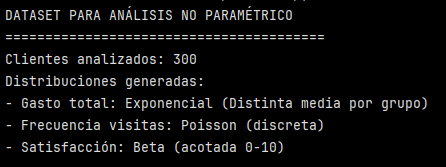
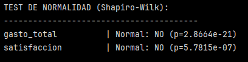
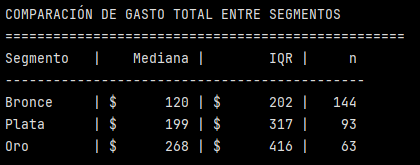
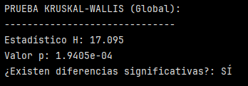
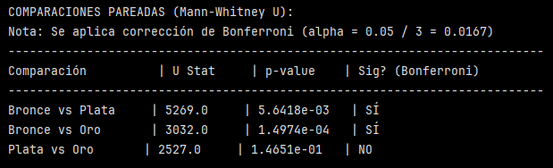

# Ejercicio: Análisis robusto de segmentación de clientes con técnicas no paramétricas

## Preparación de dataset con características no normales:

```python
import pandas as pd
import numpy as np
from scipy import stats
import matplotlib.pyplot as plt
from itertools import combinations

# ==========================================
# 1. GENERACIÓN DE DATOS (NO NORMALES)
# ==========================================
np.random.seed(42)
n_clientes = 300

# Definimos segmentos primero
segmentos_lista = np.random.choice(['Bronce', 'Plata', 'Oro'], n_clientes, p=[0.5, 0.3, 0.2])

# Generamos gasto dependiente del segmento para asegurar diferencias
# Usamos distribución exponencial (no normal) con diferentes escalas (medias)
gasto_data = []
for seg in segmentos_lista:
    if seg == 'Oro':
        val = np.random.exponential(scale=450) # Media 450
    elif seg == 'Plata':
        val = np.random.exponential(scale=250) # Media 250
    else: # Bronce
        val = np.random.exponential(scale=150) # Media 150
    gasto_data.append(val)

df = pd.DataFrame({
    'cliente_id': range(1, n_clientes + 1),
    'segmento': segmentos_lista,
    'gasto_total': gasto_data, 
    'frecuencia_visitas': np.random.poisson(3, n_clientes),  # Conteos (Poisson)
    'satisfaccion': np.random.beta(5, 2, n_clientes) * 10,   # Beta (asimetría negativa, alta satisfacción)
    'antiguedad_dias': np.random.exponential(365, n_clientes).astype(int)
})

print("DATASET PARA ANÁLISIS NO PARAMÉTRICO")
print("=" * 40)
print(f"Clientes analizados: {len(df)}")
print("Distribuciones generadas:")
print("- Gasto total: Exponencial (Distinta media por grupo)")
print("- Frecuencia visitas: Poisson (discreta)")
print("- Satisfacción: Beta (acotada 0-10)")

# Verificar no normalidad (Shapiro-Wilk)
print("\nTEST DE NORMALIDAD (Shapiro-Wilk):")
print("-" * 40)
# Solo probamos gasto y satisfacción para no saturar la salida
for col in ['gasto_total', 'satisfaccion']:
    stat, p = stats.shapiro(df[col])
    normal = "SÍ" if p > 0.05 else "NO"
    print(f"{col:20} | Normal: {normal} (p={p:.4e})")
```

El objetivo de este bloque es crear un dataser de clientes cuyas variables no siguen una distribución normal. De esta forma, se puede justificar el uso de pruebas no paramétrias y pruebas robustas.



El número de clientes analizados es 300. Se crearon 3 segmentos con distintas probabilidades para que no queden del mismo tamaño.

1. Gasto total:

- Distribución exponencial
- Asimetría positiva (cola larga derecha).

2. Frecuencia de visitas:

- Distribución de Poisson
- Solo valores enteros
- Es una variable de conteo

> [!NOTE]
> ANOVA/t-test no son válidos para conteos.

3. Satisfacción:

- Distribución Beta 
- variable acotada
- asimetría negativa (muchos clientes satisfechos)

4. Antigüedad:

- Distribución exponencial
- variable de tiempo
- Asimétrica





Luego de aplicar el test de normalidad, se observa que los p-values para las variables ``gasto_total`` y ``satisfaccion`` son 2.8664e-21 y 5.7815e-07 respectivamente. Por lo tanto, se rechaza la hipótesis nula de normalidad para ambas variables. Por ende, no es apropiado aplicar pruebas paramétricas basadas en medias.

## Comparaciones no paramétricas
```python
# ==========================================
# 2. COMPARACIONES NO PARAMÉTRICAS
# ==========================================

# Preparar datos por segmento
segmentos_dict = {}
orden_segmentos = ['Bronce', 'Plata', 'Oro']
for seg in orden_segmentos:
    segmentos_dict[seg] = df[df['segmento'] == seg]['gasto_total'].values

print("\nCOMPARACIÓN DE GASTO TOTAL ENTRE SEGMENTOS")
print("=" * 50)

# Estadísticas descriptivas robustas (Mediana y Rango Intercuartil)
print(f"{'Segmento':10} | {'Mediana':>10} | {'IQR':>10} | {'n':>5}")
print("-" * 45)
for seg in orden_segmentos:
    datos = segmentos_dict[seg]
    mediana = np.median(datos)
    q25, q75 = np.percentile(datos, [25, 75])
    iqr = q75 - q25
    print(f"{seg:10} | ${mediana:9.0f} | ${iqr:9.0f} | {len(datos):5}")

# Prueba Kruskal-Wallis (ANOVA no paramétrico)
# H0: Las medianas de todos los grupos son iguales
# Desempaquetamos los valores del diccionario en orden
h_stat, p_kw = stats.kruskal(*segmentos_dict.values())

print("\nPRUEBA KRUSKAL-WALLIS (Global):")
print("-" * 30)
print(f"Estadístico H: {h_stat:.3f}")
print(f"Valor p: {p_kw:.4e}") # Notación científica para p muy pequeños
print(f"¿Existen diferencias significativas?: {'SÍ' if p_kw < 0.05 else 'NO'}")

# Comparaciones pareadas con Mann-Whitney U (Post-hoc)
if p_kw < 0.05:
    print("\nCOMPARACIONES PAREADAS (Mann-Whitney U):")
    print("Nota: Se aplica corrección de Bonferroni (alpha = 0.05 / 3 = 0.0167)")
    print("-" * 75)
    
    alpha_corregido = 0.05 / 3  # Corrección para 3 comparaciones
    
    # Generamos pares
    pares = list(combinations(orden_segmentos, 2))
    
    print(f"{'Comparación':<20} | {'U Stat':<10} | {'p-value':<10} | {'Sig? (Bonferroni)'}")
    print("-" * 75)
    
    for seg1, seg2 in pares:
        # alternative='two-sided' es el estándar
        u_stat, p_mw = stats.mannwhitneyu(segmentos_dict[seg1], segmentos_dict[seg2], alternative='two-sided')
        
        significativo = "SÍ" if p_mw < alpha_corregido else "NO"
        print(f"{seg1} vs {seg2:<9} | {u_stat:<10.1f} | {p_mw:.4e}   | {significativo}")
else:
    print("\nNo se realizan pruebas post-hoc porque Kruskal-Wallis no fue significativo.")
```

Este bloque tiene como objetivo comparar el gasto total entre tres segmentos independientes cuando:
- la variable no es normal
- existen outliers y asimetría
- los tamaños de muestra son distintos


#### Comparación gasto entre segmentos:

1. Estadística descriptiva:



En este  caso, se usan las medianas y el rango intercuartílico (IQR).

>[!NOTE]
> Recordar que el IQR = Q3-Q1.

De esta tabla se puede decir que a medida que el segmento mejora, el gasto típico (representado por la mediana) aumenta. 

Este mismo comportamiento se observa en los IQR, esto sugiere que los segmentos superiores presentan mayor variabilidad en el gasto, lo que indica comportamientos de consumo más heterogéneos.

>[!NOTE]
> Cabe destacar que los tamaños muestrales para cada segmento son diferentes.

2. Prueba Kruskal-Wallis



Hipótesis nula (H₀): Las distribuciones (medianas) de gasto son iguales en todos los segmentos.

Como p < 0.05, se rechaza H₀. Sí existen diferencias estadísticamente significativas entre al menos dos segmentos.

>[!Warning]
> Kruskal–Wallis no dice entre cuáles, se necesita post-hoc.

>[!NOTE]
> El estadístico H es el valor númerico que mide cuán distintas son las distribuciones (medianas) entre los grupos, usando rangos. Es el "equivalente" no paramétrico del estadístico F del ANOVA. Si los grupos son similares, sus rangos estarán mezclados (H más pequeño), si los grupos difieren, sus rangos se agrupan (H grande).


3. Comparaciones pareadas: Mann-Whitney U



Se aplicó corrección de Bonferroni (controla el error tipo I por comparaciones múltiples).

Se observa que hay diferencias estadísticamente significativas entre:
- Bronce y Plata
- Bronce y Oro

Sin embargo, no se observan diferencias significativas entre Plata y Oro.

>[!NOTE]
> El U Stat es el estadístico de la prueba Mann-Whitney U, que se usa para comparar dos grupos independientes cuando:
> - la variable no es normal
> - no se quiere usar medias
> - se trabaja con rangos
>
> Es el "equivalente" no paramétrico del t-test de muestras independientes.
>
> Mide cuánto se superponen los valores de un grupo con los del otro.
> - Si los grupos son muy similares, U grande.


Esto sugiere que la principal diferecia en el comportamiento de gasto se produce al pasar del segmento Bronce a los segmentos superiores. Esto indica que el cambio relevante en el patrón de consumo ocurre en el primer nivel de segmentación.

## Reflexiones finales:

1.  ¿Por qué las pruebas no paramétricas son más apropiadas que las paramétricas para este dataset?

Las pruebas no paramétricas son más apropiadas para este dataset porque no se cumplen los supuestos fundamentales requeridos por las pruebas paramétricas. 

En particular:

- Las variables clave, como gasto total y satisfacción, presentan distribuciones claramente no normales, lo que fue confirmado mediante el test de Shapiro–Wilk (p < 0.05).

- El gasto total muestra una asimetría positiva pronunciada y presencia de valores extremos, característica común en datos de comportamiento de clientes, lo que afecta la estimación de medias y varianzas.

- Existen tamaños muestrales desiguales entre los segmentos, lo que puede comprometer la robustez de pruebas paramétricas como el ANOVA.

- Algunas variables son discretas o acotadas (frecuencia de visitas, satisfacción), lo que viola el supuesto de continuidad y normalidad.

En este contexto, las pruebas no paramétricas, como Kruskal–Wallis y Mann–Whitney U, son más adecuadas porque:

- Se basan en rangos en lugar de valores absolutos.
- Son robustas frente a outliers.
- Permiten comparar grupos independientes sin asumir normalidad ni homocedasticidad.

2. ¿Cómo afectan los intervalos de confianza bootstrap la interpretación de los resultados?

>[!NOTE]
> Un intervalo de confianza clásico se basa en supuestos paramétricos sobre la distribución de los datos, mientras que un intervalo de confianza bootstrap se construye mediante re-muestreo de la muestra original y no requiere asumir una distribución teórica, siendo más adecuado para datos no normales.
> Los intervalos de confianza bootstrap son una forma de estimar la incertidumbre de un estadístico (mediana, media, diferencia de medianas, etc.) usando solo los datos observados, sin asumir que siguen una distribución normal ni ninguna forma teórica específica.
> Representa el rango de valores plausibles del estadístico si el estudio se repitiera muchas veces bajo condiciones similares (No es un rango de los datos, es un rango del estadístico).

Los intervalos de confianza bootstrap mejoran la interpretación de los resultados al proporcionar una estimación empírica de la incertidumbre, sin depender de supuestos paramétricos sobre la distribución de los datos.

- El bootstrap permite construir intervalos de confianza para estadísticas robustas, como medianas o diferencias de medianas, que no cuentan con fórmulas analíticas simples bajo no normalidad.

- Estos intervalos reflejan la variabilidad real observada en la muestra, capturando la asimetría y dispersión propias de los datos.

- A diferencia de los intervalos paramétricos clásicos, los bootstrap no dependen de la media ni de la desviación estándar, por lo que son más estables en presencia de outliers.

La combinación de pruebas no paramétricas e intervalos de confianza bootstrap permite realizar inferencias estadísticamente válidas en contextos realistas de negocio, donde los datos rara vez cumplen los supuestos ideales de la estadística paramétrica.

---
Verificación: ¿Por qué las pruebas no paramétricas son más apropiadas que las paramétricas para este dataset? ¿Cómo afectan los intervalos de confianza bootstrap la interpretación de los resultados?

Requerimientos:
- Python con SciPy y NumPy
- Pandas para manipulación de datos
- Matplotlib para visualizaciones
- Jupyter para análisis iterativo