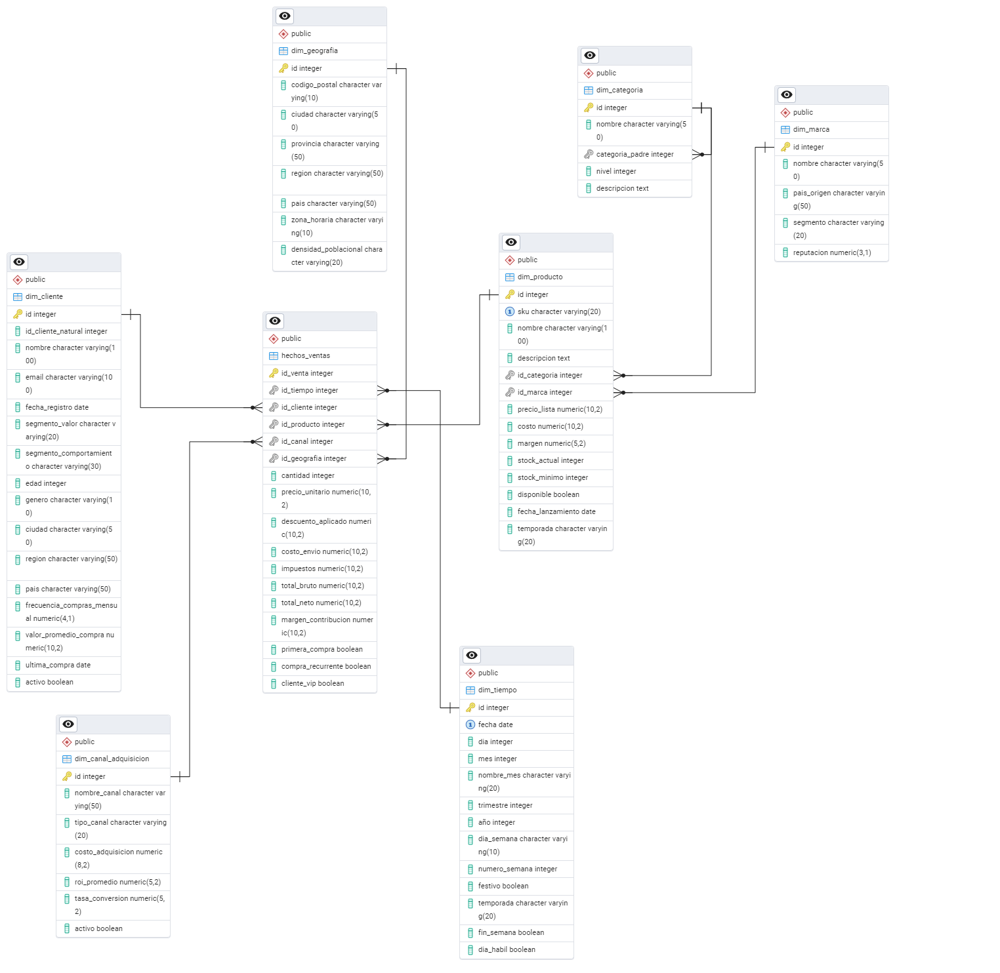

# Ejercicio: Diseño de esquema dimensional completo para análisis de e-commerce

## Análisis de requisitos y diseño conceptual:

```sql
-- Diseño de Star Schema para plataforma de e-commerce
-- Requisitos identificados:
-- - Análisis de ventas por producto, cliente, tiempo y ubicación
-- - Segmentación por categorías y comportamiento de compra
-- - Métricas: ventas, conversiones, retención, valor de vida del cliente

-- 1. Tabla de Hechos: Ventas transaccionales
CREATE TABLE hechos_ventas (
    id_venta INTEGER PRIMARY KEY,
    id_tiempo INTEGER REFERENCES dim_tiempo(id),
    id_cliente INTEGER REFERENCES dim_cliente(id),
    id_producto INTEGER REFERENCES dim_producto(id),
    id_canal INTEGER REFERENCES dim_canal_adquisicion(id),
    id_geografia INTEGER REFERENCES dim_geografia(id),
    
    -- Métricas transaccionales
    cantidad INTEGER,
    precio_unitario DECIMAL(10,2),
    descuento_aplicado DECIMAL(10,2),
    costo_envio DECIMAL(10,2),
    impuestos DECIMAL(10,2),
    
    -- Métricas calculadas (desnormalizadas para performance)
    total_bruto DECIMAL(10,2) GENERATED ALWAYS AS (cantidad * precio_unitario),
    total_neto DECIMAL(10,2) GENERATED ALWAYS AS ((cantidad * precio_unitario) - descuento_aplicado + costo_envio + impuestos),
    margen_contribucion DECIMAL(10,2) GENERATED ALWAYS AS ((cantidad * precio_unitario) - descuento_aplicado - costo_envio) * 0.3,
    
    -- Flags para segmentación rápida
    primera_compra BOOLEAN,
    compra_recurrente BOOLEAN,
    cliente_vip BOOLEAN
);

-- 2. Dimensión Tiempo: Jerarquía temporal completa
CREATE TABLE dim_tiempo (
    id INTEGER PRIMARY KEY,
    fecha DATE UNIQUE,
    dia INTEGER,
    mes INTEGER,
    nombre_mes VARCHAR(20),
    trimestre INTEGER,
    año INTEGER,
    dia_semana VARCHAR(10),
    numero_semana INTEGER,
    festivo BOOLEAN,
    temporada VARCHAR(20),  -- Primavera, Verano, etc.
    fin_semana BOOLEAN,
    dia_habil BOOLEAN
);

-- 3. Dimensión Cliente: Segmentación completa
CREATE TABLE dim_cliente (
    id INTEGER PRIMARY KEY,
    id_cliente_natural INTEGER,  -- Para SCD Tipo 2
    nombre VARCHAR(100),
    email VARCHAR(100),
    fecha_registro DATE,
    segmento_valor VARCHAR(20),  -- Bronce, Plata, Oro, Platino
    segmento_comportamiento VARCHAR(30),  -- Nuevo, Recurrente, VIP, Inactivo
    edad INTEGER,
    genero VARCHAR(10),
    ciudad VARCHAR(50),
    region VARCHAR(50),
    pais VARCHAR(50),
    frecuencia_compras_mensual DECIMAL(4,1),
    valor_promedio_compra DECIMAL(10,2),
    ultima_compra DATE,
    activo BOOLEAN
);

-- 4. Dimensión Producto: Jerarquía de catálogo
CREATE TABLE dim_producto (
    id INTEGER PRIMARY KEY,
    sku VARCHAR(20) UNIQUE,
    nombre VARCHAR(100),
    descripcion TEXT,
    id_categoria INTEGER REFERENCES dim_categoria(id),
    id_marca INTEGER REFERENCES dim_marca(id),
    precio_lista DECIMAL(10,2),
    costo DECIMAL(10,2),
    margen DECIMAL(5,2),
    stock_actual INTEGER,
    stock_minimo INTEGER,
    disponible BOOLEAN,
    fecha_lanzamiento DATE,
    temporada VARCHAR(20)
);

-- 5. Dimensión Geografía: Ubicación jerárquica
CREATE TABLE dim_geografia (
    id INTEGER PRIMARY KEY,
    codigo_postal VARCHAR(10),
    ciudad VARCHAR(50),
    provincia VARCHAR(50),
    region VARCHAR(50),
    pais VARCHAR(50),
    zona_horaria VARCHAR(10),
    densidad_poblacional VARCHAR(20)
);

-- 6. Dimensión Canal: Marketing y adquisición
CREATE TABLE dim_canal_adquisicion (
    id INTEGER PRIMARY KEY,
    nombre_canal VARCHAR(50),
    tipo_canal VARCHAR(20),  -- Pago, Orgánico, Social, Email, etc.
    costo_adquisicion DECIMAL(8,2),
    roi_promedio DECIMAL(5,2),
    tasa_conversion DECIMAL(5,2),
    activo BOOLEAN
);

-- 7. Tablas de soporte para jerarquías
CREATE TABLE dim_categoria (
    id INTEGER PRIMARY KEY,
    nombre VARCHAR(50),
    categoria_padre INTEGER REFERENCES dim_categoria(id),  -- Para jerarquía
    nivel INTEGER,  -- 1=Principal, 2=Subcategoria, etc.
    descripcion TEXT
);

CREATE TABLE dim_marca (
    id INTEGER PRIMARY KEY,
    nombre VARCHAR(50),
    pais_origen VARCHAR(50),
    segmento VARCHAR(20),  -- Premium, Medio, Económico
    reputacion DECIMAL(3,1)  -- Puntuación 1-10
);
```

>[!IMPORTANT]
> Ojo con el orden de ejecución para que las FK no fallen. No se debe ejecutar primero ``hechos_ventas`` porque referencia tablas ``dim*`` que aún no existen.
> Orden recomendado:
> - dim_categoria, dim_marca
> - dim_tiempo, dim_cliente, dim_geografia, dim_canal_adquisicion
> - dim_producto (porque referencia marca/categoría)
> - hechos_ventas





>[!NOTE]
> Star Schema y Snowflake Schema son ambos modelos dimensionales. La diferencia es el grado de normalización de las dimensiones. Ambos viven en el mundo OLAP y no OLTP.

1. Star Schema: 

- Tabla de hechos al centro
- Dimensiones desnormalizadas
- Una tabla por dimensión

Ejemplo:

```
hechos_ventas
 ├─ dim_cliente
 ├─ dim_producto
 ├─ dim_tiempo
 └─ dim_geografia
```

 2. Snowflake Schema:
 
 - Tabla de hechos al centro
 - Dimensiones normalizadas en subdimensiones
 - Jerarquías explícitas

Ejemplo:

```
 hechos_ventas
 └─ dim_producto
       ├─ dim_categoria
       └─ dim_marca
```

Aunque el Snowflake Schema introduce normalización en las dimensiones, sigue siendo un modelo dimensional orientado a OLAP. La diferencia con el Star Schema radica en que el Snowflake normaliza jerarquías dimensionales para reducir redundancia, mientras que el Star Schema mantiene dimensiones desnormalizadas para simplificar consultas y mejorar el rendimiento.


>[!NOTE]
> En un modelo dimensional, las dimensiones son tablas que contienen atributos descriptivos que proporcionan contexto a las métricas almacenadas en la tabla de hechos. Permiten analizar los datos desde distintas perspectivas como tiempo, cliente, producto o ubicación, y suelen incluir jerarquías que facilitan el análisis agregado.

>[!NOTE]
> Una tala de hechos es la tabla central de un modelo dimencional que almacena las métricas medibles del negocio y las conecta con las dimensiones (mediante claves foráneas). Responde a la pregunta ¿cuánto ocurrió? 


En este caso, la tabla de hechos es ``hechos_ventas``. Cada fila representa un evento medible del negocio: una venta de un producto, a un cliente, en una fecha, por un canal, en un lugar. El modelo propuesto es un esquema dimensional híbrido. Mantiene una estructura de tipo Star Schema, con una tabla de hechos central y dimensiones principales desnormalizadas, pero incorpora normalización parcial en la dimensión producto mediante tablas auxiliares de categoría y marca, siguiendo un enfoque tipo Snowflake.

>[!NOTE]
> Las dimensiones explican el contexto.
>
> La tabla de hechos contiene los números que se analizan.


## Comparación de consultas: Normalizado vs Dimensional:

```sql
-- Consulta en esquema NORMALIZADO (complejo, lento)
SELECT 
    c.nombre_cliente,
    p.nombre_producto,
    cat.nombre_categoria,
    SUM(v.cantidad * v.precio_unitario) as total_ventas,
    AVG(v.cantidad * v.precio_unitario) as ticket_promedio
FROM ventas v
JOIN clientes c ON v.id_cliente = c.id
JOIN productos p ON v.id_producto = p.id
JOIN categorias cat ON p.id_categoria = cat.id
WHERE v.fecha_venta BETWEEN '2024-01-01' AND '2024-12-31'
GROUP BY c.nombre_cliente, p.nombre_producto, cat.nombre_categoria
ORDER BY total_ventas DESC;

-- Consulta en esquema DIMENSIONAL (simple, rápido)
SELECT 
    dc.nombre as cliente,
    dp.nombre as producto,
    dcat.nombre as categoria,
    SUM(hv.total_neto) as total_ventas,
    AVG(hv.total_neto) as ticket_promedio
FROM hechos_ventas hv
JOIN dim_tiempo dt ON hv.id_tiempo = dt.id
JOIN dim_cliente dc ON hv.id_cliente = dc.id
JOIN dim_producto dp ON hv.id_producto = dp.id
JOIN dim_categoria dcat ON dp.id_categoria = dcat.id
WHERE dt.año = 2024
GROUP BY dc.nombre, dp.nombre, dcat.nombre
ORDER BY total_ventas DESC;
```

El objetivo de este bloque es mostrar por qué un esquema dimensional es preferible para análisis y BI frente a un esquema normalizado transaccional.

La consulta en el esquema normalizado requiere múltiples joins y cálculos dinámicos, lo que la hace más compleja y menos eficiente para análisis históricos. En cambio, el esquema dimensional centraliza las métricas en una tabla de hechos y utiliza dimensiones desnormalizadas, simplificando las consultas y mejorando el rendimiento en escenarios analíticos y de BI.


### Apuntes

OLTP: Online Transaction Processing (Procesamiento de Transacciones en Línea). Son bases de datos pensadas para operar el negocio en tiempo real, no para analizarlo.

Un sistema OLTP está diseñado para registrar muchas transacciones pequeñas en tiempo real, con alta concurrencia (muchos usuarios a la vez) y priorizando la consistencia e integridad de los datos. Estos modelos suelen ser normalizados porque buscan evitar duplicación de datos, mantener integridad referencial y facilitar actualizaciones frecuentas. Esto implica muchas tablas, muchas claves foráneas y muchos JOIN para recontruir información. OLTP sirve para ejecutar el negocio.

OLAP: Online Analytical Processing (Procesamiento Analítico en Línea). Son bases de datos que sirven para analizar el negocio, no para operarlo.

Un sistema OLAP está diseñado para analizar grandes volúmenes de datos históricos, realizar agregaciones (como SUM, AVG, COUT, etc), comparar información en el tiempo, detectar tendencias, patrones y comportamientos y apoyar la toma de decisiones. Las consultas sueles ser más largas, con muchos ``GROUP BY`` y filtros temporales.


## Análisis de trade-offs y recomendaciones:

```sql
-- Ventajas del diseño dimensional:
-- 1. Consultas más simples y legibles
-- 2. Performance superior para agregaciones
-- 3. Optimizado para herramientas BI
-- 4. Fácil de entender para analistas de negocio

-- Desventajas:
-- 1. Mayor redundancia de datos
-- 2. Más complejo mantenimiento de dimensiones
-- 3. Menos flexible para cambios estructurales

-- Recomendaciones de implementación:

-- 1. Indices estratégicos para performance
CREATE INDEX idx_hechos_tiempo ON hechos_ventas(id_tiempo);
CREATE INDEX idx_hechos_cliente ON hechos_ventas(id_cliente);
CREATE INDEX idx_hechos_producto ON hechos_ventas(id_producto);
CREATE INDEX idx_dimensiones_compuestas ON hechos_ventas(id_tiempo, id_cliente, id_producto);

-- 2. Particionamiento por tiempo para datasets grandes
CREATE TABLE hechos_ventas_y2024 PARTITION OF hechos_ventas
    FOR VALUES FROM ('2024-01-01') TO ('2025-01-01');

-- 3. Vistas materializadas para consultas frecuentes
CREATE MATERIALIZED VIEW mv_ventas_mensuales AS
SELECT 
    dt.año,
    dt.mes,
    SUM(hv.total_neto) as ventas_total,
    COUNT(DISTINCT hv.id_cliente) as clientes_unicos,
    AVG(hv.total_neto) as ticket_promedio
FROM hechos_ventas hv
JOIN dim_tiempo dt ON hv.id_tiempo = dt.id
GROUP BY dt.año, dt.mes;

-- 4. Constraints para integridad
ALTER TABLE hechos_ventas ADD CONSTRAINT ck_total_neto_positivo 
    CHECK (total_neto > 0);
ALTER TABLE dim_cliente ADD CONSTRAINT ck_segmento_valido 
    CHECK (segmento_valor IN ('Bronce', 'Plata', 'Oro', 'Platino'));
```

El diseño dimensional, basado en un esquema Star Schema (con posibles extensiones tipo Snowflake), está orientado específicamente al análisis de datos históricos y a la toma de decisiones, más que a la operación diaria del sistema. Su estructura prioriza la simplicidad de las consultas, el rendimiento en agregaciones y la facilidad de uso para analistas y herramientas de Business Intelligence.

### Ventajas 
El esquema dimensional simplifica las consultas analíticas al centralizar las métricas en una única tabla de hechos y separar el contexto en dimensiones claramente definidas. Esto permite escribir consultas con menos JOIN, filtros más intuitivos y expresiones agregadas más legibles.

Además, el diseño dimensional está optimizado para el rendimiento en escenarios analíticos, ya que:
- Las métricas suelen estar precalculadas o desnormalizadas.
- Las dimensiones cambian lentamente, reduciendo la necesidad de escrituras frecuentes.
- Se favorece el uso de índices y vistas materializadas para acelerar consultas recurrentes.

Otra ventaja relevante es que este modelo es naturalmente compatible con herramientas BI, como Power BI o Tableau, que están diseñadas para trabajar con tablas de hechos y dimensiones, facilitando la exploración de datos por usuarios no técnicos.

### Desventajas
Como contraparte, el esquema dimensional introduce mayor redundancia de datos, especialmente en dimensiones desnormalizadas, lo que incrementa el espacio de almacenamiento. 

Finalmente, el diseño dimensional es menos flexible para cambios estructurales profundos, ya que modificar la granularidad o redefinir métricas suele implicar cambios importantes en la tabla de hechos.


## Respuestas de verificación

**¿Cómo el diseño dimensional simplifica consultas analíticas complejas?**
El diseño dimensional simplifica las consultas analíticas al concentrar las métricas en una tabla de hechos y utilizar dimensiones desnormalizadas que proporcionan el contexto de análisis. Esto reduce significativamente el número de JOIN necesarios y permite expresar agregaciones y filtros de forma directa, especialmente en análisis temporales, por cliente o por producto. Como resultado, las consultas son más legibles, más fáciles de mantener y más eficientes en términos de rendimiento.

**¿Por qué este esquema está optimizado para análisis y no para operaciones transaccionales?**

Este esquema está optimizado para análisis porque prioriza la lectura de grandes volúmenes de datos históricos y las agregaciones complejas, en lugar de operaciones frecuentes de inserción y actualización. A diferencia de los modelos OLTP normalizados, el diseño dimensional acepta redundancia y desnormalización para mejorar la velocidad de consulta y facilitar el análisis multidimensional. Por ello, es ideal para OLAP y Business Intelligence, pero no para soportar transacciones en tiempo real ni alta concurrencia operativa.

---
Verificación: Compara cómo el diseño dimensional simplifica consultas analíticas complejas, y explica por qué este esquema está optimizado específicamente para análisis en lugar de operaciones transaccionales.

Requerimientos:
- PostgreSQL o MySQL para ejemplos prácticos
- DBeaver o pgAdmin para diseño visual
- Conocimientos básicos de SQL DDL
- Entorno de desarrollo de bases de datos