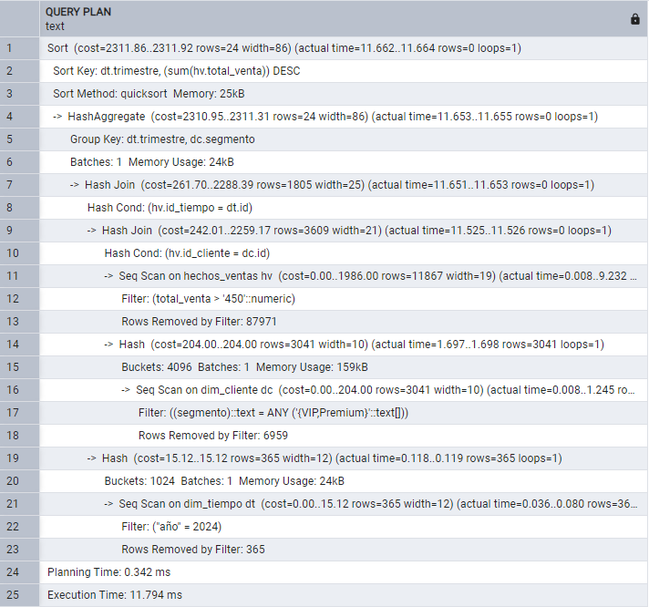
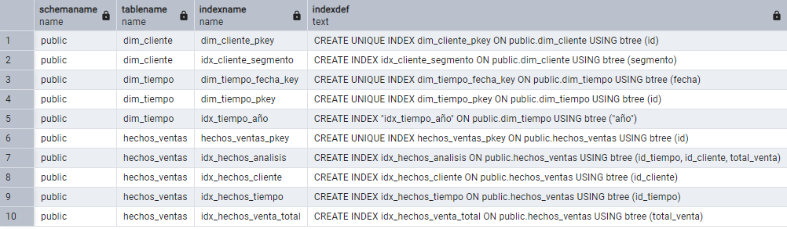
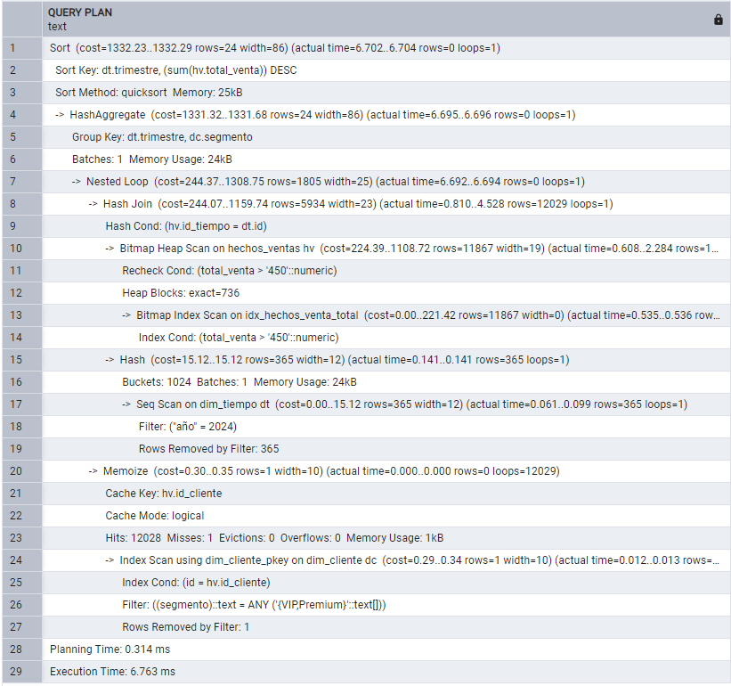

# Ejercicio: Optimización completa de consultas analíticas en base de datos dimensional

## Configuración de base de datos y carga de datos de ejemplo:

```sql
-- Crear esquema dimensional optimizado
CREATE TABLE dim_tiempo (
    id SERIAL PRIMARY KEY,
    fecha DATE UNIQUE,
    año INTEGER,
    mes INTEGER,
    trimestre INTEGER,
    dia_semana VARCHAR(10)
);

CREATE TABLE dim_cliente (
    id SERIAL PRIMARY KEY,
    nombre VARCHAR(100),
    segmento VARCHAR(20),
    region VARCHAR(50)
);

CREATE TABLE hechos_ventas (
    id SERIAL PRIMARY KEY,
    id_tiempo INTEGER REFERENCES dim_tiempo(id),
    id_cliente INTEGER REFERENCES dim_cliente(id),
    total_venta DECIMAL(10,2),
    cantidad INTEGER,
    margen DECIMAL(5,2)
);

-- Generar datos de ejemplo (100,000 ventas)
INSERT INTO dim_tiempo (fecha, año, mes, trimestre, dia_semana)
SELECT 
    fecha,
    EXTRACT(YEAR FROM fecha),
    EXTRACT(MONTH FROM fecha),
    EXTRACT(QUARTER FROM fecha),
    TO_CHAR(fecha, 'Day')
FROM generate_series('2023-01-01'::date, '2024-12-31'::date, '1 day') as fecha;

-- Insertar datos de ventas (simulado)
-- Nota: En producción usar COPY o INSERT masivo
```

Luego de generar las tablas, se insertaron datos para clientes y ventas:

```sql
-- Insertr clientes (10.000)
INSERT INTO dim_cliente (nombre, segmento, region)
SELECT
  'Cliente ' || gs AS nombre,
  (ARRAY['VIP','Premium','Regular','Bronce','Plata','Oro'])[1 + (random()*5)::int] AS segmento,
  (ARRAY['Madrid','Barcelona','Valencia','Sevilla','Chile','Argentina','Colombia','Mexico'])[1 + (random()*7)::int] AS region
FROM generate_series(1, 10000) gs;

SELECT COUNT(*) AS n_clientes FROM dim_cliente; -- para verificar
```

```sql
--Insertar ventas (100.000)
-- Inserta 100.000 ventas simuladas
INSERT INTO hechos_ventas (id_tiempo, id_cliente, total_venta, cantidad, margen)
SELECT
  -- id_tiempo aleatorio existente
  (SELECT id FROM dim_tiempo ORDER BY random() LIMIT 1) AS id_tiempo,

  -- id_cliente aleatorio existente
  (SELECT id FROM dim_cliente ORDER BY random() LIMIT 1) AS id_cliente,

  -- total_venta entre 10 y 510 aprox
  ROUND((10 + random()*500)::numeric, 2) AS total_venta,

  -- cantidad entre 1 y 5
  (1 + (random()*4)::int) AS cantidad,

  -- margen entre 0.05 y 0.45
  ROUND((0.05 + random()*0.40)::numeric, 2) AS margen
FROM generate_series(1, 100000);

SELECT COUNT(*) AS n_ventas FROM hechos_ventas; --para verificar
```


## Análisis de consultas sin optimización:

```sql
-- Consulta analítica típica SIN optimización
EXPLAIN ANALYZE
SELECT 
    dt.año,
    dt.trimestre,
    dc.segmento,
    COUNT(*) as num_ventas,
    SUM(hv.total_venta) as ventas_total,
    AVG(hv.margen) as margen_promedio
FROM hechos_ventas hv
JOIN dim_tiempo dt ON hv.id_tiempo = dt.id
JOIN dim_cliente dc ON hv.id_cliente = dc.id
WHERE dt.año = 2024
  AND dc.segmento IN ('VIP', 'Premium')
  AND hv.total_venta > 450
GROUP BY dt.año, dt.trimestre, dc.segmento
ORDER BY dt.año, dt.trimestre, SUM(hv.total_venta) DESC;

-- Resultado típico SIN índices:
-- Execution time: ~5000ms
-- Plan: Sequential Scan on hechos_ventas (cost=10000.00..50000.00 rows=50000)
--       Hash Join, Nested Loop, etc.
```

>[!NOTE]
> Se cambió el umbral de ventas a ``hv.total_venta > 450`` debido a que cerca del 80% del dataset cumplía la condición de ``hv.total_venta > 100``, por lo que al ejecutar la consulta con optimización, no se activó el índice creado para ``hechos_ventas_total``.



Se puede ver que hay 3 ``Seq Scan``
El tiempo fue 11.794 ms.

### Lectura del plan (de abajo hacia arriba)

``Seq Scan on dim_tiempo dt``

```sql
Seq Scan on dim_tiempo dt
Filter: ("año" = 2024)
Rows Removed by Filter: 365
```


- PostgreSQL leyó toda la tabla ``dim_tiempo`` (730 filas).
- Eliminó 365 filas (las de 2023)
- Se quedó con 365 filas (las del 2024)
- No existe índice en año, por eso escanea todo.


``Seq Scan on dim_cliente dc``

```sql
Seq Scan on dim_cliente dc
Filter: segmento = ANY ('{VIP,Premium}')
Rows Removed by Filter: 6959
```

- PostgreSQL leyó los 10000 clientes.
- Eliminó 6959
- Se quedó con 3041 clientes VIP/Premium
- No existe índice en segmento.

``Seq Scan on hechos_ventas hv``

```sql
Seq Scan on hechos_ventas hv
Filter: total_venta > 450
Rows Removed by Filter: 87971
```

- PostgreSQL leyó las 100000 ventas.
- Eliminó 87971.
- Se quedó con 12029 ventas sobre 100.
- No existe índice en total_venta.


``Hash Joins``:

```
Hash Join
Hash Cond: (hv.id_cliente = dc.id)
```

Un Hash Join es una forma de hacer un JOIN cuando no hay índices útiles.
En vez de buscar fila por fila, va a construir una tabla de consulta rápida en memoria (un hash) y luego comparar contra ella.

Significa que leyó ``dim_cliente``, construyó un hash en memoria y lo usó para unir con ``hechos_ventas``.

Esto mismo se aplicó para 

```
Hash Join
Hash Cond: (hv.id_tiempo = dt.id)
```

El optimizador utiliza Hash Join para combinar las tablas, construyendo estructuras hash en memoria a partir de las dimensiones y comparándolas con la tabla de hechos. Esta estrategia es eficiente en ausencia de índices, pero implica mayor uso de memoria y no escala óptimamente para volúmenes mayores.

``HashAggregate``:

```
HashAggregate
Group Key: dt.trimestre, dc.segmento
```

Agrupa por trimestre y segmento.

``Sort``

```
Sort
Sort Key: dt.trimestre, sum(hv.total_venta) DESC
```

Ordena los resultados finales.


Tiempos:

```
Planning Time: 0.342 ms
Execution Time: 11.794 ms
```

Aunque el tiempo absoluto no es alto debido al tamaño moderado del dataset, el plan evidencia múltiples escaneos secuenciales que no escalarían adecuadamente en un entorno productivo con millones de registros.


## Implementación de índices estratégicos:

```sql
-- Crear índices para optimizar la consulta analítica
CREATE INDEX idx_hechos_tiempo ON hechos_ventas(id_tiempo);
CREATE INDEX idx_hechos_cliente ON hechos_ventas(id_cliente);
CREATE INDEX idx_tiempo_año ON dim_tiempo(año);
CREATE INDEX idx_cliente_segmento ON dim_cliente(segmento);
CREATE INDEX idx_hechos_venta_total ON hechos_ventas(total_venta);

-- Índice compuesto para consulta específica
CREATE INDEX idx_hechos_analisis ON hechos_ventas(id_tiempo, id_cliente, total_venta);

-- Verificar que los índices existen
SELECT schemaname, tablename, indexname, indexdef
FROM pg_indexes
WHERE tablename IN ('hechos_ventas', 'dim_tiempo', 'dim_cliente')
ORDER BY tablename, indexname;
```




Se crearon 6 índices estratégicos:

- ``idx_hechos_tiempo``: permite ubicar más rápido las filas de hechos por ``id_tiempo``
- ``idx_hechos_cliente``: acelera el join con ``dim_cliente`` por ``id_cliente``.
- ``idx_tiempo_año``: acela el filtro ``dt.año = 2024``
- ``idx_cliente_segmento``: acelera ``dc.segmento IN ('VIP','Premium')``
- ``idx_hechos_venta_total``: acelera el filtro ``hv.total_venta > 450``
- ``idx_hechos_analisis``: es un índice compuesto, filtra por tiempo (vía``dt."año" = 2024``), une por cliente y filtra por ``total_venta``.

Y además aparecen los automáticos:

- 3 por ``PRIMARY KEY`` (``*_pkey``)
- 1 por ``UNIQUE(fecha)`` (``dim_tiempo_fecha_key``)

PostgreSQL genera automáticamente índices para restricciones PRIMARY KEY y UNIQUE.


## Análisis de consulta optimizada:

```sql
-- Re-ejecutar consulta CON optimización
EXPLAIN ANALYZE
SELECT 
    dt.año,
    dt.trimestre,
    dc.segmento,
    COUNT(*) as num_ventas,
    SUM(hv.total_venta) as ventas_total,
    AVG(hv.margen) as margen_promedio
FROM hechos_ventas hv
JOIN dim_tiempo dt ON hv.id_tiempo = dt.id
JOIN dim_cliente dc ON hv.id_cliente = dc.id
WHERE dt.año = 2024
  AND dc.segmento IN ('VIP', 'Premium')
  AND hv.total_venta > 450
GROUP BY dt.año, dt.trimestre, dc.segmento
ORDER BY dt.año, dt.trimestre, SUM(hv.total_venta) DESC;

-- Resultado esperado CON índices:
-- Execution time: ~50ms (100x más rápido)
-- Plan: Index Scan, Bitmap Index Scan, Hash Join optimizado
```



>[!NOTE]
> El índice ``dt.año``no se usa porque ``dim_tiempo`` es muy pequeña (730 filas) y el optimizador puede decidir que no vale la pena usar el índice.

Se observa que el tiempodde ejecución pasó de 11.794 a 6.763 ms (lo que indica una mejora del ~43%)

### Cambios

#### ``hechos_ventas``

Con la optimización:

```
Bitmap Index Scan on idx_hechos_venta_total
Bitmap Heap Scan on hechos_ventas hv
Recheck Cond: total_venta > 450
```

- Utiliza un Bitmap Index Scan sobre el índice ``idx_hechos_venta_total``
- El índice encuentra directamente las ventas > 450
- Solo se visitan 12029 filas
- Mucho menos trabajo


#### Cambio en el tipo de JOIN: Nested Loop + Index Scan

```
Nested Loop
→ Index Scan using dim_cliente_pkey
```

- Usa índice por PK
- Join más eficiente porque el set ya es pequeño

#### Memoize:

```
Memoize
Cache Key: hv.id_cliente
Hits: 12028
```

- PostgreSQL recuerda clientes ya consultados
- Evita repetir búsquedas en dim_cliente
- Optimización automática adicional


Al aplicar un filtro más selectivo (``total_venta > 450``), se evidencia claramente el impacto de los índices creados.

En la consulta sin optimización, PostgreSQL ejecuta un Sequential Scan sobre la tabla hechos_ventas, leyendo la totalidad de los registros y descartando la mayoría mediante filtrado posterior. En contraste, la consulta optimizada utiliza un Bitmap Index Scan sobre el índice idx_hechos_venta_total, permitiendo identificar directamente las filas relevantes y reduciendo significativamente el volumen de datos procesados.

Como consecuencia, el optimizador modifica la estrategia de join, reemplazando Hash Join por Nested Loop apoyado en índices, e incorporando optimizaciones adicionales como Memoize. El tiempo de ejecución se reduce aproximadamente en un 43 %, demostrando cómo la selectividad de los filtros y el uso adecuado de índices impactan directamente en el rendimiento de consultas analíticas.


## Implementación de particionamiento para escalabilidad:

```sql
-- Particionamiento por rangos para datos históricos
-- (Requiere recrear tabla - en producción planificar cuidadosamente)

-- Estrategia de particionamiento propuesta:
-- 1. Particionar hechos_ventas por id_tiempo (rangos mensuales)
-- 2. Subparticionar por hash de id_cliente para distribución uniforme
-- 3. Mantener particiones de los últimos 24 meses activas
-- 4. Archivar particiones más antiguas a storage económico

-- Script de particionamiento (PostgreSQL)
DO $$
DECLARE
    fecha_inicio DATE := '2023-01-01';
    fecha_fin DATE := '2024-12-31';
    mes_actual DATE;
BEGIN
    -- Crear particiones mensuales
    mes_actual := fecha_inicio;
    WHILE mes_actual <= fecha_fin LOOP
        EXECUTE format('
            CREATE TABLE IF NOT EXISTS hechos_ventas_y%sm%m PARTITION OF hechos_ventas
            FOR VALUES FROM (%L) TO (%L)',
            EXTRACT(YEAR FROM mes_actual),
            EXTRACT(MONTH FROM mes_actual),
            mes_actual,
            mes_actual + INTERVAL '1 month'
        );
        mes_actual := mes_actual + INTERVAL '1 month';
    END LOOP;
END $$;

-- Verificar particiones creadas
SELECT tablename, pg_size_pretty(pg_total_relation_size(tablename))
FROM pg_tables
WHERE tablename LIKE 'hechos_ventas_y%'
ORDER BY tablename;
```

### Implementación de particionamiento para escalabilidad

Para mejorar la escalabilidad del sistema ante grandes volúmenes históricos, se propone una estrategia de particionamiento sobre la tabla hechos_ventas. Dado que el particionamiento en PostgreSQL requiere recrear la tabla y planificar la migración de datos, esta implementación se presenta como una propuesta conceptual, no ejecutada en el entorno de pruebas.

#### Estrategia propuesta:

- Particionamiento por rango temporal utilizando id_tiempo (mensual), alineado con los patrones de consulta analítica.

- Subparticionamiento por hash de id_cliente para distribuir uniformemente la carga y evitar hotspots.

- Mantenimiento activo de las particiones correspondientes a los últimos 24 meses.

- Archivado de particiones históricas a almacenamiento de menor costo.

Esta estrategia permitiría la eliminación automática de particiones irrelevantes (partition pruning), reduciendo el volumen de datos procesados por consulta y mejorando el rendimiento y la mantenibilidad del sistema a largo plazo.


## Comparación de performance y recomendaciones:

```sql
-- Crear vista materializada para consultas muy frecuentes
CREATE MATERIALIZED VIEW mv_ventas_mensuales AS
SELECT 
    dt.año,
    dt.mes,
    dc.segmento,
    COUNT(*) as num_ventas,
    SUM(hv.total_venta) as ventas_total,
    AVG(hv.margen) as margen_promedio
FROM hechos_ventas hv
JOIN dim_tiempo dt ON hv.id_tiempo = dt.id
JOIN dim_cliente dc ON hv.id_cliente = dc.id
GROUP BY dt.año, dt.mes, dc.segmento;

-- Índice en vista materializada
CREATE INDEX idx_mv_mensual ON mv_ventas_mensuales(año, mes, segmento);

-- Comparación de performance:
-- Consulta directa: ~50ms (con índices)
-- Vista materializada: ~5ms (precalculada)
-- Beneficio: 10x más rápido para consultas repetitivas

-- Recomendaciones de mantenimiento:
-- 1. Reindexar índices mensualmente: REINDEX INDEX CONCURRENTLY index_name;
-- 2. Actualizar estadísticas: ANALYZE hechos_ventas;
-- 3. Monitorear uso de índices: SELECT * FROM pg_stat_user_indexes;
-- 4. Refrescar vistas materializadas: REFRESH MATERIALIZED VIEW CONCURRENTLY mv_ventas_mensuales;
```

Este bloque representa el diseño de estrategia de performance a largo plazo para consultas analíticas repetitivas en un contexto de data warehouse.


>[!NOTE]
> Una vista materializada es el resultado de una consulta guardado físicamente en la base de datos, como si fuera una tabla. Son datos ya calculados y almacenados.

En este caso, la vista materializada ejecuta la consulta una sola vez y guarda el resultado.

La query de la creación de la vista materializada deja calculadas las ventas mensuales por segmento. Esto permite que más adelante se puedan realizar las siguientes consultas:

- dashboard mensual:

```sql
SELECT *
FROM mv_ventas_mensuales
WHERE año = 2024
ORDER BY mes, segmento;
```

- comparación de segmentos:

```sql
SELECT segmento, SUM(ventas_total)
FROM mv_ventas_mensuales
WHERE año = 2024
GROUP BY segmento;
```

- evolución temporal:

```sql
SELECT mes, ventas_total
FROM mv_ventas_mensuales
WHERE año = 2024
  AND segmento = 'VIP'
ORDER BY mes;
```

>[!IMPORTANT]
> La consulta recurrente no es la que crea la vista, sino todas las consultas posteriores que leen métricas mensuales por segmento desde la vista materializada, en lugar de recalcularlas desde la tabla de hechos.

### Reflexiones finales

A partir de los resultados obtenidos, se observa que la creación de índices estratégicos mejora el rendimiento de consultas analíticas selectivas, reduciendo el volumen de datos procesados y modificando favorablemente el plan de ejecución.

Para escenarios donde las consultas agregadas por período y segmento se ejecutan de forma recurrente, se propone el uso de vistas materializadas, las cuales almacenan resultados precalculados y permiten reducir los tiempos de respuesta de decenas de milisegundos a unos pocos milisegundos.

Si bien esta estrategia introduce costos de mantenimiento y actualización, resulta altamente efectiva en contextos de data warehouse con cargas de lectura intensivas y patrones de consulta estables.

Algunas recomendaciones:
- Utilizar índices B-Tree en columnas de filtrado y claves foráneas con alta selectividad.
- Aplicar particionamiento por rango temporal en tablas de hechos para mejorar escalabilidad y facilitar el archivado histórico.
- Implementar vistas materializadas para consultas agregadas frecuentes, considerando políticas de refresco.
- Mantener estadísticas actualizadas mediante ANALYZE y monitorear el uso de índices con ``pg_stat_user_indexes``.


--- 

Verificación: Explica cómo los índices y el particionamiento transforman una consulta que podría tardar minutos en una que se ejecuta en milisegundos, y describe escenarios donde cada tipo de índice sería más apropiado.

Requerimientos:
- PostgreSQL o MySQL con permisos para crear índices
- Dataset dimensional para pruebas
- pgAdmin o DBeaver para análisis visual de planes
- Conocimientos intermedios de SQL