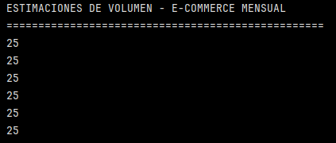
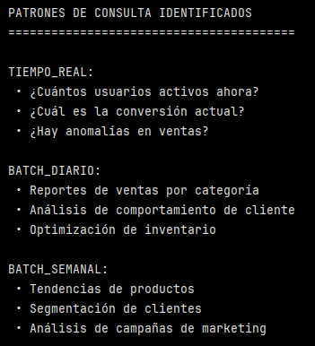
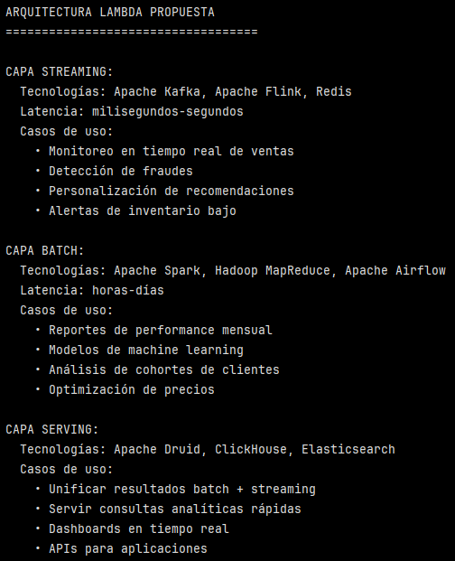
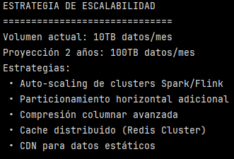

# Ejercicio: Diseño de arquitectura Big Data para análisis de e-commerce

## Análisis de requisitos y patrones de datos:

```python
# Análisis de volúmenes y patrones para e-commerce
import pandas as pd
import numpy as np

# Estimación de volúmenes para plataforma e-commerce
estimaciones_mensuales = {
    'eventos_usuario': 50000000,    # 50M eventos (clicks, views, etc.)
    'ordenes': 1000000,             # 1M órdenes
    'productos': 100000,            # 100K productos
    'clientes_activos': 5000000,    # 5M clientes activos
    'reviews': 500000,              # 500K reviews
    'logs_sistema': 100000000       # 100M logs diarios
}

print("ESTIMACIONES DE VOLUMEN - E-COMMERCE MENSUAL")
print("=" * 50)
for componente, volumen in estimaciones_mensuales.items():
    print("25")

# Patrones de consulta identificados
patrones_consulta = {
    'tiempo_real': [
        '¿Cuántos usuarios activos ahora?',
        '¿Cuál es la conversión actual?',
        '¿Hay anomalías en ventas?'
    ],
    'batch_diario': [
        'Reportes de ventas por categoría',
        'Análisis de comportamiento de cliente',
        'Optimización de inventario'
    ],
    'batch_semanal': [
        'Tendencias de productos',
        'Segmentación de clientes',
        'Análisis de campañas de marketing'
    ]
}

print("PATRONES DE CONSULTA IDENTIFICADOS") 
print("=" * 40) 

for frecuencia, consultas in patrones_consulta.items(): 
    print(f"\n{frecuencia.upper()}:") 
    
    for consulta in consultas: 
        print(f" • {consulta}")
```

Este bloque tiene como objetivo dimensionar el problema de datos (volumen, variedad, velocidad). Busca responder:

- ¿Cuántos datos se van a manejar?: volumen
- ¿A qué velocidad dse generan?: velocidad
- ¿Qué tipo de datos existen?: variedad



Este bloque también busca identificar patrones de consulta:

¿Cómo y cuándo se consultarán los datos?



Se identifican 3 patrones distintos:

- Tiempo real:
    
    - Usuarios activos hora
    - Conversión actual
    - Anomalías

    Esto implica:
        - Streaming
        - Procesamiento en tiempo real
        - Bases NoSQL o motores analíticos rápidos

- Batch diario:
    
    - Reportes
    - Análisis de clientes
    - Inventario

    Esto implica:
    
    - ETL/ELT
    - Data Warehouse
    - Procesos programados

- Batch semanal:

    - Tendencias 
    - Segmentaciónn
    - Marketing

    Esto implica:
    
    - Análisis histórico
    - Machine learning (para predicción)
    - Data Lake

>[!NOTE]
> - Data Warehouse: es un repositorio estructurado y optimixado para análisis.
> - Data Lake: es un repositorio crudo y flexible de datos en su formato original.

**Data Warehouse:**

El Data Warehouse responde qué pasó y cómo está el negocio.

Características clave:
- Datos limpios, transformados y modelados
- Esquema definido (star / snowflake)
- Orientado a BI y reporting
- Alta performance para agregaciones

Ejemplos de uso:

- Ventas por mes/categoría
- KPIs ejecutivos
- Dashboards


**Data Lake:**

El Data Lake permite explorar por qué pasó y qué podría pasar.

Características clave:

- Datos estructurados, semi y no estructurados
- Schema-on-read (el esquema se aplica al leer)
- Escalable y más barato
- Base para ciencia de datos y ML

Ejemplos de datos:

- Clickstream
- Logs
- Reviews en texto
- Eventos de usuario

Finalmente, el objetivo de esta sección es establecer los requisitos de volumen y uso de datos que justifican una arquitectura Big Data híbrida (streaming + batch) para un e-commerce.


## Diseño de arquitectura híbrida Lambda:

```python
# Arquitectura Lambda para e-commerce
arquitectura_lambda = {
    'capa_streaming': {
        'tecnologias': ['Apache Kafka', 'Apache Flink', 'Redis'],
        'casos_uso': [
            'Monitoreo en tiempo real de ventas',
            'Detección de fraudes',
            'Personalización de recomendaciones',
            'Alertas de inventario bajo'
        ],
        'latencia': 'milisegundos-segundos',
        'datos': 'eventos individuales'
    },
    'capa_batch': {
        'tecnologias': ['Apache Spark', 'Hadoop MapReduce', 'Apache Airflow'],
        'casos_uso': [
            'Reportes de performance mensual',
            'Modelos de machine learning',
            'Análisis de cohortes de clientes',
            'Optimización de precios'
        ],
        'latencia': 'horas-días',
        'datos': 'datasets completos'
    },
    'capa_serving': {
        'tecnologias': ['Apache Druid', 'ClickHouse', 'Elasticsearch'],
        'casos_uso': [ #inicialmente decía 'funciones' pero se cambió para que en esta parte apareciera en el print.
            'Unificar resultados batch + streaming',
            'Servir consultas analíticas rápidas',
            'Dashboards en tiempo real',
            'APIs para aplicaciones'
        ]
    }
}

print("ARQUITECTURA LAMBDA PROPUESTA")
print("=" * 35)

for capa, detalles in arquitectura_lambda.items():
    print(f"\n{capa.upper().replace('_', ' ')}:")
    print(f"  Tecnologías: {', '.join(detalles['tecnologias'])}")
    if 'latencia' in detalles:
        print(f"  Latencia: {detalles['latencia']}")
    if 'casos_uso' in detalles:
        print("  Casos de uso:")
        for caso in detalles['casos_uso']:
            print(f"    • {caso}")
```

Esta sección tiene como objetivo construir una arquitectura Big Data híbrida tipo Lambda para un e-commerce, considerando casos de uso, latencia esperada y tecnologías utilizadas para cada capa. Separa el procesamiento en una capa de streaming para necesidaes de baja latencia (fraude, monitoreo, alertas), una capa batch para análisis históricos y entrenamiento de modelos y una capa serving para exponer resultados consolidados en consultas analíticas rápidas (dashboard y APIs). Estas capas son una forma estándar de cubrir simultáneamente velocidad y precisión.




La arquitectura lambda es un patrón clásico para manejar datos en streaming + batch al mismo tiempo. Cada tecnología cumple un rol específico dentro de la arquitectura Lambda:

1. Capa streaming: para responder rápido a lo que está pasando ahora.

Tecnologías:

- Apacha Kakfa: es un sistema de mensajería distribuido para manejar grandes volúmenes de eventos en tiempo real.

    Ejemplo: cada click o compra se envía a Kafka.

- Apache Flink: es un motor de procesamiento de datos en streaming (y también batch). Kafka recibe eventos, Flink los procesa mientras llegan.

    Ejemplo: Si un usuario hace 10 intentos de pago en 1 minuto, alerta.

- Redis: base de datos en memoria, ultra rápida. Es como un caché temporal o almacén temporal de datos que necesitan respuesta inmediata.

    Ejemplo: Usuarios activos ahora mismo.

>[!NOTE]
> Redis es open-source. AWS ofrece ElastiCache que es Redis administrado.
> Esto lo comento porque recuerdo haber tomado un curso de Fundamentos de Arquitectura Cloud y recordaba haber escuchado/visto Redis.


2. Capa batch: para cálculos pesados e históricos con datos completos.

- Apache Spark: es un motor de procesamiento distribuido para grandes volúmenes de datos. Sirve para análisis peados sobre millones o billones de registros.

    Ejemplo: Calcular cohortes de clientes de los dos últimos años.

>[!NOTE]
> Una cohorte es un grupo de clientes que comparten una característica común en el tiempo (ejemplo: primera compra). El análisis de cohortes sirve para estudiar su comportamiento a lo largo del tiempo, permitiendo evaluar retención, valor de vida del cliente y efectividad de campañas.

- Hadoop MapReduce: es el modelo clásico del procesamiento batch distribuido. Es más antiguo que Spark, por lo que es más lento, pero es muy robusto.

- Apache Airflow: es un orquestador de workflows. No procesa datos, coordina cuándo y en qué orden se ejecutan los procesos.

    Ejemplo: programar pipelines.

3. Capa serving: para servir consultas analíticas rápidas unificando resultados de ambas capas.

- Apache Druid: es una base de datos analítica optimizada para time-series. Muy usada para dashboard en tiempo casi real.

    Ejemplo: ventas por minuto/hora/día.

- ClickHouse: es una base de datos columnar analítica ultra rápida. Es ideal para consultas OLAP pesadas.

    Ejemplo: ventas por región, categoría, campaña, año.

    >[!NOTE]
    > Amazon Redshift es la alternativa que ofrece AWS. Es un Data Warehouse columnar administrado para análisis OLAP. En un entorno AWS, Amazon Redshift puede cumplir el rol de motor analítico equivalente a soluciones open-source como ClickHouse o Apache Druid, actuando como Data Warehouse y capa serving para consultas OLAP. Sin embargo, Redshift no reemplaza las capas de streaming ni batch, sino que consume datos previamente procesados por servicios como Kinesis, EMR o Airflow.

- Elasticsearch: es un motor de búsqueda y análisis. Permite búsqueda y filtros rápidos.

    Ejemplo: buscar errores del sistema o reviews con palabra clave.

>[!NOTE]
> Apache Software Foundation (ASF): es una organización sin fines de lucro que desarrolla software open-source, define estándares de calidad y mantienen proyectos colaborativas. Muchos proyectos Big Data están en Apache porque garantiza neutralidad (no depende de una empresa), fomenta la adopción masiva y facilita la integración entre proyectos.

## Estrategias de particionamiento y escalabilidad:

```sql
-- Estrategias de particionamiento para diferentes componentes

-- 1. Eventos de usuario (streaming + histórico)
-- Kafka topics particionados por tipo de evento
CREATE TABLE eventos_usuario (
    timestamp TIMESTAMP,
    user_id BIGINT,
    event_type VARCHAR(50),
    session_id VARCHAR(100),
    properties JSONB,
    -- Particionamiento por tiempo + hash para distribución
    PARTITION BY RANGE (timestamp) SUBPARTITION BY HASH (user_id)
);

-- 2. Órdenes de compra (transaccional + analítico)
CREATE TABLE ordenes (
    order_id BIGINT PRIMARY KEY,
    user_id BIGINT,
    order_date TIMESTAMP,
    total_amount DECIMAL(10,2),
    status VARCHAR(20),
    -- Particionamiento mensual para optimización temporal
    PARTITION BY RANGE (EXTRACT(YEAR_MONTH FROM order_date))
);

-- 3. Datos de productos (relacional + búsqueda)
-- Elasticsearch para búsqueda, PostgreSQL para datos maestros
CREATE TABLE productos (
    product_id BIGINT PRIMARY KEY,
    category_id INTEGER,
    name VARCHAR(200),
    price DECIMAL(10,2),
    stock_quantity INTEGER,
    -- Índices para diferentes patrones de consulta
    INDEX idx_category_price (category_id, price),
    INDEX idx_name_fts (name) USING GIN,  -- Full-text search
    INDEX idx_stock (stock_quantity) WHERE stock_quantity > 0
);

-- 4. Métricas agregadas (data warehouse columnar)
-- ClickHouse para analytics de alto rendimiento
CREATE TABLE metricas_diarias (
    fecha DATE,
    categoria VARCHAR(50),
    region VARCHAR(50),
    ventas_total DECIMAL(10,2),
    ordenes_total INTEGER,
    clientes_unicos INTEGER,
    conversion_rate DECIMAL(5,4)
) ENGINE = MergeTree()
PARTITION BY toYYYYMM(fecha)
ORDER BY (fecha, categoria, region);
```

Este bloque presenta estrategias conceptuales de particionamiento e indexación para distintos tipos de datos del e-commerce. Cada diseño responde a un patrón de acceso específico: eventos de usuario optimizados para paralelismo y consultas temporales, órdenes particionadas por período para análisis histórico, datos maestros con índices orientados a búsqueda, y métricas agregadas almacenadas en motores columnar para análisis analítico de alto rendimiento. El objetivo es demostrar cómo la escalabilidad se logra adaptando el almacenamiento y el particionamiento al uso esperado de los datos.

>[!NOTE]
> Paralelismo en Big Data significa que un sistema puede procesar muchas cosas al mismo tiempo, repartiendo el trabajo entre varios nodos, CPUs o procesos. EnEn Big Data no se procesa todo en un solo lugar, sino que: los datos se dividen, cada parte se procesa en paralelo y los resultados se combinan.

1. Eventos de usuarios: streaming + histórico

```sql
PARTITION BY RANGE (timestamp)
SUBPARTITION BY HASH (user_id)
```

Partición por tiempo (timestamp): los datos se separan por rangos de tiempo (que puede ser día, mes, etc).

Esto permite:
- Consultar "eventos de hoy" sin leer todo el histórico. 
- Eliminar datos antiguos fácilmente.
- Optimizar queries temporales.

    Ejemplo: "Eventos de las últimas 24 horas".

La subpartición por hash(user_id) significa que dentro de cada rango temporal, los datos se reparten según el ``user_id``.

Esto permite: 

- que muchos usuarios se procesen al mismo tiempo.
- balancea la carga entre nodos.
- evita que un solo nodo se sobrecargue.

2. Órdenes de compra: transaccional + analítico

```sql
PARTITION BY RANGE (EXTRACT(YEAR_MONTH FROM order_date))
```

Partición por mes: cada mes se guarda por separado.

Esto permite:

- Consultas por período muy rápidas.
- Análisis histórico eficiente

    Ejemplo: Ventas de Marzo. Comparar Q1 y Q2.

3. Datos de productos: relacional + búsqueda

En esta sección no hay particiones, pero sí hay índices.

```sql
    INDEX idx_category_price (category_id, price),
    INDEX idx_name_fts (name) USING GIN,  -- Full-text search
    INDEX idx_stock (stock_quantity) WHERE stock_quantity > 0
```
``INDEX idx_category_price (category_id, price)`` es un índice por categoría y precio.`

``INDEX idx_name_fts (name) USING GIN`` índice full-text. Optimiza búsquedas por nombre, palabras clave, autocompletado.

``GIN`` es Generalized Inverted Index (índice invertido generalizado). Es un tipo de índice de PostgreSQL optimizado para búsquedas sobre una columna que contiene muchos valores internos, por ejemplo: texto con varias palabras, JSON, arrays, tags. Funciona como un índice invertido, asociando cada término a las filas donde aparece, lo que permite búsquedas rápidas por palabras clave, a diferencia de los índices tradicionales orientados a valores completos.

``INDEX idx_stock (stock_quantity) WHERE stock_quantity > 0`` índice de stock disponible (stock > 0). Esto evita escanear productos agotados.

4. Métricas agregadas: data warehouse columnar

```sql
PARTITION BY toYYYYMM(fecha)
ORDER BY (fecha, categoria, region)
```

Partición por mes. Esto permite:

- consultas temporales rápidas
- escaneo solo del período requerido

``ORDER BY`` significa que los datos se almacenan ordenados, lo que optimiza agregaciones y filtros. Se ordenan por fecha, categoría y región.


El paralelismo en Big Data consiste en dividir los datos para que múltiples procesos los analicen simultáneamente, lo cual es crítico en escenarios de streaming donde los eventos se generan continuamente. En este bloque , los eventos de usuario se particionan por tiempo y usuario para permitir procesamiento paralelo, las órdenes se particionan por período para optimizar análisis histórico, los productos utilizan índices orientados a búsqueda, y las métricas agregadas se almacenan en motores columnar con particiones temporales para consultas analíticas de alto rendimiento.

>[!NOTE]
> No todos los datos se escalan de igual manera. Se requieren diferentes estrategias.


## Implementación de pipeline de procesamiento:

```python
# Pipeline de procesamiento para arquitectura Lambda
def lambda_pipeline_arquitecture():
    """
    Arquitectura Lambda simplificada para e-commerce
    """
    
    # CAPA DE STREAMING (velocidad)
    def capa_streaming():
        """Procesamiento en tiempo real"""
        eventos_stream = kafka_consumer.consume('user_events')
        
        # Procesamiento con Flink
        eventos_procesados = eventos_stream \
            .filter(lambda x: x['event_type'] == 'purchase') \
            .key_by(lambda x: x['user_id']) \
            .window(TumblingEventTimeWindows.of(Time.minutes(5))) \
            .aggregate(AggregationFunction())
        
        # Resultados a Redis para consultas rápidas
        eventos_procesados.addSink(redis_sink)
        
        # También a storage duradero para batch layer
        eventos_procesados.addSink(s3_sink)
    
    # CAPA DE BATCH (precisión)
    def capa_batch():
        """Procesamiento completo y preciso"""
        # Leer todos los datos históricos
        datos_completos = spark.read.parquet('s3://data-lake/events/')
        
        # Procesamiento completo con Spark
        metricas_batch = datos_completos \
            .groupBy('fecha', 'categoria') \
            .agg(
                sum('revenue').alias('ventas_total'),
                countDistinct('user_id').alias('clientes_unicos'),
                (sum('purchases') / countDistinct('user_id')).alias('conversion_rate')
            )
        
        # Guardar resultados batch
        metricas_batch.write.mode('overwrite').parquet('s3://data-lake/batch-metrics/')
    
    # CAPA DE SERVING (unificación)
    def capa_serving():
        """Unificar y servir resultados"""
        # Combinar resultados streaming + batch
        resultados_streaming = redis_cluster.get_recent_metrics()
        resultados_batch = spark.read.parquet('s3://data-lake/batch-metrics/')
        
        # Unificar en ClickHouse para consultas analíticas
        resultados_combinados = merge_results(resultados_streaming, resultados_batch)
        clickhouse_client.insert('metricas_unificadas', resultados_combinados)
    
    return {
        'streaming': capa_streaming,
        'batch': capa_batch, 
        'serving': capa_serving
    }

# Demostración de escalabilidad
escalabilidad = {
    'volumen_actual': '10TB datos/mes',
    'proyeccion_2_años': '100TB datos/mes',
    'estrategias_escalabilidad': [
        'Auto-scaling de clusters Spark/Flink',
        'Particionamiento horizontal adicional',
        'Compresión columnar avanzada',
        'Cache distribuido (Redis Cluster)',
        'CDN para datos estáticos'
    ]
}

print("ESTRATEGIA DE ESCALABILIDAD") print("=" * 30) 
print(f"Volumen actual: {escalabilidad['volumen_actual']}") 
print(f"Proyección 2 años: {escalabilidad['proyeccion_2_años']}") 
print("Estrategias:") 

for estrategia in escalabilidad['estrategias_escalabilidad']:
    print(f" • {estrategia}")
```




Este bloque describe el flujo del pipeline Lambda y cómo escalaría.

1. ``capa_streaming()``- velocidad (tiempo real)

- Qué entra: eventos individuales desde Kafka.

- Qué hace: procesa en Flink en una ventana de 5 minutos:
    - filtra eventos
    - agrupa por usuario
    - agrega métricas en ventanas temporales

- Qué produce y dónde lo manda:
    - a Redis: métricas recientes para consultas rápidas (dashboard/alertas)
    - a S3: persistencia duradera para que el batch mantenga histórico.

>[!NOTE]
> S3 se refiere al servicio de almacenamiento de AWS S3.

2. ``capa_batch()`` - precisión (histórico completo)

- Qué entra: histórico en S3 en formato Parquet

- Qué hace: Spark calcula métricas agregadas "correctas" sobre dataser completo: 
    - ventas total
    - clientes únicos
    - tasa de conversión (según modelo de datos)

- Qué produce y dónde lo manda: resultados batch almacenados nuevamente en S3.

>[!NOTE]
> Parquet es un formato de archivo columnar diseñado específicamente para Big Data y analítica. Es la forma en que se guardan los datos en sistemas como Data Lakes.

3. ``capa_serving`` - unificación y consumo

- Qué entra: 
    - métricas recientes desde Redis (streaming)
    - métricas batch desde S3 (Spark lee)

- Qué hace: 
    - combina (merge) ambas fuentes
    - inserta en ClickHouse para consultas OLAP rápidas

- Qué produce y dónde lo manda: datasets analíticos finales y los manda a algún motor analítico para consumo.


La arquitectura Lambda resuelve el trade-off entre velocidad y precisión al separar el procesamiento de datos en dos rutas complementarias: una capa de streaming, que permite generar métricas y alertas en tiempo casi real a partir de eventos individuales, y una capa batch, que recalcula periódicamente los resultados sobre el conjunto completo de datos históricos, garantizando consistencia y exactitud. Ambas salidas se unifican en una capa serving para su consumo analítico.

Una arquitectura Kappa es un patrón de Big Data que simplifica la arquitectura eliminando la capa batch tradicional y procesando todo como streaming.
En escenarios donde los datos se modelan como un flujo continuo de eventos y el motor de streaming es capaz de reprocesar el histórico (por ejemplo, releyendo eventos desde Kafka), puede preferirse una arquitectura Kappa, ya que elimina la duplicación de lógica batch y streaming, simplificando la arquitectura y reduciendo costos operativos. También en casos en que el negocio está orientado a eventos, no se requieren recomputaciones batch complejas y en casos en que se busca simplicidad operativa.


---

Verificación: Explica cómo la arquitectura Lambda resuelve el trade-off entre velocidad (streaming) y precisión (batch), y describe escenarios donde elegirías Kappa sobre Lambda para simplificar la arquitectura.

Requerimientos:
- Conceptos básicos de sistemas distribuidos
- Familiaridad con Apache Spark o Hadoop
- Conocimientos de SQL y bases de datos
- Jupyter para experimentación conceptual