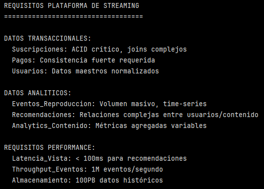
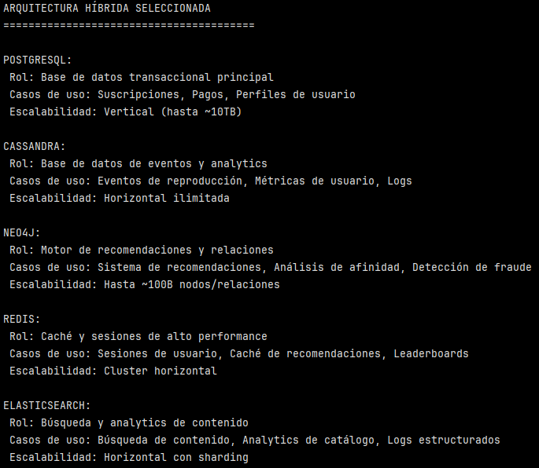

# Ejercicio: Diseño de arquitectura híbrida para plataforma de streaming de video

## Análisis de requisitos y patrones de datos:

```python
# Requisitos para plataforma de streaming
requisitos_streaming = {
    'datos_transaccionales': {
        'suscripciones': 'ACID crítico, joins complejos',
        'pagos': 'Consistencia fuerte requerida',
        'usuarios': 'Datos maestros normalizados'
    },
    'datos_analiticos': {
        'eventos_reproduccion': 'Volumen masivo, time-series',
        'recomendaciones': 'Relaciones complejas entre usuarios/contenido',
        'analytics_contenido': 'Métricas agregadas variables'
    },
    'requisitos_performance': {
        'latencia_vista': '< 100ms para recomendaciones',
        'throughput_eventos': '1M eventos/segundo',
        'almacenamiento': '100PB datos históricos'
    }
}

print("REQUISITOS PLATAFORMA DE STREAMING")
print("=" * 35)

for categoria, detalles in requisitos_streaming.items():
    print(f"\n{categoria.upper().replace('_', ' ')}:")
    if isinstance(detalles, dict):
        for subcat, desc in detalles.items():
            print(f"  {subcat.title()}: {desc}")
    else:
        print(f"  {detalles}")
```    



Este bloque muestra los  requisitos para una plataforma de streaming. 

El diccionario ``requisitos_streaming`` clasifica necesidades en 3 capas:

**1. Datos Transaccionales (OLTP): suscripciones, pagos, usuarios.**

Las suscripciones suelen requerir joins (plan, usuario, estado, beneficios) y consistencia por negocio (por ejemplo: "si el pago está OK, la suscripción debe quedar activa").

Los pagos requieren consistencia fuerte y trazabilidad. Por ejemplo, evitar doble cobro o estados incoherentes.

Los datos maestros normalizados de los usurios sugiere un modelo relacional bin estructurado, evitando duplicidad y facilitando la integridad referencial.

Generalmente se usan motores relacionales con transacciones, con constraints, índices y modelos normalizados.

>[!NOTE]
> ACID es un acrónimo que representa cuatro propiedades (Atomicidad, Consistencia, Aislamiento, Durabilidad) que garantizan que las transacciones se procesen de forma fiable, manteniendo la integridad y fiabilidad de los datos incluso ante errores o fallos del sistema.
>
>- A (Atomicidad): "Todo o nada". Una transacción se ejecuta por completo o no se ejecuta en absoluto; si falla una parte, todo se revierte a su estado original.
>- C (Consistencia): Asegura que una transacción lleve la base de datos de un estado válido a otro, respetando todas las reglas y restricciones predefinidas.
>- I (Aislamiento): Garantiza que las transacciones concurrentes no interfieran entre sí, como si se ejecutaran en serie, evitando datos inconsistentes.
>- D (Durabilidad): Una vez que una transacción se confirma (commit), sus cambios son permanentes y sobreviven a fallos del sistema o cortes de energía. 

**2. Datos Analíticos (OLAP/streaming analytics): eventos de reproducción, recomendaciones, métricas de contenido.**

Los eventos de reproducción son de volumen masivo, de alta cardinalidad y generalmente se usan consultas por ventana de tiempo.

Las recomendaciones son "relaciones complejas", por ejemplo Grafos (usuario-contenido-interaciones).

La analítica de contenido implica consultas tipo ``GROUP BY``, dashboards, cohortes, retención, etc,. donde importan particiones, columnas y pre-agregaciones.

Se justifica separar el plano analítico con motores orientados a analítica:
- columnar/warehouse (consultas agregadas rápidas)
- time-series o particionado por fecha
- y/o sistemas de procesamiento de eventos.

**3. Requisitos de performance: latencia, throughput y volumen histórico (almacenamiento)**

- Latencia para recomendaciones < 100 ms. Esto es un requisito de ``serving``. Puede resolverse con caché, índices especializados, pre-cálculo de features/recomendaciones y un datastore optimizado para lecturas. Las recomendaciones no deberían depender de consultas pesadas al sistema OLTP.

- Throughput eventos: 1M eventos/segundo. Esto sugiere ingesta desacoplada (no escribir directo a una base de datos relacional), particionar por clave (usuario, región, contenido), escritura append-only (solo se agregan datos, no se actualizan ni se borran en el momento) y escalado horizontal.

- Almacenamiento histórico de 100 PB. Esto sugiere que se requieren políticas de lifecycle, el uso de formatos comprimidos y columnar, considerar el costo por GB, separación de cómputo versus almacenamiento.

## Selección de tecnologías por caso de uso:

```python
# Arquitectura híbrida seleccionada
arquitectura_hibrida = {
    'postgresql': {
        'rol': 'Base de datos transaccional principal',
        'casos_uso': ['Suscripciones', 'Pagos', 'Perfiles de usuario'],
        'justificacion': 'ACID para finanzas, joins complejos para billing',
        'escalabilidad': 'Vertical (hasta ~10TB)',
        'limitaciones': 'Escalabilidad horizontal limitada'
    },
    
    'cassandra': {
        'rol': 'Base de datos de eventos y analytics',
        'casos_uso': ['Eventos de reproducción', 'Métricas de usuario', 'Logs'],
        'justificacion': 'Escalabilidad horizontal masiva, writes de alto throughput',
        'escalabilidad': 'Horizontal ilimitada',
        'limitaciones': 'Queries complejas limitadas'
    },
    
    'neo4j': {
        'rol': 'Motor de recomendaciones y relaciones',
        'casos_uso': ['Sistema de recomendaciones', 'Análisis de afinidad', 'Detección de fraude'],
        'justificacion': 'Queries de relaciones complejas, algoritmos de grafos',
        'escalabilidad': 'Hasta ~100B nodos/relaciones',
        'limitaciones': 'No optimizado para agregaciones masivas'
    },
    
    'redis': {
        'rol': 'Caché y sesiones de alto performance',
        'casos_uso': ['Sesiones de usuario', 'Caché de recomendaciones', 'Leaderboards'],
        'justificacion': 'Latencia < 1ms, estructuras de datos ricas',
        'escalabilidad': 'Cluster horizontal',
        'limitaciones': 'Datos volátiles (reinicio borra datos)'
    },
    
    'elasticsearch': {
        'rol': 'Búsqueda y analytics de contenido',
        'casos_uso': ['Búsqueda de contenido', 'Analytics de catálogo', 'Logs estructurados'],
        'justificacion': 'Búsqueda full-text, agregaciones complejas, APIs REST',
        'escalabilidad': 'Horizontal con sharding',
        'limitaciones': 'No transaccional, eventual consistency'
    }
}

print("ARQUITECTURA HÍBRIDA SELECCIONADA") print("=" * 40)

for tecnologia, detalles in arquitectura_hibrida.items():
    print(f"\n{tecnologia.upper()}:") 
    print(f" Rol: {detalles['rol']}") 
    print(f" Casos de uso: {', '.join(detalles['casos_uso'])}") 
    print(f" Escalabilidad: {detalles['escalabilidad']}")
```

Este bloque muestra el detalle de las tecnologías recomendadas para cada uso dentro de una arquitectura híbrida.



Complementando un poco la información para cada tecnología:

- PostreSQL: es un motor relacional tradicional, orientado a datos estructurados, con soporte completo de transacciones ACID, claves foráneas, índices avanzados y consultas complejas con JOIN.

- Cassandra: base de datos NoSQL (wide-column store). Es un sistema distribuido diseñado para altísimo volumen de escrituras, tolerancia a fallos y escalabilidad horizontal. No usa SQL tradicional, usa CQL, similar en sintaxis pero con otro modelo. Sigue el modelo append-only. Cassandra sacrifica joins y queries complejas a cambio de throughput y disponibilidad.

- Neo4j: base de datos NoSQL orientada a grafos. Modela los datos como nodos y relaciones, permitiendo recorrer conexiones de forma eficiente. Muy usado para sistemas de recomendación.

- Redis: NoSQL en memoria (key-value store). Almacén en memoria ultra rápido con soporte para estructuras como listas, sets, hashes y sorted sets. Es clave para lograr latencias de milisegundos (funciona como capa de aceleración).

- Elasticsearch: motor NoSQL de búsqueda y anaytics distriuido (basado en Apache Lucene) que permite almacenar, buscar y analizar grandes volúmenes de datos estructurados y no estructurados en tiempo real.

## Diseño de esquemas y patrones de consulta:
```sql
-- PostgreSQL: Datos transaccionales críticos
CREATE TABLE suscripciones (
    id SERIAL PRIMARY KEY,
    usuario_id INTEGER REFERENCES usuarios(id),
    plan_id INTEGER REFERENCES planes(id),
    fecha_inicio DATE,
    fecha_fin DATE,
    estado VARCHAR(20),
    precio_mensual DECIMAL(8,2),
    metodo_pago VARCHAR(50)
);

-- Cassandra: Eventos de reproducción (time-series)
CREATE KEYSPACE streaming WITH REPLICATION = {
    'class': 'NetworkTopologyStrategy',
    'datacenter1': 3
};

CREATE TABLE eventos_reproduccion (
    usuario_id UUID,
    contenido_id UUID,
    timestamp TIMESTAMP,
    duracion_reproducida INT,
    posicion_actual INT,
    dispositivo VARCHAR,
    calidad VARCHAR,
    PRIMARY KEY ((usuario_id, contenido_id), timestamp)
) WITH CLUSTERING ORDER BY (timestamp DESC);
```

```cypher
-- Neo4j: Grafo de relaciones usuario-contenido
// Nodos principales
CREATE (u:Usuario {id: 1, nombre: "Ana"})
CREATE (c:Contenido {id: 100, titulo: "Serie Drama", genero: "Drama"})

// Relaciones
CREATE (u)-[:VIO {rating: 5, tiempo_completo: true}]->(c)
CREATE (u)-[:BUSCO_GENERO]->(:Genero {nombre: "Drama"})

// Query de recomendaciones
MATCH (u:Usuario {id: 1})-[:VIO]->(c1:Contenido)-[:DEL_GENERO]->(g:Genero)<-[:DEL_GENERO]-(c2:Contenido)
WHERE NOT (u)-[:VIO]->(c2)
RETURN c2.titulo, COUNT(*) as afinidad
ORDER BY afinidad DESC
LIMIT 10;
```

```redis
-- Redis: Caché de recomendaciones
// Hashes para recomendaciones por usuario
HSET recomendaciones:usuario:1 serie:100 0.95 serie:200 0.87 serie:150 0.82

// Sorted sets para trending
ZADD trending:series 154 serie:100
ZADD trending:series 128 serie:200
```

```json
-- Elasticsearch: Búsqueda de contenido
PUT /contenido/_doc/100
{
  "titulo": "Serie Drama Completa",
  "genero": ["Drama", "Suspenso"],
  "actores": ["Actor A", "Actor B"],
  "descripcion": "Serie de drama intenso...",
  "rating_promedio": 4.5,
  "temporadas": 3
}

// Query de búsqueda
GET /contenido/_search
{
  "query": {
    "bool": {
      "must": [
        {"multi_match": {"query": "drama", "fields": ["titulo", "descripcion"]}},
        {"terms": {"genero": ["Drama", "Suspenso"]}}
      ],
      "filter": {"range": {"rating_promedio": {"gte": 4.0}}}
    }
  }
}
```


Este bloque ejemplifica cómo cada componente de la arquitectura híbrida materializa los requisitos previamente definidos mediante modelos y lenguajes específicos para cada tipo de dato. 

PostgreSQL se utiliza para representar datos transaccionales críticos que requieren consistencia fuerte y relaciones estructuradas. Cassandra modela eventos de reproducción como series de tiempo orientadas a escritura masiva y escalabilidad horizontal. Neo4j expresa relaciones complejas entre usuarios y contenido para soportar sistemas de recomendación. Redis actúa como capa de serving de baja latencia para resultados precomputados. Elasticsearch permite la indexación y búsqueda eficiente de contenido y métricas. 
 
 En conjunto cada tecnología se emplea según su fortaleza, evitando sobrecargar un único motor con responsabilidades heterogéneas.

## Implementación de patrón CQRS:

```python
# Implementación CQRS para plataforma de streaming
class StreamingCQRS:
    def __init__(self):
        self.command_db = PostgreSQL()  # Writes normalizados
        self.query_db = Cassandra()     # Reads optimizados
        self.cache = Redis()
        self.search = Elasticsearch()
    
    # Command side: Validación estricta, consistencia
    def create_subscription(self, user_id, plan_id, payment_info):
        """Crear suscripción - lado comando"""
        # Validar usuario existe
        if not self.command_db.user_exists(user_id):
            raise ValueError("Usuario no existe")
        
        # Validar plan disponible
        if not self.command_db.plan_available(plan_id):
            raise ValueError("Plan no disponible")
        
        # Procesar pago (simulado)
        payment_result = self.process_payment(payment_info)
        
        if payment_result['success']:
            # Crear suscripción en BD transaccional
            subscription = self.command_db.create_subscription({
                'user_id': user_id,
                'plan_id': plan_id,
                'payment_id': payment_result['id']
            })
            
            # Publicar evento para actualizar read models
            self.publish_event('SubscriptionCreated', subscription)
            
            return subscription
        else:
            raise ValueError("Pago fallido")
    
    # Query side: Optimizado para lecturas rápidas
    def get_user_recommendations(self, user_id):
        """Obtener recomendaciones - lado query"""
        # Primero intentar caché
        cache_key = f"recommendations:{user_id}"
        cached = self.cache.get(cache_key)
        
        if cached:
            return json.loads(cached)
        
        # Si no está en caché, calcular desde query model
        recommendations = self.query_db.get_user_recommendations(user_id)
        
        # Almacenar en caché para futuras consultas
        self.cache.setex(cache_key, 3600, json.dumps(recommendations))  # 1 hora
        
        return recommendations
    
    # Event handling: Mantener consistencia eventual
    def handle_subscription_created(self, event):
        """Actualizar read models cuando se crea suscripción"""
        # Actualizar perfil de usuario en query model
        self.query_db.update_user_profile(event['user_id'], {
            'subscription_active': True,
            'plan_id': event['plan_id'],
            'subscription_date': event['created_at']
        })
        
        # Invalidar caché relacionado
        self.cache.delete(f"user_profile:{event['user_id']}")
        self.cache.delete(f"recommendations:{event['user_id']}")

# Uso del sistema
cqrs = StreamingCQRS()

# Crear suscripción (command)
subscription = cqrs.create_subscription(user_id=123, plan_id=1, payment_info={...})

# Obtener recomendaciones (query)
recommendations = cqrs.get_user_recommendations(user_id=123)
```

Este bloque representa una implementación conceptual del patrón CQRS (Command Query Responsibility Segregation). El código se presenca como pseudocódigo en Python, ilustrando la separación entre operaciones de escritura (command side) y lectura (query side), así como la propagación de cambios mediante eventos y el uso de caché para optimizar consultas.

>[!NOTE]
> Command Query Responsibility Segregation es un patrón de arquitectura que propone separar explícitamente las operaciones que modifican el estado de aquellas que solo lo consultan.

- Commands:
    - Cambiar el estado del sistema
    - Ejemplos: crear suscripción, procesar un pago, cancelar un plan
    - Tienen reglas de negocio y validaciones
    - No devuelven datos complejos (por ejemplo solo éxitos/fracasos)

- Queries:
    - Solo lee información
    - Ejemplos: obtener recomendaciones, ver perfil, listar contenido.
    - No modifican el estado.
    - Están optimizadas para rapidez y volumen.

1. Componenetes del __init__: inicialización del sistema.

Se definen componentes separados para manejar escrituras, lecturas, caché y búsqueda, de modo que cada tipo de operación utilice el sistema más adecuado.

```python
self.command_db = PostgreSQL()  # Writes normalizados
self.query_db = Cassandra()     # Reads optimizados
self.cache = Redis()
self.search = Elasticsearch()
```

Este diseño muestra una arquitectura políglota donde cada motor cumple un rol:
- PostgreSQL (command_db): fuente de verdad transaccional para suscripciones y pagos (ACID).

- Cassandra (query_db): modelo de lectura escalable para consultas repetitivas y de alto volumen (eventos, perfiles derivados, señales para recomendaciones).

- Redis (cache): capa de aceleración para evitar recalcular recomendaciones o repetir lecturas costosas.

- Elasticsearch (search): búsqueda y exploración del catálogo (no aparece en métodos del ejemplo, pero está disponible como parte del “read experience”).

>[!NOTE]
> Una arquitectura políglota es un enfoque de desarrollo de software que permite usar múltiples lenguajes de programación, marcos de trabajo y tecnologías de bases de datos (persistencia) dentro de un mismo sistema, eligiendo la herramienta más adecuada para cada microservicio o componente, en lugar de una única pila tecnológica para todo el proyecto. El objetivo es aprovechar las fortalezas de cada tecnología para optimizar rendimiento, escalabilidad y funcionalidad, promoviendo la innovación y la eficiencia. 

2. Crear suscripción - command side

Para crear una suscripción, primero se valida que el usuario exista y que el plan esté disponible. Luego se procesa el pago y, si este resulta exitoso, la suscripción se guarda en la base de datos transaccional. Una vez creada, se publica un evento que permite informar al resto del sistema que la suscripción fue activada y que los modelos de lectura deben actualizarse.

3. Actualización de los modelos de lectura

Al recibir el evento de creación de suscripción, se actualiza el perfil del usuario en el sistema de consultas para reflejar que ahora tiene una suscripción activa. Además, se eliminan datos en caché que podrían quedar desactualizados, asegurando que las próximas consultas usen información vigente.

4. Obtener recomendaciones - query side

Cuando se solicitan recomendaciones para un usuario, el sistema primero revisa si estas ya están almacenadas en caché. Si existen, se devuelven directamente. Si no, se calculan usando el modelo de lectura optimizado y luego se guardan en caché para acelerar futuras solicitudes.

5. Uso del sistema:

El flujo completo muestra cómo las operaciones que cambian el estado (crear suscripción) están separadas de las operaciones de consulta (obtener recomendaciones), permitiendo mantener consistencia en los datos críticos y, al mismo tiempo, ofrecer respuestas rápidas al usuario.


### Reflexiones finales

¿Por qué elegirías esta arquitectura híbrida sobre un sistema SQL puro o NoSQL puro?


Elegir una arquitectura híbrida permite alinear cada tipo de dato y patrón de consulta con el motor correcto: SQL para el "core" crítico, NoSQL para ingesta masiva y motores especializados para búsqueda/recomendación y baja latencia.
Un sistema SQL puro se vuelve costoso e ineficiente para escalar eventos y analítica a gran volumen, mientras que un NoSQL puro suele complicar la integridad y confiabilidad del core financiero.

¿Qué desafíos introduciría esta complejidad adicional y cómo los mitigarías?

- Mayor complejidad operativa (más servicios que mantener):

    Esto implica más despliegues, monitores, backups, seguridad, etc.

    Formas de mitigaicón:

    - Podría ser preferir servicios gestionados oara  reducir carga operativa. 
    - Observabilidad unificada: métricas y logs
    
- Duplicación de datos: 
    
    Se podría tener el mismo dato en varios lugares (PostgreSQL, Cassandra, caché) y podría generar confusión y errores.

    Formas de mitigación:

    - Definir explícitamente el sistema de registros.
    - Modelos de lectura como derivados (copia o proyección de datos).

- Seguridad y control de acceso en  múltiples almacenes

    La superficie de ataque aumenta al tener más sistemas de almacenamiento de datos.

    Formas de mitigación:
    
    - Definir roles por servicio, cifrado en tránsito y en reposo.
    - Segmentación de red y principio de mínimo privilegio.
    - Auditoría de accesos y rotación de credenciales.


--- 
Verificación: ¿Por qué elegirías esta arquitectura híbrida sobre un sistema SQL puro o NoSQL puro? ¿Qué desafíos introduciría esta complejidad adicional y cómo los mitigarías?

Requerimientos:
- Conocimientos básicos de SQL
- Familiaridad con conceptos de bases de datos
- Jupyter para ejemplos conceptuales
- Opcional: Conexiones a servicios reales para pruebas