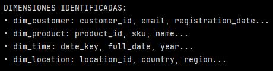

# Ejercicio: Diseño conceptual de data warehouse para e-commerce

## Paso 1: Identificar dimensiones clave

``` python
# Dimensiones para análisis de e-commerce
dimensiones_ecommerce = {
    'dim_customer': [
        'customer_id', 'email', 'registration_date',
        'customer_segment', 'total_orders', 'lifetime_value'
    ],
    'dim_product': [
        'product_id', 'sku', 'name', 'category',
        'brand', 'unit_cost', 'current_price'
    ],
    'dim_time': [
        'date_key', 'full_date', 'year', 'quarter',
        'month', 'day_of_week', 'is_weekend', 'is_holiday'
    ],
    'dim_location': [
        'location_id', 'country', 'region', 'city',
        'postal_code', 'timezone'
    ]
}

print("DIMENSIONES IDENTIFICADAS:")
for dim, atributos in dimensiones_ecommerce.items():
    print(f"• {dim}: {', '.join(atributos[:3])}...")
```


Este paso identifica las dimensiones a utilizar en el modelo dimensional de un data warehouse para e-commerce.

Se define un diccionario ``dimensione_ecommerce`` donde cada llave es una dimensión y el valor es su lista de atributos. 

Luego se imprime un resumen (solo los primeros 3 atributos de cada dimensión) para verificar rápidamente que las dimensiones hayan quedado bien declaradas.

En este caso hay 4 dimensiones identificadas:

- ``dim_customer``: contiene customer id, email, fecha de inscripción/registro, segmento del cliente, total de órdenes y lifetime value.
- ``dim_product``: contiene product id, sku, nombre, categoría, marca, costo unitario y precio actual.
- ``dim_time``: contiene date key, fecha completa, año, trimestre, mes, día de la semana, si es fin de semana y si es día festivo.
- ``dim_location``: contiene location id, país, region, ciudad, código postal y zona horaria.

## Paso 2: Definir tabla de hechos principal

```sql
-- Tabla de hechos para pedidos de e-commerce
CREATE TABLE fact_orders (
    order_id BIGINT PRIMARY KEY,
    customer_id INTEGER REFERENCES dim_customer(customer_id),
    product_id INTEGER REFERENCES dim_product(product_id),
    time_id INTEGER REFERENCES dim_time(date_key),
    location_id INTEGER REFERENCES dim_location(location_id),

    -- Métricas del pedido
    quantity_ordered INTEGER,
    unit_price DECIMAL(10,2),
    discount_amount DECIMAL(10,2),
    tax_amount DECIMAL(10,2),
    shipping_cost DECIMAL(10,2),
    total_amount DECIMAL(10,2),

    -- Métricas calculadas
    profit_margin DECIMAL(10,2),  -- (total_amount - cost) / total_amount
    is_first_purchase BOOLEAN,
    order_channel TEXT,  -- 'web', 'mobile', 'api'
    payment_method TEXT
);
```

Este paso define la tabla de hechos ``fact_orders`` que representa el núcleo del data warehouse de e-commerce, ya que concentra los eventos de compra y conecta las principales dimensiones del modelo mediante claves foráneas hacia cliente, producto, tiempo y ubicación. 

Esta tabla almacena métricas cuantitativas directamente asociadas al proceso de venta, tales como cantidad comprada, precio unitario, descuentos, impuestos, costos de envío y monto total del pedido, permitiendo realizar agregaciones y análisis comparativos en distintos ejes de negocio. 

Además, incorpora métricas derivadas y atributos analíticos (como margen de ganancia, canal de ciompra, método de pago e identificación de prmera compra) que enriquecen el análisis del comportamiento del cliente y del desempeño comercial. 

En conjunto, ``fact_orders`` actúa como el punto de integración entre dimensiones descriptivas y medidas numéricas, habilitando análisis históricos, temporales y multidimensionales propios de un entorno de inteligencia de negocios.

## Paso 3: Crear vistas analíticas optimizadas

```sql
-- Vista para análisis de productos populares
CREATE VIEW product_performance AS
SELECT
    dp.product_name,
    dp.category,
    dp.brand,
    SUM(fo.quantity_ordered) as total_units_sold,
    SUM(fo.total_amount) as total_revenue,
    AVG(fo.unit_price) as avg_selling_price,
    COUNT(DISTINCT fo.customer_id) as unique_customers,
    -- Ranking por categoría
    ROW_NUMBER() OVER (PARTITION BY dp.category ORDER BY SUM(fo.total_amount) DESC) as category_rank
FROM fact_orders fo
JOIN dim_product dp ON fo.product_id = dp.product_id
JOIN dim_time dt ON fo.time_id = dt.date_key
WHERE dt.year = 2024  -- Filtro temporal
GROUP BY dp.product_id, dp.product_name, dp.category, dp.brand;

-- Vista materializada para dashboards ejecutivos
CREATE MATERIALIZED VIEW executive_dashboard AS
SELECT
    dt.year,
    dt.month,
    SUM(fo.total_amount) as monthly_revenue,
    COUNT(DISTINCT fo.customer_id) as active_customers,
    COUNT(fo.order_id) as total_orders,
    AVG(fo.total_amount) as avg_order_value,
    -- Crecimiento mensual
    (SUM(fo.total_amount) - LAG(SUM(fo.total_amount)) OVER (ORDER BY dt.year, dt.month)) /
    LAG(SUM(fo.total_amount)) OVER (ORDER BY dt.year, dt.month) as growth_rate
FROM fact_orders fo
JOIN dim_time dt ON fo.time_id = dt.date_key
GROUP BY dt.year, dt.month
ORDER BY dt.year, dt.month;
```

En este paso se crean 2 vistas:

- ``CREATE VIEW product_performance``: 

    Tiene como objetivo habilitar un análisis de desempeño de producto (popularidad y revenue) filtrado por un período de tiempo (2024), con ranking intra-categoría.

    Responde a preguntas como:

    - ¿qué productos generan más ingresos por categoría?
    - ¿cuántas unidades se vendieron por producto?
    - ¿cuál es el precio promedio de venta?
    - ¿cuántos clientes únicos compraron cada producto?

    ```sql
    ROW_NUMBER() OVER (PARTITION BY dp.category ORDER BY SUM(fo.total_amount) DESC) as category_rank
    ``` 
   `` ROW_NUMBER()`` es una función de ventana (window function) que asigna un número secuencial a cada fila del resultado. Empieza en 1, aumenta de uno en uno y si dos filas tienen el mismo valor, igual le asigna numeros distintos.

   ``OVER (PARTITION BY dp.category...)`` indica que reinicie la numeración para cada categoría de producto. Es decir, se crea un ranking independiente por cada categoría.

    ``ORDER BY SUM(fo.total_amount) DESC`` define el criterio del ranking. Ordena los productos dentro de cada categoría de mayor a menor ingreso total general. El producto que más vende dinero queda con ``category_rank = 1``

    En este caso se creó una vista analítica (no materializada) para evaluar el desempeño de productos por categoría, marca y año, incluyendo unidades vendidas, revenue, precio promedio y clientes únicos. Además incorpora ranking por categoría mediante funciones de ventana para facilitar comparativos y priorización de catálogo. En este caso el uso es exploratorio y analítico. Este tipo de consultas cambia frecuentemente los filtros y no siempre se ejecutan con los mismos parámetros. Materializar esta vista obligaría a refrescarla cada vez que cambian las condiciones de análisis.

- ``CREATE MATERIALIZED VIEW executive_dashboard``:

    Entrega un dataset listo para dashboard ejecutivo con KPIs mensuales:

    - ``monthly_revenue``: ingresos mensuales
    - ``active_customers``: clientes activos
    - ``total_orders``: número de pedidos
    - ``avg_order_values``: ticket promedio
    - ``growth_rate``: crecimiento mes a mes

    En este caso se creó una vista materializada porque los dashboards ejecutivos se consultan muchas veces al día por BI. Materializar reduce la carga y latencia ya que no se están recalculando agregaciones grandes cada vez.


### Reflexiones finales

¿Qué índices crearías para optimizar estas consultas?

1. En ``fact_orders``

- Índices para joins:

```sql
CREATE INDEX idx_fact_orders_product_id ON fact_orders (product_id);
CREATE INDEX idx_fact_orders_time_id ON fact_orders (time_id);
CREATE INDEX idx_fact_orders_customer_id ON fact_orders (customer_id);
CREATE INDEX idx_fact_orders_location_id ON fact_orders (location_id);
```

Estos índices optimizan los JOIN entre ``fact_orders`` y las dimensiones correspondientes.

``idx_fact_orders_product_id ON fact_orders(product_id)`` permite que PostgreSQL encuentre más rápido todas las filas de hechos asociadas a un producto.

``idx_fact_orders_product_id ON fact_orders(product_id)`` optimiza el JOIN con ``dim_time`` y cualquier otro filtro temporal indirecto. Este índica ayuda a ubicar más rápido las filas del período.

``idx_fact_orders_customer_id ON fact_orders(customer_id)`` optimiza joins y cálculos por cliente. También sirve para análisis de clv, retención, segmentos, etc.

``idx_fact_orders_location_id ON fact_orders(location_id)`` optimiza joins y análisis geográficos. Si bien las vistas creadas no usan ``dim_location``, es común que haya consultas por país/ciudad/región.


2. En ``dim_time``

```sql
CREATE INDEX idx_dim_time_year_datekey ON dim_time (year, date_key);
CREATE INDEX idx_dim_time_year_month   ON dim_time (year, month);
```

``idx_dim_time_year_datekey ON dim_time(year, date_key)`` otimiza el filtro por año más la conexión hacia la clave de fecha.


Por ejemplo, la vista analítica contiene:

```sql
WHERE dt.year = 2024
JOIN ... ON fo.time_id = dt.date_key
```

Este índice podría ayduar porque localiza rápidamente las filas de ``dim_time`` que corresponden al año 2024.


``idx_dim_time_year_month ON dim_time(year, month)`` optimiza agrupaciones y orden temporal por año/mes.

Por ejemplo, la vista materializada agrupa por:

```sql
GROUP BY dt.year, dt.month
ORDER BY dt.year, dt.month
```
Este índice puede ayudar a recuperar/ordenar valores de año/mes más eficientemente.


3. En ``dim_product``

```sql
CREATE INDEX idx_dim_product_category ON dim_product (category);
CREATE INDEX idx_dim_product_brand    ON dim_product (brand);
```

``idx_dim_product_category ON dim_product(category)`` optimiza filtros por categoría y segmentación del análisis. Categoría es un atributo típico de slicing en e-commerce, por lo que indexarlo facilita exploración rápida por familias de productos.


``idx_dim_product_brand ON dim_product(brand)`` optimiza análisis por marca. Habilita consultas como: ranking de marcas, revenue de marcas, performance por marca vs categoría.


>[!NOTE]
> Recordar que los índices no cambian la consulta, solo le dice al motor: Si vas a buscar filas por esta columna, aquí hay una estructura que te permite encontrarlas más rápido.


¿Cómo manejarías el crecimiento de datos históricos en este warehouse?

1. Particionamiento por rango en tiempo

    Particionar la tabla de hechos ``fact_orders`` por fecha (mes o año). De esta manera, las consultas por año/mes escanean solo las particiones relevantes. Todos los índices activos, datos en almacenamiento rápido. Las vistas materializadas se calculan sobre estos datos.

2. Estrategia hot/warm/cold y mantenimiento

- Hot data 

    Son datos recientes, por ejemplo pedidos de últimos 6 o 12 meses.

    Se usan en dashboards diarios, para métricas mensuales, análisis de productos populares, comparaciones mes a mes. Menos índices (solo los esenciales). 

    Por ejemplo: 
        - ``fact_orders_2025`` 


- Warm data

    Por ejemplo datos que son pedidos de 1 a 3 años atrás.

    Se usan para análisis históricos, comparaciones anuales, auditorías, informes estratégicos.

    Por ejemplo: 
        - ``fact_orders_2023``
        - ``fact_orders_2022``

- Cold data

    Pedidos antiguos, más de 3-5 años.

    Se usan muy poco, para auditoría legal o algún análisis puntual. Por lo general son datos que se archivan o mantienen como particiones con índices mínimos. Pueden moverse a storage más baratos y no participan en dashboards.

    Por ejemplo: 
        - ``fact_orders_2016``
        - ``fact_orders_2017``

3. Vistas materializadas + refresco

    Materializar agregados mensuales para BI y refrescar de manera diaria u horario. La idea es materializar KPIs de alta demanda para reducir cómputo repetido sobre la tabla de hechos.

El crecimiento de datos históricos se gestiona mediante particionamiento temporal de la tabla de hechos, aplicando una estrategia hot/warm/cold en la que los datos recientes mantienen índices completos y alto rendimiento, mientras que los datos antiguos se conservan con menor nivel de indexación o se archivan, reduciendo costos y manteniendo la disponibilidad histórica.

--- 
Verificación: ¿Qué índices crearías para optimizar estas consultas? ¿Cómo manejarías el crecimiento de datos históricos en este warehouse?

Requerimientos:
- PostgreSQL con soporte para vistas materializadas
- Conocimiento básico de SQL DDL y consultas analíticas
- Familiaridad con conceptos de modelado dimensional