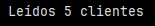
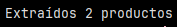
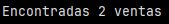

# Ejercicio: Extraer datos de múltiples fuentes

## Leer datos de un archivo CSV:

```python
import csv

ruta_archivo = r"C:\Users\Usuario\Downloads\Beca_TalentOps\Data_TalentOps\03.Herramientas_ETL_y_Proyecto_Final\S1_ETL_con_Python_y_SQL\D1-Extraccion-de-datos-con-Python\IMG-P1\clientes.csv"

def leer_csv(ruta_archivo):
    datos = []
    with open(ruta_archivo, 'r') as f:
        lector = csv.DictReader(f)
        for fila in lector:
            datos.append(fila)
    return datos

# Uso
clientes = leer_csv('clientes.csv')
print(f"Leídos {len(clientes)} clientes")
```

Esta función abre un archivo CSV, lee cada fila utilizando los encabezados como claves y almacena los registros en una lista de diccionarios. Posteriormente, se retorna la lista completa, permitiendo verificar cuántos registros fueron extraídos desde el archivo.





El archivo [clientes.csv](IMG-P1/clientes.csv), fue generado con datos sintéticos para simular una fuente estructurada externa. Cada cliente posee un identificador, nombre y una ciudad asignada aleatoriamente, permitiendo probar la extracción desde archivos planos dentro del flujo ETL.


## Simular extracción de API:

```python
import json

def extraer_api_simulada():
    # Simular respuesta de API
    datos_api = {
        "productos": [
            {"id": 1, "nombre": "Producto A", "precio": 100},
            {"id": 2, "nombre": "Producto B", "precio": 200}
        ]
    }
    return datos_api["productos"]

productos = extraer_api_simulada()
print(f"Extraídos {len(productos)} productos")
```

Se define una función que simula una llamada a una API. No recibe parámetros porque: no hay endpoint real y no hay autenticación ni filtros.

Su objetivo es imitar el formato de datos que entregaría una API HTTP.

``datos_api`` representa un JSON típico de una API REST:

- un objeto principal
- una clave ("productos")
- una lista de objetos (cada producto)

Cada producto tiene:

- ``id``
- ``nombre``
- ``precio``

``return datos_api["productos"]``:

- se extrae solo la parte útil del JSON
- se devuelve una lista de diccionarios

``productos = extraer_api_simulada()``: se ejecuta la función y el rsultado se guarda en ``productos``.

Finalmente, el print con ``len(productos)`` cuenta los elementos de la lista y se ve que se extrajeron 2 productos, validando el número de registros obtenidos.



## Conectar a base de datos SQLite:

```python
import sqlite3

def conectar_base_datos():
    conn = sqlite3.connect(':memory:')  # Base temporal
    cursor = conn.cursor()
    
    # Crear tabla
    cursor.execute('''
        CREATE TABLE ventas (
            id INTEGER PRIMARY KEY,
            producto TEXT,
            cantidad INTEGER
        )
    ''')
    
    # Insertar datos de ejemplo
    cursor.execute("INSERT INTO ventas VALUES (1, 'Producto A', 10)")
    cursor.execute("INSERT INTO ventas VALUES (2, 'Producto B', 5)")
    
    # Leer datos
    cursor.execute("SELECT * FROM ventas")
    resultados = cursor.fetchall()
    
    conn.close()
    return resultados

ventas = conectar_base_datos()
print(f"Encontradas {len(ventas)} ventas")
```

``def conectar_base_datos():`` define una función que crea una base de datos, inserta datos y consulta información (se simula una fuente relacional).

``conn = sqlite3.connect(':memory:')``: crea una base de datos temporal (no se guarda en disco y se destruye al cerrar la conexión).

``cursor = conn.cursor()``: se crea el cursor que permite ejecutar sentencias SQL y consultar resultados.

Luego se crea una tabla ``ventas`` que simula una a tabla transaccional típica (una venta, asociada a un producto con una cantidad). Se insertan 2 registros y después se ejecuta una consulta SQL ``fetchall()`` que devuelve una lista de tuplas donde cada tupla representa una fila-

``conn.close()`` cierra la conexión, lo que permite liberar recursos.

``return resultados`` devuelve el conjunto completo de ventas.

Finalmente, el print para verificar el resultado muestra que se encontraron 2 ventas:



### Reflexiones finales

¿Qué consideraciones de seguridad debes tener al conectar con bases de datos y APIs? 

Al conectarse a bases de datos y APIs es fundamental:

- Proteger credenciales y tokens, evitando incluirlos en el código. Deben almacenarse en variables de entorno o gestores de secretos.
- Utilizar conexiones setguras (HTTPS/TLS) para proteger la información en tránsito.
- Aplicar el principio de mínimo privilegio, otorganod a los usuarios o servicios solo los permisos mínimos estrictamente necesarios.
-Usar consultas parametrizadas al interactuar con bases de datos para prevenir ataques de inyección SQL.

>[!NOTE]
> Las consultas parametrizadas son sentencias SQL que utilizan marcadores de posición para separar el código SQL de los datos, evitando que los valores ingresados puedan alterar la estructura de la consulta y previniendo ataques de inyección SQL.

- Evitar exponer información sensible en logs o mensajes de error, especialmente datos personales o credenciales.


¿Cómo manejarías errores de conexión o respuestas inválidas?


- Implementar manejo de excepciones (try/except) para capturar errores de conexión a bases de datos o fallos en llamadas a APIs.

- Validar las respuestas recibidas desde APIs, verificando que tengan el formato esperado y los campos requeridos antes de procesarlas.

- Registrar errores (logging) para facilitar la detección y análisis de fallas sin detener completamente el proceso.

- Definir estrategias de reintento ante errores temporales (por ejemplo, problemas de red).


---- 


Verificación: ¿Qué consideraciones de seguridad debes tener al conectar con bases de datos y APIs? ¿Cómo manejarías errores de conexión o respuestas inválidas?

Requerimientos:
Conocimiento básico de Python
Familiaridad con archivos y bases de datos
Comprensión de conceptos HTTP