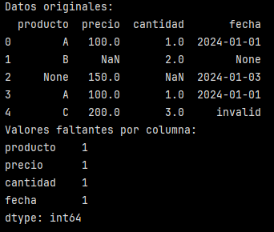
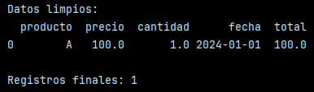
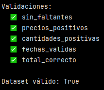

# Ejercicio: Limpiar y validar un dataset de ventas

## Dataset con problemas:

```python
import pandas as pd
import numpy as np

# Crear datos de ejemplo con problemas
ventas = pd.DataFrame({
    'producto': ['A', 'B', None, 'A', 'C'],
    'precio': [100, None, 150, 100, 200],
    'cantidad': [1, 2, None, 1, 3],
    'fecha': ['2024-01-01', None, '2024-01-03', '2024-01-01', 'invalid']
})

print("Datos originales:")
print(ventas)
print(f"Valores faltantes por columna:\n{ventas.isnull().sum()}")
```

Este bloque crea un dataset con errores y problemas de calidad de datos. Luego muestra los datos tal como vienen en bruto e identifica valores faltantes por columna.



El DataFrame tiene 4 columnas:

- producto
- precio
- cantidad
- fecha

Se observa que cada columna tiene 1 valor faltante.

>[!IMPORTANT]
>"invalid" no es un valor nulo, pero sí es un valor inválido semánticamente, algo que se validará más adelante.

El análisis exploratorio inicial revela la presencia de valores faltantes en todas las columnas, así como inconsistencias de formato en la variable fecha, lo que hace necesaria una etapa de limpieza y validación previa al análisis.

## Limpiar datos:

```python
def limpiar_datos_ventas(df):
    df_limpio = df.copy()
    
    # 1. Eliminar duplicados
    df_limpio = df_limpio.drop_duplicates()
    
    # 2. Imputar valores faltantes
    df_limpio['precio'] = df_limpio['precio'].fillna(df_limpio['precio'].median())
    df_limpio['cantidad'] = df_limpio['cantidad'].fillna(1)  # Asumir cantidad mínima
    
    # 3. Eliminar filas con producto faltante
    df_limpio = df_limpio.dropna(subset=['producto'])
    
    # 4. Corregir fechas inválidas
    df_limpio['fecha'] = pd.to_datetime(df_limpio['fecha'], errors='coerce')
    df_limpio = df_limpio.dropna(subset=['fecha'])
    
    # 5. Calcular total
    df_limpio['total'] = df_limpio['precio'] * df_limpio['cantidad']
    
    return df_limpio

ventas_limpias = limpiar_datos_ventas(ventas)
print("\nDatos limpios:")
print(ventas_limpias)
print(f"\nRegistros finales: {len(ventas_limpias)}")
```

Se define una función que toma un DataFrame ``df`` y devuelve ``df_limpio`` con:

- duplicados eliminados
- valores faltantes imputados (precio y cantidad)
- fechas convertidas a datetime y filas con fechas inválidas eliminadas
- total calculado = precio * cantidad

Lo primero que hace ``limpiar_datos_ventas(df)`` es copiar el DataFrame mediante ``df_limpio = df.copy()``. Esto ecita modificar el DataFrame original.

Luego elimina duplicados con ``df_limpio = df_limpio.drop_duplicates()``. Esto elimina filas idénticas en todas las columnas.

Posterior a esto viene la imputación de valores faltantes:

a) Precio: mediana

``df_limpio['precio'] = df_limpio['precio'].fillna(df_limpio['precio'].median())`` 

- Si precio tiene ``NaN``, lo rellena con la mediana de la columna. La mediana es robusta ante outliers, por lo que es más apropiado que la media en caso que haya valores extremos.

b) Cantidad: valor fijo mínimo

``df_limpio['cantidad'] = df_limpio['cantidad'].fillna(1)``

- Si cantidad tiene ``NaN``, se asume 1 como cantidad mínima. 

Luego, se eliminan filas con producto faltante conn ``df_limpio = df_limpio.dropna(subset=['producto'])``. Si no hay producto, el registro no es utilizable, por lo que se elimina.

Después se corrige/valida fechas:

```python
df_limpio['fecha'] = pd.to_datetime(df_limpio['fecha'], errors='coerce')
df_limpio = df_limpio.dropna(subset=['fecha'])
```
- Conversión a datatime con ``coerce``: convierte fechas inválidas y transforma lo inválido en NaT (missing datetime). Con esto, ``invalid`` pasa a ``Nat`` y ``None`` también pasa a ``NaT``.

- Eliminación de fechas inválidas/faltantes: con ``dropna(subset=['fecha'])`` se  eliminan la fila con fecha ``None`` y la fila con fecha ``invalid``.

Finalmente, se crea una variable derivada ``'total'`` que corresponde al precio*cantidad (mediante ``df_limpio['total'] = df_limpio['precio'] * df_limpio['cantidad']``)





Se observa que posterior a la limpieza solo se tiene un registro final.

- Se eliminó 1 duplicado (una fila A repetida)
- Se eliminó la fila con ``producto = None``
- Se eliminaron las filas con fecha ``None`` y fecha ``invalid``

## Validar datos limpios:

```python
def validar_ventas_limpias(df):
    validaciones = {
        'sin_faltantes': df.isnull().sum().sum() == 0,
        'precios_positivos': (df['precio'] > 0).all(),
        'cantidades_positivas': (df['cantidad'] > 0).all(),
        'fechas_validas': pd.api.types.is_datetime64_any_dtype(df['fecha']),
        'total_correcto': np.allclose(df['total'], df['precio'] * df['cantidad'])
    }
    
    print("Validaciones:")
    for check, passed in validaciones.items():
        status = "✅" if passed else "❌"
        print(f"  {status} {check}")
    
    return all(validaciones.values())

es_valido = validar_ventas_limpias(ventas_limpias)
print(f"\nDataset válido: {es_valido}")
```

>[!NOTE]
> Validaciones es un diccionario que tiene como clave: check (nombre de la validación) y valor: passed (resultado de esa validación (True o False)).
> En cada iteración check recibe la clave del diccionario y passed recibe el valor asociado.

Este bloque tiene como función validar los datos. Verifica que la limpieza fue efectiva, farantiza consitencia lógica y permite aprobar o rechazar el dataset antes de un análisis, cargar a un DW, usar en modelos o exportación.

Se define una función llamada ``validar_ventas_limpias``: recibe un DAtaFrame que se asume limpio y devuelve True/False global junto con un detalle imprso de cada validación.

- Sin valores faltantes:

``'sin_faltantes': df.isnull().sum().sum() == 0`` valida que no quede ningún ``NaN``

- Preicos positivos:

``'precios_positivos': (df['precio'] > 0).all()`` garantiza que todos los precios sean mayores a 0. 

- Cantidades positivas:

``'cantidades_positivas': (df['cantidad'] > 0).all(),`` para qe todas las vantidades sean mayores a 0.

>[!NOTE]
> ``.all()`` exige que todas las filas cumplan la condición.

- Fechas válidas:

``'fechas_validas': pd.api.types.is_datetime64_any_dtype(df['fecha']),`` acá se valida el tipo de dato, se asegura de que la fecha sea ``datetime`` y no otro tipo de dato.

- Total correcto:

``'total_correcto': np.allclose(df['total'], df['precio'] * df['cantidad'])`` recalcula el total y lo compara con el valor almacenado.

La validación global del dataset está dada por ``return all(validaciones.values())``, donde si una regla falla, el dataset completo se considera inválido.





Tras la etapa de limpieza, se implementaron validaciones de calidad que aseguran la ausencia de valores faltantes, la coherencia de reglas de negocio y la integridad de variables derivadas, confirmando que el dataset es apto para análisis.


### Reflexiones finales:

¿Cuándo deberías eliminar datos faltantes vs imputarlos? 

Eliminar datos faltantes es apropiado cuando:

- El registro es incompleto en variables críticas (en casos como este podría ser producto)
- La proporción de datos faltantes es baja y no afecta la representatividad del dataset.
- El registro pierde sentido analítico (una venta sin producto)

Imputar datos faltantes es apropiado cuando:

- El valor faltante corresponde a una variable cuantitativa secundaria (como precio o cantidad) 
- Existen criterios de negocio o estadísticos claros para imputar (mediana, promedio, valor mínimo).
- Eliminar el registro implicaría perder demasiada información

En este caso se imputaron precio y cantidad (variables cuantitativas secundarias), pero se eliminaron registros sin producto o con fechas inválidas (variables críticas), ya que estos campos son esenciales para el análisis de ventas.

¿Qué tipos de validaciones son más importantes para diferentes tipos de datos?

a) Variables numéricas

- Valores positivos y mayores que cero
- Rangos lógicos (evitar outliers extremos)
- Ausencia de valores nulos tras la limpieza

b) Variables categóricas (producto, categoría)

- Ausencia de valores faltantes en campos clave
- Consistencia de etiquetas (evitar nulos o categorías inválidas)

c) Variables temporales (fecha)

- Tipo de dato correcto (datetime)
- Fechas válidas
- Coherencia temporal (fechas no futuras si no corresponde)
- Ausencia de valores faltantes en eventos críticos

d) Variables derivadas

- Correcto cálculo a partir de sus componentes
- Revalidación tras imputaciones o transformaciones
- Tolerancia a errores numéricos (por ejemplo, uso de allclose)

----

Verificación: ¿Cuándo deberías eliminar datos faltantes vs imputarlos? ¿Qué tipos de validaciones son más importantes para diferentes tipos de datos?

Requerimientos:
Pandas instalado
Conocimiento básico de manipulación de datos
Comprensión de calidad de datos