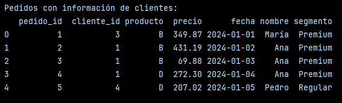
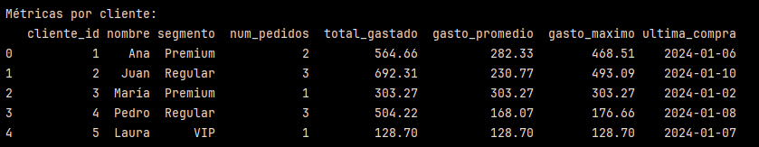

# Ejercicio: Transformaciones avanzadas en dataset de e-commerce

## Datos base:

```python
import pandas as pd
import numpy as np

# config

pd.set_option('display.max_columns', None)
pd.set_option('display.max_rows', None)
pd.set_option('display.width', None)

# Clientes
clientes = pd.DataFrame({
    'cliente_id': range(1, 6),
    'nombre': ['Ana', 'Juan', 'María', 'Pedro', 'Laura'],
    'segmento': ['Premium', 'Regular', 'Premium', 'Regular', 'VIP']
})

# Pedidos
pedidos = pd.DataFrame({
    'pedido_id': range(1, 11),
    'cliente_id': np.random.choice(range(1, 6), 10),
    'producto': np.random.choice(['A', 'B', 'C', 'D'], 10),
    'precio': np.random.uniform(50, 500, 10).round(2),
    'fecha': pd.date_range('2024-01-01', periods=10)
})

print("Clientes y pedidos cargados")
```

En este bloque se crean dos DataFrames:

- ``clientes``: contiene 5 clientes con sus respectivos id, nombres y segmento.
- ``pedidos``: contiene pedido_id que va del 1 al 10, cliente_id, producto, precio y fecha.

Finalmente se imprime un mensaje de confirmación de que el bloque se ejecutó sin problemas.


## Enriquecer datos con joins:

```python
# Unir pedidos con información de clientes
pedidos_enriquecidos = pd.merge(
    pedidos, 
    clientes, 
    on='cliente_id', 
    how='left'
)

print("Pedidos con información de clientes:")
print(pedidos_enriquecidos.head())
```

En este caso ``pd.merge() ``es como un equivalente en pandas a un JOIN en SQL.

Sería similar a:

```sql
SELECT *
FROM pedidos p
LEFT JOIN clientes c
ON p.cliente_id = c.cliente_id;
```

``pedidos`` sería la tabla principal (hechos) y representa los datos transaccionales.

``clientes`` es el DataFrame de referencia (dimensión), contiene atributos descriptivos.

``on='cliente_id'`` define la clave de unión.

``how='left'`` especifica el tipo de JOIN, en este caso LEFT JOIN:
- se conservan todos los pedidos, se agrega información del cliente solo si existe coincidencia



Finalmente, el DataFrame enriquecido contiene las columnas originales de ``pedidos`` con información adicional desde ``clientes``.

De acuerdo a la imagen, se observa que un cliente puede tener varios pedidos (como Ana).

## Calcular métricas derivadas:

```python
# Calcular métricas por cliente
metricas_cliente = pedidos_enriquecidos.groupby(['cliente_id', 'nombre', 'segmento']).agg({
    'pedido_id': 'count',
    'precio': ['sum', 'mean', 'max'],
    'fecha': 'max'  # Última compra
}).round(2)

# Aplanar columnas multi-nivel
metricas_cliente.columns = ['num_pedidos', 'total_gastado', 'gasto_promedio', 'gasto_maximo', 'ultima_compra']
metricas_cliente = metricas_cliente.reset_index()

print("\nMétricas por cliente:")
print(metricas_cliente)
```

En este bloque se calculan métricas por cliente.

- Se agrupa por cliente, nombre y segmento.
- Se calculan agregaciones:
    - recuento de pedidos
    - al precio se le calcula la suma, el promedio y el máximo.
    - se calcula la fecha máxima que representa la última compra.

Todo esto para cada cliente.

>[!NOTE]
> Cuando se usa ``.groupby().agg()``con más de una función por columna, pandas crea columnas jerárquicas (un MultiIndex).

Así quedan las columnas después del ``agg``:

```python
Index: ['cliente_id', 'nombre', 'segmento']

Columns (MultiIndex):
('pedido_id', 'count')
('precio', 'sum')
('precio', 'mean')
('precio', 'max')
('fecha', 'max')
```
Donde cada columna es una tupla: 

```python 
(columna_original, función_aplicada)

#Ejemplo

('precio', 'sum')
```

Esto significa que esta columna viene de ``precio`` y se le aplicó ``sum``.

Aplanar columnas es convertir ese esquema jerárquico (tuplas) en nombres simples de una sola capa:

```python
('pedido_id', 'count') → 'num_pedidos'
('precio', 'sum') → 'total_gastado'
('precio', 'mean') → 'gasto_promedio'
('precio', 'max') → 'gasto_maximo'
('fecha', 'max') → 'ultima_compra'
```

Con ``metricas_cliente.columns = ...`` pandas mantiene el orden de las columnas creadas por ``agg`` y uno asiga una lista de nombres en ese mismo orden. 

>[!WARNING]
> Al hacer ``groupby``, pandas mueve las columnas del groupby al índice. Dejan de ser columnas y pasan a ser el índice del DataFrame.

```
Visualmente quedaría algo así:

                         num_pedidos  total_gastado
cliente_id nombre  segmento
1          Ana     Premium          3          288.51
2          Juan    Regular          1           88.50
```

``reset_index()`` convierte el índice en columnas normales y crea un nuevo índice.




Se observa que cada fila representa un cliente agregado. Aquellos que tienen 1 solo pedido tienen igual total, promedio y máximo. En cambio clientes con más pedidos (como Ana y Pedro) tienen diferencias en sus métricas.


## Validar reglas de negocio:

```python
def validar_reglas_negocio(df):
    validaciones = []
    
    # VIP deben tener al menos 2 pedidos
    vip_insuficientes = df[(df['segmento'] == 'VIP') & (df['num_pedidos'] < 2)]
    if len(vip_insuficientes) > 0:
        validaciones.append(f"VIPs con pocos pedidos: {len(vip_insuficientes)}")
    
    # Premium no deben exceder gasto máximo
    premium_excesivos = df[(df['segmento'] == 'Premium') & (df['gasto_maximo'] > 800)]
    if len(premium_excesivos) > 0:
        validaciones.append(f"Premiums con gastos excesivos: {len(premium_excesivos)}")
    
    return validaciones

reglas_incumplidas = validar_reglas_negocio(metricas_cliente)
print(f"\nReglas de negocio incumplidas: {reglas_incumplidas}")

```

En este bloque de validación de reglas de negocio se define una función ``validar_relgas_negocio(df)``

Esta función recibe un DataFrame ya transformado (en este caso, métricas_clientes), evalúa reglas de negocio y devuelve una lista de alertas, informa inclumplimientos.


**Regla 1: VIP con al menos dos pedidos:**

```python
vip_insuficientes = df[
    (df['segmento'] == 'VIP') & 
    (df['num_pedidos'] < 2)
]
```

- Filtra clientes que son del segmento VIP
- y que tienen al menos dos pedidos

Esta regla podría deberse a que se espera que un cliente VIP tenga un comportamiento de compra recurrente.

Luego:

```python
if len(vip_insuficientes) > 0:
    validaciones.append(
        f"VIPs con pocos pedidos: {len(vip_insuficientes)}"
    )
```

Con ``len(vip_insuficientes)`` se cuenta cuántos VIP incumplen la regla y si hay almenos uno, se agrega un mensaje a la lista.

**Regla 2: Premium con gasto máximo excesivo**:

```python
premium_excesivos = df[
    (df['segmento'] == 'Premium') & 
    (df['gasto_maximo'] > 800)
]
```

- Filtra clientes Premium
- con un pedido individual mayor a 800

Luego:

```python
if len(premium_excesivos) > 0:
    validaciones.append(
        f"Premiums con gastos excesivos: {len(premium_excesivos)}"
    )
```

Finalmente, la función retorna una lista de strings que puede estar vacía o con uno más mensajes de alerta.

Y con:

```python
reglas_incumplidas = validar_reglas_negocio(metricas_cliente)
print(f"\nReglas de negocio incumplidas: {reglas_incumplidas}")
```

Se ejecuta la validación y se imprime el mensaje con el resultado.


En este caso, se observa que hay una regla incumplida, donde hay un VIP con pocos pedidos (menos de 2). Al revisar el DataFrame de metricas_clientes se puede confirmar que Laura pertenece al segmento VIP y solo tiene 1 pedido.

### Reflexiones finales

¿Qué tipo de join usarías cuando quieres mantener todos los registros de una tabla principal? 

Para mantener todos los registros de una tabla principal utilizaría un LEFT JOIN en caso de que quisiera enriquecerlos con información de otra tabla (solo cuando existe coincidencia). 

En procesos ETL, el LEFT JOIN es el más utilizado cuando se trabaja con:
- Tablas de  hechos (pedidos, ventas, transacciones)
- Enriquecimiento con dimensiones (clientes, productos, categorías)

Esto asegura la integridad del dataset base y permite detectar problemas de calidad de datos.

¿Cómo decides qué métricas calcular para un análisis específico?

La selección de métricas a cacular depende del objetivo del análisis y del nivel de decisión que se quiere apoyar.

Es importante hacerse ciertas preguntas antes de seleccionar las métricas:
- ¿Qué comportamiento se quiere analizar?
- ¿ A qué nivel de granularidad?
- ¿Qué decisiones se tomarán con los datos?

Además, dependiendo del objetivo es importante considerar lo siguiente:

- Tipo de análisis
    - Descriptivo
    - Comparativo
    - Temporal

- Relevancia del negocio:
    - Métricas que representen valor económico (gasto total, ticket promedio)
    - indicadores de comportamiento (número de pedidos, frecuencia de compra)
    - señales de riesgo o anomalías (por ejemplo gastos máximos atípicos)


--- 


Verificación: ¿Qué tipo de join usarías cuando quieres mantener todos los registros de una tabla principal? ¿Cómo decides qué métricas calcular para un análisis específico?

Requerimientos:
Pandas para manipulación de datos
Comprensión de operaciones de conjunto
Conocimiento de reglas de negocio