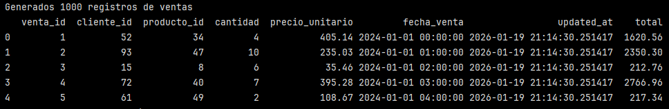
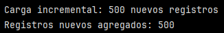
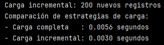

# Ejercicio: Implementar diferentes estrategias de carga

## Preparar datos de ejemplo:

>[!IMPORTANT]
> Se debe instalar ``pyarrow``. 

>[!NOTE]
> PyArrow es una biblioteca de Python para el formato de datos columnar en memoria de Apache Arrow, que permite un procesamiento de datos rápido y eficiente, mejorando el rendimiento de bibliotecas como Pandas, especialmente con grandes volúmenes de datos, ofreciendo una interoperabilidad sin fisuras entre diferentes sistemas y lenguajes, y una gestión de memoria superior, siendo fundamental para flujos de trabajo de Big Data. 

```python
import pandas as pd
import numpy as np
from datetime import datetime

# Generar datos de ventas
np.random.seed(42)
ventas = pd.DataFrame({
    'venta_id': range(1, 1001),
    'cliente_id': np.random.randint(1, 101, 1000),
    'producto_id': np.random.randint(1, 51, 1000),
    'cantidad': np.random.randint(1, 11, 1000),
    'precio_unitario': np.round(np.random.uniform(10, 500, 1000), 2),
    'fecha_venta': pd.date_range('2024-01-01', periods=1000, freq='1H'),
    'updated_at': datetime.now()
})

ventas['total'] = ventas['cantidad'] * ventas['precio_unitario']

print(f"Generados {len(ventas)} registros de ventas")
print(ventas.head())
```

En este bloque se genera un DataFrame ``ventas`` con 7 columnas y un total de 1000 registros.

La columna ``updated_at: datetime.now()`` es clave para cargas incrementales porque representa cuándo se actualizó el registro.

Además, se calcula una columna derivada ``'total'`` que corresponde a la ``'cantidad'`` * ``'precio_unitario'``.

Finalmente se impimer el número de registros generados y las primeras 5 filas del DataFrame.




## Carga completa (full load):

```python
import sqlite3

def carga_completa_sqlite(df, tabla):
    conn = sqlite3.connect(':memory:')
    
    # Crear tabla
    conn.execute(f'''
        CREATE TABLE {tabla} (
            venta_id INTEGER PRIMARY KEY,
            cliente_id INTEGER,
            producto_id INTEGER,
            cantidad INTEGER,
            precio_unitario REAL,
            total REAL,
            fecha_venta TEXT,
            updated_at TEXT
        )
    ''')
    
    # Insertar datos
    df.to_sql(tabla, conn, if_exists='replace', index=False)
    
    # Verificar
    cursor = conn.execute(f"SELECT COUNT(*) FROM {tabla}")
    count = cursor.fetchone()[0]
    
    conn.close()
    return count

registros_cargados = carga_completa_sqlite(ventas, 'ventas_completas')
print(f"Carga completa: {registros_cargados} registros")
```

El objetivo de este bloque es simular una carga completa hacia una base de datos. Una carga completa implica que se elimina cualquier estado previo, se cargan todos los registros desde cero.

En la inserción de datos 

```python
df.to_sql(tabla, conn, if_exists='replace', index=False)
```

``if_exists='replace'`` elimina la tabla si existe, la vuelve a crear e inserta todos los registros del DataFrame.

``index=False`` evita insertar el índice de pandas como una columna.


```python
cursor = conn.execute(f"SELECT COUNT(*) FROM {tabla}")
count = cursor.fetchone()[0]
```

Es una consulta directa a la base: cuenta cuántos registros quedaron cargados. Es una validación de calidad de carga.


Se cargaron todos los registros del DataFrame (1000 registros).

## Carga incremental (simulada):

```python
def carga_incremental(df, archivo_parquet, ultimo_id=0):
    # Simular carga incremental: solo registros nuevos
    nuevos_registros = df[df['venta_id'] > ultimo_id]
    
    if len(nuevos_registros) > 0:
        try:
            # En producción, leer archivo existente y append
            nuevos_registros.to_parquet(
                archivo_parquet,
                engine='pyarrow',
                index=False
            )
            print(f"Carga incremental: {len(nuevos_registros)} nuevos registros")
            return len(nuevos_registros)
        except Exception as e:
            print(f"Error en carga incremental: {e}")
            return 0
    else:
        print("No hay nuevos registros para cargar")
        return 0

nuevos_cargados = carga_incremental(ventas, 'ventas_incremental.parquet', ultimo_id=500)
print(f"Registros nuevos agregados: {nuevos_cargados}")
```
En este caso, se está simulando una carga incremental. El objetivo es cargar solo los registros nuevos, evitando procesar todo el dataset.

Se define una función ``carga_incremental(df, archivo_parquet, ultimo_id=0)``:
- ``df``: DataFrame fuente (en este caso ``ventas``)
- ``archivo_parquet``: destinoo (archivo Parquet)
- ``ultimo_id``: último ``venta_id`` cargado previamente.

Filtro incremental:

``nuevos_registros = df[df['venta_id'] > ultimo_id]``: se filtran solo las filas cuyo ``venta_id`` sea mayor al último procesado.

Verificación de existencia de nuevos datos:

``if len(nuevos_registros) > 0:``: verifica si hay nuevos registros. Si no hay, imprime "No hay nuevos registros para cargar".

Escritura en formato Parquet:

```python
nuevos_registros.to_parquet(
    archivo_parquet,
    engine='pyarrow',
    index=False
)
```

Recordar que el formato Parquet es columnar y está optimizado para analítica y Big Data.

``engine='pyarrow'`` define el motor

``index=False`` evita escribir el índice de pandas.

Manejo de errores:

```python
except Exception as e:
    print(f"Error en carga incremental: {e}")
    return 0
```

Captura errores de escritura (como permisos, engine no instalado,etc) y evita que el pipeline falle abruptamente. Retorna 0 para indicar que no e cargó nada.


```python
nuevos_cargados = carga_incremental(
    ventas,
    'ventas_incremental.parquet',
    ultimo_id=500
)
```

Ejecuta el proceso. Se simula que ya estaban cargados los registros con ``venta_id ≤ 500``, por lo tanto se esperan 500 registros nuevos.



## Comparar estrategias:

```python
import time

def comparar_estrategias_carga():
    estrategias = {}

    # Medir carga completa
    start = time.time()
    carga_completa_sqlite(ventas, 'ventas_test')
    estrategias['completa'] = time.time() - start

    # Medir carga incremental (simulada)
    start = time.time()
    carga_incremental(ventas, 'ventas_inc_test.parquet', ultimo_id=800)
    estrategias['incremental'] = time.time() - start

    print("Comparación de estrategias de carga:")
    print(f"- Carga completa   : {estrategias['completa']:.4f} segundos")
    print(f"- Carga incremental: {estrategias['incremental']:.4f} segundos")

    return estrategias


resultados = comparar_estrategias_carga()
```

En este bloque se comparan los tiempos de ejecución de una carga completa versus una carga incremental simulada, utilizando el mismo dataset. 

Se importa el módulo ``time`` para medir tiempos de ejecución en segundos. La función ``time.time()`` devuelve el tiempo actual del sistema, lo que permite calcular duraciones por diferencia.

Se define la función comparativa:

```python
def comparar_estrategias_carga():
    estrategias = {}
```

``estrategias`` es un diccionario donde  se almacenan los tiempos medidos para cada tipo de carga.

- Medición de la carga completa:

    - Se guarda el tiempo inicial (``start``)
    - Se ejeuta la carga completa, que procesa todos los registros.
    - Se calcula el tiempo total restando el tiempo inicial al mismo tiempo final.
    - El resultado se guarda bajo la clave ``'completa'``

- Medición de la carga incremental simulada:

    - Se reinicia el contador de tiempo.
    - Se ejecuta la carga incremental
    - Solo se consideran los registros cuyo ``venta_id`` es mayor a 800.
    - Se mide y almacena el tiempo de ejecución.
    - El resultado se guarda bajo la clave ``'incremental'``

>[!NOTE]
> Los 200 nuevos registros se debe a que este último bloque esta llamando otra vez a la función ``carga_incremental`` pero con otro ``ultimo_id`` (800), por lo tanto, si se ejecuta ``carga_incremental(ventas, 'ventas_inc_test.parquet', ultimo_id=800)``, como ``ventas`` tiene ``venta_id`` de 1 a 1000, entonces ``venta_id > 800`` → 801 a 1000 que equivale a 200 registros.


Finalmente la funcin retorna el diccionario ``estrategias`` con los tiempo de cada tipo de carga. Al ejecutar la función, los resultados quedan almacenados en ``resultados``.



La diferencia de tiempos ilustra cómo la carga incremental reduce el volumen de datos procesados y mejora la eficiencia del pipeline.

### Reflexiones finales:

¿En qué situaciones usarías carga completa vs incremental? 

- Carga completa:
    - Si el volumen de datos es pequeño
    - Se trata de una carga inicial o reconstrucción de todo el sistema
    - Si la fuente no permite identificar cambios (por ejemplo si no hay ``updated_at`` o IDs incrementales).
    
- Carga incremental:
    - El volumen de datos es grande y crece continuamente
    - Solo una fracción de los datos cambia entre ejecuciones.
    - Existen campos que permiten detectar cambios.
    - Se necesita eficiencia, escalabilidad y menor impacto en recursos.

¿Qué factores influyen en el tamaño óptimo de batch para carga de datos?

- Capacidad del sistema de destino: por ejemplo memoria, I/O y concurrencia (cuántos procesos, tareas o usuarios están usando el mismo recurso al mismo tiempo)
- Latencia: cargas más pequeñas reducen tiempos de espera.
- Frecuencia de actualización: cargas frecuentes se favorecen con batches pequeños, cargas nocturnas permiten batches grandes.
- Tipo de datos y transformaciones: datos complejos o con validaciones pesadas podrían requerir batches más pequeños.
- Requerimientos de recuperación ante fallos: batches más pequeños facilitan reintentos y rollback (la capacidad de deshacer una operación y volver al estado anterior si algo falla.).


>[!NOTE]
> I/O se refiere a operaciones de entrada (Input) y salida de datos (Output) de un programa y otros sistemas.
> 
> Lectura (Input)
> - Leer archivos
> - Leer desde una base de datos
> - Leer desde una APi
>
> Escritura (Output)
> - Insertar datos en una base de datos
> - Escribir archivos
> - Guardar resultados en disco o red


--- 

Verificación: ¿En qué situaciones usarías carga completa vs incremental? ¿Qué factores influyen en el tamaño óptimo de batch para carga de datos?

Requerimientos:
Pandas y SQLAlchemy
Conocimiento de bases de datos SQL
Familiaridad con formatos de archivo analíticos