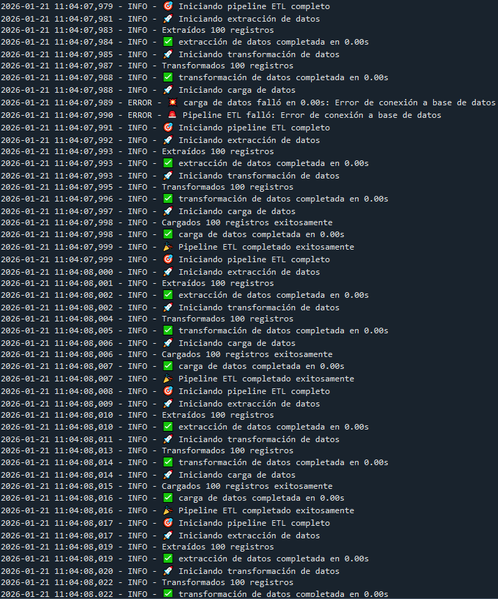
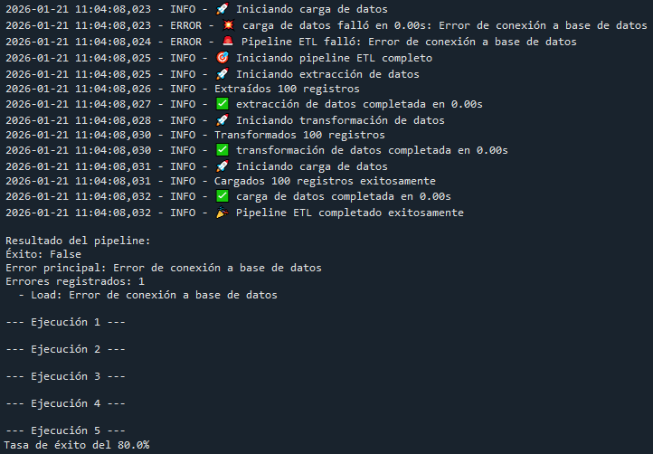

# Ejercicio: Construir pipeline ETL con manejo de errores completo

## Configurar logging:

```python
import logging
import time
from functools import wraps

# Configurar logging
logging.basicConfig(
    level=logging.INFO,
    format='%(asctime)s - %(levelname)s - %(message)s',
    handlers=[
        logging.FileHandler('etl_ecommerce.log'),
        logging.StreamHandler()
    ]
)

logger = logging.getLogger('etl_ecommerce')

def log_etapa(etapa):
    """Decorator para logging de etapas"""
    def decorator(func):
        @wraps(func)
        def wrapper(*args, **kwargs):
            logger.info(f"🚀 Iniciando {etapa}")
            start_time = time.time()
            
            try:
                result = func(*args, **kwargs)
                duration = time.time() - start_time
                logger.info(f"✅ {etapa} completada en {duration:.2f}s")
                return result
            except Exception as e:
                duration = time.time() - start_time
                logger.error(f"💥 {etapa} falló en {duration:.2f}s: {e}")
                raise e
        
        return wrapper
    return decorator
```

Este bloque define la infraestructura de observabilidad del pipeline: loggin centralizado más un decorador para medir tiempos y registrar inicio/fin/error de cada etapa.

Se importan las librerías y módulos:

- ``logging``: para registrar eventos (info, warnings, errores) en consola y archivo.
- ``time``: para medir cuánto demora cada etapa 
- ``wraps``: módulo que permite mantener el nombre "real" y docstring de la función original cuando se usan decoradores. Es útil para debugging y trazabilidad.

Luego se tiene la configuración global del logging ``logging.basicConfig(...)``. 

- ``level = logging.INFO`` define los niveles de severidad: desde INFO hacia arriba.
- ``format`` estandariza el formato de cada línea de log como:
    - ``asctime``: fecha y hora
    - ``levelname``: nivel de severidad
    - ``message``: texto del log

- ``handlers``:
    - ``FileHandler('etl_ecommerce.log')``: guarda el log en un archivo (persistencia).
    - ``StreamHandler()``: imprime en consola (visibilidad inmediata mientras ejecutas).

Después se crea un logger con nombre ``etl_ecommerce`` con el que se puede distinguir logs de este módulo versus otros y permite ajustar la configuración por logger si crece el proyecto.

Luego se define una función llamada ``log_etapa(etapa)`` que es un decorador parametrizable. Recibo un texto y devuelve un decorador. Esto permite que cada función decorada sepa qué estapa se está ejecutando.

Estructura del decorador:

- ``decorator(func)``: ``func`` es la función real que se va a decorar, por ejemplo ``extract()``, ``transform()``, etc.

- ``@wraps(func)``:

    ```python
    @wraps(func)
    def wrapper(*args, **kwargs):
    ```
    ``wrapper`` reemplaza a ``func`` al ejecutarse, pero ``@wraps`` hace que ``wrapper.__name__ sea`` el nombre original de ``func`` y se preserve docstring y metadata.

- Inicio de etapa y cronómetro: hay un log de inicio y una marca de tiempo inicial para calcular la duración.

Luego hay una sección de manejo de éxitos y errores (try/except)

- Caso de éxito:

```python
result = func(*args, **kwargs)
duration = time.time() - start_time
logger.info(f"✅ {etapa} completada en {duration:.2f}s")
return result
```

Ejecuta la función real ``func``, calcula la duración, loguea el fin exitoso con su tiempo respectivo y retorna el resultado.

- Caso de error:

```python
except Exception as e:
    duration = time.time() - start_time
    logger.error(f"💥 {etapa} falló en {duration:.2f}s: {e}")
    raise e
```

Captura cualquier excepción, logue el error con duración hasta el fallo, mensaje del error y lyego ``raise e`` re-lanza el error (no lo oculta).

## Pipeline ETL con error handling:

```python
import pandas as pd
import numpy as np
from typing import Dict, Any

class ETLPipeline:
    def __init__(self):
        self.logger = logger
        self.errores = []
    
    @log_etapa("extracción de datos")
    def extract(self) -> pd.DataFrame:
        """Extraer datos con manejo de errores"""
        try:
            # Simular extracción (podría fallar)
            if np.random.random() < 0.1:  # 10% chance de error
                raise ConnectionError("Error de conexión a fuente de datos")
            
            # Datos de ejemplo
            datos = pd.DataFrame({
                'orden_id': range(1, 101),
                'cliente_id': np.random.randint(1, 21, 100),
                'producto': np.random.choice(['A', 'B', 'C', 'D'], 100),
                'cantidad': np.random.randint(1, 6, 100),
                'precio': np.round(np.random.uniform(10, 200, 100), 2)
            })
            
            self.logger.info(f"Extraídos {len(datos)} registros")
            return datos
            
        except Exception as e:
            self.errores.append(f"Extract: {e}")
            raise e
    
    @log_etapa("transformación de datos")
    def transform(self, datos: pd.DataFrame) -> pd.DataFrame:
        """Transformar datos con validaciones"""
        try:
            df = datos.copy()
            
            # Validar datos de entrada
            if df.empty:
                raise ValueError("No hay datos para transformar")
            
            # Transformaciones
            df['total'] = df['cantidad'] * df['precio']
            df['categoria_precio'] = pd.cut(
                df['precio'], 
                bins=[0, 50, 100, 200], 
                labels=['Bajo', 'Medio', 'Alto']
            )
            
            # Validar transformaciones
            if df['total'].isnull().any():
                raise ValueError("Transformación produjo valores nulos")
            
            self.logger.info(f"Transformados {len(df)} registros")
            return df
            
        except Exception as e:
            self.errores.append(f"Transform: {e}")
            raise e
    
    @log_etapa("carga de datos")
    def load(self, datos: pd.DataFrame) -> bool:
        """Cargar datos con verificación"""
        try:
            # Simular carga (podría fallar)
            if np.random.random() < 0.05:  # 5% chance de error
                raise Exception("Error de conexión a base de datos")
            
            # En producción: datos.to_sql('ventas', engine, if_exists='append')
            self.logger.info(f"Cargados {len(datos)} registros exitosamente")
            
            # Validar carga
            registros_esperados = len(datos)
            registros_cargados = len(datos)  # Simulado
            
            if registros_cargados != registros_esperados:
                raise ValueError(f"Carga incompleta: {registros_cargados}/{registros_esperados}")
            
            return True
            
        except Exception as e:
            self.errores.append(f"Load: {e}")
            raise e
    
    def ejecutar_pipeline(self) -> Dict[str, Any]:
        """Ejecutar pipeline completo con manejo de errores"""
        self.logger.info("🎯 Iniciando pipeline ETL completo")
        
        try:
            # Extract
            datos_crudo = self.extract()
            
            # Transform
            datos_transformados = self.transform(datos_crudo)
            
            # Load
            exito = self.load(datos_transformados)
            
            resultado = {
                'exito': True,
                'registros_procesados': len(datos_transformados),
                'errores': self.errores
            }
            
            self.logger.info("🎉 Pipeline ETL completado exitosamente")
            return resultado
            
        except Exception as e:
            self.logger.error(f"🚨 Pipeline ETL falló: {e}")
            
            return {
                'exito': False,
                'error_principal': str(e),
                'errores': self.errores
            }
```

Una vez configurado el logging, se tiene este bloque que contiene el Pipeline ETL completo con manejo de errores.

1. Estructura general del pipeline:

El pipeline se encapsula en una clase (ETLPipeline) que:

- Centraliza la ejecución del proceso ETL.
- Mantiene un registro de errores ocurridos.
- Permite ejecutar el flujo completo de manera ordenada y repetible.

El pipeline se comporta como una “unidad de proceso” que sabe en qué etapa está, qué salió bien y qué falló.

2. Etapa de extracción (Extract)

Su objetivo es obtener los datos desde una fuente de origen.

- Se simula lalectura de datos (como si vinieran de una base de datos, API o archivo).
- Se considera que la extracción puede fallar (como errores de conexión)
- Se valida que los datos hayan sido efectivamente obtenidos.

Se espera que un conjunto de datos iniciales esté listo para ser transformado o que un se identifique algún error.

3. Etapa de transformación (Transform)

El objetivo de esta sección es preparar y enriquecer los datos para su uso posterior.

- Se verifica que los datos de entrada sean válidos.
- Se generan nuevos campos derivados (como ``'total'`` siendo igual a la cantidad multiplicada por el precio o ``'categoria_precio'`` asignándo una clasificación a los precios de los productos).
- Se valida que las transformaciones no hayan producido inconsistencias

Se espera que tras la ejecución de este bloque, los datos sean coherentes, completos y estructurados, listos para ser cargados.

4. Etapa de carga (Load)

La idea esta sección es persisitr los datos transformados en el sistema de destino.

- Se simula la carga a un destino final
- Se considera la posibilidad de fallos durante la carga
- Se verifica que la cantidad de datos cargados coincida con lo esperado.

Se espera que los datos se carguen correctamente o que se identifique algún fallo en esta etapa y sea reportado.

5. Orquestación del pipeline completo

La idea es coordinar las etapas de extracción, transformación y carga en un flujo único.

- Se ejecutan las etapas en el orden correcto 
- Si una etapa falla, el pipeline se detiene de forma controlada
- Se recopila información sobre el éxito o fracaso del proceso

Se espera un resultado final estructurado que indica:
- su el pipeline fue exitoso o no
- cuántos registros se procesaron
- qué errores ocurrieron en qué etapa

6. Manejo de errores

El objetivo es asegurar que el pipeline sea monitoreable y confiable.

- Cada etapa registra su inicio, fin y posibles fallos.
- Los errores se almacenan con contexto (etapa en donde ocurrieron)
- Si el pipeline falla, siempre deja evidencia del fallo.

El pipeline está diseñado para fallar de forma controlada, permitiendo análisis posterior y mejora continua.


## Ejecutar y validar pipeline:

```python
# Ejecutar pipeline con diferentes escenarios
pipeline = ETLPipeline()

# Ejecución exitosa
resultado = pipeline.ejecutar_pipeline()

print(f"\nResultado del pipeline:")
print(f"Éxito: {resultado['exito']}")
if resultado['exito']:
    print(f"Registros procesados: {resultado['registros_procesados']}")
else:
    print(f"Error principal: {resultado['error_principal']}")

print(f"Errores registrados: {len(resultado['errores'])}")
for error in resultado['errores']:
    print(f"  - {error}")

# Ejecutar múltiples veces para probar robustez
resultados_multiples = []
for i in range(5):
    print(f"\n--- Ejecución {i+1} ---")
    pipeline_i = ETLPipeline()
    resultado_i = pipeline_i.ejecutar_pipeline()
    resultados_multiples.append(resultado_i['exito'])

exito_rate = sum(resultados_multiples) / len(resultados_multiples)
print(f"Tasa de éxito del {exito_rate:.1%}")
```

Este bloque se enfoca en ejecutar el pipeline, observar su comportamiento en distintos escenarios y evaluar su robustez frente a errores.

1. Ejecución controlada del pipeline

La idea es verificar que el pipeline pueda ejecutarse de principio a fin y entregar un resultado comprensible.

- Se instancia el pipeline
- Se ejecuta el proceso ETL completo una vez
- Se obtiene un resultado estructurado que indica si la ejecución fue exitosa o no.

2. Validación del resultado de la ejecución

El objetivo es interpretar el resultado entregado por el pipeline:

- Se informa si la ejecución fue exitosa
- En caso de éxito, se reporta cuántos registros fueron procesados.
- En caso de error, se identifica el error principal ocurrido.

3. Revisión de errores registrados

La idea es asegurar la trazabilidad yla capacidad de diagnóstico.

- Se revisa cuántos rerrores fueron registrados
- Se listan errores con información de la etapa en que ocurrieron.

De esta manera se tiene visibilidad sobre los puntos débiles del pipeline.


4. Pruebas de robustez mediante múltiples ejecuciones:

Se evalúa el comportamiento del pipeline bajo condiciones variables.

- Se ejecuta el pipeline varias veces de forma consecutiva
- Cada ejecución se considera un escenario independiente
- Se observa si el pipeline logra recuperarse entre ejecuciones

De esta manera, el pipeline no se evalúa solo en un caso ideal, sino en escenarios repetidos con posibilidad de fallo.

5. Medición de estabilidad del pipeline

El propósito es cuantificar el nivel de confiabilidad del proceso.

- Se calcula una tasa de éxito basada en las ejecuciones realizadas
- Esto sirvecomo indicador que resume el desempeño global del pipeline

6. Separación entre ejecución y evaluación:

La idea es mantener claridad y orden en el análisis.

La ejecución del pipeline y su evaluación se mantienen separadas : el pipeline se encarga de procesar datos y este bloque en particular de evaluar el pipeline.







Se ejecuta una primera corrida individual del pipeline y se muestra el resultado. Luego, se ejecuta otras 5 corridas adicionales para evaluar la robustez y calcular la tasa de éxito.

La primera ejecución del pipeline falló en la etapa Load

```
💥 carga de datos falló en 0.00s: Error de conexión a base de datos
🚨 Pipeline ETL falló: Error de conexión a la base de datos
```

Luego se imprime:

```
Resultado del pipeline:
Éxito: False
Error principal: Error de conexión a base de datos
```

Lo que coincide con el resultado de la primera ejecución.

Después del primer resultado, el código entra en el bucle for:

```python
for i in range(5):
    pipeline_i = ETLPipeline()
    resultado_i = pipeline_i.ejecutar_pipeline()
```

Donde se observa múltiples pipelines exitosos (4) y nuevamente aparece un error asociado a la conexión a la base de datos en una de las iteraciones.

Finalmente, se ve que la tasa de éxito es de un 80%, ya que se calcula solo sobre las 5 ejecuciones del loop. 1/5 errores corresponde al 20%, por lo tanto se tiene un 80% de éxito.

Este resultado evidencia que el pipeline ETL es capaz de ejecutar correctamente las etapas de extracción, transformacción y carga, y que ante fallos simulados en la etapa de carga, el proceso falla de forma controlada, registra el error y continua operando en ejecuciones posterioresm permitiendo evaluar su estabilidad mediante una tasa de éxito que fue del 80%.


### Reflexiones finales 
 
 ¿Qué información debería incluir en los logs para facilitar el debugging?

Para que un log sea útil en debuggin, debe contener información que permita responder qué pasó, dónde y qué tan grave fue.

- Contexto de ejecución: nombre del pipeline y etapa
- Tiempos y performance: timestamp y duración por etapa y duración total.
- Volumen y métricas operativas: cantidad de registros extraídos/transformados/cargados. Resultados de validaciones (duplicados, valores nulos, outliers, en casos que corresponda).
- Errores con trazabilidad: tipo de error con algún mensaje del error, con stack trace, nivel de severidad y acción tomada (retry, skip, abort).

>[!NOTE]
> Stack trace es como el historial que muestra dónde y por qué ocurrió el error. Es el detalle del recorrido del programa hasta el error, que permite identificar con precisión su origen.Entrega información como: en qué archivo ocurrió el error, en qué línea, en qué función, qué función llamó a cuál. Permite saber dónde y cómo falló.

¿Cómo decides entre continuar el pipeline con errores parciales vs detenerlo completamente?

Para decidir es importante definir lo siguiente:

- Clasificar el error: ¿crítico o no crítico?
- Medir el impacto: ¿cuántos registros afecta y qué campos?
- Evaluar el riesgo downstream: ¿alguien tomará decisiones con esto? Si los datos están incompletos o hay algo mal, a quién afecta y qué consecuencias tiene?
- Definir umbrales: porcentajes máximos de errores aceptables
- Asegurar trazabilidad: si se continúa, registrar qué datos se omitieron, por qué y dónde quedaron esos datos.

Ante fallos críticos o riesgo de inconsistencia (que los datos queden en un estado incorreco o incompleto) sería recomendable detener el proceso. Continuar sería una opción en caso de que los errores sean acotados, se puedan aislar y/o que haya umbrales de calidad definidos, manteniendo trazabilidad.

---

Verificación: ¿Qué información debería incluir en los logs para facilitar el debugging? ¿Cómo decides entre continuar el pipeline con errores parciales vs detenerlo completamente?

Requerimientos:
- Logging module de Python
- Pandas para manipulación de datos
- Conocimiento de manejo de excepciones