# Ejercicio: Crear tu primer DAG funcional

>[!IMPORTANT]
> Apache Airflow está diseñado para ejecutarse en sistemas Linux, por lo que en entornos Windows se recomienda usar WSL (Windows Subsystem for Linux) para disponer de un entorno compatible. En este contexto, Airflow se instala dentro de una distribución de Linux (acá se usó Ubuntu), utilizando un entorno visual de Python para aislar dependencias y evitar conflicos con otras versiones de Python. Es fundamental verificar la compatibilidad entre la versión de Python y la versión de Airflow utilizada, definir correctamente el directorio AIRFLOW_HOME y ubicar los archivos de los DAGs en la carpeta configurada como dags_folder.

## Instalación básica de Airflow:

```python
# Crear entorno virtual
python3 -m venv airflow_env
source airflow_env/bin/activate # importante activar esto con cada terminal nueva de ubuntu

# Instalar Airflow
pip install apache-airflow

# Inicializar base de datos
airflow db init

# Crear usuario admin
airflow users create \
  --username admin \
  --firstname Admin \
  --lastname User \
  --role Admin \
  --email admin@example.com
```

Una vez instalado apache airflow y python en el entorno virtual, se verificó las versiones de cada uno:


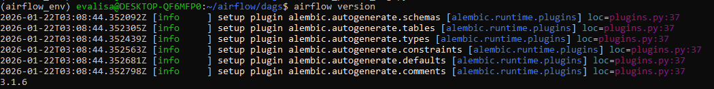

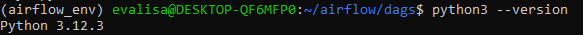


## Crear primer DAG:

```python
# dags/mi_primer_dag.py
from airflow import DAG
from airflow.operators.bash import BashOperator
from airflow.operators.python import PythonOperator
from datetime import datetime, timedelta

def saludar():
    print("¡Hola desde Airflow!")
    return "Saludo completado"

# Definir DAG
dag = DAG(
    'saludo_diario',
    description='DAG que saluda cada día',
    schedule=timedelta(days=1),  # Ejecutar diariamente
    start_date=datetime(2024, 1, 1),
    catchup=False,  # No ejecutar ejecuciones pasadas
    tags=['ejemplo', 'saludo']
)

# Tarea 1: Comando bash
tarea_bash = BashOperator(
    task_id='tarea_bash',
    bash_command='echo "Ejecutando tarea bash a las $(date)"',
    dag=dag
)

# Tarea 2: Función Python
tarea_python = PythonOperator(
    task_id='tarea_python',
    python_callable=saludar,
    dag=dag
)

# Tarea 3: Esperar (simular procesamiento)
tarea_esperar = BashOperator(
    task_id='tarea_esperar',
    bash_command='sleep 5',
    dag=dag
)

# Definir orden de ejecución
tarea_bash >> tarea_python >> tarea_esperar
```

En la carpeta ``/dags`` se creó el archivo mi-primer-dag.py 

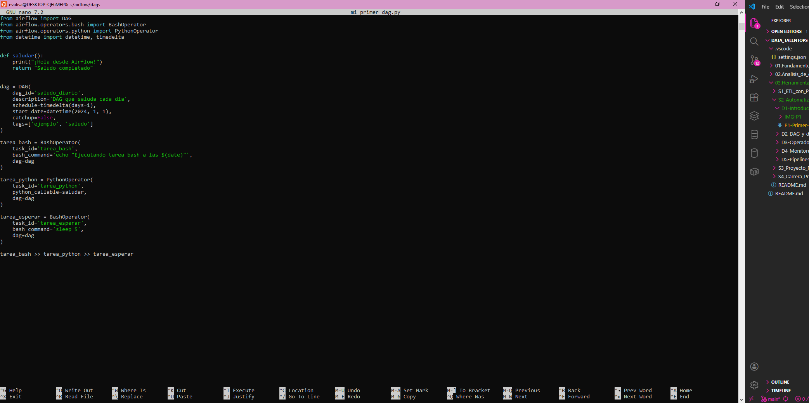

Para guardar se usa Ctrl + O y luego Ctrl + X para salir.

Se verificó que el archivo estuviera en la carpeta correspondiente:

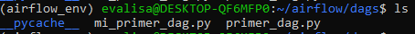

>[!NOTE]
> Hay un segundo archivo llamado primer-dag.py que fue un primer intento exploratorio con otro código. Se usó para practicar.

Se puede ver el contenido del archivo ``mi_primer_dag.py`` en la terminal con el comando ``cat mi_primer_dag.py`` 

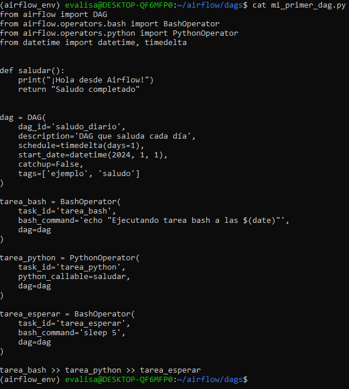

Luego ya se pasa a ejecutar el DAG.

## Ejecutar y monitorear:

```python
# Iniciar scheduler (en terminal separado)
airflow scheduler

# Iniciar webserver
airflow webserver --port 8080

# Ejecutar DAG manualmente
airflow dags unpause saludo_diario
airflow dags trigger saludo_diario
```

Una vez en la interfaz, se debe buscar el dag creado en la sección ``Dags`` al costado izquierdo.

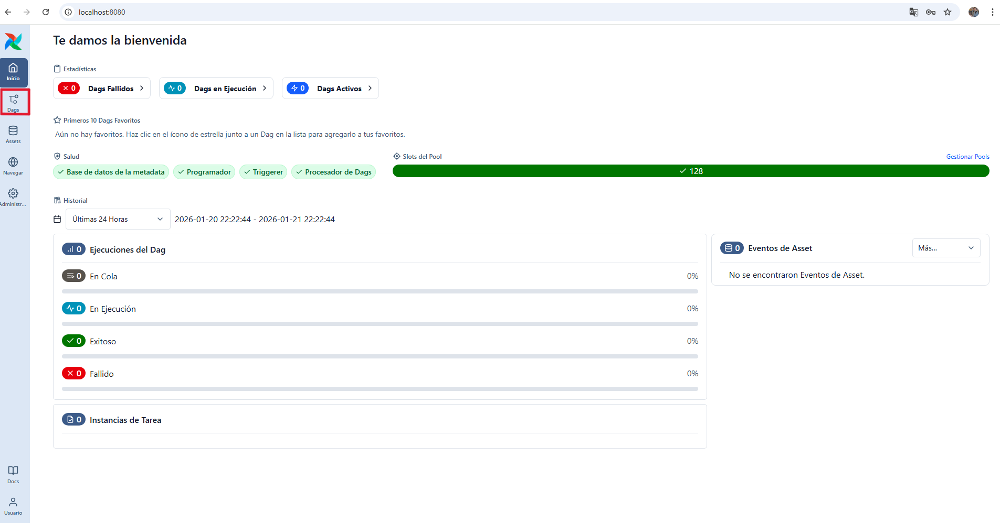

En Dags se debe buscar el nombre "saludo_diario"

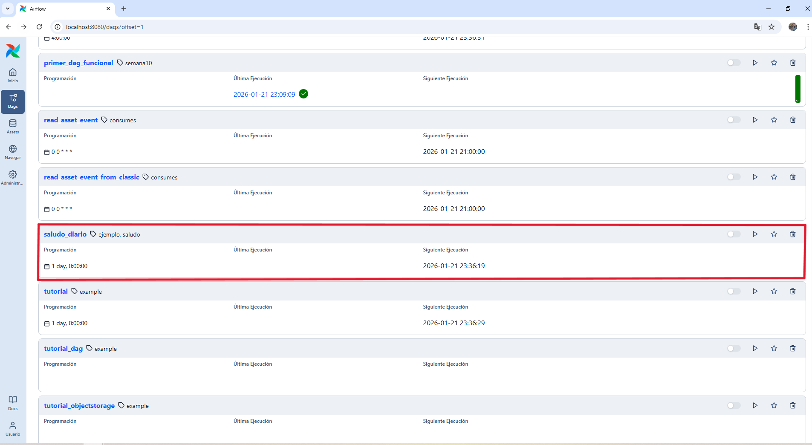

Al hacer click sobre ``saludo_diario`` se verá lo siguiente:

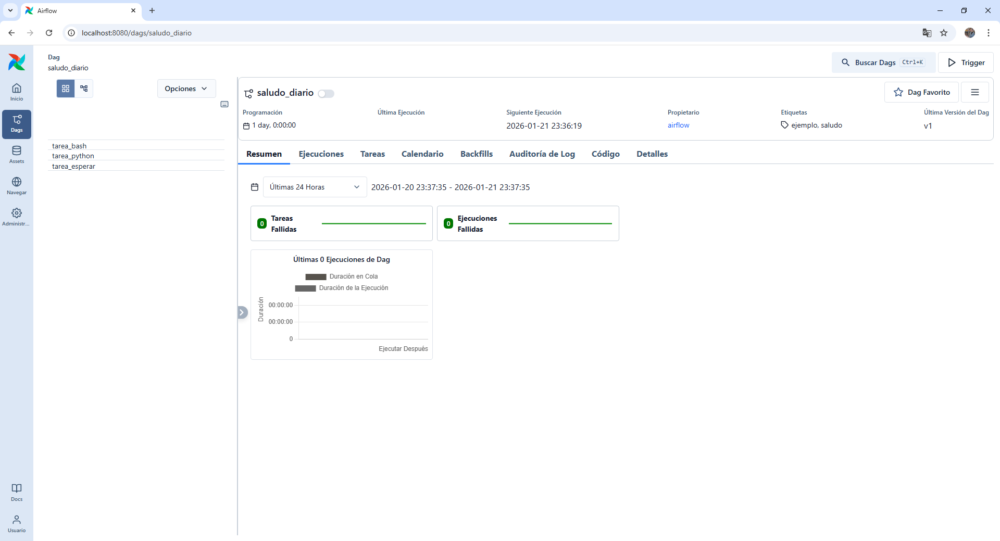

Para ejecutarlo, hay que activar la opción que está justo al lado derecho de ``saludo_diario`` y luego apretar "Trigger" (ver recuadros rojos).


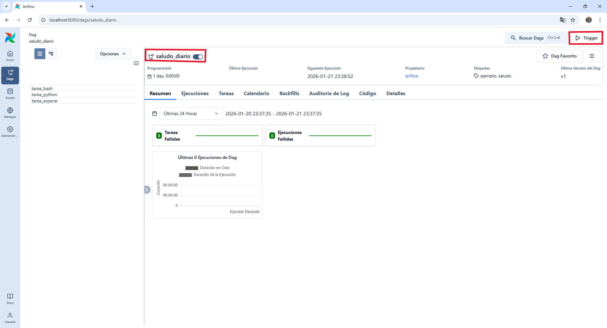


Una vez ejecutado el DAG, se verá lo siguiente:

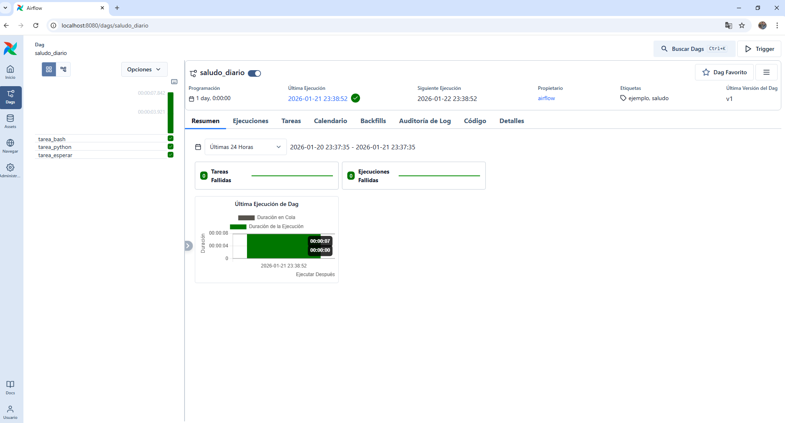


## Ver resultados:

```python
# Ver logs de ejecución
# Visitar http://localhost:8080 en navegador
# Ir a DAGs → saludo_diario → Graph View para ver flujo
# Ir a Tree View para ver historial de ejecuciones
```

Se puede seleccionar la vista Graph View para ver el flujo y los logs de cada etapa:

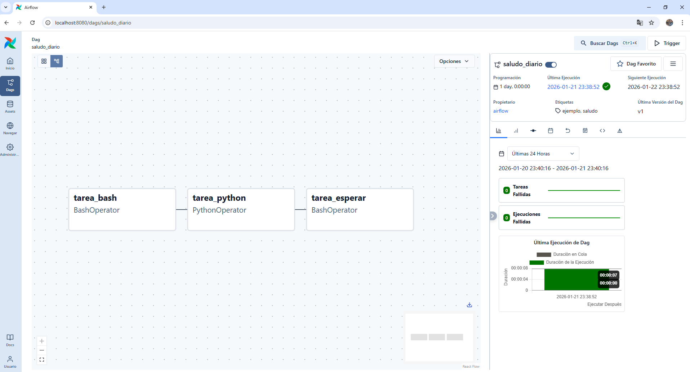

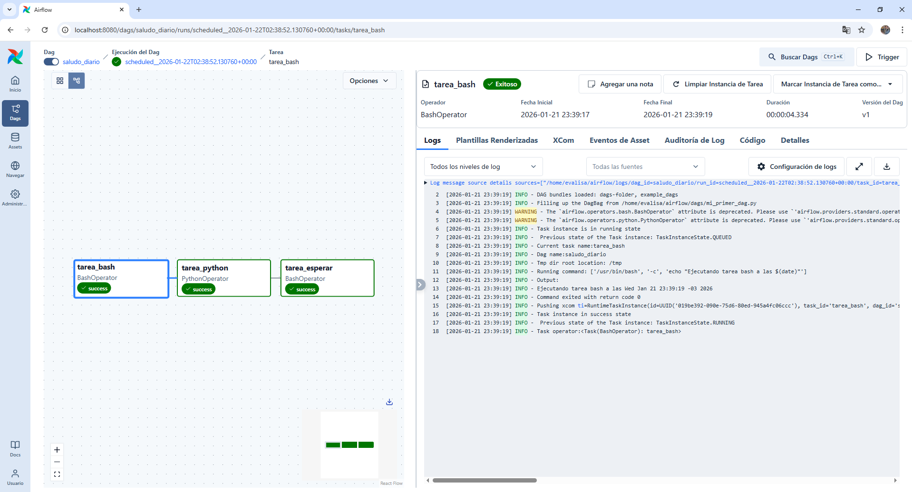

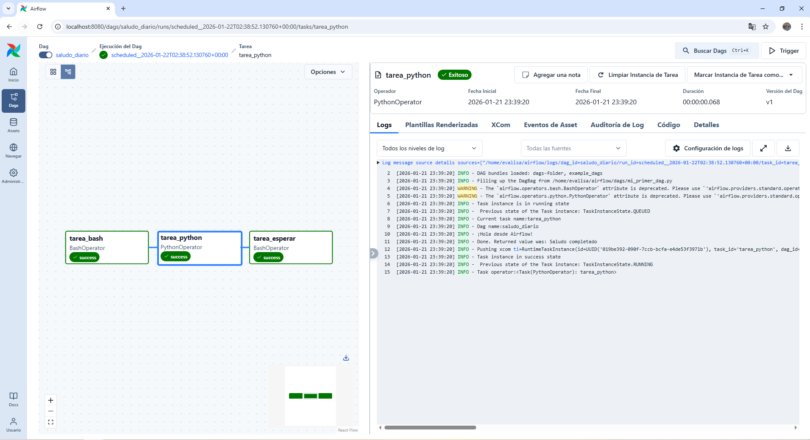

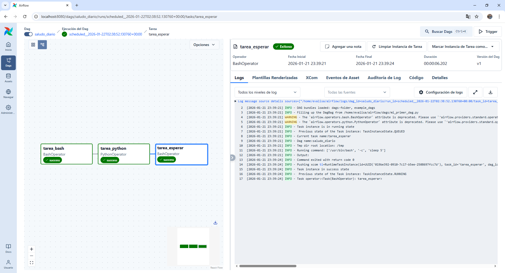


Se puede ver que en log de ``tarea_python`` dice "¡Hola desde Airflow! que era el mensaje que se esperaba ver.

El DAG se ejecutó exitosamente.

### Reflexiones finales:

Un DAG (Directed Acyclic Graph) es  un grafo dirigido sin ciclos que representa un flujo de tareas y las dependencias entre ellas. En Apache Airflow, un DAG se utiliza para definir, orquestar y automatizar procesos, indicando qué tareas deben ejecutarse, en qué orden, bajo qué condiciones y con qué frecuencia. Cada tarea es un nodo del grafo, y las flechas indican la dependencia entre tareas (qué debe ejecutarse antes o después). Airflow utiliza esta estructura para planidicar, ejecutar y monitorear workflows de forma controlada y reproducible.

¿Qué diferencia hay entre un DAG y un simple script de Python? 

Los scripts de python se ejecutan de forma lineal, de principio a fin. Si el script falla, se detiene todo el proceso. Si falla por un error No tienen control nativo de ejecución y no guarda historia de ejecuciones. Los fallos detienen todo el script, se ejecuta manualmente o requiere crontab. Es difícil de monitorear visualmente.

En cambio un DAG en Airflow define un flujo de tareas basado en dependencias. Permite reintentar solo la tarea fallida. Tiene un planificador integrado (Scheduler) que permite ejecutarlo de forma automática y programada. Mantiene historial y logs de cada ejecución. Tiene monitoreo visual en la UI.

¿Por qué es importante que los DAGs no tengan ciclos?

Un DAG por definición es acíclico, es decir, no puede haber bloques entre tareas y esto porque:

- Airflow necesita saber qué tarea se ejecuta primero y cuál después
- Un ciclo generaría una dependencia infinita (una tarea esperando a otra que nunca termina)
- El scheduler no podría planificar correctamente el orden de ejecución y provocaría bloqueos en el flujo.


>[!IMPORTANT]
> La propiedad acíclica del DAG se aplica únicamente a las **dependencias entre tareas**. El código ejecutado dentro de cada tarea puede contener bucles, condiciones y lógica compleja, ya que Airflow trata cada tarea como una unidad atómica de ejecución.

---
Verificación: ¿Qué diferencia hay entre un DAG y un simple script de Python? ¿Por qué es importante que los DAGs no tengan ciclos?


Requerimientos:
- Python 3.7+
- Apache Airflow instalado
- Conocimiento básico de grafos y workflows