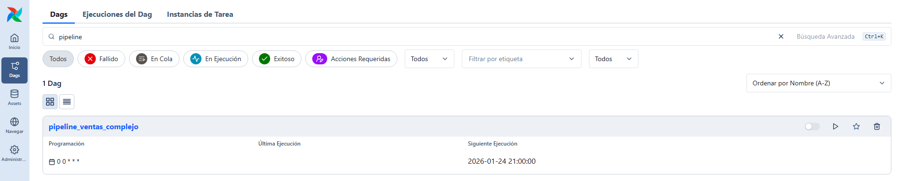
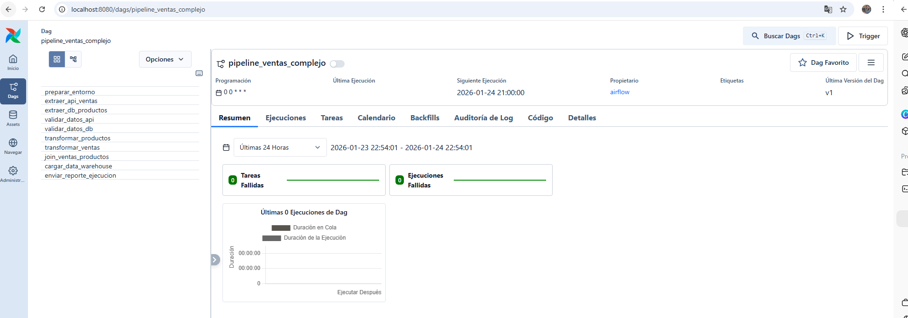
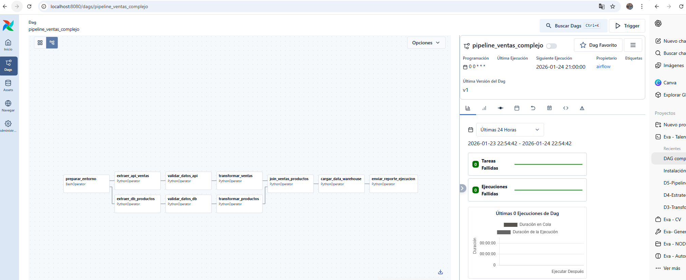
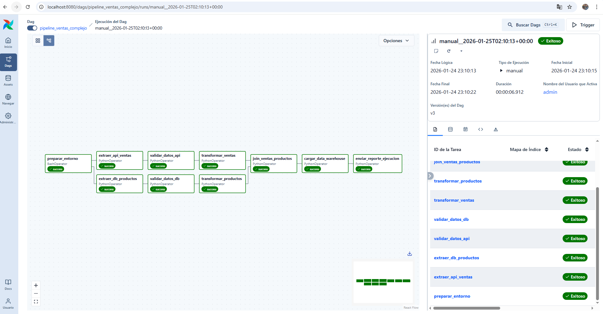
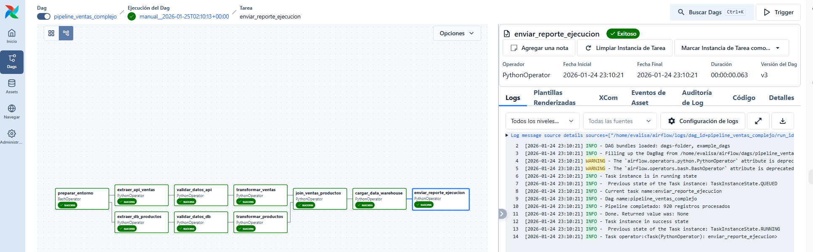

# Ejercicio: Construir DAG con dependencias complejas

## DAG de procesamiento de ventas:

Se creó el siguiente DAG llamado ``pipeline_ventas_complejo.py`` cuyo código está descrito a continuación.

```python
from airflow import DAG
from airflow.operators.python import PythonOperator
from airflow.operators.bash import BashOperator
from datetime import datetime, timedelta

def extraer_ventas():
    """Simular extracción de datos de ventas"""
    print("Extrayendo datos de ventas...")
    return {"registros": 1000}

def validar_datos(ventas):
    """Validar calidad de datos"""
    print(f"Validando {ventas['registros']} registros...")
    return {"validos": 950, "errores": 50}

def transformar_datos(datos):
    """Aplicar transformaciones de negocio"""
    print(f"Transformando {datos['validos']} registros válidos...")
    return {"transformados": datos['validos']}

def cargar_data_warehouse(transformados):
    """Cargar a data warehouse"""
    print(f"Cargando {transformados['transformados']} registros...")
    return {"cargados": transformados['transformados']}

def enviar_reporte_func(resultado):
    """Enviar reporte de ejecución"""
    print(f"Pipeline completado: {resultado['cargados']} registros procesados")

# Configurar DAG
dag = DAG(
    'pipeline_ventas_complejo',
    description='Pipeline ETL de ventas con dependencias complejas',
    schedule='@daily',
    start_date=datetime(2024, 1, 1),
    catchup=False,
    default_args={
        'retries': 2,
        'retry_delay': timedelta(minutes=5)
    }
)

# Luego se definen las tareas

# Tareas de extracción (pueden ejecutarse en paralelo)
extraer_api = PythonOperator(
    task_id='extraer_api_ventas',
    python_callable=extraer_ventas,
    dag=dag
)

extraer_db = PythonOperator(
    task_id='extraer_db_productos',
    python_callable=lambda: {"productos": 500},
    dag=dag
)

# Tarea de preparación
preparar_entorno = BashOperator(
    task_id='preparar_entorno',
    bash_command='mkdir -p /tmp/etl_ventas',
    dag=dag
)

# Tareas de validación (dependen de extracción)
validar_api = PythonOperator(
    task_id='validar_datos_api',
    python_callable=lambda: validar_datos({"registros": 1000}),
    dag=dag
)

validar_db = PythonOperator(
    task_id='validar_datos_db',
    python_callable=lambda: {"productos_validos": 480},
    dag=dag
)

# Tareas de transformación (dependen de validación)
transformar_ventas = PythonOperator(
    task_id='transformar_ventas',
    python_callable=lambda: transformar_datos({"validos": 950}),
    dag=dag
)

transformar_productos = PythonOperator(
    task_id='transformar_productos',
    python_callable=lambda: {"productos_transformados": 480},
    dag=dag
)

# Tarea de join (une ventas y productos)
join_datos = PythonOperator(
    task_id='join_ventas_productos',
    python_callable=lambda: {"registros_completos": 920},
    dag=dag
)

# Carga final
cargar_dw = PythonOperator(
    task_id='cargar_data_warehouse',
    python_callable=lambda: cargar_data_warehouse({"transformados": 920}),
    dag=dag
)

# Reporte final
enviar_reporte = PythonOperator(
    task_id='enviar_reporte_ejecucion',
    python_callable=lambda: enviar_reporte_func({"cargados": 920}),
    dag=dag
)

# Definir dependencias complejas
# Preparación inicial
preparar_entorno >> [extraer_api, extraer_db]

# Extracción → Validación
extraer_api >> validar_api
extraer_db >> validar_db

# Validación → Transformación
validar_api >> transformar_ventas
validar_db >> transformar_productos

# Transformaciones → Join
[transformar_ventas, transformar_productos] >> join_datos

# Join → Carga → Reporte
join_datos >> cargar_dw >> enviar_reporte
```

Una vez creado se debe verificar que el DAG esté en la UI.


>[!WARNING]
> El DAG puede no aparecer en la UI porque en la parte de config del DAG, aparecía ``schedule_interval='@daily'``, que está correcto para Airflow 2.x "Clásico" pero la versión que estoy usando es más nueva y por lo tanto ``schedule_interval`` ya no existe, por lo que se debe cambiar a ``schedule='@daily'``, se guarda nuevamente el archivo modificado y ahora sí debería aparecer en la UI.




Seleccionamos el DAG y vemos lo siguiente:



Luego se verifica el flujo del DAG en la sección ``Graph View``

## Visualizar el grafo de dependencias:

```
# Ver el DAG en Airflow Web UI
# Ir a Graph View para ver el flujo visual

# El grafo debería verse así:
# preparar_entorno → [extraer_api, extraer_db]
# extraer_api → validar_api → transformar_ventas ↘
# extraer_db → validar_db → transformar_productos ↘ → join_datos → cargar_dw → enviar_reporte
```



Se observa que efectivamente el flujo visual corresponde a lo esperado.

## Probar diferentes escenarios:

```
# Para probar: airflow dags test pipeline_ventas_complejo
# Para ejecutar: airflow dags trigger pipeline_ventas_complejo
# Para ver logs: airflow tasks logs pipeline_ventas_complejo enviar_reporte_ejecucion 2024-01-01
```

>[!IMPORTANT]
> El DAG no requiere estar activado para ``airflow dags test``, ya que este comando ejecuta el flujo de forma aislada sin scheduler. Para ejecuciones reales o programadas, el DAG debe estar activo y triggereado mediante la UI o el scheduler.

>[!WARNING]
> Al correr el test apareció un error: ``TypeError: 'PythonOperator' object is not callable``, donde la línea que fallaba era ``python_callable=lambda: enviar_reporte({"cargados": 920})``. 

En el código original se tenía:

```python
def enviar_reporte(resultado):
    print(f"Pipeline completado: {resultado['cargados']} registros procesados")
```

Y más abajo:

```python
enviar_reporte = PythonOperator(
    task_id='enviar_reporte_ejecucion',
    python_callable=lambda: enviar_reporte({"cargados": 920}),
    dag=dag
)
```

Y lo que ocurre es un conflicto de nombres. ``enviar_reporte`` era una función, luego se reasigna como un PythonOperator. Cuando la lambda intenta llamar a ``enviar_reporte(...)``, ya no es una función, es un operador, por lo que Airflow dice: ``'PythonOperator' object is not callable``. Para solucionar esto, se renombró la función en el archivo DAG:

```python
def enviar_reporte_func(resultado):
    print(f"Pipeline completado: {resultado['cargados']} registros procesados")
```

Y luego más abajo también:

```python
enviar_reporte = PythonOperator(
    task_id='enviar_reporte_ejecucion',
    python_callable=lambda: enviar_reporte_func({"cargados": 920}),
    dag=dag
)
```

Con esto se volvió a ejecutar un test y al ver que todo salió ok, se ejecutó el DAG.



Se observa que todas las etapas se ejecutaron exitosamente. Luego se vio el log de ``enviar_reporte_ejecucion`` y se observa el mensaje de "Pipeline completado: 920 registros procesados", evidenciado el éxito del proceso.




## Reflexiones finales


¿Cómo decidirías entre usar PythonOperator vs BashOperator para una tarea específica?

Elegiría PythonOperator cuando la lógica esté en Python, como por ejemplo: validaciones, transformaciones, cálculo de métricas, uso de librerías (pandas, requests), y cuando se quiere trazas y manejo de excepciones nativo en Python.

Elegiría BashOperator cuando la tarea sea ejecutar un comando de sistema o herramienta CLI (scripts .sh, mkdir, curl, dbt, spark-submit, utilidades del sistema).

¿Qué ventajas tiene definir dependencias explícitas en lugar de ejecutar tareas en orden secuencial?

Definir dependencias explícitas en Airflow (un DAG real) aporta ventajas claras frente a hacer todo en orden en un solo script:

1. Paralelismo controlado: se puede ejecutar tareas en paralelo (ej. extraer_api y extraer_db) y reducir tiempo total.

2. Reintentos y tolerancia a fallos por tarea: si falla validación, reintenta solo esa tarea (no todo el pipeline). Aísla errores y mejora confiabilidad.

3. Observabilidad: se puede ver en Graph/Grid View qué se ejecutó, qué falló, tiempos, logs por tarea. Esto facilita debugging y auditoría.

4. Escalabilidad del flujo: a medida que el pipeline crece, el grafo se mantiene legible. Se puede insertar nuevas tareas sin reescribir todo el “script secuencial”.

5. Re-ejecución parcial: se puede "limpiar" y re-ejecutar desde un nodo específico. Evita recalcular etapas costosas si no es necesario.


---- 
Verificación: ¿Cómo decidirías entre usar PythonOperator vs BashOperator para una tarea específica? ¿Qué ventajas tiene definir dependencias explícitas en lugar de ejecutar tareas en orden secuencial?

Requerimientos:
- Apache Airflow configurado
- Conocimiento de operadores básicos
- Familiaridad con grafos y dependencias