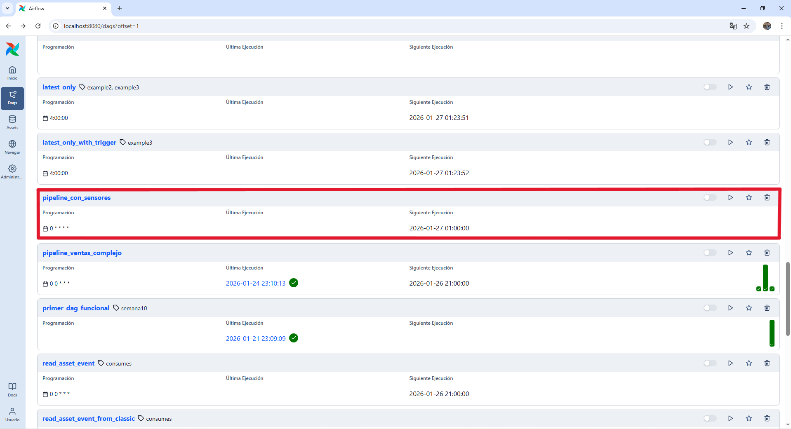
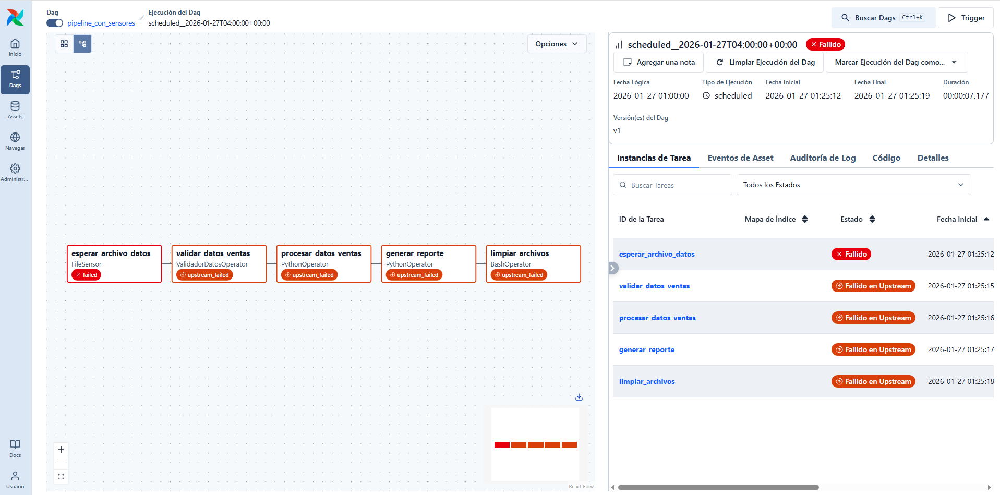
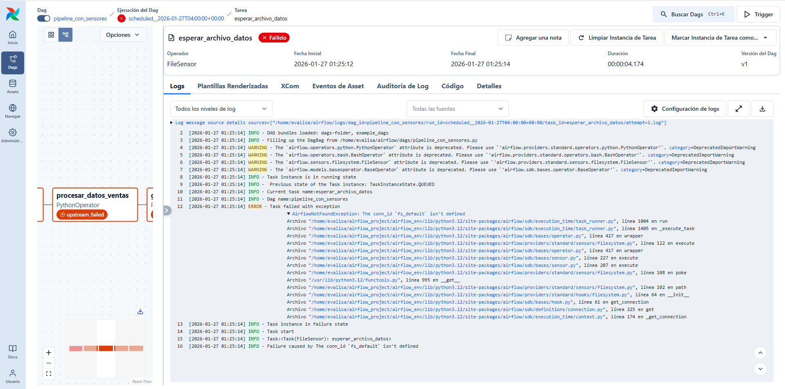
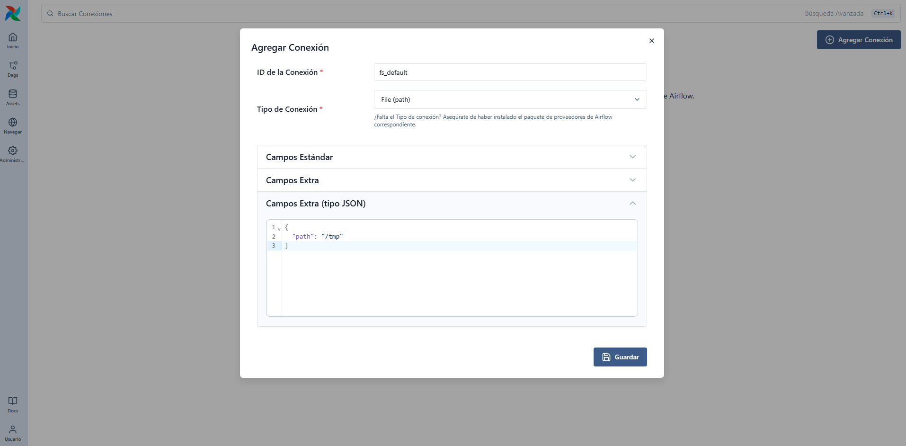
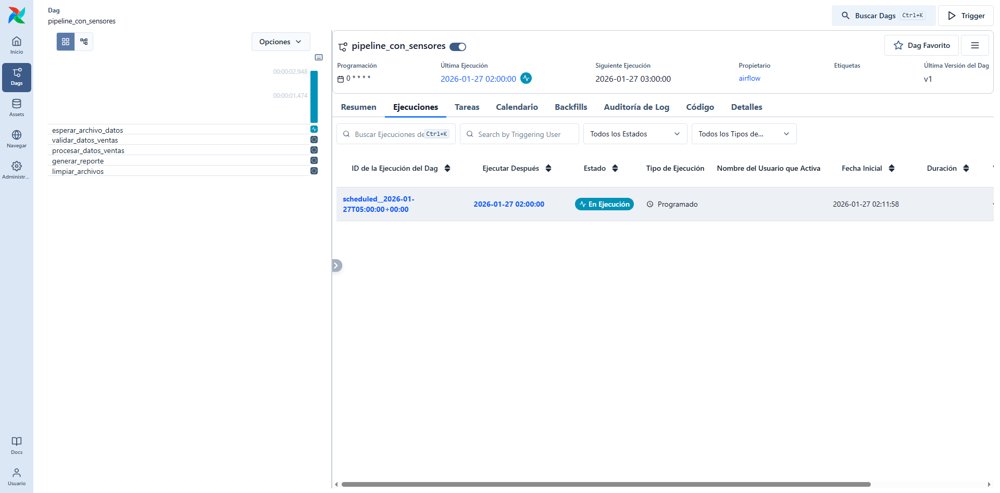
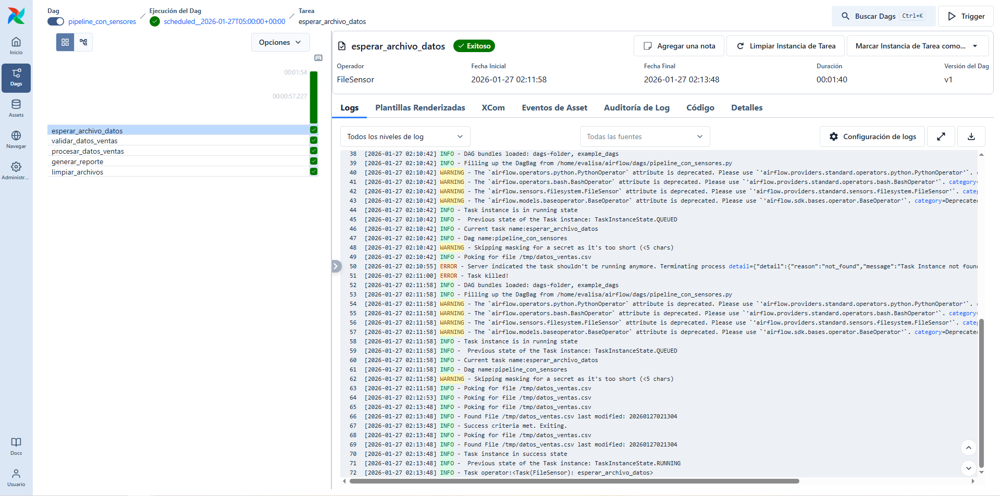
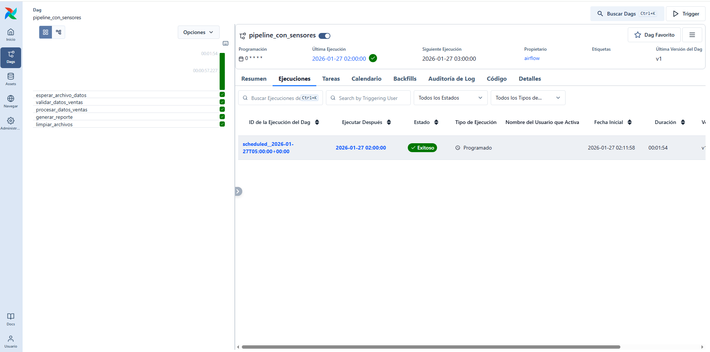
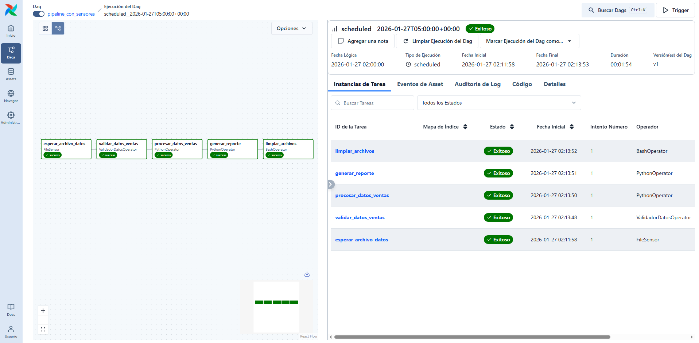
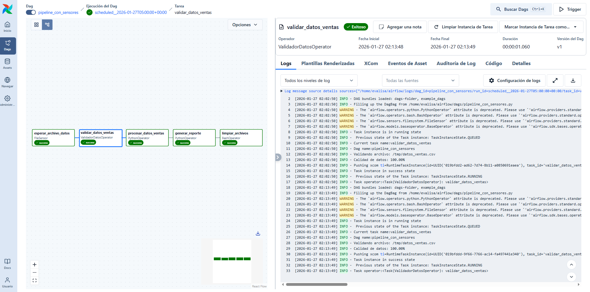
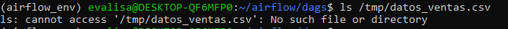

# Ejercicio: Crear DAG con operadores y sensores

Se creó el siguiente DAG llamado ``pipeline_con_sensores.py`` cuyo código está descrito a continuación:

>[!IMPORTANT]
> Al crear el DAG por primera vez, tuve un error en la UI que reconocía el archivo .py pero con un mensaje de error que decía: ``ModuleNotFoundError: No module named 'pandas'``. Esto significa que Airflow no encuentra pandas en el entorno python donde se está corriendo. Por lo tanto, es importante instalar pandas en el entorno correcto para que quede disponible para Airflow. 
> 
> Airflow ejecuta los DAGs dentro de su propio entorno Python. Por lo tanto, las librerías externas utilizadas por operadores personalizados (como pandas) deben estar instaladas explícitamente en dicho entorno para evitar errores de importación.

## DAG de procesamiento con sensores:

```python
from airflow import DAG
from airflow.operators.python import PythonOperator
from airflow.operators.bash import BashOperator
from airflow.sensors.filesystem import FileSensor
from datetime import datetime, timedelta

def procesar_datos():
    print("Procesando datos de ventas...")
    return "Datos procesados"

def generar_reporte():
    print("Generando reporte ejecutivo...")
    return "Reporte generado"

dag = DAG(
    'pipeline_con_sensores',
    description='Pipeline que espera archivos antes de procesar',
    schedule='@hourly',
    start_date=datetime(2024, 1, 1),
    catchup=False
)

# Sensor que espera archivo de entrada
esperar_datos = FileSensor(
    task_id='esperar_archivo_datos',
    filepath='/tmp/datos_ventas.csv',
    poke_interval=60,    # Revisar cada minuto
    timeout=3600,        # Máximo 1 hora
    mode='poke',         # Modo de verificación
    dag=dag
)

# Procesar datos una vez que el archivo llegue
procesar = PythonOperator(
    task_id='procesar_datos_ventas',
    python_callable=procesar_datos,
    dag=dag
)

# Generar reporte
reporte = PythonOperator(
    task_id='generar_reporte',
    python_callable=generar_reporte,
    dag=dag
)

# Limpiar archivos temporales
limpiar = BashOperator(
    task_id='limpiar_archivos',
    bash_command='rm -f /tmp/datos_ventas.csv',
    dag=dag
)

# Definir flujo: esperar → procesar → reportar → limpiar
esperar_datos >> procesar >> reporte >> limpiar

# Crear operador personalizado:

from airflow.models.baseoperator import BaseOperator
from airflow.utils.decorators import apply_defaults
import pandas as pd

class ValidadorDatosOperator(BaseOperator):
    
    def __init__(self, archivo_entrada, umbral_calidad=0.9, *args, **kwargs):
        super().__init__(*args, **kwargs)
        self.archivo_entrada = archivo_entrada
        self.umbral_calidad = umbral_calidad
    
    def execute(self, context):
        self.log.info(f"Validando archivo: {self.archivo_entrada}")
        
        # Leer datos
        try:
            df = pd.read_csv(self.archivo_entrada)
        except Exception as e:
            raise Exception(f"Error leyendo archivo: {e}")
        
        # Validaciones
        total_registros = len(df)
        registros_completos = df.dropna().shape[0]
        calidad = registros_completos / total_registros
        
        self.log.info(f"Calidad de datos: {calidad:.2%}")
        
        if calidad < self.umbral_calidad:
            raise Exception(f"Calidad insuficiente: {calidad:.2%} < {self.umbral_calidad:.2%}")
        
        return {
            'registros_totales': total_registros,
            'registros_validos': registros_completos,
            'calidad': calidad
        }

# Usar operador personalizado en DAG
validar_datos = ValidadorDatosOperator(
    task_id='validar_datos_ventas',
    archivo_entrada='/tmp/datos_ventas.csv',
    umbral_calidad=0.95,
    dag=dag
)

# Actualizar dependencias
esperar_datos >> validar_datos >> procesar >> reporte >> limpiar
```

Una vez creado, se buscó el DAG en la UI:



>[!WARNING]
> Al ejecutar el DAG, se observó un error en la primera etapa ``esperar_archivo_datos``. El error indicaba que: ``AirflowNotFoundException: The conn_id 'fs_default' isn't defined``.





>[!NOTE]
> En Airflow (versiones nuevas), FileSensor usa por defecto una conexión llamada fs_default para saber qué base path mirar. Para arreglar esto, se creó una conexión ``fs_tmp`` en la UI en la parte de Administrador → Conexiones → "Agregar Conexión".

Se completó con lo siguiente:

```
ID de la Conexión: fs_tmp

Tipo de Conexión: File (path)

Campos Extra:
    Path: /tmp

Campos Extra (tipo JSON): {"path": "/tmp"}
```



Una vez creada la conexión, se arregló el error.

Al ejecutar nuevamente el DAG, la primera etapa ``esperar_archivo_datos``, que es un FileSensor y cuyo propósito es esperar un archivo, queda en estado de "En ejecución". Como inicialmente no está creado el archivo ``datos_ventas.csb``, que es el que espera el sensor, se mantiene en ese estado hasta que el archivo se cree.






## Probar el DAG:

```bash
# Crear archivo de prueba
echo "id,nombre,ventas
1,Producto A,100
2,Producto B,200
3,Producto C,150" > /tmp/datos_ventas.csv

# Ejecutar DAG
airflow dags trigger pipeline_con_sensores

# Monitorear en web UI
```

Una vez creado el archivo, se cumple la condición para que el sensor pueda continuar.





Se observa que todas las etapas están en verde, indicando que se ejecutaron exitosamente.



Se observa que el log de la etapa ``validar_datos_ventas`` muestra mensajes como:

- ``Validando archivo: /tmp/datos_ventas.csv``
- ``Calidad de datos: 100.00%``

Indicando que el operador personalizado (``ValidadorDatosOperator``) se ejecutó, se usó pandas correctamente y hubo validación de datos.

Finalmente, se puede comprobar que la última etapa de ``limpiar_archivos`` que es un BashOperator cuyo objetivo es eliminar el archivo datos_ventas.csv, funciona correctamente al ejecutar lo siguiente en la consola.



En este ejercicio práctico, se realizó la ejecución manual del DAG una vez disponible el archivo de entrada, verificándose el correcto funcionamiento del sensor, el operador personalizado y el flujo completo del pipeline.


## Reflexiones finales

**¿En qué situaciones usarías un sensor en lugar de ejecutar tareas inmediatamente?**

Un sensor puede ser útil cuando se requiere que una tarea no se ejecuta hasta cumplirse una condición dada. Por ejemplo, la llegada de un archivo, disponibilidad de un servicio, finalización de otro proceso, etc. Los sensores permiten que el DAG espere de forma controlada antes de continuar, evitando ejecuciones fallidas o innecesarias. En el caso del FileSensor, es especialmente útil cuando el pipeline depende de archivos que son generados por sistemas externos y cuya llegada no es inmediata ni predecible.


**¿Cuáles son las ventajas de crear operadores personalizados?**

Crear operadores personalizados permite encapsular lógica específica de negocio que no está cubierta por los operadores estándar de Airflow. Esto hace que los DAGs sean más claros, reutilizables y mantenibles, ya que se evita repetir código complejo dentro de múltiples tareas.

Además, los operadores personalizados:

- Facilitan la estandarización de procesos (por ejemplo, validaciones de calidad de datos).
- Permiten integrar reglas propias del dominio directamente en el pipeline.
- Mejoran la legibilidad del DAG, ya que cada tarea representa una acción semántica clara.


----
Verificación: 
¿En qué situaciones usarías un sensor en lugar de ejecutar tareas inmediatamente? ¿Cuáles son las ventajas de crear operadores personalizados?

Requerimientos:
- Apache Airflow con sensores instalados
- Familiaridad con operadores estándar
- Conocimiento de Python para operadores personalizados