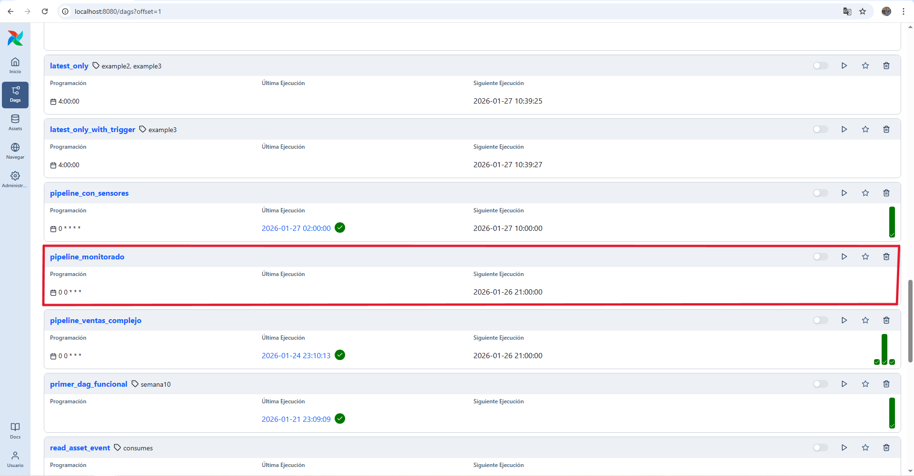
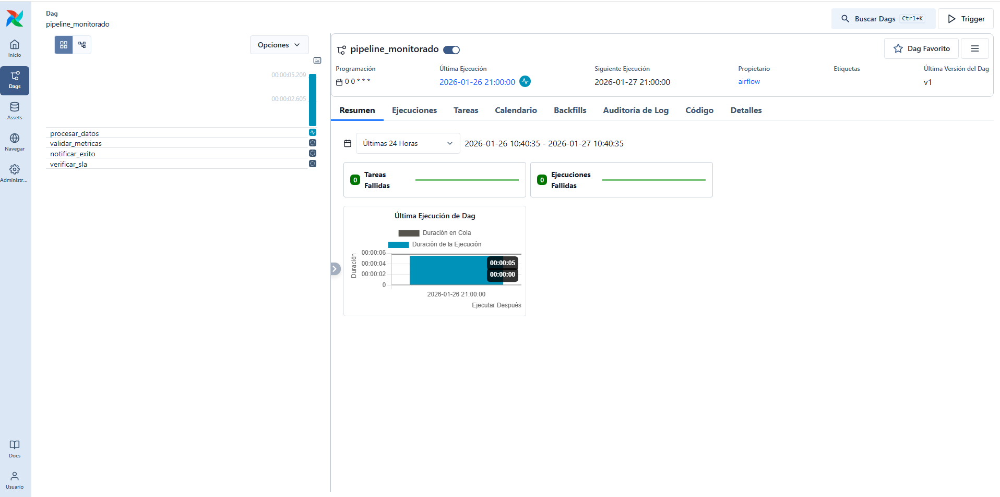
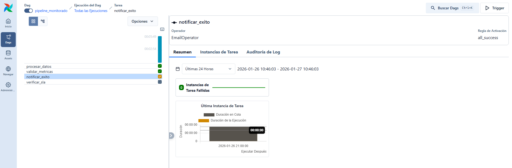
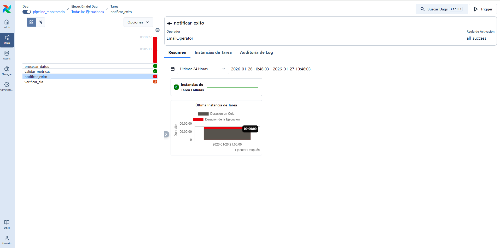
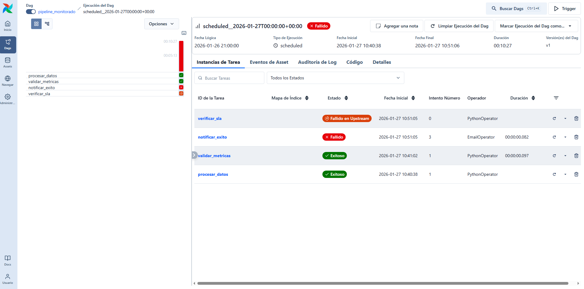
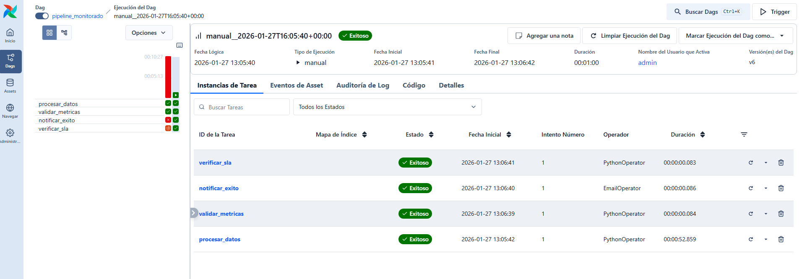
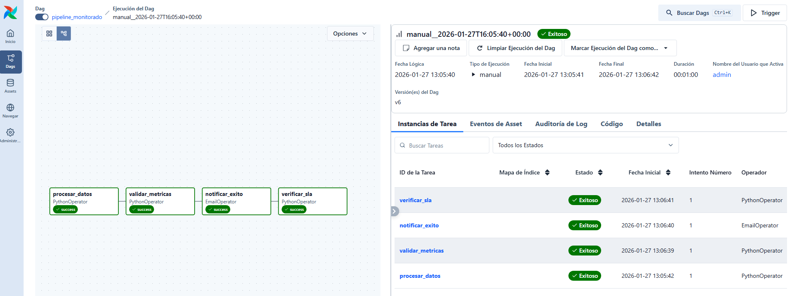
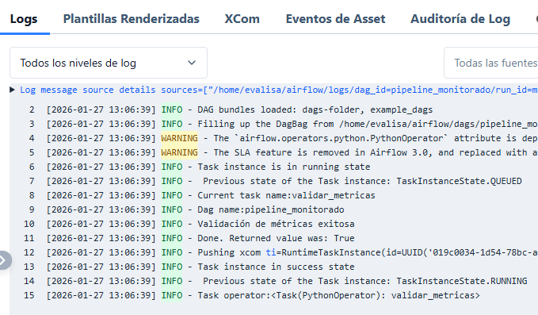
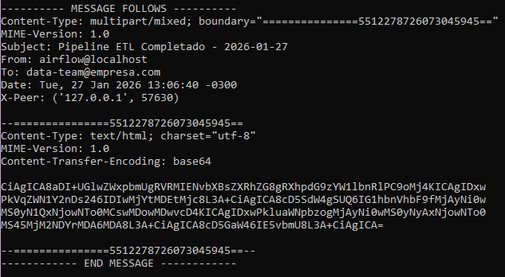
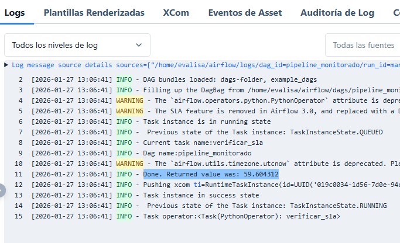

# Ejercicio: Configurar monitoreo completo en un DAG

## DAG con monitoreo y alertas:

Se creó el siguiente DAG llamado ``pipeline_monitorado.py`` cuyo código está descrito a continuación.

```python
from airflow import DAG
from airflow.operators.python import PythonOperator
from airflow.providers.smtp.operators.smtp import EmailOperator
from datetime import datetime, timedelta
import logging

# Configurar logging adicional
logger = logging.getLogger('monitored_dag')


def procesar_datos_con_metricas(**context):
    """Función que trackea métricas detalladas"""
    task_instance = context['task_instance']

    logger.info(f"Iniciando procesamiento - Task: {task_instance.task_id}")

    # Simular procesamiento
    import time
    import random

    # Métrica: tiempo de procesamiento simulado
    processing_time = random.uniform(10, 60)
    time.sleep(processing_time)

    # Métrica: registros procesados
    records_processed = random.randint(1000, 5000)

    # Métrica: tasa de éxito
    success_rate = random.uniform(0.95, 1.0)

    resultado = {
        'registros_procesados': records_processed,
        'tiempo_procesamiento': processing_time,
        'tasa_exito': success_rate,
        'timestamp': datetime.now().isoformat()
    }

    # Guardar métricas en XCom para otras tareas
    task_instance.xcom_push(key='metricas', value=resultado)

    logger.info(f"Procesamiento completado: {resultado}")
    return resultado


def validar_metricas(**context):
    """Validar que las métricas cumplan thresholds"""
    task_instance = context['task_instance']
    metricas = task_instance.xcom_pull(
        task_ids='procesar_datos',
        key='metricas'
    )

    if not metricas:
        raise ValueError("No se encontraron métricas")

    # Validar thresholds
    if metricas['tasa_exito'] < 0.9:
        raise ValueError(
            f"Tasa de éxito baja: {metricas['tasa_exito']:.2%}"
        )

    if metricas['tiempo_procesamiento'] > 300:  # 5 minutos
        logger.warning(
            f"Tiempo de procesamiento alto: "
            f"{metricas['tiempo_procesamiento']:.1f}s"
        )

    logger.info("Validación de métricas exitosa")
    return True


def on_failure_alert(context):
    """Callback personalizado para fallos"""
    task_instance = context['task_instance']
    dag_id = context['dag'].dag_id
    error = str(context.get('exception', 'Unknown error'))

    alert_message = f"""
🚨 ALERTA DE FALLO 🚨

DAG: {dag_id}
Tarea: {task_instance.task_id}
Ejecución: {task_instance.execution_date}
Error: {error}

Por favor revisar logs inmediatamente.
""".strip()

    logger.error(alert_message)

    # Aquí podrías enviar a Slack, PagerDuty, etc.


def on_success_summary(context):
    """Resumen de ejecución exitosa"""
    task_instance = context['task_instance']
    dag_id = context['dag'].dag_id

    # Calcular duración total del DAG
    start_date = context['dag_run'].start_date
    end_date = context['dag_run'].end_date

    if start_date and end_date:
        duration = (end_date - start_date).total_seconds()
        logger.info(
            f"DAG {dag_id} completado en {duration:.1f} segundos"
        )


# Configurar DAG con monitoreo
dag = DAG(
    'pipeline_monitorado',
    description='Pipeline ETL con monitoreo completo',
    schedule='@daily',
    start_date=datetime(2024, 1, 1),
    catchup=False,
    default_args={
        'retries': 2,
        'retry_delay': timedelta(minutes=5),
        'on_failure_callback': on_failure_alert,
        'execution_timeout': timedelta(hours=1)
    },
    # Callbacks del DAG
    on_success_callback=on_success_summary,
    # SLA: debe completarse en menos de 2 horas
    sla_miss_callback=lambda context: logger.warning(
        f"SLA missed for {context['dag'].dag_id}"
    )
)

# Tareas del pipeline
procesar = PythonOperator(
    task_id='procesar_datos',
    python_callable=procesar_datos_con_metricas,
    dag=dag
)

validar = PythonOperator(
    task_id='validar_metricas',
    python_callable=validar_metricas,
    dag=dag
)

notificar_exito = EmailOperator(
    task_id='notificar_exito',
    to=['data-team@empresa.com'],
    subject='Pipeline ETL Completado - {{ ds }}',
    html_content='''
    <h2>Pipeline ETL Completado Exitosamente</h2>
    <p>Ejecución: {{ ds }}</p>
    <p>Run ID: {{ dag_run.run_id }}</p>
    <p>Inicio: {{ dag_run.start_date }}</p>
    <p>Fin: {{ dag_run.end_date }}</p>
    ''',
    from_email='airflow@localhost',
    conn_id='smtp_default',
    dag=dag
)

#se borraron los provide_context y en notificar_exito se borró duration
#se agregó from_email y conn_id.

# Dependencias
procesar >> validar >> notificar_exito


from airflow.utils import timezone

# 2. Configurar alertas adicionales

def verificar_sla(**context):
    """Verificar cumplimiento de SLA"""
    dag_run = context['dag_run']
    duration = (timezone.utcnow() - dag_run.start_date).total_seconds()

    sla_seconds = 7200  # 2 horas

    if duration > sla_seconds:
        logger.warning(
            f"SLA violado: {duration:.1f}s > {sla_seconds}s"
        )
        # Enviar alerta crítica

    return duration


verificar_sla_task = PythonOperator(
    task_id='verificar_sla',
    python_callable=verificar_sla,
    dag=dag
)

# Agregar verificación de SLA al final
notificar_exito >> verificar_sla_task

```

```
# Agregar verificación de SLA al final
notificar_exito >> verificar_sla_task
Monitorear en producción:
# Ver estado del DAG
airflow dags list | grep pipeline_monitorado

# Ver tareas fallidas
airflow tasks failed pipeline_monitorado 2024-01-01

# Ver logs
airflow tasks logs pipeline_monitorado procesar_datos 2024-01-01
```


Una vez creado se debe verificar que el DAG esté en la UI.



Se selecciona el DAG y luego se ejecuta:



Se observa que la etapa de ``procesar_datos`` está en ejecución. Luego, se ejecuta exitosamente al igual que la etapa siguiente ``validar_metricas``, sin embargo, se ve que la etapa de ``notificar_exito`` está en amarillo en estado de reitento (acá hubo errores de conexión que no permitían enviar el correo).



Hasta que finalmente la etapa falló y por consecuencia también la última etapa de ``verificar_sla``.





Luego de realizar algunas modificaciones, descritas más adelante, se ejecutó nuevamente el DAG






Acá ya se puede ver que el DAG fue ejecutado exitosamente, viendo todas las tareas de color verde.

La tarea ``procesar_datos`` simula el procesamiento de un conjunto de datos y genera métricas clave de ejecución, tales como el tiempo de procesamiento, la cantidad de registros procesados y la tasa de éxito.
Estas métricas se registran en los logs y se almacenan en XCom, permitiendo que otras tareas del DAG puedan utilizarlas para validaciones posteriores y monitoreo del pipeline.

También se puede ver que en el log de ``validar_metricas`` aparece "Validación de métricas exitosa".



La tarea ``validar_metricas`` recupera las métricas generadas en la etapa de procesamiento desde XCom e imprime diferentes mensajes dependiendo de los umbrales definidos.

Además, para verificar, en una terminal de un servidor SMTP local de pruebase, se obtuvo el mensaje de notificación.



La tarea ``notificar_exito ``envía una notificación por correo electrónico al completarse exitosamente el pipeline, informando detalles relevantes de la ejecución como la fecha y las marcas de inicio y término.




Y respecto a la etapa de ``verificar_sla``, aparece "Done. Returned value was: 59.604312". Lo que significa que la tarea se ejecutó correctamente, y el valor que rotornó la función fue 59.604312 segundos (aproximadamente 1 minuto). 

La tarea verificar_sla calcula la duración total de la ejecución del DAG en segundos y la retorna como resultado. Airflow registra este valor en los logs, lo que permite confirmar que la ejecución se completó dentro del tiempo definido por el SLA.

Finalmente, se pudo ejecutar todo el DAG exitosamente adjuntanto las evidencias correspondientes.

--- 

## Consideraciones para ejecutar exitosamente este DAG.

Se tuvo que hacer unos ajustes para que el DAG se ejecutara correctamente.

1. Configuración del monitoreo y notificaciones:

El DAG incluye una etapa de notificación por correo (notificar_exito) usando EmailOperator. Para que esta tarea funcionara en un entorno local (laboratorio), fue necesario configurar explícitamente el mecanismo de envío de correos, ya que Airflow no trae un servidor SMTP activo por defecto.

2. Creación de la conexión ``smtp_default``:

Airflow utiliza Connections para manejar credenciales y servicios externos.
En este caso fue necesario:

- Crear (y luego recrear) la conexión smtp_default desde la UI.
- Definirla con:
    - Tipo de conexión: Email
    - Host: localhost
    - Puerto: 1025
    - Sin usuario, contraseña, SSL ni STARTTLS

>[!IMPORTANT]
> Al usar una conexión tipo SMTP, Airflow intenta forzar SSL internamente y genera error en la etapa de notificación. Es importante que el tipo de conexión sea Email.

3. Uso de un servidor SMTP local de prueba

Como no se utilizó un proveedor real (Gmail, Outlook, etc.), se levantó un servidor SMTP local de laboratorio usando aiosmtpd.

Esto se hizo en una terminal separada, con el comando:

```
python -m aiosmtpd -n -l 127.0.0.1:1025
```
Este servidor: 

- Recibe los correos enviados por Airflow.
- Muestra el contenido completo del mensaje en la terminal.
- Permite validar visualmente que la notificación se envió correctamente, sin depender de servicios externos.

4. Ajuste explícito del ``from_email``

El EmailOperator requiere que se defina el remitente del correo. Fue necesario agregar explícitamente en el DAG:

```
from_email='airflow@localhost'
```

Sin este dato, la tarea fallaba aunque el SMTP estuviera bien configurado.

5. Manejo de zonas horarias en la validación de SLA

En la tarea verificar_sla apareció un error de tipo:

```
can't subtract offset-naive and offset-aware datetimes
```
Esto se debía a que:

- ``dag_run.start_date`` incluye información de zona horaria (timezone-aware).

- ``datetime.now()`` no.

La solución fue usar el módulo de tiempo de Airflow:

```
from airflow.utils import timezone
timezone.utcnow()
```

La implementación de este DAG permitió evidenciar la importancia de una correcta configuración de servicios externos (como SMTP) y del uso de buenas prácticas de monitoreo, manejo de conexiones y control temporal, especialmente en entornos de desarrollo local.


--- 

Verificación: ¿Qué métricas son más importantes para monitorear en un pipeline de datos? ¿Cómo decidirías entre enviar alertas por email vs Slack vs SMS?

Requerimientos:
- Apache Airflow con configuración de email
- Sistema de logging configurado
- Conocimiento de métricas y KPIs