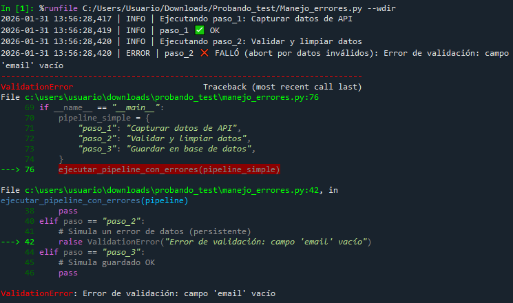

# Ejercicio: Diseñar pipeline básico con manejo de errores

## Definir componentes del pipeline:

```python
pipeline_simple = {
    'paso_1': 'Capturar datos de API',
    'paso_2': 'Validar y limpiar datos',
    'paso_3': 'Guardar en base de datos'
}
```

## Implementar manejo básico de errores:

```python
def ejecutar_pipeline_con_errores(pipeline):
    for paso, descripcion in pipeline.items():
        try:
            print(f"Ejecutando {paso}: {descripcion}")
            # Simular ejecución
            if paso == 'paso_2':
                raise ValueError("Error de validación")
        except Exception as e:
            print(f"Error en {paso}: {e}")
            # Aquí iría lógica de recovery
```
Se creó un [script](IMG-P2/Manejo_errores.py) básico para ejemplificar esto.




En este caso, el paso 2 del script simula un dato inválido (``email`` vacío). En el ``except ValidationError`` se registra el error con ``logger.error(...)``. El pipeline falla de forma explícita ante un error de validación para evitar persistir datos inválidos; el traceback aparece porque se re-lanza la excepción intencionalmente para detener la ejecución.

### Reflexiones finales

**¿Qué diferencia hay entre un pipeline que falla silenciosamente y uno con buen manejo de errores?**

Si falla silenciosamente, significa que algo sale mal pero nadie se entera (o queda ambiguo). Esto podría dejar datos incompletos/corruptos, dar la impresión de que todo funcionó "bien", causar errores downstream, como por ejemplo reportes malos o dashboards incorrectos.

Un pipeline con un buen manejo de errores es capaz de detectar, registrar, clasificar y actuar. Deja trazabilidad de qué falló, dónde, cuándo y con qué datos. Intenta recuperar (en caso de que así esté configurado) y si no, falla de forma explícita para evitar seguir trabajando con datos malos.

**¿Cómo decidirías cuándo reintentar vs abortar una ejecución?**

Reintentar: cuando el error es transitorio. 
- timeouts: que el sistema sí respondió pero demoró más de lo esperado.
- rate limit: es cuando la API bloquea por hacer demasiadas solicitudes en poco tiempo.
- red inestable
- servicio externo caído momentaneamente: como cuando la API o un servicio externo est+a caído por un rato (ya se por despliegue, mantenimiento, etc)

Abortar: cuando el error es persistente, lógico o de datos. Se da cuando el reintentar no cambia la causa y continuar podría guardar datos malos o duplicados.

- Error de validación de datos
- esquema inesperado: cuando la estructura de los datos no es la que el pipeline espera.
- claves faltantes: que falten campos obligatorios, aunque el esquema general sea correcto.
- violación de integridad al guardar: la base de datos rechaza el registro porque romple una regla. Por ejemplo insertar un usuario con un id ya existente.

--- 
Verificación: ¿Qué diferencia hay entre un pipeline que falla silenciosamente y uno con buen manejo de errores?


¿Cómo decidirías cuándo reintentar vs abortar una ejecución?

Requerimientos:
Conocimiento básico de Python
Familiaridad con conceptos de logging
Comprensión de sistemas distribuidos