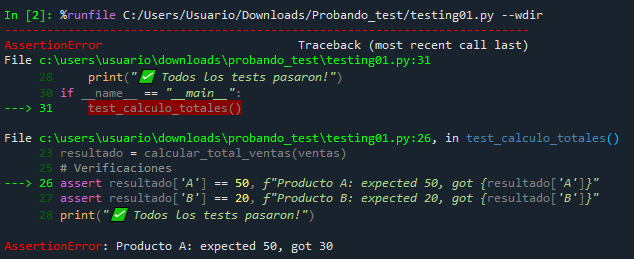
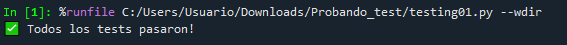

# Ejercicio: Crear suite básica de tests para un pipeline simple

## Definir función a testear:

```python
def calcular_total_ventas(ventas):
    """Calcula total de ventas por producto"""
    totales = {}
    for venta in ventas:
        producto = venta['producto']
        cantidad = venta['cantidad']
        precio = venta['precio']
        totales[producto] = totales.get(producto, 0) + (cantidad * precio)
    return totales
```

## Crear tests unitarios:

```python
def test_calculo_totales():
    # Datos de prueba
    ventas = [
        {'producto': 'A', 'cantidad': 2, 'precio': 10},
        {'producto': 'B', 'cantidad': 1, 'precio': 20},
        {'producto': 'A', 'cantidad': 3, 'precio': 10}
    ]
    
    resultado = calcular_total_ventas(ventas)
    
    # Verificaciones
    assert resultado['A'] == 50, f"Producto A: expected 50, got {resultado['A']}"
    assert resultado['B'] == 20, f"Producto B: expected 20, got {resultado['B']}"
    print("✅ Todos los tests pasaron!")

if __name__ == "__main__":
    test_calculo_totales()
```

El objetivo es verificar automáticamente que la función ``calcular_total_ventas`` funciona correctamente frente a un conjunto de datos de prueba conocidos. El test compara el resultado real de la función con el esperado, asegurando que la lógica de cálculo sea correcta.

``assert`` es una instrucción de Python que verifica una condición:
- Si la condición es verdadera, el programa continúa normalmente.
- Si la condición es falsa, el programa se detiene y lanza un ``AssertionError``, indicando que el test falló como se ve en la siguiente imagen:



>[!NOTE]
> En este caso se modificó la cantidad del producto A de 3 a 1 en la segunda aparición.

```python
def test_calculo_totales():
    # Datos de prueba
    ventas = [
        {'producto': 'A', 'cantidad': 2, 'precio': 10},
        {'producto': 'B', 'cantidad': 1, 'precio': 20},
        {'producto': 'A', 'cantidad': 1, 'precio': 10}
    ]
    
    resultado = calcular_total_ventas(ventas)
```

Si el test falla, queda en evidencia que hay un problema en la función o en los datos de entrada. En este caso se forzó un error en los datos de entrada.

Si la condición es verdadera, deberían pasar todos los test y en pantalla se mostraría lo siguiente:



En un escenario real, se podrían hacer algunas mejoras como:

- Agregar más casos de prueba:
    - Lista de ventas vacía: que el pipeline no falle cuando no hay registros.
    - Un solo producto: que la función funciona con la menor cantidad de datos posible.

- Incluir validaciones de calidad de datos:
    - Verificar que existan todas las claves necesarias
    - Evitar valores negativos o tipos incorrectos

- Separar test por escenario: que cada test valide una situación específica del pipeline. De esta manera si algo falla, se sabe exactamente en qué contexto ocurrió el error.
- Usar frameworks de testing en pipelines más grandes, para automatizar la ejecución y el reporte de resultados.

>[!NOTE]
> ``pytest`` es un framework popular de pruebas (testing), de código abierto diseñado para crear pruebas unitarias, funcionales, de integración y de API de manera sencilla y escalable. Utiliza funciones convencionales de Python y sentencias assert simples, permitiendo un descubrimiento automático de pruebas sin configuraciones complejas. 

### Reflexiones finales:

**¿Por qué es importante testear pipelines de datos?**

Es imporante porque un pipeline transforma datos que luego se usan para decisiones (ya sean reportes, KPIs, automatizaciones). Si una transdormación falla o cambia sin querer, se puede generar resultados incorrectos sin darse cuenta. Los test ayudan a:
- detectar error tempranos
- asegurar que cambios futuros no rompan lo que ya funcionaba
- mantener confianza en la calidad del dato a medida que el pipeline crece.

**¿Qué tipos de errores son más comunes en pipelines y cómo detectarlos con tests?**

- Esquema o columnas faltantes: test que verifiquen que la función llama de forma controlada o que valida campos obligatorios.
- Valores inválidos (como precios negativos): test con datos sucios que esperen ``ValueError`` o que validen reglas (precio > 0, cantidad ≥ 0).
- Lógica de negocio mal aplicada (sumas duplicadas, agrupación incorrecta): tests con datos pequeños donde se puede calcular el resultado y comparar.
- Cambios silenciosos (alguien modifica la transformación y ya no coincide con lo esperado): tests de regresión con un dataset de ejemplo y resultados esperados fijos.
- Problemas de borde (listas vacías, producto nuevo, floats): tests de casos extremos (empty input, single row, valores decimales).

--- 
Verificación: ¿Por qué es importante testear pipelines de datos? ¿Qué tipos de errores son más comunes en pipelines y cómo detectarlos con tests?

Requerimientos:
Conocimiento básico de Python
Familiaridad con conceptos de testing
Comprensión de calidad de datos