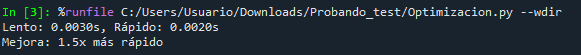

# Ejercicio: Optimizar una función de procesamiento de datos

## Función original (lenta):

```python
def procesar_datos_lento(datos):
    """Procesamiento ineficiente"""
    resultado = []
    for fila in datos:
        # Procesamiento secuencial
        fila_procesada = fila.copy()
        fila_procesada['total'] = fila['precio'] * fila['cantidad']
        resultado.append(fila_procesada)
    return resultado
```

## Función optimizada:

```python
def procesar_datos_rapido(datos):
    """Procesamiento optimizado con comprensión de listas"""
    return [
        {**fila, 'total': fila['precio'] * fila['cantidad']}
        for fila in datos
    ]
```

## Comparar performance:

```python
import time

datos_prueba = [{'precio': i, 'cantidad': i%10} for i in range(10000)]

# Medir versión lenta
inicio = time.time()
procesar_datos_lento(datos_prueba)
tiempo_lento = time.time() - inicio

# Medir versión rápida
inicio = time.time()
procesar_datos_rapido(datos_prueba)
tiempo_rapido = time.time() - inicio

print(f"Lento: {tiempo_lento:.3f}s, Rápido: {tiempo_rapido:.3f}s")
print(f"Mejora: {tiempo_lento/tiempo_rapido:.1f}x más rápido")
```

La versión lenta ``procesar_datos_lento(datos)`` está escrita con un ``for`` tradicional. Va recorriendo cada fila y construyendo la salida paso a paso. Toma una lista de registros (``precio``, ``cantidad``) y devuelve otra lista de registros con un campo extra ``total = precio*cantidad``.

En cambio, la función optimizada ``procesar_datos_rapido(datos)`` hace lo mismo pero usando compresión de listas. Esto suele ser más rápido que un ``for + append`` porque reduce trabajo habiendo menos operaicones explícitas en Python. Al hacer menos operaciones por iteración, se aprovecha una estructura que suele ser más eficiente.

Al comparar la performance de ambas funciones, se observa que la función optimizada es 1.5 más rápida.



>[!NOTE]
> Hay que considerar que como este ejemplo no contiene tantos datos, los tiempos son pequeños (del orden de los milisegundos), por lo que podría variar entre ejecuciones.

### Reflexiones finales

**¿Cuándo deberías optimizar performance?**

Es recomendable optimizar performance cuando hay un problema real de tiempo (como por ejemplo si se tarda demasiado para el usuario o para el proceso). También si el código se corre muchas veces. Esto porque los pequeños costos se acumulan. En un pipeline que se corre todos los días, el impacto de esos tiempos se vuelve acumulativo.

Si se identificó un cuello de botella, también es importante optimizar performance. Y si el rendimiento impacta un objetivo concreto, como SLA, costos cloud, experiencia del usuario, deadlines de procesamiento, etc.

**¿Qué trade-offs considerar entre velocidad y complejidad?**

Los procesos de optimización muchas veces implican trade-offs. Por ejemplo:

- Legilibilidad vs velocidad: versiones más "rápidas" pueden ser menos legibles.
- Riesgo de bugs: micro-optimizaciones podrían intrudicir errores sin querer.
- Memoria vs CPU: a veces procesos que aceleran implican mayor uso de memoria que de CPU.
- Tiempo de desarrollo: optimizar toma tiempo, por lo que vale la pena solo si el impacto lo justifica.


---
Verificación: ¿Cuándo deberías optimizar performance? ¿Qué trade-offs considerar entre velocidad y complejidad?

Requerimientos:
Conocimiento básico de Python
Familiaridad con conceptos de performance
Comprensión de algoritmos básicos